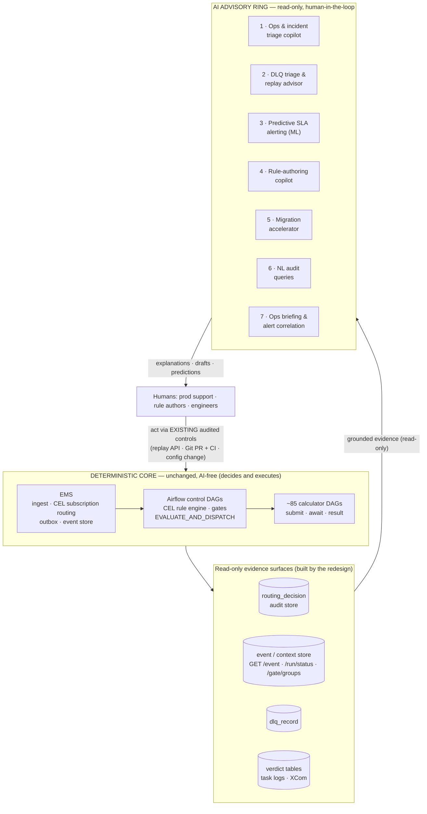
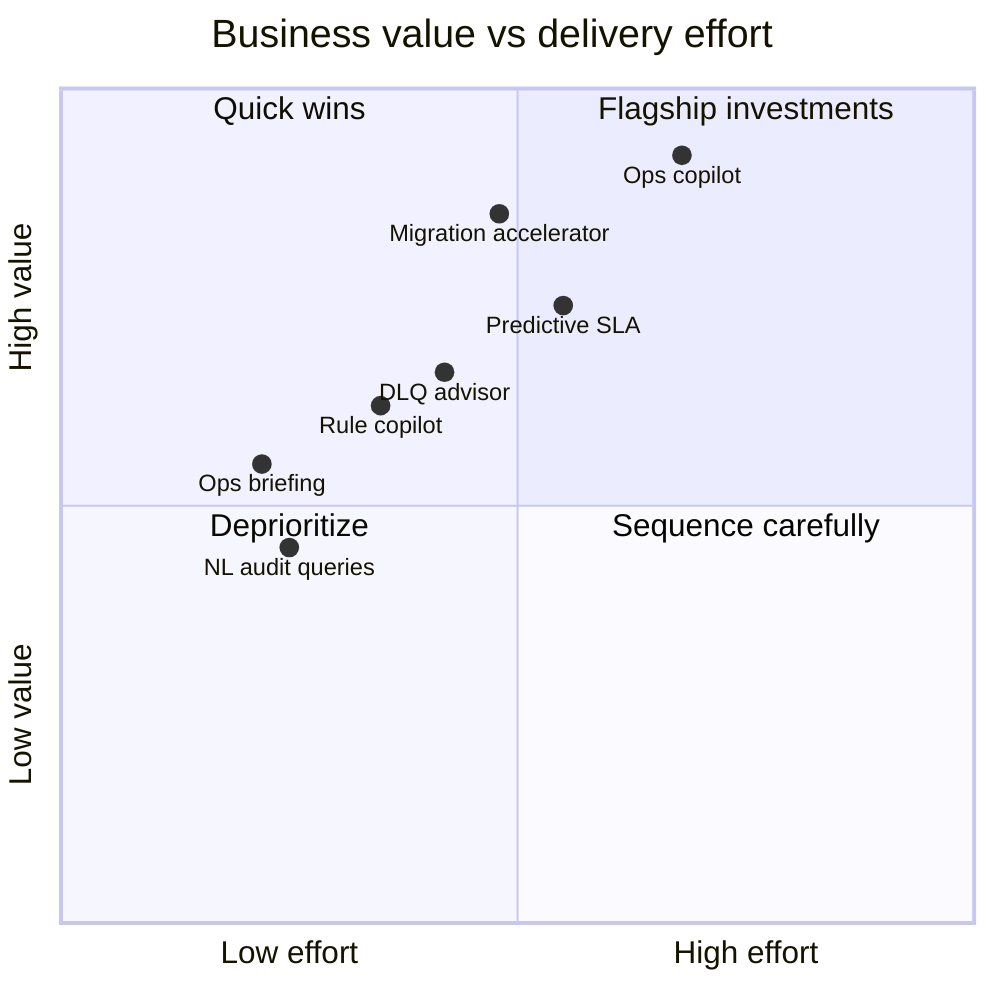
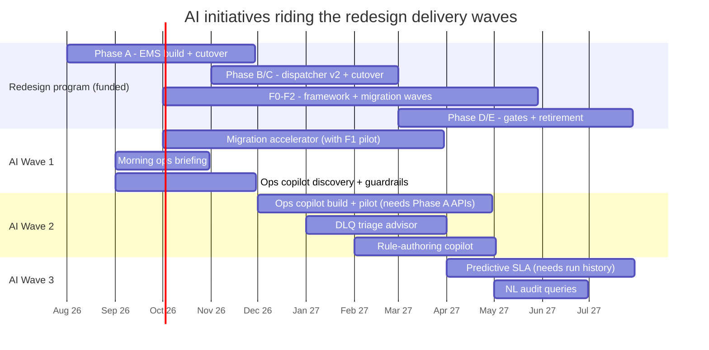
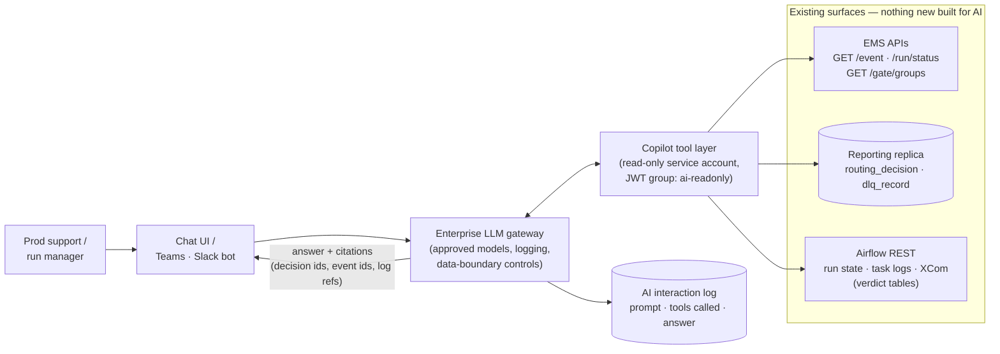
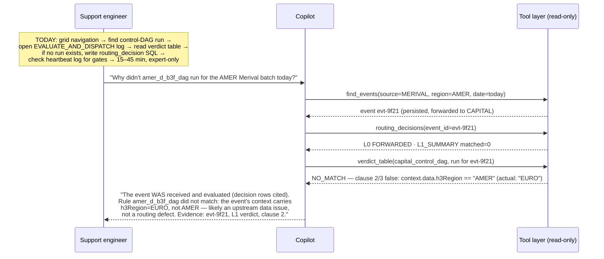
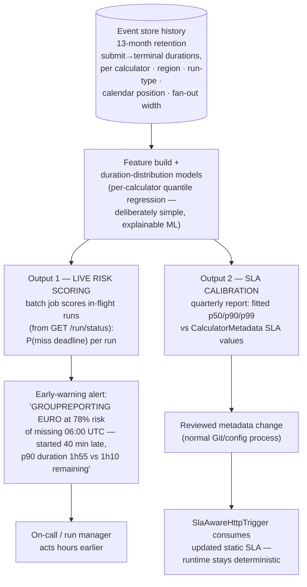

# AI Integration Proposal — Orchestration Platform (EMS + Airflow)

**Status:** Proposal for senior management review — drafted 2026-07-19
**Audience:** Part 1 (Executive Brief) for business senior management; Part 2 (Technical Proposal) for the architects and leads who will be asked to validate it
**Companions:** [system_discovery.md](system_discovery.md) (current state) · [ems-design.md](ems-design.md) (Phase A — EMS rewrite) · [trigger_redesign_final_implementation_plan.md](trigger_redesign_final_implementation_plan.md) (Phases A–E — control plane) · [framework_redesign_final_implementation_plan.md](framework_redesign_final_implementation_plan.md) (Phase 2 / F0–F4 — calculator DAG framework)
**AI platform assumption:** platform-neutral — an approved **enterprise LLM gateway** serving governed foundation models, plus standard in-house ML tooling. Nothing in this proposal depends on a specific AI vendor.

---

# Part 1 — Executive Brief

## 1. What this platform does, in one paragraph

The Orchestration Platform triggers and supervises the bank's **regulatory capital calculators**. Compute runs on MEG (Databricks); lifecycle events flow over the EDF event bus into our **Event Management Service (EMS)**, which routes them to **Airflow**, where a rules engine decides which of ~85 calculator DAGs to run, launches them, and waits for completion. The redesign program currently underway (EMS rewrite + trigger redesign + calculator framework) makes this platform fast, deterministic, and fully auditable. It is **correctness-bound, not throughput-bound**: the business risk is a missed or late regulatory calculation at month-end, not raw scale.

## 2. Why AI, and why now

Three things have changed that make AI integration practical **now**, where it would have been impossible a year ago:

1. **The redesign creates the data substrate AI needs.** The new platform produces *structured, queryable* diagnostics by design: a `routing_decision` audit table recording why every event did or didn't trigger every DAG, per-rule verdict tables with the failing clause and actual values, categorized failure diagnoses (`NEVER_STARTED` / `STARTED_NO_TERMINAL` / `TERMINAL_IN_DLQ`), a dead-letter store with correlation keys, and gate-stall reports that name the exact missing contributions. Millisecond query APIs (`/event`, `/run/status`, `/gate/groups`) replace 10-minute scans. AI systems are only as good as the data they can ground themselves in — **the redesign is, unintentionally, the best possible AI-readiness program.**

2. **The expensive work is human interpretation, not machine decision-making.** The platform decides *what to run* deterministically and well. Where hours are spent today is humans **interpreting** its outputs: diagnosing incidents at month-end, triaging dead-lettered messages, authoring and reviewing trigger rules, and rewriting ~85 DAGs during migration. These are exactly the tasks modern AI does well — *when grounded in the structured evidence this platform now produces*.

3. **AI can ride the existing delivery waves.** Every initiative below attaches to a phase of the funded redesign program (Phases A–E, F0–F4). None requires a separate platform build; each consumes APIs and data stores the program is already delivering.

## 3. The guiding principle: AI advises, the platform decides

The redesign's core asset is **determinism**: idempotent triggers, pure CEL rules, recomputable verdicts, CI-enforced invariants. This is what makes the platform defensible to auditors and regulators. **We will not put AI inside that core.** Every proposed integration is in the *advisory ring* around it — reading, explaining, predicting, drafting — with humans acting through the existing audited controls.

## 4. The opportunities

| # | Initiative | Problem it solves | Business value | Risk posture |
|---|-----------|-------------------|----------------|--------------|
| 1 | **Ops & Incident-Triage Copilot** | Answering "why didn't DAG X run?", "why is the portfolio stalled?" requires navigating Airflow grids, task logs, and SQL — expert knowledge, slow at 2 a.m. on month-end | Minutes-not-hours MTTR on the runs that protect regulatory deadlines; support self-sufficiency; fewer engineer escalations | Read-only; answers cite the underlying decision records; no write access to anything |
| 2 | **DLQ Triage & Replay Advisor** | Every dead-lettered message needs human classification (contract change? data anomaly?) and a replay-vs-discard decision | Faster recovery of blocked calculations (a lost completion event can silently stall a portfolio gate); consistent, documented triage | Advises only; replay stays behind the existing audited human-approved API |
| 3 | **Predictive SLA-Breach Alerting** (classical ML) | Today's alerts fire when something *has already* failed or timed out; month-end intervention windows are short | Proactive "this run will likely miss its 06:00 deadline" alerts **while intervention is still possible**; data-derived SLA tuning replaces guessed metadata | ML runs offline; outputs are alerts and reviewed config changes; runtime stays deterministic |
| 4 | **Rule-Authoring Copilot** | Trigger rules are CEL expressions + test fixtures; a learning curve for every team, and misconfigured routing presents as silent absence | Faster, safer rule changes; lower onboarding barrier for new tenants (e.g. NSFR); plain-English rule explanations for reviewers | Drafts only; the existing deterministic CI (compile, type-check, fixtures, superset invariant) remains the sole gate |
| 5 | **Migration Accelerator** | ~85 calculator DAGs must be hand-rewritten to the new framework — the largest labor line in the program | Compresses the F2 migration waves; earlier legacy decommission; earlier realization of the redesign's efficiency gains | Generated drafts are human-reviewed and validated by the already-designed fixture/contract/DagBag CI |
| 6 | **NL Audit Queries & Regulator Extracts** | Audit questions ("show all events in March that matched nothing") need SQL against `routing_decision` | Faster audit and regulator responsiveness; support and risk teams self-serve | Read-only replica; generated SQL is previewed before execution |
| 7 | **Morning Ops Briefing & Alert Correlation** | Overnight status is assembled by hand each morning; alert storms (one outage → N pages) obscure the root cause | A daily grounded digest of runs, failures, open gates, and DLQ items; correlated incident narratives instead of page floods | Generation only, from the same read-only telemetry; alerting thresholds stay rule-based |

## 5. Prioritization

**Wave 1 (recommended immediate start):** Migration Accelerator (#5 — time-critical: value decays as manual migration proceeds), Ops Briefing (#7 — small, fast proof of the grounded-AI pattern), and discovery for the Ops Copilot (#1 — the flagship).
**Wave 2:** Ops Copilot build, DLQ Advisor (#2), Rule Copilot (#4).
**Wave 3:** Predictive SLA (#3 — needs months of new-platform run history), NL Audit Queries (#6).

## 6. Roadmap, aligned to the redesign program

The redesign phases gate what AI can consume: Phase A delivers the EMS APIs and decision store; F0–F2 deliver the framework and migrate DAGs; Phases D–E deliver gates and retire legacy paths.

## 7. Indicative sizing

T-shirt sizes: **S** ≈ 2–4 person-weeks · **M** ≈ 1–2 person-months (2 people) · **L** ≈ one quarter (2–3 people). All assume the enterprise LLM gateway exists as a consumable service (it is not built by this program).

| Initiative | Size | Team shape | Depends on |
|---|---|---|---|
| 1 · Ops copilot | **L** | 1 platform eng + 1 AI eng + prod-support SME (fractional) | Phase A in prod (`/event`, `/run/status`, `/gate/groups`, `routing_decision`) |
| 2 · DLQ advisor | **M** | 1 AI eng + on-call SME | Phase A (`dlq_record`, replay API) |
| 3 · Predictive SLA | **M** | 1 data scientist + 1 platform eng | 3–6 months of new-platform run history; F0 SLA audit (OQ-2) |
| 4 · Rule copilot | **S–M** | 1 AI eng | Registry v2 schema frozen (Phase B) |
| 5 · Migration accelerator | **M** (time-boxed) | 1 AI eng embedded in the migration team | F0 framework landed; F1 pilot learnings |
| 6 · NL audit queries | **S** | 1 AI eng | Phase A (`routing_decision` populated) |
| 7 · Ops briefing | **S** | 1 AI eng | Phase A telemetry (works partially against current state) |

## 8. Governance and risk posture (summary — detail in Part 2, §9)

- **Human-in-the-loop everywhere.** No AI output triggers, replays, or changes platform state. Humans act through the controls the redesign already audits (replay API with audit rows, Git PRs gated by CI, reviewed config changes).
- **Read-only by construction.** AI components hold read-only credentials to query APIs and a reporting replica — enforced by the platform's existing auth model (JWT groups), not by policy documents.
- **Grounded and citable.** Copilot answers must cite the decision rows / log lines they derive from; "I don't have evidence for that" is a required behavior. This is a retrieval-and-reasoning pattern over authoritative stores, not open-ended generation.
- **Model-risk aligned.** Advisory/diagnostic use over internal operational data sits in the low-risk tier of model-risk frameworks and emerging AI regulation; the deterministic decision path — the regulated part — remains fully explainable and AI-free. Every AI interaction is logged for review.
- **Vendor-neutral.** All initiatives target the enterprise LLM gateway abstraction; models can be swapped as the bank's approved list evolves.

## 9. The ask

1. **Approve Wave 1** (Migration Accelerator, Ops Briefing, Ops Copilot discovery) — indicative commitment: ~2 FTE for one quarter, riding the existing redesign delivery organization.
2. **Nominate the governance path** — confirm the enterprise LLM gateway and the model-risk classification route for advisory-tier AI tooling.
3. **Success review at the end of Wave 1** against the metrics in Part 2 (§10) before committing to Wave 2.

---

# Part 2 — Full Technical Proposal

## 0. Design rules (normative for every initiative)

1. **No AI in the decision path.** Trigger evaluation, gate readiness, dispatch, replay execution, and any write to control-plane state remain exclusively deterministic. AI never authors state the core reads at runtime.
2. **Read-only integration surfaces only:** `GET /event`, `GET /run/status`, `GET /gate/groups` (EMS §4.3/§4.5), a read replica of `routing_decision` / `dlq_record` / `dag_trigger_outbox` metadata, and the Airflow REST API (logs, XCom, run state). No new write endpoints are created for AI.
3. **Grounding contract:** every generated answer carries machine-checkable citations (decision row ids, event ids, log line references). Ungrounded assertions are a defect, tracked as such.
4. **Human action through existing audited controls:** `POST /admin/replay` (audit rows, elevated JWT), Git PR + CI for registry/DAG changes, reviewed config for SLA metadata.
5. **Determinism invariants untouched:** the CI-enforced properties of the redesign (pure CEL rules, canonical confs, idempotent `dag_run_id`, superset invariant) are preconditions of this proposal, not modified by it.

---

## Initiative 1 — Ops & Incident-Triage Copilot (flagship)

### Problem grounding

The trigger plan's own debuggability contract (§7) defines the questions prod support asks: *"Why didn't DAG X run for event E?"*, *"Did my tenant even receive event E?"*, *"Why is the portfolio not running?"*, *"Show me all events in March that matched nothing."* The redesign makes each answerable — but through different surfaces (grid → task log verdict table; `routing_decision` SQL; heartbeat run logs; `/run/status`), each requiring tool fluency and platform knowledge. At month-end, under deadline pressure, that fluency is the bottleneck; today these investigations escalate to the engineers who built the system.

### What it is

A conversational assistant (chat UI and/or Teams/Slack integration) that answers those questions by **tool-calling over the existing read-only surfaces** and synthesizing a grounded narrative. It is a thin orchestration layer: the intelligence is in the platform's structured evidence; the LLM's job is navigation and explanation.

### Architecture

Tool inventory (initial): `find_events(criteria)`, `run_status(correlation)`, `routing_decisions(event_id | dag_id, window)`, `gate_groups(rule)`, `airflow_run(dag_id, run_id)`, `verdict_table(control_dag_run)`, `dlq_lookup(correlation)`, `heartbeat_report(tenant)`. Each maps 1:1 to an existing endpoint or replica query.

### Before / after

The copilot also covers the case logs cannot: **absence**. "Did my tenant receive event E?" is answered from `routing_decision` tier `L0_SUBSCRIPTION` (the trigger plan's own design for the no-Airflow-run case, §7) — the copilot knows to look there when no dispatcher run exists.

### Guardrails

Read-only JWT identity; per-tool allowlists; answers must cite tool outputs (response schema enforces a citations array); conversations logged to the AI interaction store; no access to calculator *data* (the platform orchestrates metadata and lifecycle events — market/position data never transits these APIs, which materially simplifies data-classification review).

### Sizing, dependencies, metrics

**L.** Depends on Phase A in production (all four surfaces). Success metrics: median time-to-diagnosis for the §7 question classes (target: 45 min → < 5 min); % of month-end incidents resolved by support without engineer escalation; citation-validity rate (audited sample); support-team satisfaction score.

---

## Initiative 2 — DLQ Triage & Replay Advisor

### Problem grounding

The EMS design makes the DLQ **poison-only** with a defined runbook (§4.2): on DLQ-depth alert, a human triages `dlq_record` (exception chain, correlation keys), determines the root cause — "usually an upstream contract change" — fixes it, then replays via the audited `POST /admin/replay`. The design explicitly demands every record end in "replay or a documented discard decision." The trigger plan's sequence §6.3 shows the stakes: a dead-lettered final contribution silently stalls a portfolio gate until replayed. Triage quality and speed are the human bottleneck.

### What it is

An assistant attached to the DLQ alert flow. On new `dlq_record` rows it drafts a triage package: **classification** (schema/contract violation vs malformed payload vs unexpected-but-valid variant), **blast radius** (correlation keys → which runs/gates are waiting on this event, via `/run/status` and `/gate/groups`), **precedent** (similar historical `dlq_record` entries and how they were resolved), and a **recommendation** (replay after fix / discard with rationale / escalate to upstream team). The human approves; replay executes through the existing audited endpoint; the AI's draft becomes the documented discard/replay rationale the runbook already requires.

### Guardrails

Never calls the replay API. Recommendation and rationale are drafts into the ticket/alert; the audit row (`replayed_by`) always names the human. Classification precision is measured against the human's final decision.

### Sizing, dependencies, metrics

**M.** Depends on Phase A (`dlq_record`, replay API, `/run/status`). Metrics: DLQ time-to-resolution (alert → replay/discard decision); % of stalled-gate incidents where blast radius was correctly identified up front; agreement rate between recommendation and final human decision (target > 90% before widening rollout).

---

## Initiative 3 — Predictive SLA-Breach Alerting & Learned SLA Calibration (classical ML)

### Problem grounding

The completion stack (trigger §5.8, framework §6) derives probe schedules and timeouts from `CalculatorMetadata` SLAs — *static, human-maintained* values. The framework's own risk register flags them: risk #2 — "SLA data missing/wrong → noisy or blind probe schedules," mitigated only by a one-off audit (OQ-2) and defaults. And all alerting is **reactive**: `NEVER_STARTED` fires at its timeout; `STARTED_NO_TERMINAL` at the deadline; the reconciliation sweep flags overdue runs after a coarse global window. On a month-end evening, the difference between knowing at 02:00 vs 05:30 that the 06:00 UTC deliverable is at risk is the entire intervention window.

### What it is — two outputs from one model

Note the boundary: the ML **never** feeds the trigger at runtime. Output 1 is an alert stream beside the existing rule-based alerts (which remain the guaranteed backstop). Output 2 lands as ordinary reviewed metadata changes — the runtime consumes exactly the same static `CalculatorMetadata` it does today, just better calibrated. This also converts the F0 SLA audit from a one-off into a continuously validated asset.

### Sizing, dependencies, metrics

**M.** Depends on 3–6 months of new-platform run history (clean `/run/status` lifecycle data), so this is deliberately Wave 3. Metrics: early-warning lead time vs today's timeout-based detection; precision/recall of breach predictions (target: >80% precision at >60 min lead time before paging on it — run in shadow "log-only" mode first, exactly as the redesign itself validates via shadow phases); reduction in `sla_defaulted` / mis-calibrated timeout noise.

---

## Initiative 4 — Registry Rule-Authoring Copilot

### Problem grounding

Registry v2 (trigger §3) makes trigger rules CEL clause lists with mandatory `must_match` / `must_not_match` fixtures, guarded by a five-step CI pipeline (schema validation, compile/type-check, fixture execution, superset check, canonical-conf lint). This is the right design — and it carries a real adoption cost: every tenant team must learn CEL, author fixtures, and reason about the superset invariant. The trigger plan's risk #5 names the failure mode: a too-narrow subscription "presents as absence" — rules that silently never fire.

### What it is

Authoring assistance embedded in the existing Git/PR workflow — the CI remains the sole gate:

- **NL → draft rule:** "trigger the USRG IHC DAG for monthly Merival events in USRG from the 5th of the month" → draft `trigger.when` clause list in the registry's idiom (one clause per line for per-clause diagnostics), plus draft fixtures for both match directions.
- **Fixture synthesis from history:** propose realistic fixtures from *actual* stored events (via `GET /event`) rather than hand-invented JSON — fixtures that reflect production payload shapes, including the awkward variants (`TYPE` vs `type` spellings, compact vs ISO dates) the EMS design documents.
- **Reviewer explanations in the PR:** plain-English rendering of the rule delta beside the CI's rendered diff ("this widens amer_d_b3f_dag to include WMAP; it newly overlaps rule X for events where…"), plus overlap/shadowing analysis across the tenant's rule set.
- **Superset-invariant explanations:** when CI's superset check fails, translate it ("your subscription excludes source RWA but rule Y requires it — the rule can never fire").

### Guardrails

Output is PR content only. The pinned deterministic CI (celpy conformance, fixtures, superset check) decides — the copilot has no authority and needs none. Misgenerated CEL fails compilation in CI exactly like miswritten CEL.

### Sizing, dependencies, metrics

**S–M.** Depends on the registry v2 schema being frozen (Phase B). Metrics: lead time for a rule change (authoring → merged); first-time CI pass rate for copilot-assisted PRs; onboarding time for the next tenant (NSFR is the natural test case — its registry exists, disabled); routing-absence incidents attributable to rule misconfiguration (target: zero).

---

## Initiative 5 — Migration Accelerator (~85 DAG rewrites)

### Problem grounding

The framework plan commits to **direct per-DAG rewrite, no shim** (D2): each of ~85 DAGs gets a hand-written `plan()` function + `CalculatorSpec`, a committed condition-classification table (taxonomy §2.3: each legacy check → class A registry clause / class B gate / class C wait / class D exception), in family waves (F2). Its risk register names the cost: risk #5, "migration fatigue across ~85 DAGs," mitigated by "mechanical plan-extraction recipe from F1." That recipe is precisely an LLM-shaped task.

### What it is

An engineer-operated (not autonomous) migration workbench used inside the F2 waves:

1. **Extraction:** given a legacy DAG pair (e.g. the `usrg_ihc_dag.py` + `usrg_ihc_calculator.py` god-callback structure described in framework §4.1), generate the draft `plan()` function, `CalculatorSpec`, and the §4.4 old→new mapping table for review.
2. **Classification draft:** propose the per-check classification table (criteria → registry `trigger.when` clauses; dataset checks → class B gate vs class D exception) that the migration PR must commit — the human migrator confirms or corrects each row.
3. **Consistency checks:** cross-check the draft against the F1 pilot's established patterns; flag deviations for attention rather than silently normalizing them.

Every draft flows through the program's own verification design: plan unit tests from shared fixtures, spec contract tests, DagBag/chain-graph CI, and the F1/F2 acceptance gates (zero skipped runs for migrated DAGs, verdict tables in RESULT logs). The framework plan already mandates one PR per DAG with a single-file rollback — the accelerator changes the *cost* of each PR, not the process.

### Sizing, dependencies, metrics

**M, time-boxed to the migration program.** Depends on F0 (framework landed) and F1 (pilot patterns established — the accelerator is calibrated against the pilot, then applied to waves). Metrics: engineer-hours per migrated DAG vs the F1 baseline; wave duration vs plan; review-cycle count per PR; **zero** relaxation of the per-wave acceptance metrics (the accelerator must not show up as quality regression). Business framing: this is the initiative with a hard expiry date — every week of delay shrinks its value as manual migration proceeds — and its payoff compounds: earlier F4 deletion of the legacy zoo, earlier decommission of the Scala service, earlier realization of the skip-churn savings.

---

## Initiative 6 — NL Audit Queries & Regulator Extracts

### Problem grounding

`routing_decision` is designed as the durable audit surface — "logs rotate; the table doesn't" (trigger §7) — with an expected retention on the regulatory horizon (7 years typical, EMS §14). The trigger plan itself writes the exemplar queries ("which events produced zero matches this month?"). Today every such question is hand-written SQL by someone who knows the schema.

### What it is

NL → SQL over an approved, documented subset of the reporting replica (`routing_decision`, event/context promoted columns, `dlq_record`): the user states the question, the assistant generates the SQL, **shows it with an explanation**, and executes it read-only on confirmation. Query templates for recurring audit patterns (zero-match sweeps, per-tenant volume reports, decision timelines for a named event) are saved and reusable — over time this becomes a curated audit-query library, AI-drafted, human-ratified.

### Guardrails

Read-only replica; row-limits and statement timeouts enforced at the connection; generated SQL always displayed pre-execution; the schema exposed to the model is the documented promoted-column subset, not raw JSONB payloads.

### Sizing, dependencies, metrics

**S.** Depends on Phase A (`routing_decision` populated). Metrics: turnaround time for audit/regulator data requests; % of support/risk data questions self-served without engineering involvement.

---

## Initiative 7 — Morning Ops Briefing & Alert Correlation

### Problem grounding

The platform emits rich but fragmented nightly telemetry: calculator run outcomes with categorized diagnoses, heartbeat gate reports naming missing contributors (trigger §5.7), DLQ/outbox/reconciliation gauges (EMS §10), portfolio progress. Run managers reassemble this picture manually every morning; overnight, a single upstream outage (MEG, EDF) fans out into many independent pages.

### What it is

Two generation tasks over the same read-only telemetry:

- **Scheduled briefing:** a daily digest — what ran and completed, what failed and *why* (categorized: `NEVER_STARTED` / `STARTED_NO_TERMINAL` / `TERMINAL_IN_DLQ`), which gates are open and what they await, DLQ items pending triage, anything the reconciliation sweep flagged — every line linked to its evidence (run, decision row, heartbeat log). Delivered to the ops channel before start of day.
- **Alert correlation:** when alerts cluster in time, draft a single incident narrative connecting them ("8 completion timeouts 02:10–02:25, all `STARTED_NO_TERMINAL`, all MEG-submitted after 01:55 — consistent with a MEG/Databricks incident; EMS ingestion healthy; outbox draining") — attached to the page, replacing nothing. All underlying alerts still fire; thresholds stay rule-based.

### Sizing, dependencies, metrics

**S.** Works partially against the current platform; full value with Phase A telemetry. This is the recommended **first delivery** — it exercises the whole pattern (gateway, read-only tool layer, grounding contract, interaction logging) on the lowest-risk use case, and its infrastructure is reused by Initiatives 1 and 2. Metrics: run-manager prep time; time-to-root-cause for multi-alert incidents; factual-accuracy audit of briefings (sampled weekly).

---

## 8. Where AI is deliberately NOT used

This list is as load-bearing as the initiatives. The redesign's value to a regulator is that every trigger decision is deterministic, recomputable, and evidenced; these boundaries keep it that way.

| Excluded | Why |
|---|---|
| Trigger/rule evaluation at runtime | The core invariant: pure CEL over `(event, context)`, recomputable verdicts (trigger §8). An ML/LLM judgment here would destroy recomputability and auditability. |
| Gate readiness decisions | Gates are stateless recomputation from the event store — the design that structurally eliminated the lost-update bug. Nothing probabilistic belongs here. |
| Autonomous replay / remediation | `POST /admin/replay` is powerful (re-triggers calculations). It stays human-invoked and audited; the AI drafts the rationale, never the action. |
| Writing control-plane state | Subscriptions, registry rules, SLA metadata, outbox — all AI-drafted changes travel through Git/CI/review; no AI principal holds write credentials. |
| Anomaly-based *blocking* | ML may raise alerts; it may never suppress, delay, or veto a calculation. |
| Calculator business data | The AI surfaces carry orchestration metadata and lifecycle events only; position/market/capital figures never enter an AI context window. |

## 9. Governance & risk management (detail)

- **Access model:** one AI service principal per initiative, JWT group `ai-readonly`, permitted only on the read surfaces in §0.2 — enforced by the same Spring Security / Entra model the EMS design specifies for its other principals (EMS §4.3 auth). Write paths (`/admin/*`, `POST /decisions`) reject the AI principal at the auth layer.
- **Data boundary:** all model calls transit the enterprise LLM gateway (logging, retention controls, approved-model enforcement, data-residency compliance). Orchestration metadata is internal operational data; the copilot surfaces are reviewed once by data classification, at gateway onboarding.
- **Auditability of the AI itself:** every interaction (prompt, tools invoked, tool outputs, answer, citations) is logged to an AI interaction store with the same retention discipline the platform applies elsewhere — the AI layer gets its own `routing_decision`-equivalent.
- **Evaluation before trust:** each initiative ships with an offline evaluation set (golden Q&A for the copilot from historical incidents; historical DLQ decisions for the advisor; backtest for the SLA model) and runs in **shadow/advisory-only mode** before anyone pages on it — mirroring the shadow-parity discipline the redesign itself uses for every cutover.
- **Model-risk classification:** all initiatives are advisory-tier (no autonomous action, no customer impact, no regulatory calculation influence). Initiative 3 is a conventional statistical model and follows the standard model-inventory route; the LLM initiatives follow the bank's generative-AI use-case approval path. The proposal deliberately contains **zero** high-risk-tier AI.
- **Kill switch:** every integration is additive and detachable; disabling any AI component returns the platform to exactly its pre-AI operating model, because no workflow *depends* on AI output — it accelerates workflows that continue to exist without it.

## 10. Success metrics rollup

| Initiative | Primary metric | Target |
|---|---|---|
| 1 · Ops copilot | Median time-to-diagnosis (trigger-plan §7 question classes) | 45 min → < 5 min; ≥ 70% of month-end incidents resolved without engineer escalation |
| 2 · DLQ advisor | Alert → replay/discard decision time; recommendation agreement rate | −50% resolution time; > 90% agreement |
| 3 · Predictive SLA | Early-warning lead time; precision at pageable threshold | > 60 min lead; > 80% precision (shadow-validated) |
| 4 · Rule copilot | Rule-change lead time; first-pass CI success; NSFR onboarding time | −50% lead time; routing-absence incidents = 0 |
| 5 · Migration accelerator | Engineer-hours per migrated DAG vs F1 baseline; wave schedule | −40–60% per-DAG effort; F2 waves on/ahead of plan with acceptance metrics intact |
| 6 · NL audit | Audit request turnaround | Same-day for standard extracts |
| 7 · Ops briefing | Run-manager prep time; multi-alert time-to-root-cause | Briefing in-channel before 07:00 daily; single-narrative rate > 80% for correlated storms |

## 11. Open questions

| # | Question | Blocks |
|---|---|---|
| 1 | Enterprise LLM gateway: availability, approved model list, logging/retention contract, cost model | All LLM initiatives (Wave 1 discovery item) |
| 2 | Reporting replica for `routing_decision` / `dlq_record`: provision as part of Phase A infra or separately? | Initiatives 1, 2, 6, 7 |
| 3 | Generative-AI use-case approval path and expected lead time in this division | Wave 1 start date |
| 4 | Chat surface of record for prod support (Teams? existing ops tooling?) | Initiative 1, 7 delivery form |
| 5 | Historical incident corpus for the copilot evaluation set (tickets, postmortems) — where does it live, who curates | Initiative 1 evaluation gate |
| 6 | Does the migration program want the accelerator embedded from F1 (calibration) or only from F2 (application)? | Initiative 5 start |

---

*End of proposal. Wave 1 approval (Exec Brief §9) is the only decision requested now; each subsequent wave is gated on the previous wave's measured results.*
