# EMS Redesign — Architectural Review & GitLab Delivery Backlog

**Source spec:** [`ems-design.md`](../ems-design.md) (approved design, amendments A1–A15, revised 2026-07-28)
**Reviewed against:** `ems/` (Java 17 / Spring Boot 3.5.4 implementation), `old-ems/` + `old-orchestration/` (legacy Scala/Python sources), `docs/ems-technical-specification.md` §23–24, `docs/plans/2026-07-28-ems-phase4-ops-readiness.md`
**Reviewer role:** Principal Systems Architect / TPM review, prepared for GitLab import
**Scope note:** this backlog specifies the **full EMS re-platform program end-to-end** (Phases 0–6 of `ems-design.md` §13), as the canonical GitLab record of the project — it does not assume or depend on any prior implementation state.

---

## Part 1 — Architectural Review & Summary

### 1.1 Key architectural shifts

| From (legacy `event-orchestration`) | To (EMS redesign) | Why it matters |
|---|---|---|
| Scala 2.13 / Spring Boot, hand-rolled | Java 17 / Spring Boot 3.5.x, `JdbcClient` (no ORM) | Removes a single-language-expert bus factor; Java is the org-standard runtime and the EDF contract already ships as a JVM artifact |
| `event`/`context` as opaque JSONB blobs, zero secondary indexes | JSONB retained as source of truth, with `GENERATED ALWAYS ... STORED` typed columns + composite B-tree/GIN indexes | Root-causes the 10+ minute sensor queries (full sequential scans); the write path is unchanged, so every "as-is" invariant (JSONB payload, `ON CONFLICT DO NOTHING` dedup) survives |
| Level-0 routing = DB property (`filter.persist`/`filter.post`) + a separate Python JSON registry, single-condition shape | One `subscription` table, two CEL stages (`PERSIST` pre-enrichment, `FORWARD` post-enrichment), tenant-scoped, CI-writable via `PUT /admin/subscriptions` | Collapses two authoring surfaces into one audited, tenant-aware one; A4's two-stage split is a *faithful* port of the legacy PRE/POST split, not a simplification |
| Airflow triggered inline on the Kafka consume path | Transactional outbox + async `OutboxDispatcher` | Decouples ingest liveness from Airflow availability entirely — an Airflow outage no longer touches the consumer |
| "N retries → DLQ" undifferentiated retry policy | Poison-only DLQ (verified publish) vs. unbounded seek-based park for transient infra (A1) | Prevents an infrastructure outage from being misclassified as business-level data loss requiring manual replay |
| No deterministic run identity (Airflow auto-assigns `dag_run_id`) | `dag_run_id = orch_sha1(dag_id + RFC 8785 JCS(conf))[:16]`, 409 = success (A6 — a **new** invariant, not a reproduction) | Makes shadow-consume, the cutover flip, and rollback all race-free by construction — at-least-once delivery degrades to idempotent no-ops, never duplicate calculator runs |
| No retention/archival story | 13-month archive-then-delete lifecycle DAG, `routing_decision` on an independent (longer) audit horizon | Bounds table growth without a partitioning migration EMS doesn't yet need |

### 1.2 Trade-offs accepted (Decision Record synthesis, `ems-design.md` §3)

- **Blocking servlet model over reactive/WebFlux** — correct at the stated concurrency (≤ 1 QPS from deferrable sensors plus a bounded Kafka consumer count); revisit only if that assumption changes.
- **No query-result or enriched-event caching, no Redis** — deliberately rejected because sensors poll for state *change*; any cache turns `/event`/`/run/status` into a stale-404 hazard. This is the correct call today but is also the design's single biggest scale lever being taken off the table (see §1.4).
- **Partitioning deferred** — correct now (few-GB scale), but the trigger condition (~50 GB or measurable vacuum churn) has no owner or alert wired to it yet; it is a paper trigger.
- **Mechanical PERSIST translation, interpreted FORWARD translation (A14)** — the map-table condition grammar has no parser in either legacy repo, so FORWARD rows are a **human sign-off**, not a mechanical port. This is honestly documented but means the seed migration (`V6__subscription_seed0.sql`) carries irreducible human risk that no test suite can fully discharge.
- **Case-folding moved into an activation view, not the rule text or the `Normalizer`** (A15) — the simplest rule-authoring surface was chosen over payload fidelity, on the explicit basis that DAG authors (not the platform team) own rule text. This is a sound trade but places a silent last-wins-on-key-collision behavior in front of every rule; the WARN-log signal for collisions has no metric/alert.

### 1.3 Risks & gaps

**Already acknowledged in the design (`ems-design.md` §14 / `docs/ems-technical-specification.md` §24.1–24.2)** — carried into this backlog as Phase 0/4 issues: EDF Context REST API contract undefined (#1), MEG calc-event family JSON paths / query-param alias inventory unverified against production (#2), production frequency/region value inventory provisional, `routing_decision` retention horizon and topic volumes unset, cel-java↔celpy conformance ownership only partially resolved, long-term owning team undecided.

**Additional gaps surfaced by this review, not called out in the source document:**

1. **Outbox-dispatcher backoff is not coordinated across pods.** §10 states the dispatcher "runs in every pod" and relies on `FOR UPDATE SKIP LOCKED` for safe concurrent draining — correct for exactly-once claim of a row, but the exponential-backoff schedule (§4.2 step 7) has no persisted `next_eligible_at` column (V5 tracks only `attempts`/`last_error`). If backoff state is kept in-process per pod, a row that just failed on pod A becomes immediately eligible for a retry by pod B, which has no memory of A's failure — under sustained Airflow degradation this turns an intended 30 s–600 s backoff into an effective retry storm scaled by pod count. **Tracked as issue #31.**
2. **`dag_run_id` hash space is unsized.** A6 truncates `orch_sha1(...)` to 16 characters with no documented collision-probability analysis. A silent collision would manifest as a *missed* trigger (409-equivalent behavior) for an unrelated run — in a regulatory-capital context (CAPITAL/RWA/CVA control DAGs) that is a silent correctness failure, not a loud one. Should be sized against expected multi-year run volume before go-live (folded into #6's DoD).
3. **`ems.auth.mode` defaults to a self-issued trust (`local`).** A shared or misconfigured environment that never explicitly sets `entra` accepts tokens the service minted for itself — a fail-open default in a system fronting regulatory capital data. **Tracked as issue #30.**
4. **No maker-checker control on `PUT /admin/subscriptions` break-glass edits.** Phase A allows direct, audited (`updated_by`) edits outside CI. Audit-after-the-fact is not the same control as review-before-apply for a routing table that decides which events reach which regulatory control DAG. Recommend for Phase B scoping, noted as an out-of-scope risk here (see §1.5).
5. **No database-failover drill in the acceptance checklist (§12).** The checklist rehearses kill-Airflow, poison, transient-outage, and rollback drills, but never a Postgres primary failover — "zone-redundant HA" is asserted, never exercised end-to-end against the app's connection/retry behavior.
6. **Admin-invocation audit is per-record, not per-call.** `POST /admin/replay` writes `dlq_record.replayed_at/by` per replayed row; a call that replays *nothing* (bad filter, empty selection) leaves no audit trail at all. Already named in `docs/ems-technical-specification.md` §24.2; closed by the V6 table in issue #22.
7. **CEL dual-engine drift is a standing structural risk, not a one-time migration risk.** Every future rule author who exercises a CEL feature the shared conformance fixture suite doesn't cover can introduce a cel-java/celpy semantic divergence that silently violates the `PERSIST ⊇ FORWARD` invariant. The fixture suite is necessary but not sufficient without an explicit "new CEL construct → new fixture" contribution rule (folded into #6's DoD).

### 1.4 Scaling considerations

- **The whole caching strategy is pinned to "≤ 1 QPS from deferrable sensors."** If migration scope grows (more DAGs migrated onto `/run/status`/`/gate/groups`, or the heartbeat-DAG polling cadence tightens), the *only* scaling lever left is the database itself — no read replica, no query cache is in the design. The generated-column/index strategy buys 2–3 orders of magnitude of headroom, but it is not infinite; `pg_stat_statements`-driven review should be a standing operational practice, not a one-time perf gate (#23).
- **Connection budget:** HPA 3–10 pods × HikariCP `maximumPoolSize=10` = 30–100 connections at scale, against an Azure PG Flexible Server tier whose connection ceiling is not stated in the design. Should be confirmed against the actual provisioned SKU before the perf gate (#23) is signed off.
- **Write amplification from generated `STORED` columns:** every insert now writes N extra typed columns plus their indexes. At firehose ingestion volumes ("thousands of events") this is a deliberate and reasonable trade for read performance, but WAL volume and autovacuum headroom should be watched during the perf gate, not assumed away by "autovacuum absorbs the monthly churn" (§9).
- **`routing_decision` is explicitly *not* partitioned yet** despite being flagged as the one candidate for month-range partitioning "later" (§3) — its retention horizon (§14 item 10) is the blocking unknown, not a technical constraint. This should be resolved before, not after, multi-year accumulation makes the eventual partitioning migration expensive.
- **Kafka partition count and consumer concurrency** are inherited "as-is" from the legacy topics; nothing in the redesign revisits whether partition count matches the new service's per-partition parking behavior (a parked partition under transient outage stops *all* progress on that partition, not just the offending message) at current or projected volumes.

### 1.5 Explicitly out of scope for this Epic

- Trigger-plan Phase B+ (registry CI ownership of `subscription` rows, the v2 control DAG, `contractVersion` in the outbox conf — Amendment A5) and the calculator DAG framework redesign (companion document `framework_redesign_final_implementation_plan.md`) — those are separate epics this build unblocks but does not implement.
- Maker-checker / four-eyes review workflow for subscription edits (risk #4 above) — recommended as a Phase B follow-up, not built here.
- A bespoke admin UI. EMS is a headless backend service; `/admin/*` is a REST surface consumed by CI tooling and authenticated operators, not an end-user application. No frontend work is in scope.
- Cross-region disaster recovery beyond Azure PG zone-redundant HA (risk #5 above).

---

## Part 2 — GitLab Epic

> Copy everything between the rules below directly into a new GitLab Epic description.

---

### Title

`feat(ems): re-platform Event Management Service to Java/Spring with Phase-A trigger control-plane`

### Executive Summary & Goals

The `event-orchestration` microservice (Scala 2.13/Spring Boot, PostgreSQL JSONB-blob store) is both the platform's performance bottleneck and the anchor point of the platform-wide trigger redesign. Airflow sensors querying context-enriched events currently take **10+ minutes** per query because `event`/`context` are unindexed JSONB blobs. This Epic delivers a from-scratch rewrite — **EMS**, Java 17 / Spring Boot 3.x against Azure Database for PostgreSQL — that:

1. Fixes the root cause: typed `GENERATED ALWAYS ... STORED` columns + composite indexes bring enriched-event queries from 10+ minutes to low single-digit milliseconds, with the JSONB payload kept as the source of truth and the HTTP query contract byte-compatible with today (existing Airflow sensors are untouched).
2. Ships the Phase-A control-plane surfaces the platform-wide trigger redesign requires "built in from day one": a tenant `subscription` table (Level-0 routing), a transactional outbox (Airflow-outage-proof triggering), `routing_decision` recording, a poison-only DLQ with audited replay, and the `GET /run/status` endpoint the calculator-DAG framework's step F0 hard-blocks on.
3. Retires the Scala/JSONB-blob stack, DB-driven config bootstrapping, and the two-place (Scala table + Python JSON) routing-authoring split, replacing them with Flyway-versioned schema, Spring profiles/Vault config, and one CI-governable subscription table.

**Success looks like:** the canonical enriched-event query executes at p95 < 50 ms against 10M+ rows; a kill-Airflow drill in staging shows zero lost triggers; shadow-consume parity against production traffic shows zero unexplained conf/drop diffs; the cutover flip and its rollback are both exercised and signed off before the legacy service is decommissioned.

### Scope

**In scope**
- Full schema redesign (event/context generated columns + indexes; subscription; routing_decision; outbox; DLQ) — Flyway V1–V6.
- Kafka ingestion pipeline: consume, normalize, two-stage CEL subscription evaluation, context resolution, single-transaction persist, outbox write, poison/transient error classification.
- Query API (`/event`, `/context`, `/parentcontext`, `/childcontext`) byte-compatible with the legacy contract.
- Control-plane API (`/run/status`, `/gate/groups`, `POST /decisions`, `POST /admin/replay`, `PUT /admin/subscriptions`) and Spring Security (Entra JWT / Basic / local dev token).
- Observability (Prometheus-pull metrics, alert rules, dashboards), `ReconciliationSweep` loss backstop, Helm chart, CI/CD.
- Performance validation at 10M-row scale; production `subscription` seed-0 translation and sign-off.
- Shadow-consume rehearsal, parity validation, historical backfill, cutover flip, rollback drill, go-live acceptance.
- Retention & archival lifecycle (Airflow maintenance DAG).

**Out of scope** (see Part 1 §1.5 for rationale)
- Trigger-plan Phase B+ (registry CI, v2 control DAG, `contractVersion`) and the calculator-DAG framework redesign.
- Maker-checker review workflow for subscription edits.
- Any bespoke admin UI/frontend.
- Cross-region DR beyond Azure PG zone-redundant HA.

### High-Level Architecture Overview

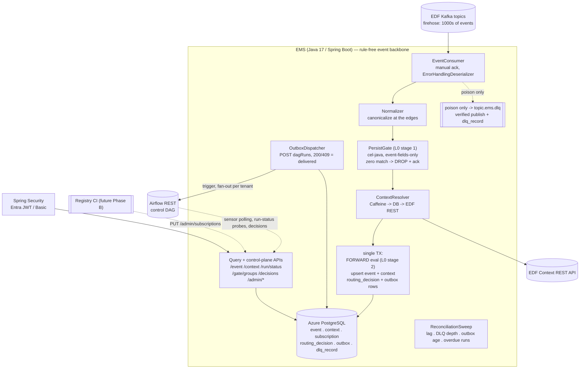
```mermaid
flowchart TB
    KF[("EDF Kafka topics<br/>firehose: 1000s of events")] --> CONS["EventConsumer<br/>manual ack, ErrorHandlingDeserializer"]

    subgraph EMS["EMS (Java 17 / Spring Boot) — rule-free event backbone"]
        CONS --> NORM["Normalizer<br/>canonicalize at the edges"]
        NORM --> SUB["PersistGate (L0 stage 1)<br/>cel-java, event-fields-only<br/>zero match -> DROP + ack"]
        SUB --> CTX["ContextResolver<br/>Caffeine -> DB -> EDF REST"]
        CTX --> TX["single TX:<br/>FORWARD eval (L0 stage 2)<br/>upsert event + context<br/>routing_decision + outbox rows"]
        TX --> PG[("Azure PostgreSQL<br/>event . context . subscription<br/>routing_decision . outbox . dlq_record")]
        OBD["OutboxDispatcher<br/>POST dagRuns, 200/409 = delivered"] --> PG
        API["Query + control-plane APIs<br/>/event /context /run/status<br/>/gate/groups /decisions /admin/*"] --> PG
        DLQ[["poison only -> topic.ems.dlq<br/>verified publish + dlq_record"]]
        CONS -. "poison only" .-> DLQ
        RECON["ReconciliationSweep<br/>lag . DLQ depth . outbox age . overdue runs"]
    end

    CTX --> EDFAPI[("EDF Context REST API")]
    OBD -- "trigger, fan-out per tenant" --> AF[("Airflow REST<br/>control DAG")]
    AF -. "sensor polling, run-status probes, decisions" .-> API
    CI[["Registry CI (future Phase B)"]] -. "PUT /admin/subscriptions" .-> API
    SEC["Spring Security<br/>Entra JWT / Basic"] --> API
```

---

## Part 3 — GitLab Issues

### Issue index

| # | Title | Phase | Depends on |
|---|---|---|---|
| 1 | spike(ems): confirm EDF Context REST API contract | 0 — Verification | — |
| 2 | spike(ems): verify production JSON paths, PG version & param-alias inventory | 0 — Verification | — |
| 3 | feat(ems): bootstrap project scaffold and CI pipeline | 1 — Foundation | — |
| 4 | feat(ems): event/context schema — generated columns & indexes (V1–V2) | 1 — Foundation | #3, #2 |
| 5 | feat(ems): control-plane schema — subscription/routing_decision/outbox/dlq (V3–V5) | 1 — Foundation | #3 |
| 6 | feat(ems): canonical-JSON/dag_run_id conformance harness, Testcontainers base, Helm skeleton | 1 — Foundation | #3 |
| 7 | feat(ems): Kafka consumer and edge Normalizer | 2 — Ingestion | #4, #6 |
| 8 | feat(ems): Level-0 two-stage subscription engine (CEL) | 2 — Ingestion | #5, #6 |
| 9 | feat(ems): EDF context resolution (Caffeine → DB → EDF) | 2 — Ingestion | #4, #1 |
| 10 | feat(ems): single-transaction ingestion pipeline | 2 — Ingestion | #7, #8, #9 |
| 11 | feat(ems): poison-only DLQ and transient-failure classification | 2 — Ingestion | #10 |
| 12 | feat(ems): outbox dispatcher and Airflow trigger client | 2 — Ingestion | #10 |
| 13 | test(ems): end-to-end ingestion integration drills | 2 — Ingestion | #10, #11, #12 |
| 14 | feat(ems): `GET /event` byte-compatible query API | 3 — APIs | #4 |
| 15 | feat(ems): `GET /context`, `/parentcontext`, `/childcontext` | 3 — APIs | #4 |
| 16 | feat(ems): `GET /run/status` (framework F0 unblocker) | 3 — APIs | #4, #11 |
| 17 | feat(ems): `GET /gate/groups` generic grouped query | 3 — APIs | #4 |
| 18 | feat(ems): `POST /decisions` batch audit ingest | 3 — APIs | #5 |
| 19 | feat(ems): admin write path — `POST /admin/replay` & `PUT /admin/subscriptions` | 3 — APIs | #5, #11 |
| 20 | feat(ems): Spring Security auth matrix | 3 — APIs | #14–#19 |
| 21 | feat(ems): Prometheus-pull observability transport & metric catalog | 4 — Ops readiness | #10, #12, #6 |
| 22 | feat(ems): ReconciliationSweep & admin-invocation audit table (V6) | 4 — Ops readiness | #11, #12, #21 |
| 23 | perf(ems): performance gate at 10M-row scale | 4 — Ops readiness | #4, #14 |
| 24 | feat(ems): production `subscription` seed-0 translation & sign-off | 4 — Ops readiness | #5, #8 |
| 25 | feat(ems): finalize Helm chart for production readiness | 4 — Ops readiness | #6, #21, #22 |
| 26 | feat(ems): shadow-consume rehearsal, parity validation & historical backfill | 5 — Cutover | #13, #20, #24, #25 |
| 27 | feat(ems): cutover flip with version-controlled rollback | 5 — Cutover | #26 |
| 28 | chore(ems): sign off go-live acceptance checklist | 5 — Cutover | #23, #26, #27 |
| 29 | feat(ems): retention & archival Airflow DAG | 6 — Lifecycle | #4, #28 |
| 30 | fix(ems): fail-closed auth default & secrets rotation | Cross-cutting | #20 |
| 31 | fix(ems): coordinate outbox-dispatcher backoff across pods | Cross-cutting | #12 |

---

### Issue #1 — spike(ems): confirm EDF Context REST API contract

**Labels:** `phase::0-verification`, `type::spike`, `component::ingestion`
**Depends on:** —

**Context & Motivation**
`ems-design.md` §14 item 2 leaves the EDF Context REST API — endpoint, auth flow, error contract, rate limits — undefined. The ingestion pipeline's `ContextResolver`/`EdfContextClient` (issue #9) and its in-call retry/park policy cannot be implemented against a real contract without this, and every downstream context-dependent behavior (persist-once semantics, §4.2 step 4) inherits whatever is decided here.

**Technical Approach & Requirements**
- Engage the EDF platform team; obtain (or confirm) the context-fetch endpoint shape, auth flow (expected: OAuth2 client-credentials via Entra), and the full error-code taxonomy — specifically which codes mean "context absent" (4xx) vs "context service unavailable" (5xx/timeout), since §4.2 step 4 depends on that split for correct park-vs-empty behavior.
- Confirm context immutability (§14 item 5) — this is the precondition for the 24 h Caffeine TTL in §8.
- Confirm rate limits, to size the bounded in-call retry policy (§10, "short bounded retry — it blocks a partition").
- Record findings as amendments to `ems-design.md` §0, following the existing amendment protocol (grounding citation required).

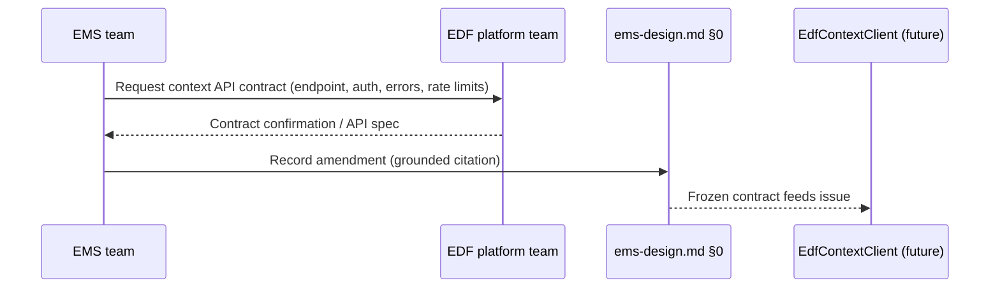
```mermaid
sequenceDiagram
    participant Arch as EMS team
    participant EDF as EDF platform team
    participant Doc as ems-design.md §0
    participant Client as EdfContextClient (future)

    Arch->>EDF: Request context API contract (endpoint, auth, errors, rate limits)
    EDF-->>Arch: Contract confirmation / API spec
    Arch->>Doc: Record amendment (grounded citation)
    Doc-->>Client: Frozen contract feeds issue #9 implementation
```

**Acceptance Criteria**
```gherkin
Scenario: EDF contract is documented and unambiguous
  Given the EDF platform team has responded
  When the contract is recorded in ems-design.md §0
  Then it specifies the endpoint path, auth flow, every distinct error code and its
    meaning (absent vs unavailable), rate limits, and the context-immutability guarantee

Scenario: No implementation proceeds on an unconfirmed contract
  Given issue #9 (EdfContextClient) is not yet started
  When this spike closes
  Then #9 is unblocked and its provisional/stub assumptions are replaced with the confirmed contract
```

**Definition of Done**
- [ ] Contract documented as a dated amendment in `ems-design.md` §0 with source citation
- [ ] §14 items 2 and 5 marked answered in `docs/ems-technical-specification.md` §24.1
- [ ] Issue #9 unblocked and updated with the confirmed endpoint/error taxonomy
- [ ] No code change (this is a documentation/verification issue)

---

### Issue #2 — spike(ems): verify production JSON paths, PG version & query-param alias inventory

**Labels:** `phase::0-verification`, `type::spike`, `component::data-model`
**Depends on:** —

**Context & Motivation**
The V1 schema DDL (issue #4) and the `/event` query contract (issue #14) both depend on JSON path assumptions that are only partially verified against production data: MEG calc-event family paths (`taskId`, `taskEventType`, `datasetId` spelling, `data.reporting-date`), whether `parentIds` is ever multi-element, the complete sensor query-param alias inventory, and the target Azure PG version (needs ≥ 12 for generated columns; design targets 16).

**Technical Approach & Requirements**
- Cross-check `trigger_event_context.json` (Merival family, already sample-verified) against a real MEG-family calc-event payload from production or a faithful non-prod capture.
- Grep `old-orchestration` sensor call sites (`BasicDatasetEventCriteriaTask`, `HttpDeferrableSensor`) for the complete query-param alias set feeding §4.3's alias table.
- Confirm the provisioned/target Azure Database for PostgreSQL Flexible Server version.
- Resolve which column (`logical_business_date` vs `reporting_date`) each event family's DATASET CHECK query binds to (§14 item 1a).
- Record every resolved item as updates to `ems-design.md` §14 and `docs/ems-technical-specification.md` §24.1.

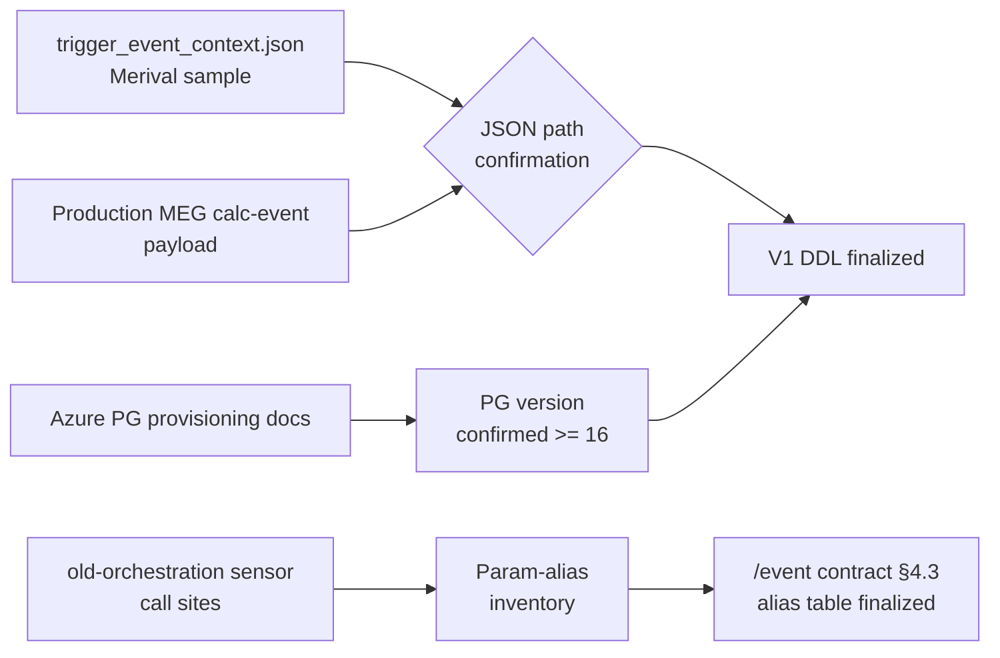
```mermaid
flowchart LR
    A[trigger_event_context.json<br/>Merival sample] --> D{JSON path<br/>confirmation}
    B[Production MEG calc-event<br/>payload] --> D
    C[old-orchestration sensor<br/>call sites] --> E[Param-alias<br/>inventory]
    F[Azure PG provisioning docs] --> G[PG version<br/>confirmed >= 16]
    D --> H[V1 DDL finalized]
    E --> I["/event contract §4.3<br/>alias table finalized"]
    G --> H
```

**Acceptance Criteria**
```gherkin
Scenario: MEG family paths are confirmed
  Given a real or faithfully-captured MEG calc-event payload
  When its JSON structure is compared against the V1 draft DDL paths
  Then every promoted column's extraction expression is confirmed or corrected

Scenario: Param-alias inventory is complete
  Given the full set of sensor call sites in old-orchestration
  When every distinct query parameter name is catalogued
  Then the §4.3 alias table lists every observed alias with its target column

Scenario: PG version is confirmed
  When the target Azure PG Flexible Server tier is checked
  Then its version is >= 12 (hard requirement for generated columns), target 16
```

**Definition of Done**
- [ ] `ems-design.md` §14 items 1, 1a, 1b, 6 updated to "answered" with citations
- [ ] Findings feed issue #4's DDL and issue #14's alias table directly
- [ ] No code change (this is a documentation/verification issue)

---

### Issue #3 — feat(ems): bootstrap project scaffold and CI pipeline

**Labels:** `phase::1-foundation`, `type::feat`, `component::ci-cd`
**Depends on:** —

**Context & Motivation**
Nothing else in this Epic can be built without a compiling, CI-gated Spring Boot skeleton. This issue establishes the Maven module, package layout, and the pipeline that every subsequent issue's Definition of Done depends on.

**Technical Approach & Requirements**
- Spring Boot 3.5.x / Java 17 Maven module at `ems/`, group `com.orchestration.ems`, `spring-boot-starter-web`, `spring-boot-starter-validation`, `spring-boot-starter-jdbc`, `postgresql`, `flyway-core` + `flyway-database-postgresql`.
- Package layout per `ems-design.md` §10: `config/`, `ingestion/`, `subscription/`, `store/`, `decisions/`, `dispatch/`, `api/`, `recon/`, `model/`.
- CI pipeline (`.github/workflows/ems-ci.yml` or GitLab-CI equivalent): `mvn -B -ntp -f ems/pom.xml verify` on every push/MR; Testcontainers-backed integration tests run in this pipeline only (never locally-required — see issue #6).
- Repository initialized under version control (a real git remote is a prerequisite for CI to ever execute — this is a hard blocker for every later "CI green" exit criterion in this Epic).

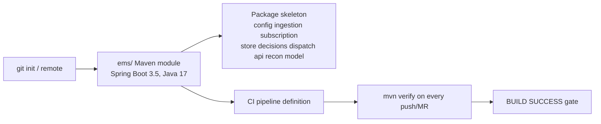
```mermaid
flowchart LR
    A[git init / remote] --> B[ems/ Maven module<br/>Spring Boot 3.5, Java 17]
    B --> C[Package skeleton<br/>config ingestion subscription<br/>store decisions dispatch api recon model]
    B --> D[CI pipeline definition]
    D --> E["mvn verify on every push/MR"]
    E --> F[BUILD SUCCESS gate]
```

**Acceptance Criteria**
```gherkin
Scenario: Fresh clone builds green
  Given a fresh checkout of the repository
  When `mvn -B -ntp -f ems/pom.xml verify` is run
  Then the build completes with BUILD SUCCESS and zero tests fail

Scenario: CI runs on every change
  Given a merge request against the default branch
  When the pipeline triggers
  Then it runs `mvn verify` and blocks merge on failure

Scenario: Package layout matches the design
  When the module skeleton is inspected
  Then all nine packages from ems-design.md §10 exist, each with a package-info.java
```

**Definition of Done**
- [ ] `mvn verify` green in CI (not just locally)
- [ ] Package skeleton matches `ems-design.md` §10 exactly
- [ ] CI pipeline file committed and passing on the default branch
- [ ] `README`/module docs note the Java/Maven toolchain versions

---

### Issue #4 — feat(ems): event/context schema — generated columns & indexes (V1–V2)

**Labels:** `phase::1-foundation`, `type::feat`, `component::data-model`
**Depends on:** #3, #2

**Context & Motivation**
This is the fix for the core problem statement: 10+ minute sensor queries caused by unindexed JSONB. The schema promotes hot filter attributes to typed `GENERATED ALWAYS ... STORED` columns (zero write-path coupling, cannot drift from payload) with composite indexes, while keeping JSONB as the source of truth so the wire format stays byte-compatible.

**Technical Approach & Requirements**
- Flyway `V1__event_context.sql`: `event` table (`event_id` PK, `json` jsonb, generated `task_id`, `dataset_id` [COALESCE `DATASET_UUID`/`datasetId`], `context_id`, `source`, `state` [nested `additionalData.STATE`, A7], `event_type` [COALESCE `additionalData.TYPE`/`type`, A8], `task_event_type`, `business_date`, `logical_business_date`, `event_timestamp`, `created_at`); `context` table (`context_id` PK, `json`, generated `dataset_id`, `reporting_date`, `logical_business_date`, `frequency` via `ems_norm_freq()`, `h3_region` via `ems_norm_region()`, `created_at`). **No scalar `first_parent_id` column** — parent-chain lookups use array-containment (A9), covered by V2's GIN index.
- Every generated expression is `IMMUTABLE`, no casts (a `::date`/`::uuid` cast would poison the whole insert on one malformed message).
- Flyway `V2__indexes.sql`: `idx_event_task_id`, `idx_event_dataset_id`, `idx_event_context_id`, `idx_event_created_at`, `idx_context_rep_freq_region` (composite `reporting_date, frequency, h3_region`), `idx_context_dataset_id`, `idx_context_created_at`, and a **GIN index** on `context.json->'parentIds'` (`jsonb_path_ops`) for A9 containment queries.
- Canonicalization functions `ems_norm_freq`/`ems_norm_region` (V1 prelude) as pure `IMMUTABLE` SQL value maps mirroring the Java `Normalizer` (issue #7) — final maps depend on issue #2's production value inventory.

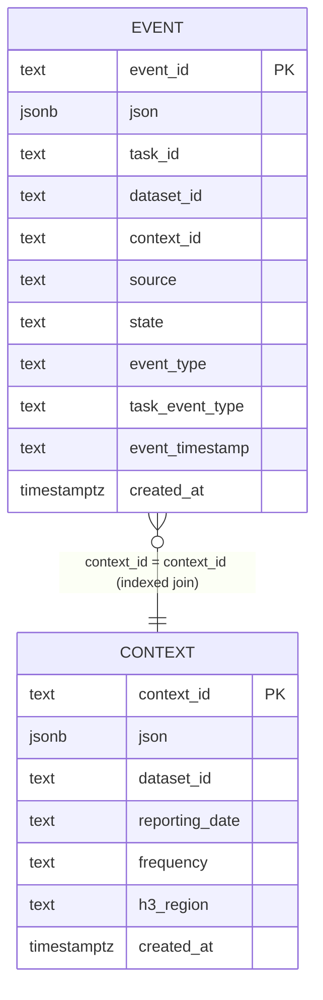
```mermaid
erDiagram
    EVENT {
        text event_id PK
        jsonb json
        text task_id
        text dataset_id
        text context_id
        text source
        text state
        text event_type
        text task_event_type
        text event_timestamp
        timestamptz created_at
    }
    CONTEXT {
        text context_id PK
        jsonb json
        text dataset_id
        text reporting_date
        text frequency
        text h3_region
        timestamptz created_at
    }
    EVENT }o--|| CONTEXT : "context_id = context_id (indexed join)"
```

**Acceptance Criteria**
```gherkin
Scenario: Flyway migrates cleanly
  Given an empty PostgreSQL 16 database
  When `flyway migrate` runs V1 and V2
  Then both tables, all generated columns and all indexes exist with no errors

Scenario: Generated columns populate automatically
  Given a row is inserted with only (event_id, json)
  When the row is read back
  Then every generated column reflects the correct JSON path, including COALESCE fallbacks (A7/A8)

Scenario: A malformed payload never poisons the insert
  Given an event JSON missing an expected key
  When the row is inserted
  Then the insert succeeds with NULL in the affected generated column (no exception)

Scenario: The canonical query uses an index, not a sequential scan
  Given 100k+ seeded rows
  When `EXPLAIN` runs against the §4.3 canonical enriched-event query
  Then the plan shows an Index Scan on idx_event_task_id, never a Seq Scan
```

**Definition of Done**
- [ ] `FlywayMigrationIT` (Testcontainers PG16) green in CI
- [ ] `EXPLAIN` assertion proves index usage on the canonical query
- [ ] `SELECT count(*) FROM event WHERE task_id IS NULL` reconciles with rows genuinely lacking the key (acceptance-checklist item, §12)
- [ ] Schema documented in `docs/ems-technical-specification.md`

---

### Issue #5 — feat(ems): control-plane schema — subscription/routing_decision/outbox/dlq_record (V3–V5)

**Labels:** `phase::1-foundation`, `type::feat`, `component::data-model`
**Depends on:** #3

**Context & Motivation**
This is what makes EMS a control-plane, not just a faster query store: a tenant-scoped, two-stage subscription table for Level-0 routing; an audit trail (`routing_decision`) with queryable absence coverage; a transactional outbox that decouples ingest from Airflow availability; and a DLQ table for poison-message triage.

**Technical Approach & Requirements**
- `V3__subscription.sql`: `subscription(id, tenant_id, stage CHECK IN ('PERSIST','FORWARD'), rule_name, control_dag_id, when_cel, registry_version, enabled, updated_at, updated_by)`, `CHECK (stage <> 'FORWARD' OR control_dag_id IS NOT NULL)`, `UNIQUE (tenant_id, stage, rule_name)`.
- `V4__routing_decision.sql`: `routing_decision(decision_id uuid PK, event_id, tenant_id, tier, target_dag_id, decision, detail jsonb, registry_version, engine_version, decided_by, decided_at)` + `UNIQUE INDEX ux_rd_l0 ON routing_decision(event_id, tenant_id) WHERE tier='L0_SUBSCRIPTION'` for redelivery idempotency, plus `ix_rd_event`, `ix_rd_target`, `ix_rd_tier`.
- `V5__outbox_dlq.sql`: `dag_trigger_outbox(dag_run_id PK text, dag_id, conf jsonb, created_at, delivered_at, attempts, last_error)` + `ix_outbox_pending ON dag_trigger_outbox(created_at) WHERE delivered_at IS NULL`; `dlq_record(id, topic, kafka_partition, kafka_offset, event_id, task_id, context_id, error, recorded_at, replayed_at, replayed_by)` + `ix_dlq_context`, `ix_dlq_task`.
- All FK-shaped columns (`event_id`, `context_id`) are deliberately **not** enforced as real foreign keys where the design requires independent retention horizons (`routing_decision` outlives `event` — §9 step 5).

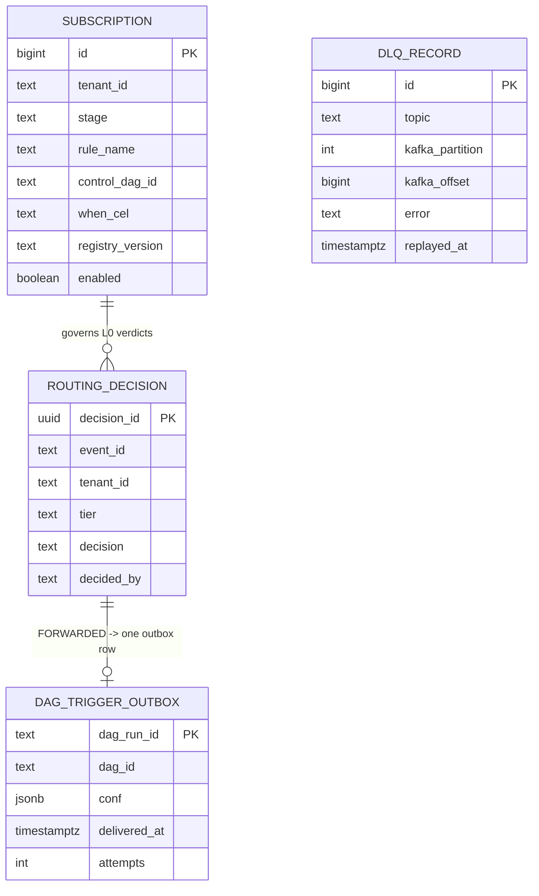
```mermaid
erDiagram
    SUBSCRIPTION {
        bigint id PK
        text tenant_id
        text stage
        text rule_name
        text control_dag_id
        text when_cel
        text registry_version
        boolean enabled
    }
    ROUTING_DECISION {
        uuid decision_id PK
        text event_id
        text tenant_id
        text tier
        text decision
        text decided_by
    }
    DAG_TRIGGER_OUTBOX {
        text dag_run_id PK
        text dag_id
        jsonb conf
        timestamptz delivered_at
        int attempts
    }
    DLQ_RECORD {
        bigint id PK
        text topic
        int kafka_partition
        bigint kafka_offset
        text error
        timestamptz replayed_at
    }
    SUBSCRIPTION ||--o{ ROUTING_DECISION : "governs L0 verdicts"
    ROUTING_DECISION ||--o| DAG_TRIGGER_OUTBOX : "FORWARDED -> one outbox row"
```

**Acceptance Criteria**
```gherkin
Scenario: L0 redelivery is idempotent
  Given a routing_decision row already exists for (event_id, tenant_id) at tier L0_SUBSCRIPTION
  When the same (event_id, tenant_id) is inserted again
  Then ON CONFLICT DO NOTHING silently no-ops, no duplicate row is created

Scenario: FORWARD rows require a control DAG
  Given a subscription row with stage='FORWARD' and control_dag_id=NULL
  When the insert is attempted
  Then it is rejected by the forward_requires_dag CHECK constraint

Scenario: Outbox drain query is index-served
  Given 10,000 outbox rows, 50 undelivered
  When the dispatcher's pending-drain query runs
  Then EXPLAIN shows ix_outbox_pending is used, not a sequential scan
```

**Definition of Done**
- [ ] `FlywayMigrationIT` extended to cover V3–V5, green in CI
- [ ] Constraint tests for `forward_requires_dag` and `uq_subscription`
- [ ] Schema documented, including the deliberate absence of enforced FKs

---

### Issue #6 — feat(ems): canonical-JSON/dag_run_id conformance harness, Testcontainers base & Helm skeleton

**Labels:** `phase::1-foundation`, `type::feat`, `component::ci-cd`
**Depends on:** #3

**Context & Motivation**
A6 introduces a **new** invariant — deterministic `dag_run_id = orch_sha1(dag_id + RFC 8785 JCS(conf))[:16]` — that has no legacy counterpart and must be locked identically between EMS (Jackson) and the future Python framework side. This issue builds the shared conformance fixture, the reusable Testcontainers PostgreSQL base every later IT depends on, and the Helm chart skeleton.

**Technical Approach & Requirements**
- Canonical JSON: implement RFC 8785 (JCS) once; `canonical/CanonicalJson.java` + `canonical/DagRunId.java` (`orch_sha1(dagId + jcs(conf))[:16]`).
- Authoritative cross-engine vectors in `shared/canonical-conformance/canonical_vectors.json` — loaded by **both** the EMS-Java test and the future framework-Python test, no copies. `CanonicalConformanceTest` asserts every vector.
- **Address review risk #2 (§1.3):** document the collision-probability analysis for the 16-character truncated hash against the projected multi-year run volume from issue #2's findings; record the conclusion (accept, or widen the truncation) as an amendment.
- `support/AbstractPostgresIT`: reusable Testcontainers PG16 base (non-pooled `dataSource()`/`jdbcClient()`), `@Testcontainers(disabledWithoutDocker = true)` so it auto-skips without Docker and only runs in CI.
- Helm chart skeleton at `ems/deploy/helm/ems/`: `Chart.yaml`, `templates/deployment.yaml`, `templates/service.yaml`, `templates/hpa.yaml`, `_helpers.tpl`, `values.yaml`.
- cel-java dependency pinned to an exact version (no range) — the shared-engine consistency invariant (§7) depends on both cel-java and celpy being pinned and tracked together.

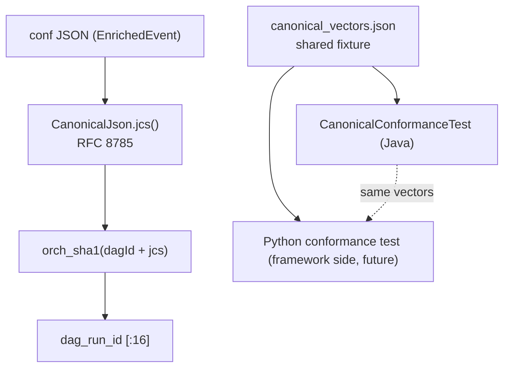
```mermaid
flowchart TB
    A["conf JSON (EnrichedEvent)"] --> B["CanonicalJson.jcs()<br/>RFC 8785"]
    B --> C["orch_sha1(dagId + jcs)"]
    C --> D["dag_run_id [:16]"]
    E[canonical_vectors.json<br/>shared fixture] --> F["CanonicalConformanceTest (Java)"]
    E --> G["Python conformance test (framework side, future)"]
    F -.same vectors.-> G
```

**Acceptance Criteria**
```gherkin
Scenario: Canonical JSON is RFC 8785 compliant
  Given a conf object with unordered keys and mixed whitespace
  When CanonicalJson.jcs() is applied
  Then the output matches the JCS specification's canonical form byte-for-byte

Scenario: dag_run_id is deterministic
  Given the same (dagId, conf) pair
  When DagRunId.derive is called twice, independently
  Then both calls return the identical 16-character id

Scenario: Cross-engine vectors all pass
  Given the shared canonical_vectors.json fixture
  When CanonicalConformanceTest runs
  Then every vector's expected dag_run_id matches the computed one (7/7 minimum)

Scenario: Testcontainers base auto-skips without Docker
  Given a machine with no Docker daemon reachable
  When `mvn verify` runs
  Then AbstractPostgresIT-derived tests report SKIPPED, not FAILED, and the build is still green
```

**Definition of Done**
- [ ] `CanonicalConformanceTest` green against 100% of the shared vector fixture
- [ ] Collision-probability note recorded (amendment or explicit risk acceptance)
- [ ] `helm lint` and `helm template` pass on the skeleton chart
- [ ] `AbstractPostgresIT` reused by every subsequent `*IT` in this Epic (no per-test container bootstrapping)

---

### Issue #7 — feat(ems): Kafka consumer and edge Normalizer

**Labels:** `phase::2-ingestion`, `type::feat`, `component::ingestion`
**Depends on:** #4, #6

**Context & Motivation**
The consumer is the pipeline's entry point; the Normalizer is the single Java authority for value canonicalization, applied only at the edges (forwarded conf, CEL activation, promoted columns) so the stored JSONB stays byte-verbatim (§4.4).

**Technical Approach & Requirements**
- `ingestion/EventConsumer`: `@KafkaListener`, `AckMode.MANUAL_IMMEDIATE`, `isolation.level=read_committed`, `ErrorHandlingDeserializer` wrapping the Confluent JSON Schema deserializer for `EventResponse` — a malformed message must never kill the consumer.
- `ingestion/Normalizer`: `normFreq`/`normRegion` statics mirroring the SQL `ems_norm_freq`/`ems_norm_region` functions (issue #4); upper-cases enumerated event fields at the grounded paths (`additionalData.STATE`, `additionalData.TYPE|type` [A8], `taskEventType` [A7]); never mutates the raw payload (deep-copy only).
- Counter `ems_normalization_mutations_total{field}` incremented on every actual value change — expected ≈ 0 on live traffic; a CI test asserts Java↔SQL functional equivalence exhaustively over the value inventory from issue #2.

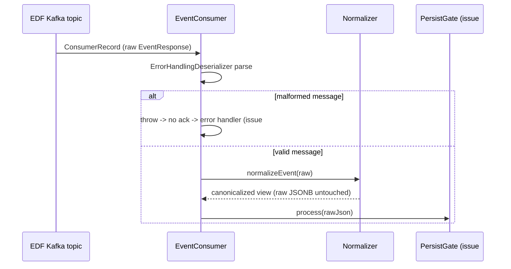
```mermaid
sequenceDiagram
    participant Kafka as EDF Kafka topic
    participant Consumer as EventConsumer
    participant Norm as Normalizer
    participant Next as PersistGate (issue #10)

    Kafka->>Consumer: ConsumerRecord (raw EventResponse)
    Consumer->>Consumer: ErrorHandlingDeserializer parse
    alt malformed message
        Consumer->>Consumer: throw -> no ack -> error handler (issue #11)
    else valid message
        Consumer->>Norm: normalizeEvent(raw)
        Norm-->>Consumer: canonicalized view (raw JSONB untouched)
        Consumer->>Next: process(rawJson)
    end
```

**Acceptance Criteria**
```gherkin
Scenario: A malformed message does not kill the consumer
  Given a message that fails JSON Schema deserialization
  When it is consumed
  Then ErrorHandlingDeserializer catches it and the consumer continues processing subsequent records

Scenario: Normalization never mutates the stored payload
  Given an event with additionalData.state = "finish" (lower-case)
  When it flows through the Normalizer
  Then the CEL activation view sees "FINISH" but the raw JSON later persisted is byte-identical to what arrived

Scenario: Mutation counter reflects real changes only
  Given a payload whose values are already canonical
  When it is normalized
  Then ems_normalization_mutations_total does not increment
```

**Definition of Done**
- [ ] Unit tests for every normalized field, including COALESCE/A7/A8 cases
- [ ] `NormalizerSqlParityIT` (Testcontainers) asserts Java↔SQL equivalence exhaustively
- [ ] `ems_normalization_mutations_total{field}` verified in a `SimpleMeterRegistry` test
- [ ] No mutation of the deserialized raw payload (asserted, not just assumed)

---

### Issue #8 — feat(ems): Level-0 two-stage subscription engine (CEL)

**Labels:** `phase::2-ingestion`, `type::feat`, `component::subscription`
**Depends on:** #5, #6

**Context & Motivation**
This is the routing brain: a `PERSIST` drop-gate (event-fields-only, pre-enrichment) and per-tenant `FORWARD` conditions (event+context, post-enrichment), replacing the legacy `filter.persist`/`filter.post` properties and the `post_filter_control_dag_map` table with one CI-governable, tenant-scoped table (A4).

**Technical Approach & Requirements**
- `subscription/CelPrograms`: compiles `SubscriptionRow.when_cel` via cel-tools `ScriptHost`; **stage-scoped declarations enforce A4 structurally** — `PERSIST` declares only `event`, `FORWARD` declares `event`+`context`, so a `PERSIST` rule referencing `context.*` fails compilation, not just review.
- `subscription/SubscriptionService`: `persistMatches(EventRow)` = OR over enabled `PERSIST` rows on `{event}`; `forwardMatches(EnrichedEvent)` = every enabled `FORWARD` rule over `{event, context}`; eval error = non-match (mirrors legacy `getOrElse(false)`).
- **A15 case-fold activation view:** every object key and string value in the CEL activation tree is lower-cased recursively before evaluation — rule text is therefore always-lowercase, plain `==`, no `.lowerAscii()`, no `has()` guards. Duplicate keys after folding collapse last-wins-in-document-order, logging a WARN on collision.
- Compiled programs cached by `(stage, when_cel)`; `SubscriptionRepo.loadEnabled()` refreshed into a Caffeine cache (`refreshAfterWrite(60 s)`) — zero hot-path DB reads.
- CI invariant chain enforcement hook: `PERSIST ⊇ FORWARD` — any FORWARD fixture that doesn't also pass its tenant's PERSIST gate must fail the build (used by issue #24's seed sign-off).

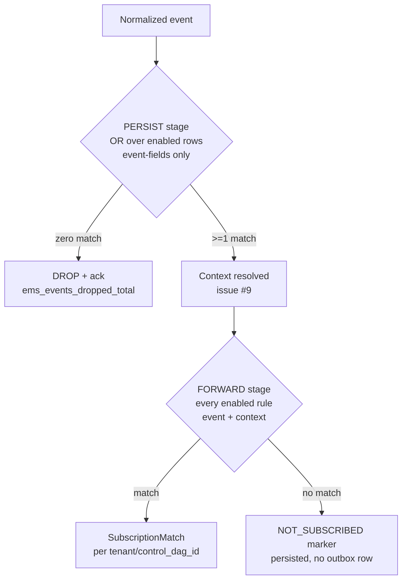
```mermaid
flowchart TB
    E[Normalized event] --> P{PERSIST stage<br/>OR over enabled rows<br/>event-fields only}
    P -- zero match --> D[DROP + ack<br/>ems_events_dropped_total]
    P -- >=1 match --> C[Context resolved<br/>issue #9]
    C --> F{FORWARD stage<br/>every enabled rule<br/>event + context}
    F -- match --> O[SubscriptionMatch<br/>per tenant/control_dag_id]
    F -- no match --> N[NOT_SUBSCRIBED marker<br/>persisted, no outbox row]
```

**Acceptance Criteria**
```gherkin
Scenario: A4 is enforced structurally
  Given a PERSIST-stage rule whose when_cel references context.data.foo
  When it is compiled
  Then compilation fails (context is an undeclared variable in the PERSIST stage)

Scenario: Zero PERSIST matches drops the event
  Given no enabled PERSIST rule matches an event
  When persistMatches evaluates it
  Then the result is empty and the caller must not fetch context or persist

Scenario: Case-fold makes legacy literals transfer verbatim
  Given event.additionalData.TYPE = "INGESTION" and a rule event.additionaldata.type == "ingestion"
  When the activation view is built
  Then the rule matches (A15 lower-cases both the key and the value)

Scenario: PERSIST ⊇ FORWARD invariant is CI-enforced
  Given a FORWARD subscription fixture matching an event
  When the same event is evaluated against its tenant's PERSIST rows
  Then at least one PERSIST rule also matches, or the build fails
```

**Definition of Done**
- [ ] Unit tests: compile success/failure per stage, match/zero-match, disabled rows, A4 rejection, case-fold collision WARN
- [ ] `SubscriptionRepoIT` (Testcontainers) green in CI
- [ ] PERSIST ⊇ FORWARD CI check wired and demonstrably fails on a crafted violation
- [ ] Compiled-program cache verified to avoid recompilation on repeated evaluation

---

### Issue #9 — feat(ems): EDF context resolution (Caffeine → DB → EDF)

**Labels:** `phase::2-ingestion`, `type::feat`, `component::ingestion`
**Depends on:** #4, #1

**Context & Motivation**
Context enrichment must be fast (contexts are shared across many events) and must never let an EDF outage silently drop or corrupt data — a genuine EDF outage must **park** the partition, not error out or skip.

**Technical Approach & Requirements**
- `ingestion/EdfContextClient`: `Optional<ContextRow> fetch(id)` — 2xx → present; **4xx (incl. 404) → absent, not an error**; 5xx/timeout/IO → bounded short retry then throw a dedicated unavailability exception (the park signal). Contract confirmed by issue #1.
- `ingestion/ContextResolver`: `resolve(id)` = Caffeine (24 h/10k, keyed `context_id`) → DB PK lookup → EDF REST call; on an EDF hit, **persist the fetched context** (save-on-fetch, ported from legacy behavior) then cache; EDF-absent results are **not cached** (so a subsequent late-arriving context isn't masked).
- Emit `ems_context_fetch_total{source=cache|db|edf}`.
- Null/blank context id → warn + empty, no exception.

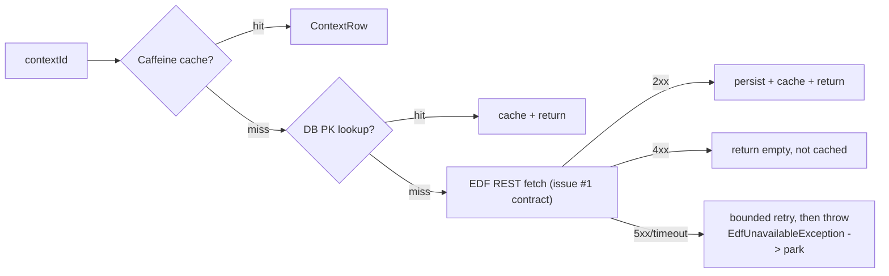
```mermaid
flowchart LR
    A[contextId] --> B{Caffeine cache?}
    B -- hit --> Z[ContextRow]
    B -- miss --> C{DB PK lookup?}
    C -- hit --> D[cache + return]
    C -- miss --> E["EDF REST fetch (issue #1 contract)"]
    E -- 2xx --> F[persist + cache + return]
    E -- 4xx --> G[return empty, not cached]
    E -- 5xx/timeout --> H[bounded retry, then throw<br/>EdfUnavailableException -> park]
```

**Acceptance Criteria**
```gherkin
Scenario: Cache hit skips DB and EDF entirely
  Given a context already cached
  When resolve(id) is called
  Then no DB query and no EDF call occur, and ems_context_fetch_total{source=cache} increments

Scenario: EDF outage parks, never drops
  Given EDF returns 503 beyond the bounded retry budget
  When resolve(id) is called
  Then an unavailability exception propagates (never a silent empty result)

Scenario: EDF 404 is treated as legitimate absence
  Given EDF returns 404 for a context id
  When resolve(id) is called
  Then the result is empty, no exception is thrown, and the miss is not cached
```

**Definition of Done**
- [ ] `EdfContextClientTest` (WireMock) covering 200/404/503-retried-then-throw
- [ ] `ContextResolverTest` covering cache/DB/EDF tiers, save-on-fetch, outage propagation
- [ ] `ContextResolverIT` (Testcontainers) for the DB-hit path
- [ ] `ems_context_fetch_total` verified per source tag

---

### Issue #10 — feat(ems): single-transaction ingestion pipeline

**Labels:** `phase::2-ingestion`, `type::feat`, `component::ingestion`
**Depends on:** #7, #8, #9

**Context & Motivation**
This wires issues #7–#9 into the normative §4.2 pipeline: persist gate → context resolve (outside the TX, so an EDF outage parks before any write) → forward evaluation → one transaction writing event, context, `routing_decision`, and outbox rows atomically.

**Technical Approach & Requirements**
- `ingestion/IngestionService.process(String rawJson)`: `EventRow.of(rawJson)` → `SubscriptionService.persistMatches` (zero → count + ack, no fetch/persist) → `ContextResolver.resolve` (outside TX) → `EnrichedEvent` assembly → `forwardMatches` → single TX via `TransactionTemplate`.
- TX body: `event` upsert (`ON CONFLICT DO NOTHING`; **inserted==0 → return**, the redelivery no-op guard — a duplicate event's decisions+outbox already committed) → `context` upsert if present → `routing_decision` L0 batch insert → one outbox row per FORWARD match (`conf = EnrichedEvent.toConf()`, `dag_run_id` via issue #6's `DagRunId.derive`).
- Zero FORWARD matches on a persisted event → single `NOT_SUBSCRIBED` marker row, zero outbox rows (exact legacy persist-without-trigger behavior).
- Every write in the TX is idempotent, so at-least-once Kafka redelivery is safe end-to-end by construction.

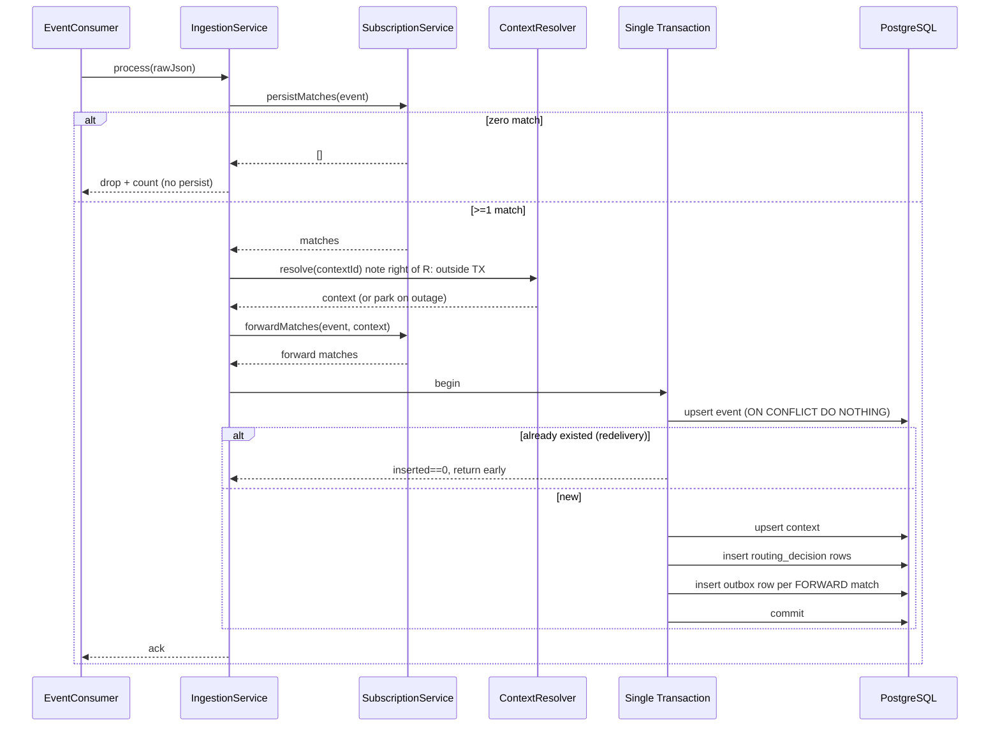
```mermaid
sequenceDiagram
    participant C as EventConsumer
    participant I as IngestionService
    participant S as SubscriptionService
    participant R as ContextResolver
    participant TX as Single Transaction
    participant DB as PostgreSQL

    C->>I: process(rawJson)
    I->>S: persistMatches(event)
    alt zero match
        S-->>I: []
        I-->>C: drop + count (no persist)
    else >=1 match
        S-->>I: matches
        I->>R: resolve(contextId)  note right of R: outside TX
        R-->>I: context (or park on outage)
        I->>S: forwardMatches(event, context)
        S-->>I: forward matches
        I->>TX: begin
        TX->>DB: upsert event (ON CONFLICT DO NOTHING)
        alt already existed (redelivery)
            TX-->>I: inserted==0, return early
        else new
            TX->>DB: upsert context
            TX->>DB: insert routing_decision rows
            TX->>DB: insert outbox row per FORWARD match
            TX->>DB: commit
        end
        I-->>C: ack
    end
```

**Acceptance Criteria**
```gherkin
Scenario: Full pipeline persists atomically
  Given an event matching both a PERSIST and a FORWARD rule
  When process() runs
  Then event, context, one FORWARDED routing_decision, and one outbox row all commit in the same transaction

Scenario: Redelivery is a safe no-op
  Given an event already fully persisted
  When the same raw JSON is processed again
  Then inserted==0 short-circuits before any context/decision/outbox write, and no duplicate rows exist

Scenario: A downstream write failure rolls back the whole transaction
  Given the outbox insert throws mid-transaction
  When process() runs
  Then the event insert also rolls back — nothing is left half-committed
```

**Definition of Done**
- [ ] `IngestionServiceTest` (mocked collaborators) covering gate-drop, matching, redelivery, EDF-outage-parks
- [ ] `FullPipelineIT` (Testcontainers, shared DataSource so repos join the real single TX) covering atomicity via an injected failing repo
- [ ] `RedeliveryIdempotencyIT` proving a double `process()` call yields exactly one of everything
- [ ] Traceability entry added to `docs/ems-technical-specification.md` §23

---

### Issue #11 — feat(ems): poison-only DLQ and transient-failure classification

**Labels:** `phase::2-ingestion`, `type::feat`, `component::ingestion`
**Depends on:** #10

**Context & Motivation**
Amendment A1: transient infrastructure failures must **park** the partition (self-healing, no data loss, no human intervention) while poison messages (deserialization/contract violations, which can never succeed) must dead-letter immediately so they don't block the partition. Conflating the two — as a flat "N retries → DLQ" policy would — turns recoverable outages into business-level loss requiring manual replay.

**Technical Approach & Requirements**
- `config/KafkaConfig#kafkaErrorHandler`: `DefaultErrorHandler` with `addNotRetryableExceptions(IllegalArgumentException, DeserializationException)` → poison; everything else (including a dedicated EDF-unavailable exception from issue #9, and PG-unavailability) → retryable → `FixedBackOff(parkBackoffMs, UNLIMITED_ATTEMPTS)`.
- Poison path: `DeadLetterPublishingRecoverer` to `<topic>.ems.dlq` with `failIfSendResultIsError(true)`, DLT producer `acks=all` — **verified delivery only**; a failed DLQ publish leaves the offset uncommitted (redelivered, never lost).
- `ingestion/DlqRecorder`: best-effort `dlq_record` row (topic/partition/offset, extracted `event_id`/`task_id`/`context_id`, rendered exception chain) — **never throws**; the verified DLT publish is the authoritative gate, the row is triage-only.
- Alert wiring note (feeds issue #21): DLQ depth > 0 for 5 min pages; consumer-lag alerting surfaces a parked partition.

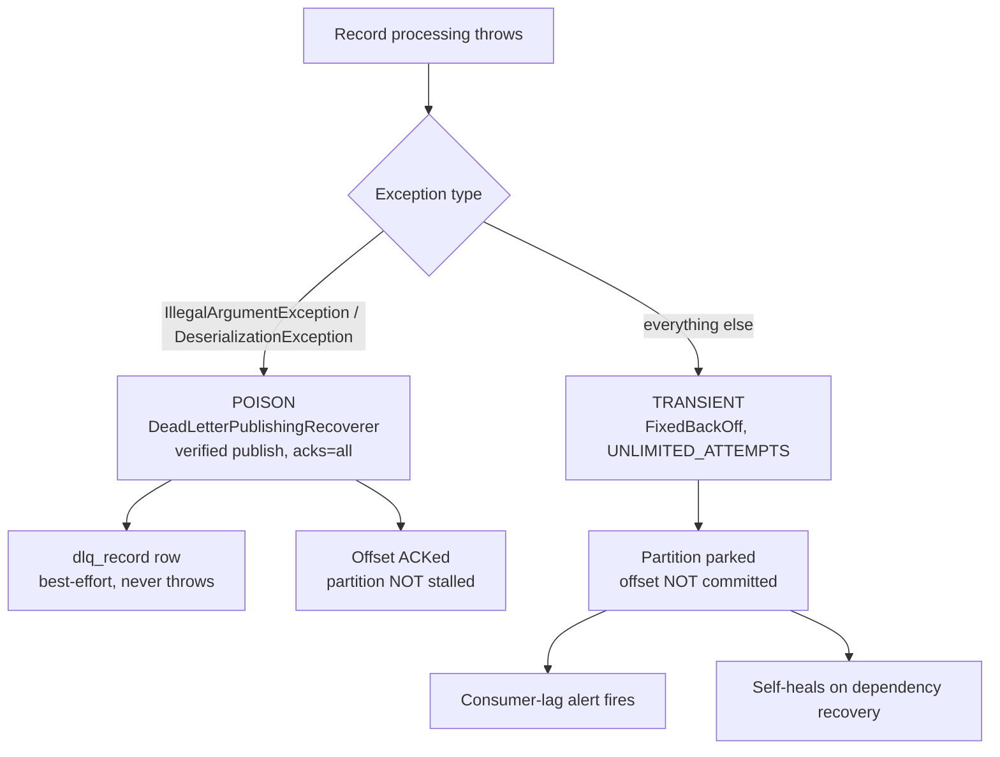
```mermaid
flowchart TB
    A[Record processing throws] --> B{Exception type}
    B -- IllegalArgumentException / DeserializationException --> C["POISON<br/>DeadLetterPublishingRecoverer<br/>verified publish, acks=all"]
    C --> D[dlq_record row<br/>best-effort, never throws]
    C --> E[Offset ACKed<br/>partition NOT stalled]
    B -- everything else --> F["TRANSIENT<br/>FixedBackOff, UNLIMITED_ATTEMPTS"]
    F --> G[Partition parked<br/>offset NOT committed]
    G --> H[Consumer-lag alert fires]
    G --> I[Self-heals on dependency recovery]
```

**Acceptance Criteria**
```gherkin
Scenario: Poison never stalls the partition
  Given a message that fails deserialization
  When it is processed
  Then it is verified-published to <topic>.ems.dlq, a dlq_record row is written, the offset commits,
    and the next valid record on the same partition processes normally

Scenario: A DLQ publish failure never loses the record
  Given the DLT broker rejects the publish
  When the recoverer attempts it
  Then the offset remains uncommitted and the original record is redelivered on the next poll

Scenario: Transient infra failure parks, not dead-letters
  Given the EDF client throws an unavailability exception
  When the record is retried
  Then it is never routed to the DLQ; it retries indefinitely with the fixed backoff until the dependency recovers
```

**Definition of Done**
- [ ] `PoisonDlqIT` (EmbeddedKafka + real Postgres) — byte-verbatim DLQ + correlated `dlq_record` row
- [ ] `DlqPublishFailureIT` — verified-publish failure → uncommitted offset → redelivery
- [ ] `TransientOutageIT` — park, then process after recovery, zero DLQ writes
- [ ] Alert thresholds documented for issue #21/#22 to implement

---

### Issue #12 — feat(ems): outbox dispatcher and Airflow trigger client

**Labels:** `phase::2-ingestion`, `type::feat`, `component::dispatch`
**Depends on:** #10

**Context & Motivation**
The transactional outbox (issue #5) is only useful if something reliably drains it. This issue builds the async dispatcher that decouples ingest liveness from Airflow entirely: an Airflow outage of hours produces a drained backlog on recovery, never a lost trigger.

**Technical Approach & Requirements**
- `dispatch/AirflowTriggerClient.trigger(dagId, dagRunId, conf)`: POST `/dags/{dagId}/dagRuns`; classify **2xx or 409 → DELIVERED** (409 = deterministic id already triggered, A6), 429/5xx/unreachable → RETRIABLE, other 4xx/unparseable → NON_RETRIABLE (alert). Never throws.
- `dispatch/OutboxDispatcher` (`@Scheduled(fixedDelay=2000ms)`): one TX per tick, `outboxRepo.drainPending(100)` (`FOR UPDATE SKIP LOCKED`), per row dispatch → DELIVERED marks `delivered_at`; RETRIABLE/NON_RETRIABLE record the attempt and back off (equal-jitter, 30 s → 600 s, port of `ExponentialBackoffRetryStrategy`).
- `ems_outbox_pending_age_seconds` gauge from `oldestPendingCreatedAt()` — feeds the "oldest pending > 10 min pages" alert.
- Runs in every pod; `SKIP LOCKED` makes concurrent drains safe for **claiming** a row (see issue #31 for the separate backoff-coordination gap this does *not* solve).

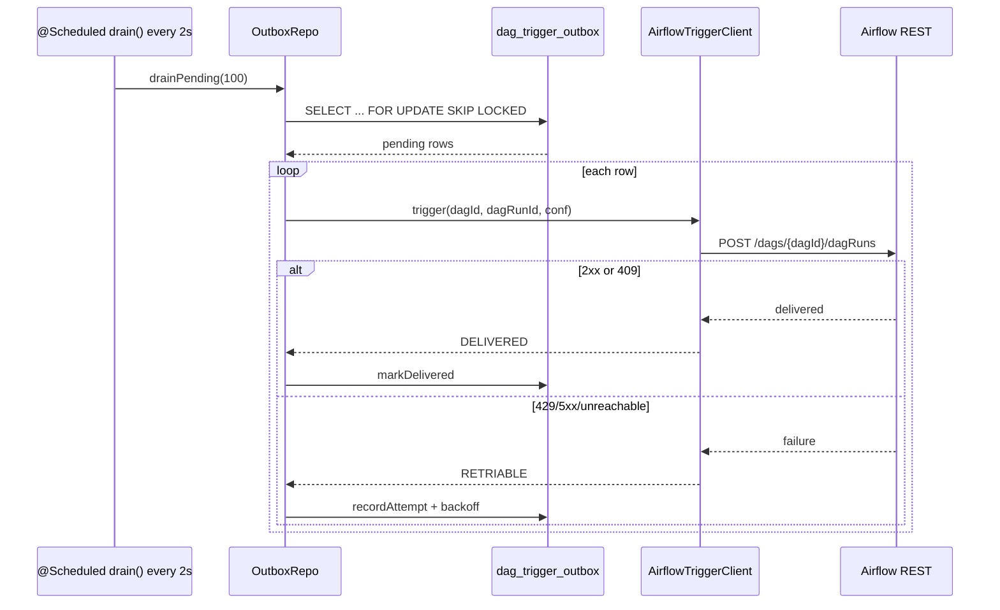
```mermaid
sequenceDiagram
    participant Sched as @Scheduled drain() every 2s
    participant Repo as OutboxRepo
    participant DB as dag_trigger_outbox
    participant Client as AirflowTriggerClient
    participant AF as Airflow REST

    Sched->>Repo: drainPending(100)
    Repo->>DB: SELECT ... FOR UPDATE SKIP LOCKED
    DB-->>Repo: pending rows
    loop each row
        Repo->>Client: trigger(dagId, dagRunId, conf)
        Client->>AF: POST /dags/{dagId}/dagRuns
        alt 2xx or 409
            AF-->>Client: delivered
            Client-->>Repo: DELIVERED
            Repo->>DB: markDelivered
        else 429/5xx/unreachable
            AF-->>Client: failure
            Client-->>Repo: RETRIABLE
            Repo->>DB: recordAttempt + backoff
        end
    end
```

**Acceptance Criteria**
```gherkin
Scenario: 409 counts as delivered
  Given Airflow already has a dag run with the deterministic dag_run_id
  When the dispatcher POSTs the trigger
  Then Airflow responds 409, and the row is marked delivered (not retried)

Scenario: A kill-Airflow outage drains fully on recovery
  Given Airflow is unreachable for an extended period
  When the outage ends
  Then every accumulated outbox row is eventually delivered with zero loss, and
    ems_outbox_pending_age_seconds returns to zero

Scenario: Backoff is respected within a single dispatch cycle
  Given a row just failed with a RETRIABLE outcome
  When the next immediate drain tick runs
  Then the row is not re-attempted before its backoff window elapses
```

**Definition of Done**
- [ ] `AirflowTriggerClientTest` (WireMock) — 200/409 DELIVERED, 503 RETRIABLE, 400 NON_RETRIABLE, full-body assertion
- [ ] `OutboxDispatcherTest` — delivered/retriable/backoff-window behavior, bean absent unless `ems.dispatch.enabled=true`
- [ ] `KillAirflowDrainIT` (Testcontainers) — sustained 503 leaves rows undelivered with growing attempts + gauge; recovery drains fully in one pass
- [ ] `ems_outbox_pending_age_seconds` gauge verified

---

### Issue #13 — test(ems): end-to-end ingestion integration drills

**Labels:** `phase::2-ingestion`, `type::test`, `component::ingestion`
**Depends on:** #10, #11, #12

**Context & Motivation**
`ems-design.md` §12 requires the full pipeline's failure semantics to be proven against real Postgres/Kafka, not just unit-mocked: dedup, atomicity, poison, redelivery, outage, and kill-Airflow — the "no-loss by construction" claim (§4.2) is only credible once these drills are green in CI.

**Technical Approach & Requirements**
- Consolidate and CI-gate the integration drills already scoped across issues #10–#12: `FullPipelineIT`, `RedeliveryIdempotencyIT`, `PoisonDlqIT`, `DlqPublishFailureIT`, `TransientOutageIT`, `KillAirflowDrainIT`.
- All extend the shared Testcontainers base (issue #6) so they auto-skip locally and run only in CI.
- Assert generated-column population, `jsonb_exists(conf,'context')` (not the `?` operator, which collides with JDBC bind placeholders), and atomicity via an injected failing repository that forces a rollback.

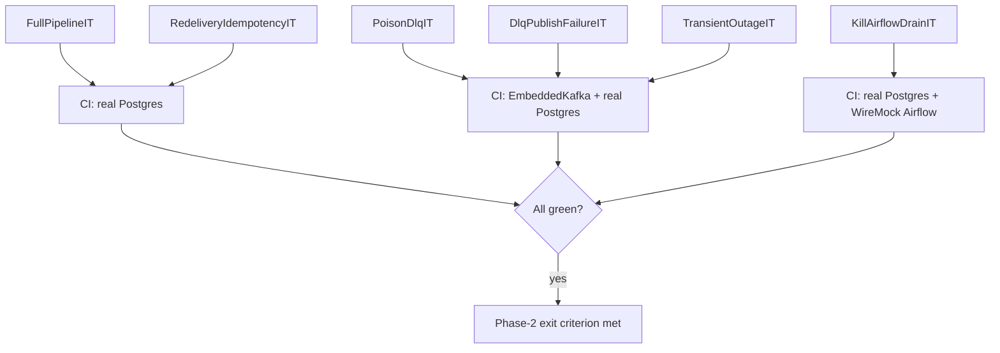
```mermaid
flowchart TB
    A[FullPipelineIT] --> G[CI: real Postgres]
    B[RedeliveryIdempotencyIT] --> G
    C[PoisonDlqIT] --> H[CI: EmbeddedKafka + real Postgres]
    D[DlqPublishFailureIT] --> H
    E[TransientOutageIT] --> H
    F[KillAirflowDrainIT] --> I[CI: real Postgres + WireMock Airflow]
    G --> J{All green?}
    H --> J
    I --> J
    J -- yes --> K[Phase-2 exit criterion met]
```

**Acceptance Criteria**
```gherkin
Scenario: Phase-2 exit criterion is met
  Given all six drills listed above
  When the CI pipeline runs against a real Docker daemon
  Then every drill passes with zero manual intervention

Scenario: Atomicity is proven, not assumed
  Given a forced failure injected into the outbox insert step
  When the transaction is attempted
  Then the event and context inserts are also rolled back (verified by a subsequent query, not by log inspection)
```

**Definition of Done**
- [ ] All six ITs green in a real CI run against Docker (not just "compiles and skips locally")
- [ ] Phase-2 exit criterion explicitly signed off in the Epic
- [ ] Traceability matrix (`docs/ems-technical-specification.md` §23) updated

---

### Issue #14 — feat(ems): `GET /event` byte-compatible query API

**Labels:** `phase::3-apis`, `type::feat`, `component::api`
**Depends on:** #4

**Context & Motivation**
Existing Airflow sensors must keep working unmodified: `GET /event` must return exactly the legacy 200/404 contract, matching each non-id parameter across all four legacy JSON locations (A10), with response bodies built from the raw `json` columns so the wire format is byte-compatible.

**Technical Approach & Requirements**
- `store/EventQueryRepository` + `api/EventController`: canonical query per §4.3 (`event` JOIN `context` on indexed `context_id`), WHERE built only from supplied params.
- A10: each non-id param matches across `event`, `event.additionalData`, `context`, `context.data` (4-location OR), case-sensitive keys, `|`-multivalue OR — **no** param→single-column alias map; promoted columns are an index accelerator only.
- A9: `parentIds` filtering via `json->'parentIds' @> to_jsonb(:id)` (GIN, issue #4), never element-0.
- Param values pass through the same canonicalization as ingestion before binding (§4.3) — never against raw payloads in SQL.

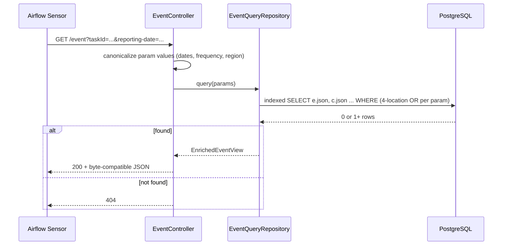
```mermaid
sequenceDiagram
    participant Sensor as Airflow Sensor
    participant Ctrl as EventController
    participant Repo as EventQueryRepository
    participant DB as PostgreSQL

    Sensor->>Ctrl: GET /event?taskId=...&reporting-date=...
    Ctrl->>Ctrl: canonicalize param values (dates, frequency, region)
    Ctrl->>Repo: query(params)
    Repo->>DB: indexed SELECT e.json, c.json ... WHERE (4-location OR per param)
    DB-->>Repo: 0 or 1+ rows
    alt found
        Repo-->>Ctrl: EnrichedEventView
        Ctrl-->>Sensor: 200 + byte-compatible JSON
    else not found
        Ctrl-->>Sensor: 404
    end
```

**Acceptance Criteria**
```gherkin
Scenario: Byte-compatible response
  Given an event/context pair persisted via ingestion
  When GET /event returns it
  Then the response body's event/context JSON is byte-identical to the stored raw payload

Scenario: 404 on no match
  Given no event matches the supplied filters
  When GET /event is called
  Then the response is exactly 404, matching the legacy sensor contract

Scenario: 4-location OR matching
  Given a param value that only exists under event.additionalData, not top-level event
  When that param is supplied
  Then the query still matches (A10 semantics preserved)

Scenario: Multi-value state filter
  Given state=FINISH|FAILED
  When the query executes
  Then it binds as state = ANY(['FINISH','FAILED']) and remains index-friendly
```

**Definition of Done**
- [ ] `EventControllerTest` covering every param combination in the §4.3 alias table
- [ ] `EventQueryRepositoryIT` (Testcontainers) proving index usage via `EXPLAIN`
- [ ] Contract test: response byte-compatible against a golden fixture derived from legacy samples
- [ ] p95 < 50 ms asserted at 100k+ seeded rows (full 10M gate is issue #23)

---

### Issue #15 — feat(ems): `GET /context`, `/parentcontext`, `/childcontext`

**Labels:** `phase::3-apis`, `type::feat`, `component::api`
**Depends on:** #4

**Context & Motivation**
Completes the read-side contract sensors rely on for context lookup and parent/child chain traversal, preserving A9's array-containment semantics (no scalar first-parent shortcut).

**Technical Approach & Requirements**
- `store/ContextQueryRepository` + `api/ContextController`: `/context` lookup by `datasetId`/`context-id`/`reporting-date`/`frequency`; `/parentcontext` and `/childcontext` walk the chain via the A9 GIN `parentIds @>` containment query (children are reverse-derived — no separate child-pointer column exists in the payload).
- **No EDF fallback on the read path** — that responsibility belongs to ingestion (issue #9) only; a query-time miss is a 404, never a live EDF call.
- `checkRequestedParams`: all supplied params must match (top-level or `data.*`), matching legacy strictness.

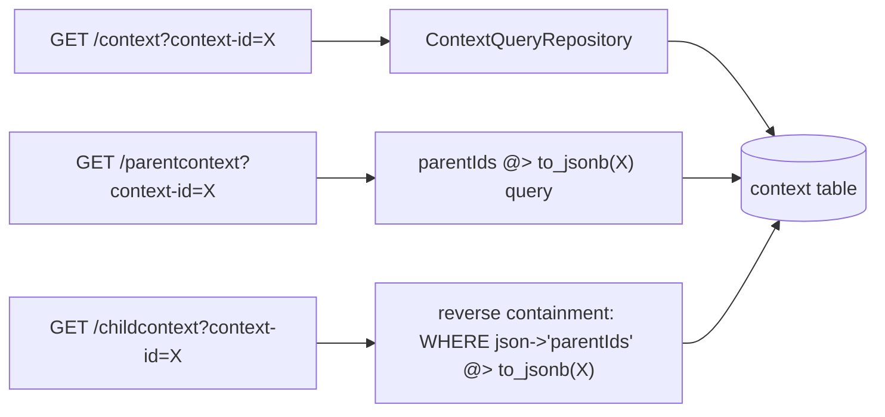
```mermaid
flowchart LR
    A["GET /context?context-id=X"] --> B[ContextQueryRepository]
    C["GET /parentcontext?context-id=X"] --> D["parentIds @> to_jsonb(X) query"]
    E["GET /childcontext?context-id=X"] --> F["reverse containment: WHERE json->'parentIds' @> to_jsonb(X)"]
    B --> G[(context table)]
    D --> G
    F --> G
```

**Acceptance Criteria**
```gherkin
Scenario: Context lookup returns byte-compatible JSON
  Given a persisted context
  When GET /context?context-id=X is called
  Then the response is 200 with the byte-verbatim stored JSON, or 404 if absent

Scenario: Multi-parent chains resolve correctly
  Given a context with more than one entry in parentIds
  When GET /parentcontext is called
  Then all parents are found via array-containment, not just element 0

Scenario: Read path never calls EDF
  Given a context id that is not in the local store
  When any of these three endpoints is called
  Then the response is 404 and no EDF REST call is made
```

**Definition of Done**
- [ ] `ContextControllerTest` covering all three endpoints and the all-params-must-match rule
- [ ] `ContextQueryIT` (Testcontainers) proving GIN index usage for parent/child traversal
- [ ] Flagged assumption (children reverse-derivation) documented in `docs/ems-technical-specification.md`

---

### Issue #16 — feat(ems): `GET /run/status` (framework F0 unblocker)

**Labels:** `phase::3-apis`, `type::feat`, `component::api`
**Depends on:** #4, #11

**Context & Motivation**
This endpoint is a **hard blocker** for the calculator-DAG framework's step F0. It must summarize an event's lifecycle in one indexed query and correctly categorize timeouts (`NEVER_STARTED` / `STARTED_NO_TERMINAL` / `TERMINAL_IN_DLQ`) for the framework's `SlaAwareHttpTrigger`.

**Technical Approach & Requirements**
- `store/RunStatusRepository` + `api/RunStatusController`: wire shape byte-exact per §4.5 — `{scheduled, started, terminal: {present, successful, event_id}, dlq_hint, last_event_at}`.
- Terminal vocabulary: MERIVAL `STATE ∈ {FINISH, FAILED}` (FINISH = success); MEG `taskEventType = COMPLETED` (+ successful flag — flag this as an assumption pending a real COMPLETED sample, per `docs/ems-technical-specification.md` §24.2).
- Keyed by `context_id` (=`triggerContextId`) / `task_id` (both indexed, issue #4); `dlq_hint` via `ix_dlq_context`/`ix_dlq_task` (issue #5/#11).
- **Always 200** (no-events = `NEVER_STARTED` candidate, not 404); missing keys → 400.

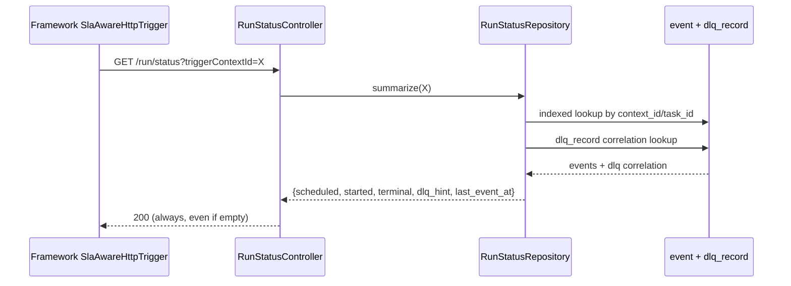
```mermaid
sequenceDiagram
    participant FW as Framework SlaAwareHttpTrigger
    participant Ctrl as RunStatusController
    participant Repo as RunStatusRepository
    participant DB as event + dlq_record

    FW->>Ctrl: GET /run/status?triggerContextId=X
    Ctrl->>Repo: summarize(X)
    Repo->>DB: indexed lookup by context_id/task_id
    Repo->>DB: dlq_record correlation lookup
    DB-->>Repo: events + dlq correlation
    Repo-->>Ctrl: {scheduled, started, terminal, dlq_hint, last_event_at}
    Ctrl-->>FW: 200 (always, even if empty)
```

**Acceptance Criteria**
```gherkin
Scenario: A never-started run reports correctly
  Given no events exist for the supplied key
  When GET /run/status is called
  Then it returns 200 with started=false, terminal.present=false (framework infers NEVER_STARTED)

Scenario: A terminal event in the DLQ is surfaced
  Given a terminal event's redelivery ended up in dlq_record
  When GET /run/status is called
  Then dlq_hint is populated from the correlated dlq_record row

Scenario: Missing required keys is a client error
  Given a request with neither triggerContextId nor taskId
  When GET /run/status is called
  Then the response is 400

Scenario: Performance target is met
  Given 10M+ seeded event rows
  When the summarize query runs
  Then p95 latency is < 50 ms (validated fully in issue #23)
```

**Definition of Done**
- [ ] `RunStatusControllerTest` covering NEVER_STARTED / STARTED_NO_TERMINAL / TERMINAL_IN_DLQ shapes
- [ ] `RunStatusIT` (Testcontainers) against real data
- [ ] Contract verified against the framework's `SlaAwareHttpTrigger` expectations (coordinate with framework team)
- [ ] MEG `successful`-flag assumption explicitly flagged in docs pending real sample confirmation

---

### Issue #17 — feat(ems): `GET /gate/groups` generic grouped query

**Labels:** `phase::3-apis`, `type::feat`, `component::api`
**Depends on:** #4

**Context & Motivation**
Serves trigger-plan Phase D's stateless gate recompute. EMS stays **rule-free**: all criteria and JSON paths arrive from the caller (the heartbeat DAG passes them from the registry gate spec) — EMS has no per-gate schema knowledge.

**Technical Approach & Requirements**
- `store/GateGroupsRepository` + `api/GateGroupsController`: `idx_event_created_at` lookback window scan + the same 4-location OR criteria matching as `/event` (A10), ANDed, then **in-service** JSONB path extraction of `group_by`/`contributor` over the (small) qualifying set.
- Path grammar: `event|context` root + dotted/bracket segments; unresolved path → null → row dropped/contributor skipped.
- Required params: `group_by` + `lookback` (compact duration `5d/6h/30m/45s`) → 400 if missing; `contributor` optional.
- **Always 200** — an empty window returns `{"groups":[]}`, never 404.

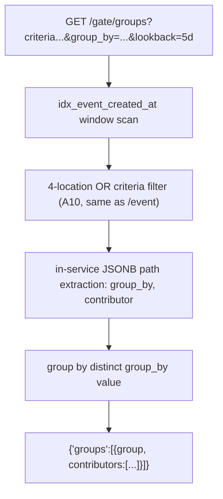
```mermaid
flowchart TB
    A["GET /gate/groups?criteria...&group_by=...&lookback=5d"] --> B["idx_event_created_at window scan"]
    B --> C["4-location OR criteria filter (A10, same as /event)"]
    C --> D["in-service JSONB path extraction: group_by, contributor"]
    D --> E["group by distinct group_by value"]
    E --> F["{'groups':[{group, contributors:[...]}]}"]
```

**Acceptance Criteria**
```gherkin
Scenario: Grouping with no schema knowledge
  Given a caller-supplied group_by path like context.data["reporting-date"]
  When GET /gate/groups is called
  Then EMS resolves the path generically without any gate-specific code

Scenario: Empty window returns 200, not 404
  Given no events fall inside the lookback window
  When the endpoint is called
  Then it returns 200 with {"groups":[]}

Scenario: Missing group_by or lookback is rejected
  Given a request missing either required parameter
  When the endpoint is called
  Then it returns 400
```

**Definition of Done**
- [ ] `GateGroupsControllerTest` covering path resolution, missing-param 400, empty-result 200
- [ ] `GateGroupsIT` (Testcontainers) proving `idx_event_created_at` usage via `EXPLAIN`
- [ ] Deliberate omission of per-group `last_event_at` documented (additive later if the heartbeat contract names the field)

---

### Issue #18 — feat(ems): `POST /decisions` batch audit ingest

**Labels:** `phase::3-apis`, `type::feat`, `component::api`
**Depends on:** #5

**Context & Motivation**
Batch ingest of L1/GATE-tier decision records from dispatchers/heartbeats, extending `routing_decision` beyond the L0 rows issue #10 writes directly. Audit must never silently swallow a write failure — "audit never blocks dispatch" is a *caller* property, so EMS must answer honestly.

**Technical Approach & Requirements**
- `decisions/DecisionIngestController` + `RoutingDecisionRepo.insertBatch` (`@Transactional`): request `{"decisions":[{event_id,tenant_id,tier,target_dag_id,decision,detail,registry_version,engine_version}]}` → response `{"received":n,"inserted":m}`.
- `tier`/`decision` validated against the closed V4 vocabularies → 400 on any unrecognized value (a typo would otherwise silently vanish from audit queries).
- **Whole-batch rejection** on any malformed record (nothing written); atomic insert; a DB failure surfaces as 5xx so the caller retries rather than getting a false-positive 200.
- One generic INSERT: `ON CONFLICT ... WHERE tier='L0_SUBSCRIPTION' DO NOTHING` (L0 dedups via `ux_rd_l0`), all other tiers append.
- Empty batch is a valid 200 `{0,0}`.

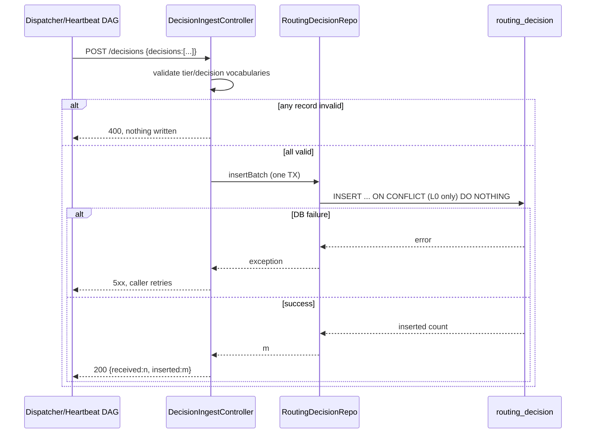
```mermaid
sequenceDiagram
    participant Caller as Dispatcher/Heartbeat DAG
    participant Ctrl as DecisionIngestController
    participant Repo as RoutingDecisionRepo
    participant DB as routing_decision

    Caller->>Ctrl: POST /decisions {decisions:[...]}
    Ctrl->>Ctrl: validate tier/decision vocabularies
    alt any record invalid
        Ctrl-->>Caller: 400, nothing written
    else all valid
        Ctrl->>Repo: insertBatch (one TX)
        Repo->>DB: INSERT ... ON CONFLICT (L0 only) DO NOTHING
        alt DB failure
            DB-->>Repo: error
            Repo-->>Ctrl: exception
            Ctrl-->>Caller: 5xx, caller retries
        else success
            DB-->>Repo: inserted count
            Repo-->>Ctrl: m
            Ctrl-->>Caller: 200 {received:n, inserted:m}
        end
    end
```

**Acceptance Criteria**
```gherkin
Scenario: A malformed record rejects the whole batch
  Given a batch where one record has an unrecognized tier value
  When POST /decisions is called
  Then the response is 400 and zero records are written, including the valid ones

Scenario: A write failure is never swallowed
  Given the database is unreachable mid-insert
  When POST /decisions is called
  Then the response is 5xx, not a false 200

Scenario: L1/GATE decisions append rather than dedup
  Given two decision records for the same event at tier GATE, five minutes apart
  When both are ingested
  Then both rows persist (only L0_SUBSCRIPTION dedups)
```

**Definition of Done**
- [ ] `DecisionIngestControllerTest` covering vocabulary validation, whole-batch rejection, empty batch
- [ ] `DecisionIngestIT` (Testcontainers) proving atomic insert and the ON CONFLICT scoping
- [ ] Response schema documented byte-exact in `docs/ems-user-guide.md`

---

### Issue #19 — feat(ems): admin write path — `POST /admin/replay` & `PUT /admin/subscriptions`

**Labels:** `phase::3-apis`, `type::feat`, `component::api`
**Depends on:** #5, #11

**Context & Motivation**
The two elevated-privilege write endpoints: DLQ replay (turns the DLQ from a graveyard into a triage queue) and subscription upsert (the CI-governable routing-config write path, Phase-A seeded by migration, Phase-B taken over by registry CI).

**Technical Approach & Requirements**
- **Replay:** `dlq_record` stores no payload, so replay **seeks the source topic at the stored (partition, offset)** and re-sends verbatim (key preserved); offset range-checked against beginning/end offsets so an expired coordinate can't trigger `auto.offset.reset` into replaying the wrong record. Publish-then-stamp ordering (never stamp first). Response is **200 with per-id reasons** (`NOT_FOUND`/`ALREADY_REPLAYED`/`PAYLOAD_UNAVAILABLE`/`PUBLISH_FAILED`), not 5xx — the reader is a human operator and nothing is lost by a partial failure. Selection by id only (no topic/time selectors — bounds blast radius); ids de-duplicated.
- **Subscriptions upsert:** `PUT /admin/subscriptions` → `SubscriptionRepo.upsertAll` (`ON CONFLICT (tenant_id,stage,rule_name) DO UPDATE`, `@Transactional`). Rejects CEL that fails compilation; `PERSIST` rows additionally reject any `context.*` reference (A4, structurally enforced by issue #8's `CelPrograms`). Whole-slice rejection on any bad row. `FORWARD` without `control_dag_id` is a 400 (V3 CHECK), not a 500.

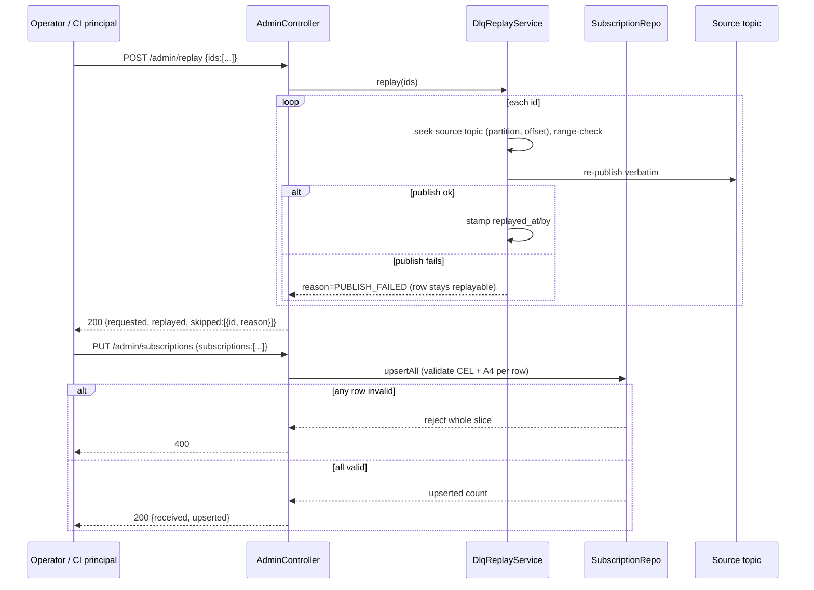
```mermaid
sequenceDiagram
    participant Op as Operator / CI principal
    participant Admin as AdminController
    participant Replay as DlqReplayService
    participant SubRepo as SubscriptionRepo
    participant Kafka as Source topic

    Op->>Admin: POST /admin/replay {ids:[...]}
    Admin->>Replay: replay(ids)
    loop each id
        Replay->>Replay: seek source topic (partition, offset), range-check
        Replay->>Kafka: re-publish verbatim
        alt publish ok
            Replay->>Replay: stamp replayed_at/by
        else publish fails
            Replay-->>Admin: reason=PUBLISH_FAILED (row stays replayable)
        end
    end
    Admin-->>Op: 200 {requested, replayed, skipped:[{id, reason}]}

    Op->>Admin: PUT /admin/subscriptions {subscriptions:[...]}
    Admin->>SubRepo: upsertAll (validate CEL + A4 per row)
    alt any row invalid
        SubRepo-->>Admin: reject whole slice
        Admin-->>Op: 400
    else all valid
        SubRepo-->>Admin: upserted count
        Admin-->>Op: 200 {received, upserted}
    end
```

**Acceptance Criteria**
```gherkin
Scenario: Replay never loses a record on publish failure
  Given a DLQ record whose re-publish fails
  When POST /admin/replay processes it
  Then the reason is PUBLISH_FAILED, the row remains un-stamped, and it can be retried later

Scenario: A repeated replay id is a safe double-submit guard
  Given an id already replayed
  When it is submitted again
  Then the response marks it ALREADY_REPLAYED and no duplicate re-publish occurs

Scenario: Subscription upsert enforces A4 at the write boundary
  Given a PERSIST-stage row whose when_cel references context.*
  When PUT /admin/subscriptions is called
  Then the whole slice is rejected with 400, and no partial write occurs

Scenario: A malformed FORWARD row is a client error, not a server error
  Given a FORWARD row with no control_dag_id
  When the upsert is attempted
  Then the response is 400, not 500
```

**Definition of Done**
- [ ] `AdminControllerTest` covering both endpoints' happy/error paths
- [ ] `DlqReplayIT` (Testcontainers + embedded Kafka) proving offset-seek replay and range-checking
- [ ] `SubscriptionUpsertIT` proving A4 rejection and whole-slice atomicity
- [ ] Runbook entry added to `docs/ems-user-guide.md` §12.3

---

### Issue #20 — feat(ems): Spring Security auth matrix

**Labels:** `phase::3-apis`, `type::feat`, `component::security`
**Depends on:** #14, #15, #16, #17, #18, #19

**Context & Motivation**
Every endpoint built in issues #14–#19 must sit behind the correct authorization tier before this Epic can leave Phase 3: Entra JWT as primary, Basic as fallback, group-claim-based authorization, with `PUT /admin/subscriptions` additionally restricted to the CI principal.

**Technical Approach & Requirements**
- `config/SecurityConfig` + `AuthProperties` + `GroupAuthorities`: actuator health/info `permitAll`; `PUT /admin/subscriptions` = elevated group **AND** CI-principal group; `/admin/**` = elevated group; `POST /decisions` = dispatcher group; everything else authenticated. Stateless, CSRF off.
- `ems.auth.mode = local|entra` — `entra` uses Boot's issuer-uri decoder (fail-fast if unset, no dev-token endpoint); `local` self-issues HS256 via `POST /token` (Basic in → bearer out, asserting the caller's own groups) for slices/ITs/dev boxes with no IdP dependency.
- One `GroupAuthorities` table (group→authority + inverse) shared by the JWT converter, Basic accounts, and token issuance, so Basic and JWT callers are equally privileged. Principal-claim fallback to `sub`.
- **Do not default `ems.auth.mode` to `local`** in any deployed profile — see issue #30, which hardens this specific gap.

```mermaid
sequenceDiagram
    participant Caller
    participant Sec as SecurityConfig
    participant JWT as Entra JWT decoder / local HS256
    participant Endpoint

    Caller->>Sec: Request + Authorization header
    alt Bearer JWT
        Sec->>JWT: decode + validate issuer/signature
        JWT-->>Sec: claims incl. groups
    else Basic
        Sec->>Sec: authenticate against GroupAuthorities accounts
    end
    Sec->>Sec: map groups -> authorities (GroupAuthorities)
    Sec->>Endpoint: check required authority for this route
    alt authorized
        Endpoint-->>Caller: 2xx
    else wrong group
        Sec-->>Caller: 403
    else no/garbage credential
        Sec-->>Caller: 401
    end
```

**Acceptance Criteria**
```gherkin
Scenario: Anonymous access is rejected
  Given no Authorization header
  When any non-permitAll endpoint is called
  Then the response is 401

Scenario: Wrong group is forbidden
  Given a valid JWT lacking the required group claim for /admin/**
  When that endpoint is called
  Then the response is 403

Scenario: PUT /admin/subscriptions requires both groups
  Given a JWT with the elevated admin group but not the CI-principal group
  When PUT /admin/subscriptions is called
  Then the response is 403

Scenario: Basic and JWT callers are equally privileged
  Given the same group assigned via both a Basic account and a JWT claim
  When each calls the same endpoint
  Then both receive the same authorization outcome
```

**Definition of Done**
- [ ] `SecurityMatrixTest` — anonymous 401 / wrong-group 403 / right-group 2xx per tier, local token round-trip, dispatcher-token 403 on /admin, garbage bearer 401
- [ ] `GroupAuthoritiesTest` covering the group↔authority mapping both directions
- [ ] All six controller slices from #14–#19 updated with `@Import(SecurityConfig.class)` tests proving reachability by an authorized caller
- [ ] `docs/ems-user-guide.md` "Authenticating" section written

---

### Issue #21 — feat(ems): Prometheus-pull observability transport & metric catalog

**Labels:** `phase::4-ops-readiness`, `type::feat`, `component::observability`
**Depends on:** #10, #12, #6

**Context & Motivation**
Amendment A11: the transport is **Prometheus pull** — `/actuator/prometheus` scraped via a `ServiceMonitor`, with alert rules shipped as a `PrometheusRule` inside the Helm chart. This closes a real contradiction: exposing the `prometheus` actuator endpoint without the Prometheus Micrometer registry on the classpath means the endpoint doesn't actually exist.

**Technical Approach & Requirements**
- Add `micrometer-registry-prometheus` to the classpath; keep `micrometer-registry-otlp` present but `management.otlp.metrics.export.enabled=false` by default (one property flips it for an OTLP-collector environment).
- Implement the full §10 metric table: `ems_events_consumed_total{topic,outcome}`, `ems_events_dropped_total{source}`, `ems_subscription_verdicts_total{tenant,decision}`, `ems_dlq_depth{topic}`, `ems_outbox_pending_age_seconds`, `ems_consumer_lag{topic,partition}`, `ems_normalization_mutations_total{field}`, `ems_registry_version{component,version}`, `ems_overdue_inflight_runs`, `ems_context_fetch_total{source}`, per-endpoint latency histograms on `/event`, `/run/status`, `/gate/groups`.
- Write `MetricNamingTest` **first** — scrape a real `PrometheusMeterRegistry` and assert exposed names match the §10 table exactly before assuming any suffix behavior (the Prometheus client reserves and strips the `_info` suffix from gauges, so `ems_registry_version{...}` is exposition-exact only after this is verified, not guessed).
- `ems_events_consumed_total{topic,outcome}`: `IngestionService.process` returns an `IngestOutcome` enum (`DROPPED`/`PERSISTED`/`DUPLICATE`); `EventConsumer` counts with the record's topic; the DLQ recoverer counts `outcome=poison`. A parked record is not counted (lag is that signal).
- Per-endpoint histograms via a `MeterFilter` enabling percentile histograms on `http.server.requests` restricted to the three named URIs — no per-controller `@Timed` annotations.

```mermaid
flowchart LR
    A[EMS pods] -- expose --> B["/actuator/prometheus"]
    B -- scraped by --> C[ServiceMonitor]
    C --> D[(Prometheus)]
    D -- evaluates --> E[PrometheusRule<br/>shipped in Helm chart]
    E -- fires --> F[Alertmanager]
    D -- queried by --> G[Grafana dashboards]
```

**Acceptance Criteria**
```gherkin
Scenario: The scrape endpoint actually works
  Given the app is running with micrometer-registry-prometheus on the classpath
  When Prometheus scrapes /actuator/prometheus
  Then every §10 metric name is present, exposition-exact (verified by MetricNamingTest, not assumed)

Scenario: OTLP is off by default but one property away
  Given a fresh deployment with no OTLP collector
  When metrics export runs
  Then no OTLP push occurs; setting management.otlp.metrics.export.enabled=true alone enables it

Scenario: Parked records are not double-counted as failures
  Given a record parked under transient backoff
  When ems_events_consumed_total is inspected
  Then it has not incremented for that record (only lag reflects the stall)
```

**Definition of Done**
- [ ] `MetricNamingTest` green, proving every §10 metric's exposed name
- [ ] Unit tests for every counter/gauge emission point
- [ ] Helm `ServiceMonitor` + `PrometheusRule` templates added (finalized fully in issue #25)
- [ ] `docs/ems-technical-specification.md` §10 metric table marked implemented

---

### Issue #22 — feat(ems): ReconciliationSweep & admin-invocation audit table (V6)

**Labels:** `phase::4-ops-readiness`, `type::feat`, `component::observability`
**Depends on:** #11, #12, #21

**Context & Motivation**
Three §17 alerts (`ems_dlq_depth`, `ems_consumer_lag`, `ems_overdue_inflight_runs`) have no source without a loss backstop that is deliberately **independent** of the ingest and dispatch paths — it must publish even when the consumer is parked and even when `ems.dispatch.enabled=false` (e.g., during shadow-consume, issue #26). This issue also closes the admin-audit gap: a `POST /admin/replay` call that replays nothing today leaves no record at all.

**Technical Approach & Requirements**
- `recon/ReconciliationSweep` (`@Scheduled`, unconditional bean — not gated behind `ems.dispatch.enabled`): reads out-of-band from SQL (`dlq_record`, `dag_trigger_outbox`, `event`) and a Kafka `AdminClient` (committed vs. end vs. earliest offsets).
- `ems_dlq_depth{topic}` = count of unreplayed `dlq_record` rows grouped by topic (not DLT end-offsets, which never return to zero after a replay and would page forever).
- `ems_consumer_lag{topic,partition}` = end − committed; `ems_consumer_retention_headroom_records{topic,partition}` = committed − earliest, as the cheap monotone proxy for "lag age approaching retention."
- `ems_outbox_pending_age_seconds` ownership moves here (unconditional) so shadow-stage backlogs, where the dispatcher bean doesn't exist, are still monitored.
- `ems_overdue_inflight_runs`: reuse `RunStatusRepository`'s terminal/started vocabulary verbatim (no second vocabulary); bounded by a configurable horizon so the query rides `idx_event_created_at`.
- New `V6` migration (separate location from `V1-V5` if it must coexist with a seed migration, see issue #24): `admin_invocation` table recording every `/admin/replay` and `/admin/subscriptions` call (principal, timestamp, params, records-affected count) regardless of whether it changed anything.

```mermaid
flowchart TB
    subgraph Sweep["ReconciliationSweep (@Scheduled, always on)"]
        A[dlq_record] --> M1[ems_dlq_depth]
        B[dag_trigger_outbox] --> M2[ems_outbox_pending_age_seconds]
        C[event + RunStatusRepository vocab] --> M3[ems_overdue_inflight_runs]
        D[Kafka AdminClient offsets] --> M4[ems_consumer_lag<br/>ems_consumer_retention_headroom_records]
    end
    M1 --> P[(Prometheus)]
    M2 --> P
    M3 --> P
    M4 --> P
    E["POST /admin/replay or PUT /admin/subscriptions"] --> F[admin_invocation row<br/>V6, always written]
```

**Acceptance Criteria**
```gherkin
Scenario: Sweep publishes even when the consumer is parked
  Given the Kafka consumer is parked under a transient outage
  When the sweep tick runs
  Then ems_dlq_depth and ems_overdue_inflight_runs still update (they read SQL, not the consumer)

Scenario: Sweep publishes in shadow mode
  Given ems.dispatch.enabled=false
  When the sweep tick runs
  Then ems_outbox_pending_age_seconds still reflects the growing shadow backlog

Scenario: A no-op admin call is still audited
  Given POST /admin/replay is called with a filter matching zero records
  When the call completes
  Then an admin_invocation row is written recording the attempt and its zero-record outcome

Scenario: DLQ depth reflects triage state, not cumulative volume
  Given a DLQ record is successfully replayed
  When the next sweep tick runs
  Then ems_dlq_depth decrements for that topic
```

**Definition of Done**
- [ ] `ReconciliationSweepTest` (mocked repo) covering all four gauge computations and degraded-Kafka behavior
- [ ] `ReconRepositoryIT` (Testcontainers) over real rows and real consumer-group offsets
- [ ] `V6` migration for `admin_invocation`, applied and tested
- [ ] Alert thresholds for all newly-published metrics templated in `values.yaml` (finalized in issue #25)

---

### Issue #23 — perf(ems): performance gate at 10M-row scale

**Labels:** `phase::4-ops-readiness`, `type::perf`
**Depends on:** #4, #14

**Context & Motivation**
The core promise of this Epic — "10+ minutes to low single-digit milliseconds" — is unproven until it is measured against a realistic data volume, not just a few hundred seeded rows in a unit test.

**Technical Approach & Requirements**
- Opt-in Testcontainers-backed harness, tagged (e.g. `@Tag("perf")`) and **excluded from the default `mvn verify`** so a normal CI run isn't held hostage to a 10M-row seed; runs via a dedicated CI job/profile.
- Seed 10M synthetic events + 1M contexts with realistic value-distribution skew (not uniform random — uniform data hides index-selectivity problems real skewed data exposes).
- Assert the canonical §4.3 query and `/run/status` (issue #16) both meet **p95 < 50 ms**, with `EXPLAIN` assertions proving `idx_event_task_id` / `idx_context_rep_freq_region` usage and **no sequential scans**.
- Measure the DB-layer query directly (e.g., `RunStatusRepository.summarize`), not through a full HTTP round-trip, so the number is a database-plan gate, not a JVM-warmup artifact; report HTTP/serialization overhead separately.
- Capture and archive `EXPLAIN (ANALYZE, BUFFERS)` before/after evidence for the acceptance checklist (issue #28).
- Confirm the HikariCP pool budget (issue #3's `maximumPoolSize=10` × HPA max pods) against the actual provisioned Azure PG connection ceiling (review risk, §1.4) as part of this gate's sign-off.

```mermaid
flowchart TB
    A[Synthetic data generator<br/>10M events, 1M contexts, skewed] --> B[(Testcontainers PG16)]
    B --> C[Canonical §4.3 query]
    B --> D[/run/status summarize/]
    C --> E{p95 < 50ms?<br/>EXPLAIN: index scan only}
    D --> E
    E -- pass --> F[EXPLAIN ANALYZE BUFFERS<br/>archived as acceptance evidence]
    E -- fail --> G[Index/query tuning iteration]
```

**Acceptance Criteria**
```gherkin
Scenario: Canonical query meets the latency target at scale
  Given 10M seeded event rows and 1M context rows
  When the §4.3 canonical query executes 1000 times with varied parameters
  Then p95 latency is < 50 ms

Scenario: No sequential scans at scale
  Given the same seeded dataset
  When EXPLAIN runs against the canonical query and /run/status
  Then the plan uses idx_event_task_id / idx_context_rep_freq_region exclusively, never a Seq Scan

Scenario: The perf gate does not block normal CI
  Given a routine merge request with no perf-tagged changes
  When the default `mvn verify` pipeline runs
  Then the perf-tagged tests are excluded and the pipeline completes in normal CI time
```

**Definition of Done**
- [ ] Perf harness committed, tagged opt-in, running in a dedicated CI job/profile
- [ ] p95 < 50 ms demonstrated and archived with `EXPLAIN (ANALYZE, BUFFERS)` evidence
- [ ] Connection-pool sizing confirmed against the provisioned Azure PG tier
- [ ] Acceptance-checklist item (§12, issue #28) ticked with linked evidence

---

### Issue #24 — feat(ems): production `subscription` seed-0 translation & sign-off

**Labels:** `phase::4-ops-readiness`, `type::feat`, `component::subscription`
**Depends on:** #5, #8

**Context & Motivation**
Without seeded `subscription` rows, the table is empty on a fresh deploy and **every event is dropped at the persist gate** — this is the single gap that would make a fresh EMS deployment silently discard all traffic. PERSIST rows translate mechanically from `eventorchestration.filter.persist` (a well-formed JSON array); FORWARD rows require human interpretation (A14) because the legacy map-table condition grammar's parser is not present in either legacy repo.

**Technical Approach & Requirements**
- Mechanically translate the 7 legacy PERSIST rows (FRCA all; AQUA_CCR × 2; MERIVAL INGESTION × 2; RWA MR MONTHLY; CVA MR MONTHLY) into CEL, following A15's case-folded activation view (all-lowercase paths and literals, plain `==`, no `.lowerAscii()`/`has()` guards).
- Interpret and **sign off** the FORWARD rows (CAPITAL → `orchestration_control_dag_capital`, 8 rows incl. the context-referencing `context.data["run-category"]` TOPSIDE prefix match; NSFR → `orchestration_control_dag_liquidity`, 1 row, disabled) in a dedicated assumptions register (`docs/ems-seed0-assumptions.md`) — every departure from the literal legacy text enumerated and signed off by a human, not asserted by a test.
- Ship as `V6__subscription_seed0.sql` (or next available version) in a **separate Flyway location** (e.g. `classpath:db/seed`), added to `spring.flyway.locations` only in deployed profiles (`azure`/`shadow`/`live`) — never in the default location, so it doesn't silently change the fixture state of every existing integration test.
- Seed `enabled` flags mirror legacy exactly (all rows enabled except NSFR) — the real cutover safety valve is `ems.dispatch.enabled=false`, not disabling subscription rows.
- CI enforcement: every seeded FORWARD row must also satisfy its tenant's seeded PERSIST rows (the §7 `PERSIST ⊇ FORWARD` invariant, issue #8) over the sample payloads — a violation fails the build.

```mermaid
flowchart TB
    A[eventorchestration.filter.persist<br/>7 rows, JSON array] -- mechanical --> B[PERSIST CEL rows]
    C[post_filter_control_dag_map<br/>9 rows, malformed pseudo-SQL] -- human interpretation --> D[FORWARD CEL rows]
    D --> E[docs/ems-seed0-assumptions.md<br/>every departure signed off]
    B --> F["V6__subscription_seed0.sql<br/>classpath:db/seed"]
    D --> F
    F --> G{"PERSIST ⊇ FORWARD<br/>CI invariant (issue #8)"}
    G -- pass --> H[Deployed to azure/shadow/live profiles only]
    G -- fail --> C
```

**Acceptance Criteria**
```gherkin
Scenario: A fresh deploy does not silently drop all traffic
  Given a new environment with the seed migration applied
  When live traffic arrives
  Then at least the 7 PERSIST rows are active and admit the expected event families

Scenario: Every FORWARD row is covered by a PERSIST row
  Given the 8 seeded CAPITAL FORWARD rows and 1 disabled NSFR row
  When each is evaluated against its tenant's PERSIST rows over sample payloads
  Then every enabled FORWARD row's matching event set is a subset of a PERSIST row's matching set

Scenario: Every interpretive decision is signed off
  Given docs/ems-seed0-assumptions.md
  When the FORWARD translation is reviewed
  Then every departure from the literal legacy condition text has an explicit sign-off entry

Scenario: The seed migration does not affect existing test fixtures
  Given the existing integration test suite built against an empty subscription table
  When the seed migration is added to a separate Flyway location
  Then those tests remain unaffected (they don't run with the deployed-profile locations)
```

**Definition of Done**
- [ ] `V6__subscription_seed0.sql` written, CEL-compiles, `PERSIST ⊇ FORWARD` CI check green
- [ ] `docs/ems-seed0-assumptions.md` complete with human sign-off on every FORWARD interpretation
- [ ] Per-environment row deltas collected and reconciled (§14 item 3 residual)
- [ ] Explicitly flagged in the Epic: "seed parity reviewed" is a **human gate** — no test can fully discharge it

---

### Issue #25 — feat(ems): finalize Helm chart for production readiness

**Labels:** `phase::4-ops-readiness`, `type::feat`, `component::ci-cd`
**Depends on:** #6, #21, #22

**Context & Motivation**
The Foundation skeleton (issue #6) is not production-ready: it lacks the monitoring CRDs, disruption budget, and secrets wiring the rest of Phase 4 depends on, and nothing gates the chart's correctness in CI.

**Technical Approach & Requirements**
- Add `ServiceMonitor` and `PrometheusRule` templates (issue #21/#22's metrics and alert thresholds as code, not a wiki page).
- `PodDisruptionBudget`, real `ConfigMap` for Spring profile values, Vault-agent injection annotations for secrets (Airflow basic auth, Azure OAuth, JKS truststore, EDF API keys — per §10's `system_properties` retirement mapping).
- HPA 3–10 replicas, `RollingUpdate maxSurge=1/maxUnavailable=0`, liveness/readiness via actuator, Istio sidecar compatibility, Workload Identity for passwordless Azure PG auth.
- CI job: `helm lint` + `helm template`, plus an explicit assertion that renders the `shadow`/`live` profile values and confirms the §11 cutover-critical defaults (`ems.dispatch.enabled`, `ems.consumer.enabled`) have not silently flipped.

```mermaid
flowchart TB
    A[Helm chart: ems/deploy/helm/ems] --> B[Deployment + Service + HPA<br/>issue #6 skeleton]
    A --> C[ServiceMonitor + PrometheusRule<br/>issue #21/#22]
    A --> D[PodDisruptionBudget]
    A --> E[ConfigMap + Vault-agent annotations]
    B & C & D & E --> F["CI: helm lint + helm template"]
    F --> G{Cutover-default guard:<br/>ems.dispatch.enabled / ems.consumer.enabled unchanged?}
    G -- pass --> H[Chart ready for shadow deploy]
```

**Acceptance Criteria**
```gherkin
Scenario: Chart lints and templates cleanly
  Given the finalized chart
  When `helm lint` and `helm template` run in CI
  Then both succeed with zero errors across all profiles (dev/shadow/live)

Scenario: Cutover defaults cannot silently drift
  Given a change to values.yaml
  When CI runs the cutover-default guard
  Then it fails the build if ems.dispatch.enabled or ems.consumer.enabled changed without an explicit, reviewed diff

Scenario: Secrets never appear in the chart
  Given the ConfigMap and Vault-agent annotations
  When the chart is inspected
  Then no secret value is present in plaintext anywhere in the templates or values.yaml
```

**Definition of Done**
- [ ] `helm lint`/`helm template` gated in CI and green
- [ ] Cutover-default guard test demonstrably fails on a crafted bad diff
- [ ] All §10 config-mapping items (Vault/profile/subscription-table) verified present
- [ ] Chart reviewed by the platform/ops team before issue #26 begins

---

### Issue #26 — feat(ems): shadow-consume rehearsal, parity validation & historical backfill

**Labels:** `phase::5-cutover`, `type::feat`, `component::migration`
**Depends on:** #13, #20, #24, #25

**Context & Motivation**
The strategy exploits the one invariant both services share: idempotent triggering (§11). Running EMS against live production traffic with dispatch disabled and its own consumer group is zero-risk and produces the byte-parity evidence the go-live decision depends on.

**Technical Approach & Requirements**
- Deploy with `ems.dispatch.enabled=false` and a **dedicated consumer group** (never the legacy Scala group) — EMS consumes live traffic, evaluates subscriptions, persists events/contexts/decisions, and writes outbox rows that are never dispatched.
- **Conf byte-parity job:** compare shadow outbox `(dag_id, dag_run_id, conf)` against the dag runs the legacy service actually triggered (via Airflow REST) — target zero diffs; any diff must be explained by `ems_normalization_mutations_total`.
- **Drop parity job:** events the legacy service persisted that EMS dropped, and vice versa — each explained or zero (validates the seed-0 translation from issue #24).
- **Perf validation:** run the canonical §4.3 queries against the shadow-filled store under real production data volume; confirm p95 targets from issue #23 hold on real (not synthetic) data.
- **Historical backfill:** copy the 13-month retention window from the legacy database (`postgres_fdw` or dump/restore); `ON CONFLICT DO NOTHING` absorbs overlap with shadow-ingested rows; run `ANALYZE event, context;` after load.

```mermaid
sequenceDiagram
    participant Kafka as EDF Kafka (live traffic)
    participant Legacy as Legacy Scala service (unchanged consumer group)
    participant Shadow as EMS (own consumer group, dispatch disabled)
    participant AF as Airflow (triggered only by Legacy)
    participant Parity as Parity jobs

    Kafka->>Legacy: live events
    Kafka->>Shadow: same live events (mirrored)
    Legacy->>AF: triggers dag runs
    Shadow->>Shadow: persist event/context/decisions + write (undispatched) outbox row
    Parity->>AF: fetch actual triggered dag runs
    Parity->>Shadow: fetch shadow outbox rows
    Parity->>Parity: compare (dag_id, dag_run_id, conf) -> diffs explained or zero
    Parity->>Legacy: compare persisted-event sets -> drop parity
    Note over Shadow: separately, backfill 13mo history via postgres_fdw / dump-restore
```

**Acceptance Criteria**
```gherkin
Scenario: Conf byte-parity is clean
  Given days-to-weeks of mirrored live traffic
  When the parity job compares shadow outbox conf to legacy-triggered dag runs
  Then every diff is either zero or explained by a nonzero ems_normalization_mutations_total entry

Scenario: Drop parity is clean
  Given the same mirrored traffic window
  When events persisted by legacy but dropped by EMS (or vice versa) are compared
  Then each discrepancy is explained (a seed-0 translation gap) or the set is empty

Scenario: Backfill does not duplicate shadow-ingested rows
  Given the shadow consumer has already ingested some of the 13-month window
  When the backfill copy runs
  Then ON CONFLICT DO NOTHING absorbs the overlap with no duplicate rows

Scenario: Real-data performance holds
  Given the shadow store now holds real production-scale data
  When the canonical queries run
  Then p95 latency matches the synthetic perf-gate result from issue #23 within an agreed tolerance
```

**Definition of Done**
- [ ] Shadow deployment running for an agreed minimum window (days-to-weeks) with zero dispatch
- [ ] Conf byte-parity and drop-parity reports produced and reviewed, zero unexplained diffs
- [ ] Backfill completed and verified (row counts reconciled against the legacy source)
- [ ] Go/no-go decision recorded before issue #27 begins

---

### Issue #27 — feat(ems): cutover flip with version-controlled rollback

**Labels:** `phase::5-cutover`, `type::feat`, `component::migration`
**Depends on:** #26

**Context & Motivation**
Because triggering is idempotent (A6), the "big bang" reduces to a route flip plus a consumer/dispatch toggle — and rollback is the same flip in reverse, with no data surgery ever required.

**Technical Approach & Requirements**
- Repoint the query-API route (`ES_EVENT_ENDPOINT`/ingress) to EMS; deferrable sensors tolerate the blip by design (re-poke on error).
- Scale the legacy service's consumers to 0 (its group offsets freeze at the stop point).
- Mark all pending shadow outbox rows delivered (`delivered_at=now()`, annotated `shadow-suppressed`); flip `ems.dispatch.enabled=true`. Only post-flip events dispatch; boundary events processed by both services collide on `dag_run_id` → 409 → no double runs.
- Smoke test immediately post-flip: `/event` 200 & 404 paths, `/context`/`/parentcontext`/`/childcontext`, `/run/status`; one end-to-end trigger verified against a real subscription row.
- **Rollback (any point, release-version controlled, no data surgery):** repoint the route back; scale the legacy deployment back up (previous release version, unchanged config); set `ems.dispatch.enabled=false`. Legacy consumers resume from their own frozen offsets and reprocess the gap from Kafka; any triggers EMS already sent during the interim collide on `dag_run_id` and dedup. Safe as long as the gap is within Kafka topic retention (tracked by the lag-headroom alert, issue #22).
- **Rehearse the rollback in staging before the production flip** — it must be a drilled procedure, not a first-time-in-production improvisation.

```mermaid
stateDiagram-v2
    [*] --> ShadowConsume: issue #26 complete, go/no-go = go
    ShadowConsume --> Flip: repoint route, scale legacy to 0
    Flip --> DispatchEnabled: mark pending shadow rows delivered, ems.dispatch.enabled=true
    DispatchEnabled --> SmokeTest
    SmokeTest --> Observation: smoke test passes
    SmokeTest --> Rollback: smoke test fails
    Observation --> Decommission: acceptance checklist (issue #28) signed off
    Observation --> Rollback: issue discovered during observation window
    Rollback --> ShadowConsume: route back, legacy scaled up, ems.dispatch.enabled=false
    Decommission --> [*]
```

**Acceptance Criteria**
```gherkin
Scenario: Flip is a route change, not a data migration
  Given the shadow-consume stage has already ingested and backfilled all history
  When the flip executes
  Then no data is copied or transformed at flip time — only the route and two feature toggles change

Scenario: Boundary events never double-trigger
  Given an event processed by both the legacy service and EMS during the flip window
  When both attempt to trigger the same control DAG
  Then the second attempt receives 409 and no duplicate calculator run occurs

Scenario: Rollback requires no data surgery
  Given a rollback is initiated at any point in the observation window
  When the route flips back and the legacy service resumes
  Then it reprocesses the gap from its own frozen Kafka offsets with zero manual data repair

Scenario: Rollback has been rehearsed before production needs it
  Given the staging environment
  When the rollback drill is executed
  Then it completes with no loss and no double runs, and the runbook is validated end-to-end
```

**Definition of Done**
- [ ] Rollback drill executed and signed off in staging **before** the production flip
- [ ] Production flip executed with the documented smoke-test suite green
- [ ] Legacy service kept deployable (scaled to 0) for the full observation window
- [ ] Runbook published in `docs/ems-user-guide.md`

---

### Issue #28 — chore(ems): sign off go-live acceptance checklist

**Labels:** `phase::5-cutover`, `type::chore`
**Depends on:** #23, #26, #27

**Context & Motivation**
`ems-design.md` §12 defines an explicit acceptance checklist gating go-live decommission of the legacy service. This issue is the tracking item that consolidates evidence already produced by earlier issues into a single sign-off record — it produces no new code.

**Technical Approach & Requirements**
- Consolidate evidence links for each checklist item into one sign-off document: before/after `EXPLAIN (ANALYZE, BUFFERS)` (issue #23), generated-column completeness query, dedup regression test, shadow parity reports (issue #26), kill-Airflow drill (issue #13), poison/DLQ drill (issue #11), sensor round-trip p95 at 100 concurrent pollers, rollback drill (issue #27), retention DAG dry-run (issue #29, if sequenced before decommission).
- Formal go/no-go review with stakeholders before the legacy stack is decommissioned.

```mermaid
flowchart TB
    A["EXPLAIN before/after (#23)"] --> H[Sign-off document]
    B["Generated-column completeness (#4)"] --> H
    C["Dedup regression (#10)"] --> H
    D["Shadow parity: conf + drop (#26)"] --> H
    E["Kill-Airflow drill (#13)"] --> H
    F["Poison/DLQ drill (#11)"] --> H
    G["Rollback drill (#27)"] --> H
    H --> I{All items ticked?}
    I -- yes --> J[Go-live sign-off + legacy decommission approved]
    I -- no --> K[Remaining gaps tracked as follow-up issues]
```

**Acceptance Criteria**
```gherkin
Scenario: Every checklist item has linked evidence
  Given the §12 acceptance checklist
  When the sign-off document is reviewed
  Then every item links to a specific test run, drill result, or report — no item is marked done on assertion alone

Scenario: Legacy decommission is gated on this sign-off
  Given the sign-off document is incomplete
  When a decommission request is raised
  Then it is blocked until every checklist item is either ticked or explicitly deferred with owner and rationale
```

**Definition of Done**
- [ ] Sign-off document published with evidence links for every §12 checklist item
- [ ] Stakeholder go/no-go review conducted and recorded
- [ ] Legacy service decommission explicitly approved or explicitly deferred with reasons

---

### Issue #29 — feat(ems): retention & archival Airflow DAG

**Labels:** `phase::6-lifecycle`, `type::feat`, `component::ops`
**Depends on:** #4, #28

**Context & Motivation**
Without a retention lifecycle, `event`/`context` grow unbounded. This closes §9: a monthly Airflow maintenance DAG (zero new infrastructure — the team already operates Airflow) that archives, deletes, and purges on independent horizons per table.

**Technical Approach & Requirements**
- **Archive:** `event` + `context` rows older than 13 months to compressed files in Azure Blob Storage (`COPY ... TO STDOUT` → gzip → blob).
- **Delete events in batches** using the `ctid`-based pattern (PostgreSQL `DELETE` has no `LIMIT`), looping until 0 rows affected, with a sleep between batches to bound lock/IO pressure.
- **Delete orphaned contexts only** — past retention **and** no longer referenced by any event (`NOT EXISTS` check).
- **Purge `dag_trigger_outbox`** rows with `delivered_at` older than 30 days; **purge `dlq_record`** older than 13 months, replayed-or-discard-documented only.
- **`routing_decision` is explicitly untouched** by this DAG — it lives on an independent audit horizon (§14 item 10, resolved by issue #2/#24's findings); this DAG must not assume a horizon that hasn't been confirmed.
- Backfilled historical rows derive their retention clock from `event_timestamp` (the payload's own emit time), not load-time `created_at` (§14 item 4).

```mermaid
flowchart TB
    A["Monthly Airflow maintenance DAG"] --> B["Archive event+context > 13mo<br/>COPY -> gzip -> Azure Blob"]
    B --> C["Batched DELETE (ctid pattern)<br/>loop until 0 rows"]
    C --> D["Delete orphaned contexts<br/>past retention AND unreferenced"]
    D --> E["Purge outbox rows<br/>delivered_at > 30d"]
    E --> F["Purge dlq_record<br/>> 13mo, replayed/discard-documented"]
    F --> G["routing_decision: untouched<br/>independent audit horizon"]
```

**Acceptance Criteria**
```gherkin
Scenario: Archive completes before delete
  Given event/context rows older than 13 months
  When the DAG runs
  Then a compressed archive file lands in Blob Storage before any DELETE executes on those rows

Scenario: Referenced contexts survive
  Given a context past its retention window that is still referenced by a recent event
  When the orphan-context cleanup runs
  Then that context row is NOT deleted

Scenario: routing_decision is never touched by this DAG
  Given routing_decision rows of any age
  When the retention DAG runs
  Then no DELETE statement targets routing_decision

Scenario: Batched deletes don't lock the table for extended periods
  Given millions of eligible rows
  When the batched delete runs
  Then it proceeds in bounded LIMIT 50000 batches with a sleep between iterations
```

**Definition of Done**
- [ ] DAG implemented and dry-run against a staging copy: archive files verified in Blob, batch deletes complete, orphan-context rule leaves referenced contexts intact, outbox/DLQ purges correct
- [ ] Retention-DAG acceptance-checklist item (§12) ticked
- [ ] `routing_decision` retention horizon explicitly documented as out of scope for this DAG pending §14 item 10
- [ ] Runbook added to `docs/ems-user-guide.md`

---

### Issue #30 — fix(ems): fail-closed auth default & secrets rotation

**Labels:** `phase::cross-cutting`, `type::fix`, `component::security`
**Depends on:** #20

**Context & Motivation**
Architectural review finding (§1.3, risk #3): `ems.auth.mode` currently defaults to `local` — a self-issued token trust — unless a deployment explicitly sets `entra`. A shared or misconfigured environment left on the default trusts tokens it minted for itself. This is a fail-open default in a system fronting regulatory capital data (CAPITAL/RWA/CVA control DAGs) and should be fixed before go-live, not discovered during an audit.

**Technical Approach & Requirements**
- Change the **deployed-profile** defaults (`azure`/`shadow`/`live` — not local dev/test profiles) so `ems.auth.mode` must be explicitly set to `entra`; fail application startup if it is unset or left at `local` in those profiles.
- Add a startup WARN (already partially present) that escalates to a startup **failure** outside local/dev profiles, closing the gap noted in `docs/ems-technical-specification.md` §24.2.
- Document secrets rotation policy for the Vault-held secrets (Airflow basic auth, Azure OAuth, JKS truststore, EDF API keys, per §10): rotation cadence, and confirmation that Workload Identity token refresh failure degrades to a clear error, not a silent stale-credential retry loop.

```mermaid
flowchart TB
    A[App startup] --> B{Profile}
    B -- local/dev/test --> C["ems.auth.mode=local allowed<br/>WARN logged"]
    B -- azure/shadow/live --> D{ems.auth.mode explicitly = entra?}
    D -- yes --> E[Start normally]
    D -- no / unset / local --> F["Startup FAILS<br/>fail-closed, not fail-open"]
```

**Acceptance Criteria**
```gherkin
Scenario: A deployed profile refuses to start on the insecure default
  Given the "shadow" or "live" Spring profile is active
  And ems.auth.mode is unset or explicitly "local"
  When the application starts
  Then startup fails fast with a clear error naming the property

Scenario: Local/dev profiles remain unaffected
  Given the local development profile
  When ems.auth.mode defaults to "local"
  Then the application starts normally with a WARN log (unchanged developer experience)

Scenario: Secrets rotation is documented and testable
  Given the Vault-agent-injected secrets
  When the rotation runbook is followed in staging
  Then a rotated credential is picked up without a service restart, or the documented restart procedure is exercised successfully
```

**Definition of Done**
- [ ] Fail-fast startup check added and covered by a profile-parameterized test
- [ ] `docs/ems-technical-specification.md` §24.2 gap marked closed
- [ ] Secrets rotation runbook published in `docs/ems-user-guide.md`
- [ ] Verified in a staging deployment before issue #26 (shadow-consume) begins

---

### Issue #31 — fix(ems): coordinate outbox-dispatcher backoff across pods

**Labels:** `phase::cross-cutting`, `type::fix`, `component::dispatch`
**Depends on:** #12

**Context & Motivation**
Architectural review finding (§1.3, risk #1): the `OutboxDispatcher` runs in every pod and uses `FOR UPDATE SKIP LOCKED` to safely claim a row for a single delivery attempt — but the exponential-backoff schedule after a RETRIABLE outcome has no persisted `next_eligible_at` column (V5 tracks only `attempts`/`last_error`). If backoff state lives only in each pod's process memory, a row that just failed on pod A becomes immediately eligible for pod B's next drain tick, which has no memory of A's failure. Under sustained Airflow degradation with N dispatcher pods, this can turn an intended 30 s–600 s backoff into an effective retry rate scaled by N — the opposite of what backoff is for.

**Technical Approach & Requirements**
- Add a `next_eligible_at timestamptz` column to `dag_trigger_outbox` (a small, additive Flyway migration) so backoff state is shared across all pods via the database, not held in per-process memory.
- `drainPending` query gains `AND (next_eligible_at IS NULL OR next_eligible_at <= now())` alongside the existing `FOR UPDATE SKIP LOCKED`.
- `recordAttempt` sets `next_eligible_at = now() + backoffFor(attempts)` in the same statement that increments `attempts`, keeping the claim-and-schedule atomic.
- Verify with a multi-connection test simulating two "pods" draining concurrently against a shared row in backoff: only one pod should observe an eligible row within the backoff window.

```mermaid
sequenceDiagram
    participant PodA as Dispatcher pod A
    participant PodB as Dispatcher pod B
    participant DB as dag_trigger_outbox

    PodA->>DB: drainPending() -- claims row X, FOR UPDATE SKIP LOCKED
    PodA->>PodA: trigger() fails -> RETRIABLE
    PodA->>DB: recordAttempt(X): attempts++, next_eligible_at = now()+backoff
    Note over DB: row X now carries a shared, DB-visible backoff deadline
    PodB->>DB: drainPending() -- WHERE next_eligible_at <= now()
    DB-->>PodB: row X excluded (still in backoff window)
    Note over PodB: without this fix, PodB would have re-claimed X immediately
```

**Acceptance Criteria**
```gherkin
Scenario: A second pod respects a first pod's backoff
  Given pod A just recorded a RETRIABLE attempt on row X with a 30s backoff
  When pod B's drain tick runs 5 seconds later
  Then row X is not returned to pod B (next_eligible_at excludes it)

Scenario: Backoff expiry makes the row eligible again for any pod
  Given row X's next_eligible_at has passed
  When any pod's drain tick runs
  Then row X is eligible for claim by whichever pod's query runs first

Scenario: The fix does not weaken the existing concurrency safety
  Given multiple pods draining simultaneously after backoff has expired
  When two pods race to claim the same eligible row
  Then FOR UPDATE SKIP LOCKED still guarantees exactly one pod claims it
```

**Definition of Done**
- [ ] Additive Flyway migration for `next_eligible_at` (with a safe default for existing rows)
- [ ] `OutboxDispatcherTest` extended with a two-simulated-pod scenario proving backoff is now shared
- [ ] `KillAirflowDrainIT` re-verified with multiple dispatcher instances against a shared container
- [ ] Architectural review risk #1 (§1.3) marked closed with a cross-reference to this issue

---

*Document prepared for GitLab import. Every issue's Technical Approach cites concrete `ems-design.md` sections, amendment IDs (A1–A15), and — where grounded in the existing partial implementation — real class/table/metric names, so each issue is developer-ready without requiring the assignee to re-read the full 634-line design document first.*
