# Event Management Service (EMS) — Technical Specification

**Version:** 1.0 · **Date:** 2026-07-27
**Status of the system described:** Phases 1–3 (partial) implemented; see [§2 Implementation Status](#2-implementation-status).
**Authoritative design source:** [`ems-design.md`](../ems-design.md) (approved design, amendments A1–A10).
**Companion document:** [`ems-user-guide.md`](ems-user-guide.md) (task-oriented guide for API consumers and operators).

> **Precedence.** This specification describes what the design mandates *and* what the code in [`ems/`](../ems/) actually does. Where the two differ (deferred work, provisional stubs), the difference is called out explicitly rather than smoothed over. Where this document is silent, [`ems-design.md`](../ems-design.md) governs; where that is silent, [`trigger_redesign_final_implementation_plan.md`](../trigger_redesign_final_implementation_plan.md) governs.

---

## Table of contents

1. [Purpose & scope](#1-purpose--scope)
2. [Implementation status](#2-implementation-status)
3. [System context](#3-system-context)
4. [Architecture](#4-architecture)
5. [Binding invariants (amendments A1–A10)](#5-binding-invariants-amendments-a1a10)
6. [Data model](#6-data-model)
7. [Ingestion pipeline](#7-ingestion-pipeline)
8. [Level-0 subscription engine](#8-level-0-subscription-engine)
9. [Normalization](#9-normalization)
10. [Canonical JSON and trigger identity](#10-canonical-json-and-trigger-identity)
11. [Transactional outbox and dispatch](#11-transactional-outbox-and-dispatch)
12. [Failure taxonomy, DLQ and replay](#12-failure-taxonomy-dlq-and-replay)
13. [Query API specification](#13-query-api-specification)
14. [Control-plane API specification](#14-control-plane-api-specification)
15. [Caching](#15-caching)
16. [Configuration reference](#16-configuration-reference)
17. [Observability](#17-observability)
18. [Security](#18-security)
19. [Deployment topology](#19-deployment-topology)
20. [Retention and archival](#20-retention-and-archival)
21. [Test strategy and current inventory](#21-test-strategy-and-current-inventory)
22. [Migration and cutover](#22-migration-and-cutover)
23. [Traceability matrix](#23-traceability-matrix)
24. [Open items and known gaps](#24-open-items-and-known-gaps)

---

## 1. Purpose & scope

### 1.1 What EMS is

EMS is the **event backbone** of the orchestration platform: it consumes the EDF event firehose from Kafka, decides (coarsely) which events matter, enriches them with their context, persists them durably, and hands trigger intents to Airflow control DAGs. It also serves the read API that Airflow sensors, the calculator DAG framework, and the control plane poll.

EMS is deliberately **rule-free**. It evaluates exactly two classes of coarse condition (persist / forward) and *never* evaluates a calculator rule. All fine-grained routing intelligence lives in the Airflow-resident registry (trigger plan Phases B–E). EMS owns **durability, idempotency and query speed** — nothing else.

### 1.2 Problems this rewrite solves

| # | Legacy problem | Resolution in EMS |
|---|---|---|
| 1 | Enriched-event query takes **10+ minutes** — `event`/`context` are opaque JSONB blobs with no secondary indexes; every filtered query is a full sequential scan | Typed `GENERATED ALWAYS … STORED` columns + composite B-tree/GIN indexes over the JSONB payload (§6). Target: low single-digit ms |
| 2 | Join on `event.json->>'context-id' = context.context_id` defeats the context PK index | Both sides are promoted columns: `c.context_id = e.context_id` (§13.2) |
| 3 | 10-min queries × 300 s sensor polls × HikariCP max 40 → pool-exhaustion cascade | Pool capped at 10/pod; `statement_timeout=30s` guardrail (§16) |
| 4 | No ingest timestamp, no retention story | `created_at` on every table; monthly retention DAG at 13 months (§20) |
| 5 | Scala 2.13 on Spring Boot — costs without benefits | Java 17 + Spring Boot 3.5.4 (§4.3) |
| 6 | Airflow trigger issued inline on the consume path — an Airflow outage blocks ingestion | Transactional outbox + async dispatcher (§11) |
| 7 | Routing config split across a Scala DB table and a Python JSON registry, with no tenancy | Single `subscription` table, tenant-scoped, CI-governable (§8) |
| 8 | Raw versioned SQL files, no migration tool | Flyway `V1`–`V5` (§6) |
| 9 | `system_properties` DB-driven config bootstrapping | Spring profiles + env vars (§16) |

### 1.3 What this build supplies to later phases

| Consumer | Dependency delivered here | Status |
|---|---|---|
| Trigger plan Phase B | `routing_decision` store, `POST /decisions` | ✅ implemented |
| Trigger plan Phase B | `PUT /admin/subscriptions` | ✅ implemented |
| Trigger plan Phase D | `GET /gate/groups` + fast indexed contribution queries | ✅ implemented |
| Framework step **F0 (hard blocker)** | `GET /run/status` | ✅ implemented (production deployment pending) |
| Framework F1+, unmigrated DAGs | `GET /event` byte-compatible 200/404 contract | ✅ implemented |

---

## 2. Implementation status

The build follows the phase board in [`ems-design.md §13`](../ems-design.md). Current state as of 2026-07-27:

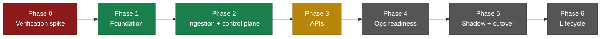

| Component | Class(es) | Status |
|---|---|---|
| Flyway schema V1–V5 | `db/migration/V1..V5__*.sql` | ✅ |
| Canonical JSON + `dag_run_id` | `canonical/CanonicalJson`, `canonical/DagRunId` | ✅ conformance 7/7 |
| Kafka consumer + error handler | `ingestion/EventConsumer`, `config/KafkaConfig` | ✅ |
| Normalizer | `ingestion/Normalizer` | ✅ (value maps provisional — §24 item 8) |
| Subscription engine (CEL) | `subscription/SubscriptionService`, `CelPrograms`, `SubscriptionRepo` | ✅ |
| Context resolution | `ingestion/ContextResolver`, `EdfContextClient` | ✅ (EDF contract provisional — §24 item 2) |
| Single-TX persist | `ingestion/IngestionService` | ✅ |
| Store repositories | `store/EventRepository`, `ContextRepository` | ✅ |
| Routing decisions | `decisions/RoutingDecisionRepo`, `L0Decision` | ✅ |
| Outbox + dispatcher | `dispatch/OutboxRepo`, `OutboxDispatcher`, `AirflowTriggerClient` | ✅ |
| DLQ recording | `ingestion/DlqRecorder` | ✅ |
| `GET /event` | `api/EventController`, `store/EventQueryRepository` | ✅ |
| `GET /context`, `/parentcontext`, `/childcontext` | `api/ContextController`, `store/ContextQueryRepository` | ✅ |
| `GET /run/status` | `api/RunStatusController`, `store/RunStatusRepository` | ✅ |
| `GET /gate/groups` | `api/GateGroupsController`, `store/GateGroupsRepository` | ✅ |
| `POST /decisions` | `decisions/DecisionIngestController` | ✅ |
| `POST /admin/replay` | `api/AdminController`, `ingestion/DlqReplayService` | ✅ |
| `PUT /admin/subscriptions` | `api/AdminController`, `SubscriptionRepo.upsertAll` | ✅ |
| Spring Security (Entra JWT + Basic), `POST /token` | `config/SecurityConfig`, `config/GroupAuthorities`, `api/TokenController` | ✅ |
| `ReconciliationSweep` | `recon/package-info.java` only | ⏳ **not built** (Phase 4) |
| `seed-0` subscription migration | fixture only: `src/test/resources/fixtures/subscriptions_seed0.json` | ⏳ **not built** (Phase 4) |
| Retention/archival DAG | — | ⏳ **not built** (Phase 6) |

**Verification caveat (carried from Phase 1).** All `*IT` integration tests are annotated `@Testcontainers(disabledWithoutDocker = true)` and **auto-skip on the development workstation** — Testcontainers cannot reach the local Docker engine (it listens on the `dockerDesktopLinuxEngine` named pipe; docker-java's probe times out). The integration suite's green run is a **CI obligation** ([`.github/workflows/ems-ci.yml`](../.github/workflows/ems-ci.yml)), which is itself inert until the workspace becomes a git repository. **No integration test has been observed green.**

Last observed build (`mvn -B -ntp -f ems/pom.xml verify`, 2026-07-27):

```
Surefire (unit):        Tests run: 115, Failures: 0, Errors: 0, Skipped: 0
Failsafe (integration): Tests run:  74, Failures: 0, Errors: 0, Skipped: 74   ← all auto-skipped
BUILD SUCCESS
```

---

## 3. System context

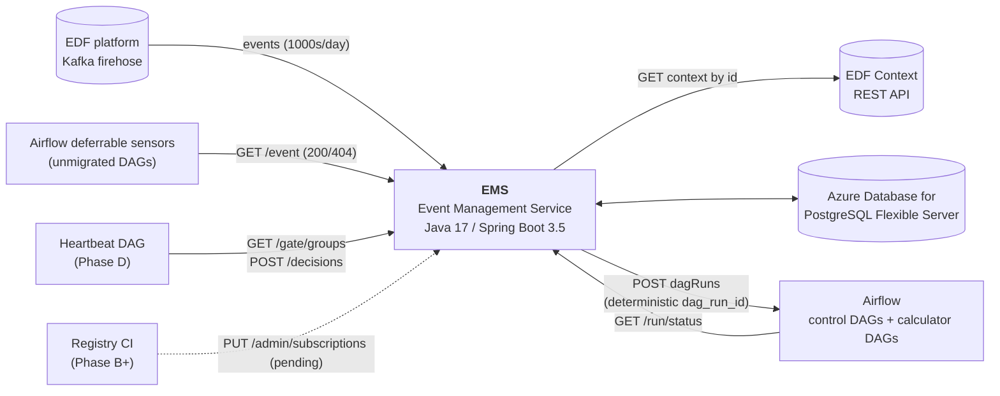

### 3.1 External dependencies

| Dependency | Direction | Protocol | Failure impact | Handling |
|---|---|---|---|---|
| EDF Kafka topics | inbound | Kafka (SASL_SSL), manual ack | No ingestion | Consumer lag alert; offsets preserved |
| EDF Context REST API | outbound | HTTPS + bearer | Cannot enrich | 4xx ⇒ context absent; 5xx/timeout ⇒ **park partition** (§12) |
| Azure PostgreSQL | bidirectional | JDBC | Cannot persist or serve | **Park partition** on ingest; 5xx on API |
| Airflow REST API | outbound | HTTPS + Basic/Bearer | Triggers undelivered | **Outbox buffers**; ingestion unaffected (§11) |

### 3.2 Traffic characteristics

- **Ingest:** thousands of events/day across the EDF firehose; only a small deliberate fraction passes the persist gate.
- **Read:** ≈ **1 QPS** from deferrable sensors (300 s poll cadence). This is a *query-plan* problem, not a throughput problem — which is why the fix is indexes, not caching or scale-out.

---

## 4. Architecture

### 4.1 Component view

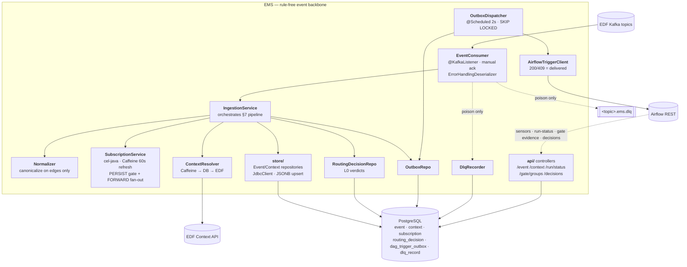

### 4.2 Package map

Root package: `com.orchestration.ems`.

| Package | Responsibility | Key types |
|---|---|---|
| `canonical/` | RFC 8785 canonicalization; deterministic trigger identity (A6) | `CanonicalJson`, `DagRunId` |
| `config/` | Kafka wiring, Caffeine caches, outbound `RestClient`s | `KafkaConfig`, `CacheConfig`, `RestClientConfig` |
| `ingestion/` | The consume→persist pipeline | `EventConsumer`, `IngestionService`, `Normalizer`, `ContextResolver`, `EdfContextClient`, `DlqRecorder`, `EdfUnavailableException` |
| `subscription/` | Level-0 CEL evaluation and rule caching | `SubscriptionService`, `CelPrograms`, `SubscriptionRepo` |
| `store/` | Persistence and read paths (JdbcClient, no ORM) | `EventRepository`, `ContextRepository`, `EventQueryRepository`, `ContextQueryRepository`, `RunStatusRepository`, `GateGroupsRepository` |
| `decisions/` | Routing-decision audit trail | `RoutingDecisionRepo`, `L0Decision`, `DecisionIngestController` |
| `dispatch/` | Outbox drain and Airflow delivery | `OutboxRepo`, `OutboxDispatcher`, `AirflowTriggerClient`, `PendingTrigger` |
| `api/` | HTTP query surfaces | `EventController`, `ContextController`, `RunStatusController`, `GateGroupsController` |
| `recon/` | Reconciliation sweep (⏳ stub only) | — |
| `model/` | Immutable records on the wire and the pipeline | `EventRow`, `ContextRow`, `EnrichedEvent`, `EnrichedEventView`, `SubscriptionRow`, `SubscriptionMatch`, `RunStatus`, `GateGroups`, `DecisionRecord` |

### 4.3 Technology decisions

| Concern | Choice | Rationale | Rejected |
|---|---|---|---|
| Runtime | **Java 17 LTS**, blocking servlet model | Same JDK the legacy service runs; EDF contract ships as a JVM artifact; matches trigger-plan §4 | Scala-native (expertise-heavy), Kotlin (novelty), Python/FastAPI (weaker Kafka consumer framework) |
| Framework | **Spring Boot 3.5.4** | Spring Kafka is a consumer *framework* (error-handling deserializer, seek-based retry, dead-letter publishing) | WebFlux — complexity with no payoff at ≤1 QPS |
| Persistence | **`JdbcClient`, no ORM** | Few, hand-tuned queries; plan transparency | JPA/Hibernate |
| Schema | **`GENERATED ALWAYS … STORED` + B-tree/GIN**, JSONB remains source of truth | Zero write-path coupling; columns cannot drift from payload; automatic backfill | Expression indexes (fragile text coupling); full normalization (brittle vs upstream evolution) |
| Rule engine | **cel-java 0.4.4** (`org.projectnessie.cel:cel-tools`) | Cross-engine parity with celpy on the Python side | Custom DSL |
| Canonical JSON | **RFC 8785 (JCS)** via `io.github.erdtman:java-json-canonicalization:1.1` | Locked cross-engine contract (A6) | Ad-hoc key-sorted serialization |
| Migrations | **Flyway** | Repeatable, auditable, CI-enforced | Liquibase |
| Caching | **In-process Caffeine only** — context-by-id, compiled rules | No stale-404 hazard on a state-change-polling endpoint; no DB load to relieve at ≤1 QPS | Redis (available, deliberately unused) |
| Partitioning | **Not now**, with explicit revisit triggers | Partitioning `event` forces the partition key into the PK, breaking `ON CONFLICT (event_id)` dedup | Monthly range partitioning |

---

## 5. Binding invariants (amendments A1–A10)

These ten amendments are **normative**. A1–A5 are design-level; A6–A10 were derived by reading the legacy sources (`old-ems/`, `old-orchestration/`) and correct earlier plan text. Every one has a concrete enforcement point in the code.

| # | Invariant | Enforced by | Verified by |
|---|---|---|---|
| **A1** | Transient-infra failures **park the partition** (unbounded backoff); they are **never** dead-lettered. The DLQ is **poison-only**. Airflow is off the ingest path | `config/KafkaConfig#kafkaErrorHandler` — `FixedBackOff(parkBackoffMs, UNLIMITED_ATTEMPTS)`; only `IllegalArgumentException` + `DeserializationException` are not-retryable | `TransientOutageIT`, `PoisonDlqIT`, `DlqPublishFailureIT` |
| **A2** | Cutover = shadow-consume then **big-bang route flip**, version-controlled rollback | `ems.dispatch.enabled` toggle; `shadow`/`live` Spring profiles | §22 |
| **A3** | Event store is **not** "as-is" — typed generated columns + indexes; write path unchanged (JSONB upsert, `ON CONFLICT DO NOTHING`) | `V1__event_context.sql`, `V2__indexes.sql`; `EventRepository#upsert` | `FlywayMigrationIT`, `EventContextRepositoryIT` |
| **A4** | Level-0 is **two-stage**: `PERSIST` (event-only CEL, pre-enrichment, zero-match ⇒ drop without persisting) + `FORWARD` (event+context CEL, post-enrichment, in-TX) | `SubscriptionService#persistMatches` / `#forwardMatches`; `CelPrograms#build` declares `context` **only** for FORWARD, so a PERSIST rule referencing `context` fails to compile | `SubscriptionServiceTest` |
| **A5** | `contractVersion` enters the conf at **Phase B**, not Phase A | `EnrichedEvent#toConf()` emits only the legacy merge shape | `EnrichedEventTest` |
| **A6** | `dag_run_id = orch_sha1(dag_id + jcs(conf))[:16]` is a **new** invariant (legacy set no run id). Canonical form is RFC 8785; EMS ↔ framework parity locked by a shared fixture | `canonical/DagRunId#derive`, `canonical/CanonicalJson` | `CanonicalConformanceTest` — **7/7 passing** against [`shared/canonical-conformance/canonical_vectors.json`](../shared/canonical-conformance/canonical_vectors.json) |
| **A7** | MEG-family `taskId`/`taskEventType` live under `event.additionalData` — generated columns COALESCE to top level | `V1__event_context.sql` `task_id`, `task_event_type` | `FlywayMigrationIT` |
| **A8** | Cross-family key spellings COALESCE: `reporting-date\|reportingDate`, `run-category\|runCategory`, `h3Region\|regionCode` | `V1__event_context.sql` context columns; `Normalizer#normalizeContext` | `FlywayMigrationIT`, `NormalizerTest` |
| **A9** | `parentIds` is **array-containment** queried, not element-0 — GIN `jsonb_path_ops`, no scalar `first_parent_id` column | `V2__indexes.sql` `idx_context_parent_ids`; `json->'parentIds' @> to_jsonb(?::text)` in `EventQueryRepository`/`ContextQueryRepository` | `ContextQueryIT`, `EventQueryRepositoryIT` |
| **A10** | `GET /event` matches each non-id param across **four JSON locations** (`event`, `event.additionalData`, `context`, `context.data`), case-sensitive, `\|`-multivalue OR — there is **no** param→column alias map | `EventQueryRepository.OTHER_TEMPLATE`, `GateGroupsRepository.CRITERION_TEMPLATE` | `EventControllerTest`, `EventQueryRepositoryIT` |

### 5.1 A10's consequence for query-parameter canonicalization

`ems-design §4.3` states that query-parameter *values* pass through ingestion canonicalization before binding. **A10 supersedes that**, and the implementation deliberately performs **no value canonicalization on query parameters**. The reasoning is decisive: the stored `json` is byte-verbatim, and the 4-location OR matches against **raw** JSONB — canonicalizing a parameter value before comparing it to raw stored text would *break* byte-compatibility, not preserve it. Canonicalization stays evidence-gated on §24 item 1b (the sensor-traffic parameter inventory).

---

## 6. Data model

### 6.1 Entity relationships

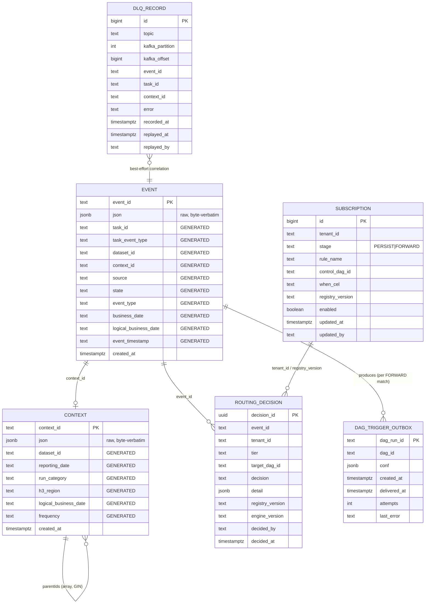

### 6.2 Design rules for promoted columns

Every promoted column is extracted via an **`IMMUTABLE` expression with no casts**:

- A `::uuid` or `::date` cast would let **one malformed message poison all inserts** for the table.
- `text::date` is not `IMMUTABLE` anyway, so PostgreSQL would reject the generated-column definition.
- ISO-8601 dates **compare and sort correctly as text** — the cast buys nothing.
- `NULL` from an absent JSON key is expected and fine.

Canonicalizing functions (`ems_norm_freq`, `ems_norm_region`) are `IMMUTABLE PARALLEL SAFE RETURNS NULL ON NULL INPUT` pure value maps that mirror the Java `Normalizer` exactly (§9).

### 6.3 Table: `event` (V1)

| Column | Type | Derivation | Notes |
|---|---|---|---|
| `event_id` | `text` PK | application-supplied (payload `id`) | dedup key for `ON CONFLICT DO NOTHING` |
| `json` | `jsonb NOT NULL` | as received | byte-verbatim payload of record |
| `task_id` | generated `text` | `COALESCE(json->'additionalData'->>'taskId', json->>'taskId')` | **A7** — MEG family nests it |
| `task_event_type` | generated `text` | `upper(COALESCE(json->'additionalData'->>'taskEventType', json->>'taskEventType'))` | **A7** |
| `dataset_id` | generated `text` | `COALESCE(json->'additionalData'->>'DATASET_UUID', json->'additionalData'->>'datasetId')` | both spellings |
| `context_id` | generated `text` | `COALESCE(json->>'contextId', json->'additionalData'->>'contextId')` | **A3** join key |
| `source` | generated `text` | `upper(json->>'source')` | |
| `state` | generated `text` | `upper(json->'additionalData'->>'STATE')` | nested — sample-verified |
| `event_type` | generated `text` | `upper(COALESCE(json->'additionalData'->>'TYPE', json->'additionalData'->>'type'))` | both spellings live in prod |
| `business_date` | generated `text` | `json->>'businessDate'` | |
| `logical_business_date` | generated `text` | `json->>'logicalBusinessDate'` | ISO form of the compact `LBD` param |
| `event_timestamp` | generated `text` | `json->>'eventTimestamp'` | emit time — backfill fidelity anchor |
| `created_at` | `timestamptz` | `now()` | retention + `ORDER BY` + gate lookback |

### 6.4 Table: `context` (V1)

| Column | Derivation | Notes |
|---|---|---|
| `context_id` PK | payload `id` | |
| `json` | as received | byte-verbatim |
| `dataset_id` | `json->>'datasetId'` | absent in Merival contexts |
| `reporting_date` | `COALESCE(json->'data'->>'reporting-date', json->'data'->>'reportingDate')` | **A8** |
| `run_category` | `upper(COALESCE(json->'data'->>'run-category', json->'data'->>'runCategory'))` | **A8** |
| `h3_region` | `ems_norm_region(COALESCE(json->'data'->>'h3Region', json->'data'->>'regionCode'))` | **A8** + normalization |
| `logical_business_date` | `json->'data'->>'logicalBusinessDate'` | Merival family |
| `frequency` | `ems_norm_freq(json->'data'->>'frequency')` | normalization |
| `created_at` | `now()` | |

> **A9:** there is deliberately **no** `first_parent_id` column. `parentIds` is a JSON array queried by containment.

### 6.5 Index inventory (V2, V4, V5)

| Index | Table | Definition | Serves |
|---|---|---|---|
| `idx_event_task_id` | `event` | `(task_id)` | THE calc-event lookup key |
| `idx_event_dataset_id` | `event` | `(dataset_id)` | dataset check |
| `idx_event_context_id` | `event` | `(context_id)` | enriched-event join, `/run/status` |
| `idx_event_created_at` | `event` | `(created_at)` | retention, `ORDER BY`, `/gate/groups` lookback |
| `idx_context_rep_freq_region` | `context` | `(reporting_date, frequency, h3_region)` | one composite; leftmost-prefix serves pair-only queries |
| `idx_context_dataset_id` | `context` | `(dataset_id)` | |
| `idx_context_created_at` | `context` | `(created_at)` | |
| `idx_context_parent_ids` | `context` | `USING gin ((json->'parentIds') jsonb_path_ops)` | **A9** chain traversal, STATUS CHECK |
| `ux_rd_l0` | `routing_decision` | `UNIQUE (event_id, tenant_id) WHERE tier='L0_SUBSCRIPTION'` | L0 redelivery idempotency |
| `ix_rd_event` / `ix_rd_target` / `ix_rd_tier` | `routing_decision` | audit queries | |
| `ix_outbox_pending` | `dag_trigger_outbox` | `(created_at) WHERE delivered_at IS NULL` | dispatcher drain + age gauge |
| `ix_dlq_context` / `ix_dlq_task` | `dlq_record` | partial, `WHERE … IS NOT NULL` | `/run/status` `dlq_hint` |

**Deliberately un-indexed:** `source`, `event_type`, `state`, `task_event_type`. In every observed query they co-occur with a selective key, so the driving index narrows to a handful of rows and the residual filter is free. Add only if `pg_stat_statements` proves a need.

### 6.6 Observed query → expected plan

| Query | Driving index | Residual filters |
|---|---|---|
| DATASET CHECK (`contextId, DATASET_UUID, FREQUENCY, LBD, source, TYPE`) | `idx_event_context_id` (or `idx_event_dataset_id`) | source, type, frequency, reporting_date |
| START-EVENT LINK (`triggerContextId, taskEventType`) | `idx_event_context_id` | task_event_type |
| STATUS CHECK (`parent_id, type, STATE` multi-value) | `idx_context_parent_ids` (GIN) → `idx_event_context_id` | event_type, state |
| `/run/status` probe (`context_id`) | `idx_event_context_id` | in-service terminal classification |
| `/gate/groups` (criteria + lookback) | `idx_event_created_at` | 4-location OR residuals; JSONB path extraction in-service |

---

## 7. Ingestion pipeline

### 7.1 Normative sequence

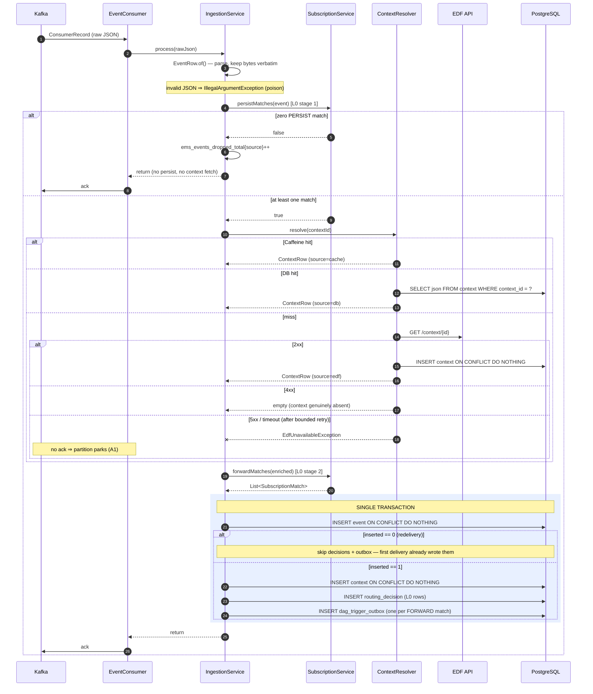

### 7.2 Step-by-step specification

| # | Step | Implementation | Failure mode |
|---|---|---|---|
| 1 | **Consume** | `EventConsumer#onMessage` — `@KafkaListener`, `AckMode.MANUAL_IMMEDIATE`, `isolation.level=read_committed`, `ErrorHandlingDeserializer` wrapping `StringDeserializer` | Deserialization failure ⇒ poison |
| 2 | **Parse** | `EventRow.of(rawJson, mapper)` — keeps `rawJson` byte-verbatim, extracts `id` and `contextId` | Invalid JSON ⇒ `IllegalArgumentException` ⇒ poison |
| 3 | **Persist gate (L0 stage 1)** | `SubscriptionService#persistMatches` — OR over enabled `PERSIST` rules against `{event}` only | Zero matches ⇒ counted drop, ack, done |
| 4 | **Resolve + normalize context** | `ContextResolver#resolve` — Caffeine → DB → EDF; **runs outside the transaction** so an EDF outage parks before any DB write | `EdfUnavailableException` ⇒ park |
| 5 | **Forward evaluation (L0 stage 2)** | `SubscriptionService#forwardMatches` over `{event, context}` | Runtime CEL error ⇒ non-match (legacy parity) |
| 6 | **Single transaction** | `IngestionService#persist` via `TransactionTemplate` | Any DB failure ⇒ rollback, no ack, park |
| 7 | **Ack** | `ack.acknowledge()` — only after step 6 commits | — |
| 8 | **(async) Dispatch** | `OutboxDispatcher#drain` every 2 s | Independent of ingestion (§11) |

### 7.3 The drop gate is the point

EDF is a central firehose carrying thousands of events of which a tiny fraction is relevant. **Dropping before the context fetch and the DB write is the intended economics**, not a defect. The consequences are accepted and instrumented:

- A dropped event leaves a **metric** (`ems_events_dropped_total{source}`), not a record.
- Recovery from an over-narrow `PERSIST` rule is **offset replay within the Kafka retention window**.
- Guardrails: per-source drop-rate anomaly alert; CI-reviewed subscription changes; the §8.4 invariant chain `PERSIST ⊇ FORWARD ⊇ Level-1 rules` guarantees no downstream rule can silently lose events to this gate.

Production configuration proves the persist set is deliberately **broader** than the forward set — lifecycle-wide (e.g. MERIVAL INGESTION BATCH in *any* `STATE`) rather than terminal-only — so sensors, `/run/status` and gates keep non-terminal evidence.

### 7.4 Idempotency model

Every write in the pipeline is idempotent, so at-least-once redelivery is safe end-to-end. A crash or rebalance between **any** two steps produces a duplicate no-op — never a loss, never a double calculator run.

| Write | Idempotency mechanism |
|---|---|
| `event` insert | `ON CONFLICT (event_id) DO NOTHING` |
| `context` insert | `ON CONFLICT (context_id) DO NOTHING` |
| `routing_decision` L0 `FORWARDED` rows | `ON CONFLICT (event_id, tenant_id) WHERE tier='L0_SUBSCRIPTION' DO NOTHING` (`ux_rd_l0`) |
| `routing_decision` `NOT_SUBSCRIBED` marker (null tenant) | **Not** covered by the partial index — idempotency comes from the **event-insert guard**: when `eventRepository.upsert` returns 0, the whole decision/outbox block is skipped |
| `dag_trigger_outbox` | `ON CONFLICT (dag_run_id) DO NOTHING` |
| Airflow trigger | Deterministic `dag_run_id`; HTTP 409 = already triggered = success |

> **Note on the guard.** `IngestionService#persist` returns early when the event insert affects 0 rows. This is what makes the null-tenant `NOT_SUBSCRIBED` marker redelivery-safe, and it is why the whole block must stay in one transaction.

### 7.5 Decision-row model

| Situation | `routing_decision` rows written |
|---|---|
| Event passes PERSIST, matches *n* FORWARD rules | *n* rows: `tier=L0_SUBSCRIPTION`, `decision=FORWARDED`, `tenant_id`, `target_dag_id`, `registry_version`, `engine_version=cel-java==0.4.4`, `decided_by=ems` |
| Event passes PERSIST, matches **no** FORWARD rule | 1 row: `decision=NOT_SUBSCRIBED`, `tenant_id=NULL`, `target_dag_id=NULL` — the legacy persist-without-trigger outcome, made queryable |
| Event fails the PERSIST gate | **none** (the event does not exist in the store) |

---

## 8. Level-0 subscription engine

### 8.1 Two stages, one table

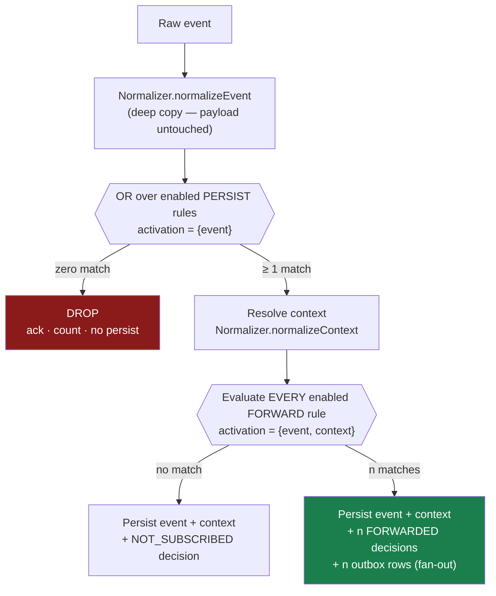

| Stage | Legacy artifact replaced | Job | CEL scope |
|---|---|---|---|
| `PERSIST` | `eventorchestration.filter.persist` (`system_properties`) | Drop gate — which firehose events are worth persisting. Deliberately **lifecycle-wide** | `event.*` **only** (pre-enrichment, A4) |
| `FORWARD` | `eventorchestration.filter.post` + `post_filter_control_dag_map` | Routing — which persisted events reach which tenant's control DAG. Typically terminal-only | `event.*` **+** `context.*` (post-enrichment) |

### 8.2 A4 is enforced structurally, not by string matching

`CelPrograms#build` compiles a rule with **stage-scoped variable declarations**:

```java
List<Decl> declarations = row.stage() == Stage.FORWARD
        ? List.of(Decls.newVar("event", ACTIVATION_MAP), Decls.newVar("context", ACTIVATION_MAP))
        : List.of(Decls.newVar("event", ACTIVATION_MAP));
```

A `PERSIST` rule that references `context` therefore fails to **compile** ("undeclared reference"), and is rejected with an `IllegalArgumentException` at load time. No regex, no pre-parse — the type checker is the guard.

Both variables are typed `map(string, dyn)`: the activation carries the normalized event/context as nested Java maps and field selection is dynamic map lookup.

### 8.3 Evaluation semantics (normative)

- **Stage 1** is a short-circuiting OR over enabled `PERSIST` rows. Zero match ⇒ ack + drop.
- **Stage 2** evaluates **every** enabled `FORWARD` row (no short-circuit) — the same event may fan out to multiple tenants. Disjoint `dag_id` ⇒ disjoint `dag_run_id` ⇒ independent Airflow runs.
- A **runtime evaluation error** (missing key, no such field) is a **non-match**, not a failure — mirroring the legacy `JsonFilterRuleset.filter` `getOrElse(false)` semantics.
- A `null` context becomes an **empty map**, so context-referencing rules simply do not match.
- Conditions are **coarse by design**. EMS evaluates no calculator rule, ever.

### 8.4 The CI invariant chain

```
PERSIST ⊇ FORWARD ⊇ tenant's Level-1 registry rules
```

Every registry-rule fixture must pass its tenant's `FORWARD` rows, and every `FORWARD` fixture must pass the `PERSIST` gate. Any rejection fails the build. `SubscriptionService#forwardImpliesPersist(event, context)` is the per-event predicate this chain is built from.

> **Seed consequence.** The legacy *effective* persist set was `PERSIST ∪ FORWARD` (the Kafka `RecordFilterStrategy` admitted an event matching persist **or** post, and every admitted event was saved). The `seed-0` translation must therefore add `PERSIST` rows wherever a FORWARD-only match would otherwise be dropped.

### 8.5 Rule caching and refresh

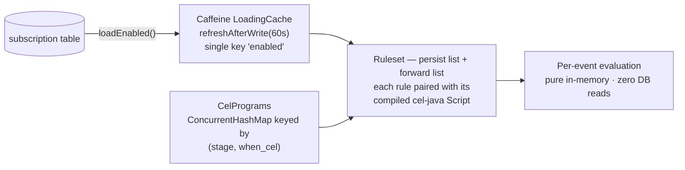

Subscription-table edits take effect **within ~60 s without a redeploy**. Compiled `Script`s are pure and thread-safe; identical CEL under the same stage compiles once.

### 8.6 Mechanical translation from the legacy filters

Legacy filters are flat JSONPath-equality maps: an array of objects is an **OR across rows**; keys within an object are an **AND**.

```
{"$.source":"MERIVAL", "$.additionalData.TYPE":"INGESTION", "$.additionalData.RUN_TYPE":"BATCH"}
  → event.source == "MERIVAL" && event.additionalData.TYPE == "INGESTION"
    && event.additionalData.RUN_TYPE == "BATCH"

{"$.context.data.run-category":"TOPSIDE.*"}                (FORWARD only)
  → context.data["run-category"].startsWith("TOPSIDE")
```

> **Translation notes.** Legacy filter matching was **fully case-insensitive** (whole event JSON, path and value lower-cased) and a trailing `.*` was a `Regex.quote(prefix) + ".*"` **literal-prefix** match, not free regex. The subscription CEL plus the `Normalizer` reproduce this; the `TOPSIDE.*` clause becomes `startsWith("TOPSIDE")`, as in the `seed-0` fixture.

### 8.7 Naming collision — do not confuse

| Term | Meaning | Example values |
|---|---|---|
| `additionalData.tenant` (payload) | **Upstream source-system label** | `FRCA`, `MR`, `ACTL` |
| `subscription.tenant_id` (column) | **Orchestration team** that owns the rule | `CAPITAL`, `NSFR`, `PLATFORM` |

Subscription CEL compares the former; row ownership is the latter.

### 8.8 `seed-0` inventory (fixture, not yet a migration)

[`ems/src/test/resources/fixtures/subscriptions_seed0.json`](../ems/src/test/resources/fixtures/subscriptions_seed0.json) holds the mechanical translation used by tests:

| Stage | Tenant | Rows |
|---|---|---|
| `PERSIST` | `PLATFORM` | 7 — FRCA (all); AQUA_CCR × {INTRA-MONTH-ADJUSTED, INTRA-MONTH-UNADJUSTED}; MERIVAL INGESTION × {BATCH, INTRA}; RWA MR MONTHLY; CVA MR MONTHLY |
| `FORWARD` | `CAPITAL` → `orchestration_control_dag_capital` | 8 — FRCA CURATION (with the `context.data["run-category"].startsWith("TOPSIDE")` clause), FRCA CALC_EVENT FINISH, AQUA_CCR ×2, MERIVAL BATCH/INTRA, RWA, CVA |
| `FORWARD` | `NSFR` → `orchestration_control_dag_liquidity` | 1 — **disabled** |

16 rows in total.

Provenance is recorded alongside in `subscriptions_seed0.provenance.md`. Loading these rows into a real environment is Phase 4 work and is gated on §24 item 3 (per-environment deltas).

---

## 9. Normalization

### 9.1 Principle: canonicalize at the edges, never the payload

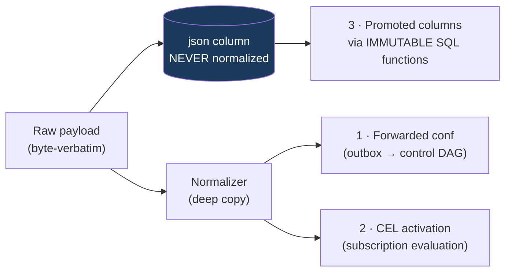

The `Normalizer` is applied to **exactly three edges**. `unwrapContextValues`, `normalizeEvent` and `normalizeContext` each **deep-copy** their input and return a new tree; the argument is never mutated.

### 9.2 Transformations

| Target | Path(s) | Function | Metric tag |
|---|---|---|---|
| Event state | `additionalData.STATE` | upper-case | `field=state` |
| Event type | `additionalData.TYPE`, else `additionalData.type` (A8 — `TYPE` wins) | upper-case | `field=type` |
| Task event type | `additionalData.taskEventType`, else top-level `taskEventType` (A7) | upper-case | `field=taskEventType` |
| Context frequency | `data.frequency` | `normFreq` | `field=frequency` |
| Context region | `data.h3Region`, else `data.regionCode` (A8) | `normRegion` | `field=region` |
| Context value unwrap | `data.{key}` objects containing a `"value"` field | replaced by that node (legacy `EventFilter.scala:91-103`) | `field=<dataKey>` |

The unwrap runs **first**, so a `{"value": …}` wrapper collapses to a scalar before `normFreq`/`normRegion` sees it.

### 9.3 Java ↔ SQL parity contract

| Value | `Normalizer.normFreq` (Java) | `ems_norm_freq` (SQL) |
|---|---|---|
| `D`, `DAILY` (any case) | `DAILY` | `DAILY` |
| `M`, `MONTHLY` | `MONTHLY` | `MONTHLY` |
| `Q`, `QUARTERLY` | `QUARTERLY` | `QUARTERLY` |
| anything else | `upper(raw)` | `upper(raw)` |
| `null` | `null` | `null` (`RETURNS NULL ON NULL INPUT`) |

| Value | `Normalizer.normRegion` | `ems_norm_region` |
|---|---|---|
| `AMERICAS` | `AMER` | `AMER` |
| anything else | `upper(raw)` | `upper(raw)` |
| `null` | `null` | `null` |

Parity is asserted exhaustively against a real PostgreSQL by `NormalizerSqlParityIT`. **The value maps themselves are provisional** — the production inventory is §24 item 8.

### 9.4 The mutation counter is a safety instrument

`ems_normalization_mutations_total{field}` counts every value the `Normalizer` actually changed. **Expected ≈ 0 on live traffic** (the MEG contract is fixed JSON). Any nonzero value must be reviewed **before cutover**, because during Phase A the forwarded conf feeds the *existing* control DAG v1, whose Python code expects today's values. Normalization exists to *guarantee* canonical form for Phase-B rules, not to change live values.

---

## 10. Canonical JSON and trigger identity

### 10.1 The contract (A6)

```
dag_run_id = orch_sha1( dag_id ‖ canonical_json(conf) )[:16]

canonical_json = RFC 8785 (JSON Canonicalization Scheme, JCS)
orch_sha1(s)   = lowercase-hex SHA-1 over the UTF-8 bytes of s
‖              = direct concatenation, NO separator
```

Concatenation without a separator is unambiguous: `canonical_json(conf)` of an object always begins with `{`, and a `dag_id` contains no brace, so no two distinct `(dag_id, conf)` pairs collide.

### 10.2 Why it is a hard cross-engine invariant

The legacy service set **no** Airflow run id — Airflow auto-generated one (`old-ems/EventSender.scala:86-103`, `old-orchestration/common/dag_utils.py:28-37`). There is therefore **no legacy byte-parity target**; A6 introduces a *new* scheme. Two independent engines must derive the same id:

| Engine | Language | Canonicalizer | Consumer |
|---|---|---|---|
| EMS | Java 17 | `io.github.erdtman:java-json-canonicalization:1.1` | `dispatch/OutboxDispatcher` |
| Control plane / framework | Python | RFC 8785 implementation on the celpy side | `gates.py` / `dag_utils.orch_sha1` |

If they disagree by a single byte, racing evaluations produce **different** run ids, they do **not** collide into one Airflow run, and the 409-dedup that makes cutover and rollback race-free (§22) silently breaks.

### 10.3 Conformance suite

[`shared/canonical-conformance/canonical_vectors.json`](../shared/canonical-conformance/canonical_vectors.json) is the **single source of truth**. Both engines load *this* file (no copies — no drift) and assert per vector that `canonical_json(conf)` equals `expected_jcs` byte-for-byte and `dag_run_id` equals `expected_dag_run_id`.

`CanonicalConformanceTest` resolves the file by walking up from the module directory (no copy — no drift). **Current result: 7/7 passing** — 4 parameterized shared vectors plus 3 property assertions (`orchSha1_isLowercaseHexOverUtf8`, `derive_isStableRegardlessOfInputKeyOrder`, `canonicalize_rejectsMalformedJson`). This is the one integration-grade guarantee actually verified on this workstation.

> ⚠️ **The Python side of the contract does not exist yet.** Only the Java engine currently loads these vectors; the mirrored celpy-side test is outstanding (§24 item 9). Until it is written and green, cross-engine parity is *specified*, not *proven*.

Example vector:

```json
{
  "name": "flat-string-keys-reordered",
  "dag_id": "amer_d_b3f_dag",
  "conf": { "reporting_date": "2026-07-17", "portfolio_id": "PF-123" },
  "expected_jcs": "{\"portfolio_id\":\"PF-123\",\"reporting_date\":\"2026-07-17\"}",
  "expected_dag_run_id": "e8a324c84502fa07"
}
```

### 10.4 The conf shape (A5)

`EnrichedEvent#toConf()` produces the **legacy merge shape**: a deep copy of the event object with a nested `"context"` field when a context was resolved, and no `context` key otherwise.

There is deliberately **no `contractVersion` key**. Adding one would change `dag_run_id = sha1(dag_id + conf)` and defeat trigger dedup between the old and new services during the cutover overlap. The v2 dispatcher introduces it at Phase B.

> **Practical caution.** JCS number serialization follows ECMAScript rules. Floating-point values in a `conf` are discouraged precisely because they stress those rules; orchestration confs use strings/integers/booleans/null/objects/arrays.

---

## 11. Transactional outbox and dispatch

### 11.1 Why an outbox

Trigger intent commits **atomically with the event persist**, so there is no acked-but-never-forwarded window. An Airflow outage produces a **drained backlog on recovery**, not lost triggers and not a stalled ingest path. This removes the legacy failure mode where an Airflow outage blocked event processing entirely.

### 11.2 Row lifecycle

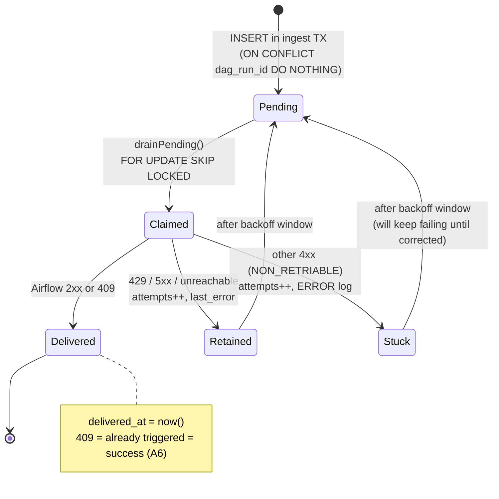

### 11.3 Dispatcher algorithm

`OutboxDispatcher#drain` — `@Scheduled(fixedDelay = ems.dispatch.poll-interval-ms, default 2000)`. `fixedDelay` (not `fixedRate`) so a slow Airflow can never overlap two drains on one pod.

```
BEGIN TRANSACTION
  rows := SELECT dag_run_id, dag_id, conf::text, attempts
          FROM dag_trigger_outbox
          WHERE delivered_at IS NULL
          ORDER BY created_at
          FOR UPDATE SKIP LOCKED
          LIMIT :batchSize            -- default 100
  FOR EACH row:
      IF now() < nextEligible[row.dag_run_id] THEN skip this tick
      outcome := POST {airflow}/dags/{dagId}/dagRuns  {dag_run_id, conf}
      CASE outcome
        DELIVERED     -> UPDATE … SET delivered_at = now(); nextEligible.remove()
        RETRIABLE     -> UPDATE … SET attempts = attempts+1, last_error = …
                         nextEligible[id] := now() + backoff(attempts)
        NON_RETRIABLE -> same as RETRIABLE + ERROR-level log
COMMIT
refresh ems_outbox_pending_age_seconds gauge
```

**Concurrency.** Every pod runs a dispatcher. `FOR UPDATE SKIP LOCKED` makes concurrent drains safe — each tick claims a **disjoint** slice for the life of its transaction. The row locks are held while delivering, which is why the claim → deliver → mark cycle must run inside one transaction.

### 11.4 Backoff

The table stores no eligibility timestamp (only `attempts`), so the dispatcher gates retries **in memory**:

```
capped = min(maxBackoffSeconds, baseBackoffSeconds × 2^(attempts-1))     -- 30s … 600s
half   = capped / 2
delay  = half + random(0 … half)                                          -- equal jitter
```

Equal jitter means concurrent dispatchers never retry in lock-step, while the delay never drops below half the computed value. The shift is clamped at 20 to guard `1L << large` overflow.

The `nextEligible` map is **process-local**: a pod restart retries immediately once, which is harmless because delivery is idempotent on the 409 rule.

### 11.5 Outcome classification (`AirflowTriggerClient`)

| Airflow response | Outcome | Dispatcher action |
|---|---|---|
| 2xx | `DELIVERED` | `delivered_at = now()` |
| **409 Conflict** | `DELIVERED` | The deterministic `dag_run_id` already exists ⇒ already triggered ⇒ **idempotent success, never an error** |
| 429, any 5xx | `RETRIABLE` | Retain + backoff |
| Connect refused / read timeout / I/O (`ResourceAccessException`) | `RETRIABLE` | Retain + backoff |
| Any other 4xx | `NON_RETRIABLE` | Retain + backoff + `ERROR` log (retrying is futile; needs correction) |
| Stored conf is unparseable JSON | `NON_RETRIABLE` | A bug, not a transient fault — surfaced rather than parking the drain |

The client is pinned to **HTTP/1.1**: the JDK client's default h2c upgrade fails a POST-with-body handshake against a cleartext server (RST_STREAM), and Airflow's REST API gains nothing from HTTP/2 for single triggers.

---

## 12. Failure taxonomy, DLQ and replay

### 12.1 The two-way classification (A1)

`EventConsumer` has **no try/catch by design**. Any exception propagates without acking, and `DefaultErrorHandler` decides its fate:

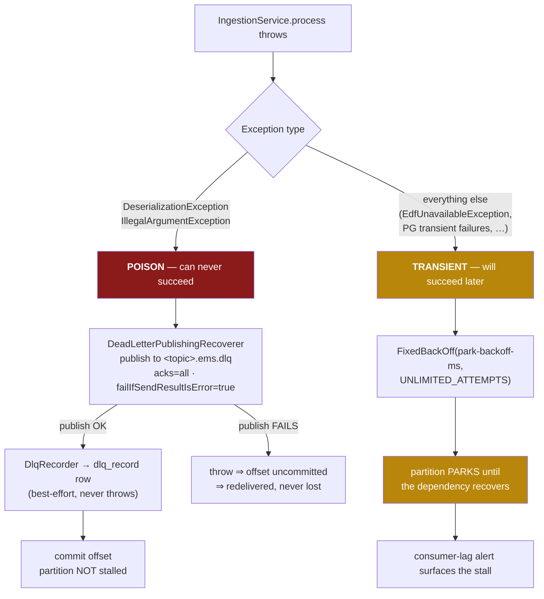

| Class | Definition | Examples | Behaviour |
|---|---|---|---|
| **Poison** | A payload that can never succeed | Deserialization failure; invalid JSON; contract violation | Verified-publish to `<topic>.ems.dlq`, write `dlq_record`, **then** ack. No retry ladder, no head-of-line blocking |
| **Transient** | A dependency is merely down | `EdfUnavailableException` (EDF 5xx/timeout); PostgreSQL unavailability | **Unbounded** backoff; the partition parks. **Nothing transient is ever dead-lettered** |
| **Airflow unavailable** | Not a pipeline failure at all | — | The transaction already committed; the outbox absorbs it |

**Why not "N retries → DLQ" for infra errors?** Dead-lettering during an outage converts recoverable backpressure into business-level loss requiring human replay. Parking self-heals on recovery. With the outbox, the most common downstream outage (Airflow) never touches ingestion at all.

**Why unbounded backoff does not cause a rebalance storm.** The park backoff interval (`ems.consumer.park-backoff-ms`, default 5000 ms) is kept well under `max.poll.interval.ms`, so an indefinitely parked partition never trips a rebalance.

**The one loss scenario no consumer config prevents:** an outage that outlasts the Kafka topic's retention. This is why lag headroom is tracked against retention and paged on early.

### 12.2 DLQ publish is the authoritative step

`DeadLetterPublishingRecoverer` is configured with `failIfSendResultIsError=true` and a DLT producer with `acks=all`. A failed DLQ publish **throws**, leaving the offset uncommitted so the record redelivers — it is never silently lost. `DlqRecorder` runs *after* the publish and is **best-effort**: it swallows its own failures so a storage hiccup cannot redeliver an already-dead-lettered record and duplicate the DLT message.

`dlq_record` correlation keys (`event_id`, `task_id`, `context_id`) are extracted **defensively** from a payload that is malformed by definition — any parse failure yields `null`s rather than throwing.

### 12.3 Replay runbook

1. DLQ-depth alert fires (`ems_dlq_depth{topic} > 0` for 5 min).
2. Triage via `dlq_record`: row **id**, original topic/partition/offset, exception chain, extracted correlation keys.
3. Fix the root cause — usually an upstream contract change.
4. `POST /admin/replay` with the selected `ids`. [`DlqReplayService`](../ems/src/main/java/com/orchestration/ems/ingestion/DlqReplayService.java) seeks each recorded `(partition, offset)` on the **source** topic, re-publishes the original bytes and key, then stamps `replayed_at` / `replayed_by` — in that order, so a failed publish can never leave a row that claims to have been replayed. Ids that could not be replayed come back with a reason (`NOT_FOUND`, `ALREADY_REPLAYED`, `PAYLOAD_UNAVAILABLE`, `PUBLISH_FAILED`) rather than a blanket error.
5. Idempotency makes replay safe even for partially processed records; a replayed gate contribution flows through outbox → dispatcher → gate recompute normally.

Two bounds worth knowing: `dlq_record` keeps triage rows for 13 months (§6) while topic retention is days, so an old row will answer `PAYLOAD_UNAVAILABLE` — the audit survives, the bytes do not. And selection is **by id only**: there is no topic- or time-range selector, because a typo in one would become a mass re-drive.

**The DLQ is a triage queue, never a graveyard**: every alerted record ends in replay or a documented discard decision.

---

## 13. Query API specification

> **Contract preservation is the point.** These endpoints keep unmigrated Airflow DAGs untouched across cutover. Response bodies are built from the raw `json` columns (parsed, then re-serialized), so the wire format is **byte-compatible** with today. Normalization never touches stored payloads.

### 13.1 `GET /event`

The enriched-event query — the sensor contract, Phase-D gate evidence, and the framework's `services.events` read path.

**Control flow** (a 1:1 port of `old-ems/EventController.scala:37-54`):

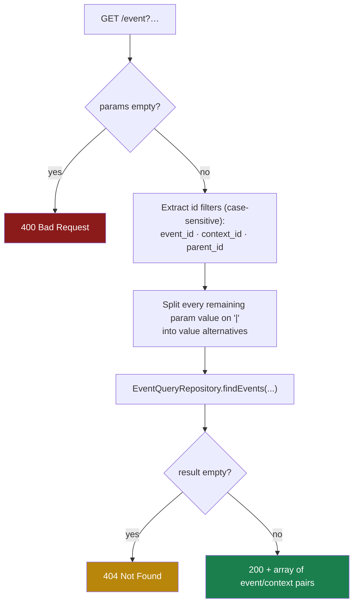

| Aspect | Specification |
|---|---|
| **Method / path** | `GET /event` |
| **No parameters** | `400` — a bare `GET /event` is a client error, not "match everything" |
| **Id filters** | `event_id`, `context_id`, `parent_id` — matched **case-sensitively by name**, ANDed |
| **All other params** | `\|`-split into alternatives, each matched by the **4-location OR** (A10), groups ANDed |
| **Repeated params** | Collapse to the first value (matches the legacy `JavaMap[String,String]` binding); multi-value alternation travels inside one value via `\|` |
| **Match found** | `200` + JSON array of `{"event": …, "context": …}` |
| **No match** | `404` (**exact** — the sensor contract depends on it) |
| **Value canonicalization** | **None** (§5.1) |

**Generated SQL:**

```sql
SELECT e.json AS event_json, c.json AS context_json
FROM context c <JOIN-TYPE> JOIN event e ON c.context_id = e.context_id
WHERE <id predicates> AND <per-param 4-location OR groups>
```

**Join-type selection** (verbatim legacy parity, `DatabaseEventRepository.scala:67-71`):

| `event_id` | `context_id` | Join |
|---|---|---|
| present | present | `INNER` |
| present | absent | `RIGHT OUTER` |
| absent | any | `LEFT OUTER` |

**Predicate templates:**

| Filter | SQL | Amendment |
|---|---|---|
| `event_id` | `e.event_id = ?` | |
| `context_id` | `c.context_id = ?` | |
| `parent_id` | `c.json->'parentIds' @> to_jsonb(?::text)` | **A9** (was `c.json->'parentIds' ?? ?`) |
| any other param `k` with values `v1..vn` | `(e.json->>? IN (…) OR e.json->'additionalData'->>? IN (…) OR c.json->>? IN (…) OR c.json->'data'->>? IN (…))` | **A10** |

Bind-parameter layout per non-id param: `[key, v1..vn]` repeated once per location (4×) — mirroring the legacy `List.fill(4)(k +: v).flatten`.

The three redesign substitutions (`A3` indexed join, `A9` containment, promoted columns) are **pure index accelerators producing identical result sets** — never a semantic change.

### 13.2 `GET /context`

| Aspect | Specification |
|---|---|
| **Path** | `GET /context?context_id=<id>` |
| **Empty id** | `400` |
| **Found** | `200` + the raw context object |
| **Not found** | `404` |
| **SQL** | `SELECT json FROM context WHERE context_id = ?` |

### 13.3 `GET /parentcontext` and `GET /childcontext`

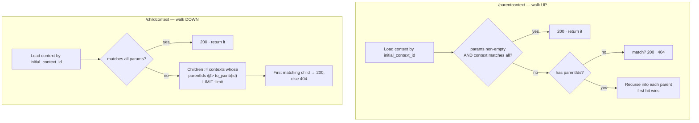

| Aspect | `/parentcontext` | `/childcontext` |
|---|---|---|
| Required param | `initial_context_id` (missing ⇒ `400`) | `initial_context_id` (missing ⇒ `400`) |
| Extra params | Match criteria | Match criteria; `limit` (default `1`) caps children scanned |
| Match rule | Every requested param equals `context.<key>` **or** `context.data.<key>`, compared as JSON strings; **empty params ⇒ trivially matches** (so the walk returns the topmost ancestor) | same |
| Traversal | Recursive up `parentIds` | Reverse containment via the A9 GIN index |

**Two deliberate deviations from legacy, flagged as assumptions:**

1. **No EDF fallback on the read path.** The legacy `fetchContext` fell back to the EDF REST API on a local miss. In the redesign, EDF fetching belongs to the *ingest* pipeline, so a context absent locally simply ends that branch of the walk (equivalent to the legacy `fetchContext → None`).
2. **Children are reverse-derived locally** via `parentIds @> to_jsonb(id)` instead of the legacy EDF child-hierarchy call — the EDF hierarchy contract is §24 item 2.

### 13.4 Legacy dev/test endpoints

`POST /token` **is** implemented, but only in `ems.auth.mode=local` — see §18. `POST /listen`, `POST /listencontext` and `GET /statuschange` are **not implemented**. The legacy service marks them dev/test; they will be added only on evidence that an Airflow caller needs them.

---

## 14. Control-plane API specification

### 14.1 `GET /run/status` — the framework F0 unblocker

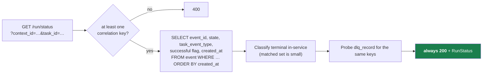

**Request:** `GET /run/status?context_id=<triggerContextId>&task_id=<taskId>` — at least one required; both are ANDed when supplied.

**Response (always `200`):**

```json
{
  "scheduled": true,
  "started": true,
  "terminal": { "present": true, "successful": true, "event_id": "evt-mer-1" },
  "dlq_hint": false,
  "last_event_at": "2026-07-17T09:31:04Z"
}
```

| Field | Derivation |
|---|---|
| `started` | At least one event matches the correlation criteria. The framework discriminates `NEVER_STARTED` from `STARTED_NO_TERMINAL` on exactly this flag |
| `scheduled` | **Collapses into `started`** — EMS has no scheduler view distinct from the event stream. Documented gap; a truer `scheduled` is a follow-up if the framework ever needs to distinguish scheduled-but-not-started |
| `terminal.present` / `.successful` / `.event_id` | See the terminal vocabulary below; the **latest** terminal event among the matched rows wins |
| `dlq_hint` | A `dlq_record` row carries the same correlation key(s) (`ix_dlq_context` / `ix_dlq_task`). A deadline-passed run with this set maps to `TERMINAL_IN_DLQ` |
| `last_event_at` | ISO-8601 instant of the newest matching event, or `null` |

**Terminal vocabulary** (the framework's two completion schemes, verbatim):

| Scheme | Terminal when | Successful when |
|---|---|---|
| `MERIVAL_CALC_EVENT` | `STATE ∈ {FINISH, FAILED}` | `STATE = FINISH` |
| `MEG_TASK_EVENT` | `taskEventType = COMPLETED` | the event's `successful` flag is true |

> **A run with no events is `200` with `started=false`, never `404`.** The framework's `SlaAwareHttpTrigger` classifies from the body, so an empty run must still return a body.

> **Assumption flagged (oracle gap).** No `taskEventType=COMPLETED` sample exists in the repo to pin where the MEG `successful` flag lives, so it is read best-effort from both `additionalData.successful` and top-level `successful`. If a real COMPLETED payload contradicts this, record it as an amendment before relying on it. The MERIVAL `STATE` path is fully grounded by sample payloads.

### 14.2 `GET /gate/groups`

The generic grouped-event query the heartbeat DAG consumes to find open gates in one round trip. **EMS stays rule-free**: every path and criterion arrives from the caller, which holds the registry gate spec.

| Parameter | Required | Meaning |
|---|---|---|
| `group_by=<json-path>` | **yes** | The value that names each group. Missing/blank ⇒ `400` |
| `lookback=<dur>` | **yes** | Window width — `<int><unit>`, unit ∈ `{s,m,h,d}` (e.g. `5d`, `6h`, `30m`). Missing/unparseable ⇒ `400`. **An unbounded scan is never implied** |
| `contributor=<json-path>` | no | Identifies a contribution within a group |
| everything else | no | Criteria — `\|`-split, matched via the same 4-location OR as `/event` (A10) |

**Two-stage implementation:**

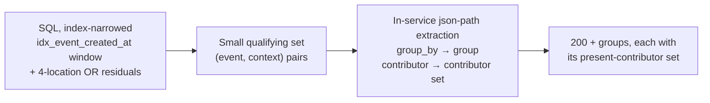

```sql
SELECT e.json AS event_json, c.json AS context_json
FROM event e LEFT OUTER JOIN context c ON e.context_id = c.context_id
WHERE e.created_at >= now() - make_interval(secs => ?)
  AND <criterion 4-location OR groups>
```

The lower bound is **SQL-clock relative**, avoiding app/DB clock skew.

**Json-path grammar** — a minimal CEL-style walker, not a general JSONPath engine. A path is an `event` or `context` root followed by dotted and/or bracketed segments; bracket segments (`["k"]`, `['k']`, `[k]`) normalize to dotted first, so hyphenated keys resolve:

```
context.data["reporting-date"]     event.additionalData.STATE     context.data.companyCode
```

An unresolved path yields `null` — the row contributes no group / no contributor, never an error.

**Response:** always `200` with a possibly empty list. Groups are ordered by `group` value; contributors within a group are distinct and sorted.

```json
{ "groups": [ { "group": "2026-07-17", "contributors": ["PF-101", "PF-102"] } ] }
```

> **Deliberately omitted, flagged.** The heartbeat scenario in the trigger plan renders a group's *age* alongside its present count, hinting at a per-group timestamp. The authoritative EMS contract lists only the present-contributor set, and neither document pins a field name/format. Rather than invent one, age is left out; a per-group `last_event_at` is trivially additive once the heartbeat contract names it.

### 14.3 `POST /decisions`

Batch ingest of the slim decision records dispatchers and heartbeat DAGs emit — the **L1/GATE half** of the audit trail whose L0 half EMS writes itself during ingest.

**Request:**

```json
{
  "decided_by": "capital_control_dag",
  "decisions": [
    {
      "event_id": "evt-mer-1",
      "tenant_id": "CAPITAL",
      "tier": "L1_OUTCOME",
      "target_dag_id": "amer_d_b3f_dag",
      "decision": "TRIGGERED",
      "detail": { "matched_rule": "b3f_daily" },
      "registry_version": "reg-2026-07-20",
      "engine_version": "celpy==0.1.2"
    }
  ]
}
```

**Response:** `200 {"received": 1, "inserted": 1}`

| Rule | Behaviour |
|---|---|
| Validation | **Rejects the whole batch** (`400`, nothing written). Required: non-blank `decided_by`, a `decisions` array, and per record an `event_id` plus a `tier`/`decision` from the closed V4 vocabularies |
| `tier` vocabulary | `L0_SUBSCRIPTION`, `L1_SUMMARY`, `L1_OUTCOME`, `GATE` |
| `decision` vocabulary | `FORWARDED`, `NOT_SUBSCRIBED`, `MATCHED`, `TRIGGERED`, `ERROR`, `GATE_OPEN`, `GATE_WAITING` |
| `detail` | JSON **object** or absent |
| Persistence | **All-or-nothing**; a DB failure surfaces as `5xx` so the caller's retry-then-alert loop engages |
| Empty batch | `200 {"received":0,"inserted":0}` — not an error |
| `inserted < received` | Normal — an `L0_SUBSCRIPTION` record duplicating an existing verdict is absorbed by `ux_rd_l0`, so a retry after an ambiguous timeout re-posts safely |

> **Why EMS answers honestly instead of always returning 200.** "Audit never blocks dispatch" is a property of the *caller* — it proceeds regardless of the answer. That is precisely why EMS must not swallow write failures behind a `200`: a silent drop is an audit record lost forever, because the caller would never retry it.

> **`decided_by` is batch-level, not per record.** It is a property of the caller, so it lives once on the envelope. Once JWT authentication lands (§18), the envelope value is replaced by the authenticated principal — at which point a per-record field would be a spoofing surface.

### 14.4 Admin control-plane endpoints

| Endpoint | Behaviour | Status |
|---|---|---|
| `POST /admin/replay` | Re-publish selected DLQ records to the source topic. `EMS_ADMIN`; each replayed record stamps `replayed_at`/`replayed_by` from the principal. Safe end-to-end because every downstream step is idempotent. Request `{"ids":[…]}` → `{"requested","replayed","skipped":[{"id","reason"}]}` | ✅ implemented |
| `PUT /admin/subscriptions` | Upsert rendered subscription rows `{tenant, stage, rule_name, control_dag_id, when, registry_version}` (+ optional `enabled`) on `ON CONFLICT (tenant_id, stage, rule_name) DO UPDATE`. **Rejects CEL that fails compilation; `PERSIST` rows additionally reject any `context.*` reference** (A4, enforced by `CelPrograms`), and a `FORWARD` row with no `control_dag_id` (V3 CHECK, caught at the edge). `EMS_ADMIN` **and** `EMS_CI`; direct SQL grants revoked | ✅ implemented |

The one deliberate narrowing: §4.5:220's parenthetical second mode ("or re-emit stored events through the pipeline") is **not** built. `dlq_record` is the poison ledger, and re-emitting healthy stored events is a different operation with a different blast radius; it will be added on evidence that an operator needs it.

---

## 15. Caching

**This is the complete list. Nothing else is cached.**

| Cache | Scope | Key | Policy | Purpose |
|---|---|---|---|---|
| Context | in-process Caffeine (`CacheConfig#contextCache`) | `context_id` | `expireAfterWrite(24h)`, `maximumSize(10 000)` | Ingestion fetch-dedup — skip the EDF call and the DB hit for events sharing a context |
| Subscriptions | in-process Caffeine (`SubscriptionService`) | single key `"enabled"` → `Ruleset{persist[], forward[]}` with compiled `Script`s | `refreshAfterWrite(60s)` | Zero hot-path DB reads, zero recompilation |
| CEL programs | `ConcurrentHashMap` (`CelPrograms`) | `(stage, when_cel)` | unbounded, process lifetime | Compile identical CEL once |

**Explicitly no enriched-event or query-result caching, and no Redis.**

- Sensors poll `/event` to detect **state change** — caching that endpoint serves stale `404`s and delays DAG completion by the TTL.
- Post-redesign reads are low-ms at ≤ 1 QPS: there is no DB load to relieve.
- A cross-pod cache adds a network hop and a failure mode for nothing. Azure Cache for Redis is available and deliberately unused.

**Context-cache validity** rests on contexts being immutable from EDF (fetch-once semantics) — §24 item 5.

---

## 16. Configuration reference

### 16.1 Spring profiles

| Profile | Purpose | `ems.dispatch.enabled` |
|---|---|---|
| `local` | Testcontainers / docker-compose Postgres+Kafka | `false` |
| `azure` | Azure PG Flexible Server, passwordless (Entra / Workload Identity) | inherits |
| `shadow` | Production shadow-consume (§22 stage 1): own consumer group, outbox accumulates, **never dispatched** | `false` |
| `live` | Post-cutover | `true` |

### 16.2 Properties

| Property | Default | Meaning |
|---|---|---|
| `ems.consumer.enabled` | `true` (base yml) | Gates `EventConsumer` **and** `KafkaConfig`. `false` ⇒ an API-only pod |
| `ems.consumer.topics` | — | Comma-separated EDF topic list |
| `ems.consumer.group-id` | `ems-ingest` | Consumer group |
| `ems.consumer.park-backoff-ms` | `5000` | Transient-failure park interval; must stay well under `max.poll.interval.ms` |
| `ems.dispatch.enabled` | `false` | **The §22 shadow→live switch.** Gates `OutboxDispatcher` |
| `ems.dispatch.poll-interval-ms` | `2000` | Drain tick (`fixedDelay`) |
| `ems.dispatch.batch-size` | `100` | Rows claimed per tick |
| `ems.dispatch.base-backoff-seconds` | `30` | Delivery backoff base |
| `ems.dispatch.max-backoff-seconds` | `600` | Delivery backoff cap |
| `ems.airflow.base-url` | `http://localhost:8082/api/v1` | Airflow REST root (**include** the API prefix) |
| `ems.airflow.trigger-path` | `/dags/{dagId}/dagRuns` | POST path template |
| `ems.airflow.auth-header` | `""` | Provisional static `Authorization` value; blank ⇒ no header |
| `ems.edf.base-url` | `http://localhost:8081` | EDF Context API root |
| `ems.edf.context-path` | `/context/{id}` | GET path template (**provisional** — §24 item 2) |
| `ems.edf.token` | `""` | Provisional bearer token (placeholder for Entra client-credentials) |
| `ems.edf.max-attempts` | `3` | Bounded in-call retry before parking |
| `ems.edf.retry-backoff` | `200ms` | Pause between EDF retries — kept short because it blocks a partition |
| `ems.auth.mode` | `local` | `local` (self-issued HS256 + `POST /token`) or `entra` (§18) |
| `ems.auth.groups-claim` | `groups` | JWT claim carrying group membership |
| `ems.auth.principal-claim` | `sub` | Claim naming the caller — audited into `decided_by`/`replayed_by`/`updated_by` |
| `ems.auth.groups.dispatcher` | `ems-dispatchers` | Group granting `EMS_DISPATCHER` (Entra group **object id** in a real tenant) |
| `ems.auth.groups.admin` | `ems-admins` | Group granting `EMS_ADMIN` |
| `ems.auth.groups.ci` | `ems-registry-ci` | Group granting `EMS_CI` |
| `ems.auth.users[]` | empty | HTTP Basic accounts (`username`, prefix-encoded `password`, `groups`) — Vault-sourced |
| `ems.auth.local.signing-key` | `""` | HS256 secret for `local` mode; blank ⇒ random per process |
| `ems.auth.local.token-ttl` | `1h` | Lifetime of a `POST /token` token |

### 16.3 Infrastructure settings

| Concern | Setting | Rationale |
|---|---|---|
| DB | Azure PG Flexible Server, zone-redundant HA, Entra ID / Workload Identity passwordless auth | Credentials disappear from config |
| Pool | HikariCP `maximum-pool-size: 10` per pod (was 40) | 10 pods × 40 = 400 potential connections was oversized vs Azure PG slots |
| Statement guardrail | `options: "-c statement_timeout=30000"` | Backstop against a 10-minute query ever returning |
| Flyway | `enabled: true`, `baseline-on-migrate: false`, `validate-on-migrate: true` | Fail fast on a missing/out-of-order migration rather than start on a bad schema |
| Kafka | `enable.auto.commit=false`, `AckMode.MANUAL_IMMEDIATE`, `isolation.level=read_committed`, `ErrorHandlingDeserializer` | Ack only after durable processing |
| Kafka offset reset | **`auto.offset.reset=earliest`** | **Deliberate correction** — the legacy seed defaults were `latest` + `enable-auto-commit=true`, i.e. today's config can silently skip events after offset loss |
| CEL | cel-java **0.4.4**, exact version pinned | Recomputability anchor recorded in `routing_decision.engine_version`; must stay lock-step with the celpy pin |

### 16.4 Secrets

Secrets are **never** in `application.yml`. In-cluster they arrive via Vault Agent injection: Airflow basic auth, Azure OAuth, JKS truststore, EDF API keys. The legacy `system_properties` table is retired; its audited contents map cleanly — secrets → Vault, Kafka consumer tuning → profile YAML, the two filter properties → the `subscription` table.

---

## 17. Observability

Micrometer → OpenTelemetry (`micrometer-registry-otlp`). Actuator exposes `health`, `info`, `prometheus`, `metrics`, with K8s liveness/readiness probe groups enabled.

| Metric | Type | Emitted by | Alert |
|---|---|---|---|
| `ems_events_consumed_total{topic,outcome}` | counter | consumer | — |
| `ems_events_dropped_total{source}` | counter | `IngestionService` (L0 zero-match) | **warn** — per-source drop-rate anomaly (the misconfigured-subscription detector) |
| `ems_subscription_verdicts_total{tenant,decision}` | counter | ⏳ planned | anomaly: tenant volume drop |
| `ems_context_fetch_total{source=cache\|db\|edf}` | counter | `ContextResolver` | — |
| `ems_normalization_mutations_total{field}` | counter | `Normalizer` | **warn** — any nonzero reviewed before cutover (§9.4) |
| `ems_outbox_pending_age_seconds` | gauge | `OutboxDispatcher` | **page** — oldest > 10 min |
| `ems_dlq_depth{topic}` | gauge | ⏳ planned (`ReconciliationSweep`) | **page** — > 0 for 5 min |
| `ems_consumer_lag{topic,partition}` (+ headroom vs retention) | gauge | ⏳ planned | **page** on sustained lag; **page early** when lag age approaches retention |
| `ems_overdue_inflight_runs` | gauge | ⏳ planned | **warn** — STARTED events with no terminal past a coarse global window |
| `ems_registry_version_info{component}` | info | ⏳ planned (Phase B+) | **warn** — divergence > 30 min |
| Per-endpoint latency histograms (`/event`, `/run/status`, `/gate/groups`) | histogram | Actuator | **warn** — p95 regression |

> Metrics marked ⏳ require `recon/ReconciliationSweep`, which is Phase-4 work and currently a documentation stub.

---

## 18. Security

Built in Phase 3 Batch G ([`SecurityConfig`](../ems/src/main/java/com/orchestration/ems/config/SecurityConfig.java)), proven by `SecurityMatrixTest` (every tier × {anonymous, wrong group, right group}).

| Surface | Required authority |
|---|---|
| `/actuator/health/**`, `/actuator/info` | none — K8s probes |
| Query endpoints (`/event`, `/context`, `/parentcontext`, `/childcontext`, `/run/status`, `/gate/groups`), `POST /token` | authenticated |
| `POST /decisions` | `EMS_DISPATCHER` — whose principal name also becomes the `decided_by` value |
| `/admin/**` | `EMS_ADMIN` (elevated group) |
| `PUT /admin/subscriptions` | `EMS_ADMIN` **and** `EMS_CI`; direct SQL grants revoked |

Anonymous → 401; authenticated but in the wrong group → 403. The chain is stateless (no session, no cookie) and CSRF is therefore disabled.

Mechanism: Spring Security OAuth2 resource server (Entra JWT + group claims) with HTTP Basic fallback, mirroring the legacy `AuthorizationManager` modes. Group identifiers map to the three authorities above through one table ([`GroupAuthorities`](../ems/src/main/java/com/orchestration/ems/config/GroupAuthorities.java)) shared by the JWT converter, the Basic accounts and token issuance, so a Basic caller and a JWT caller in the same group are equally privileged.

`ems.auth.mode` selects the issuer:

| Mode | Decoder | `POST /token` |
|---|---|---|
| `local` (default) | HS256 with `ems.auth.local.signing-key` (random per process when blank) | present — HTTP Basic in, bearer token out, asserting the caller's own groups |
| `entra` | Boot's issuer-based decoder; startup fails fast without `spring.security.oauth2.resourceserver.jwt.issuer-uri` | absent |

`local` keeps `@WebMvcTest` slices, ITs and dev boxes working without an IdP — it is not a bypass (a token and the right group are still required), but it does mean **any shared environment must set `ems.auth.mode=entra`**; startup logs a warning naming that property whenever a random key is in use.

`decided_by`, `replayed_by` and `updated_by` are taken from the authenticated principal (`ems.auth.principal-claim`, `sub` by default). A `decided_by`/`updated_by` in a request body is ignored, so the existing Python client keeps working without change.

---

## 19. Deployment topology

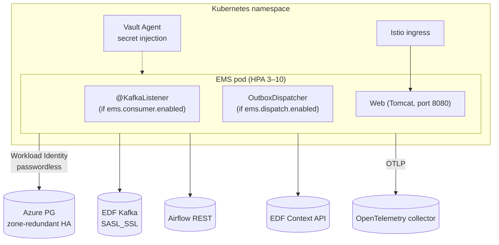

| Concern | Setting |
|---|---|
| Replicas | HPA 3–10, target 70 % CPU; `replicaCount: 3` is the initial floor |
| Rollout | `RollingUpdate`, `maxSurge: 1`, `maxUnavailable: 0` — keeps ingest capacity during rollout |
| Probes | `/actuator/health/liveness`, `/actuator/health/readiness` |
| Resources | requests 500m / 512Mi; limits 2 CPU / 1Gi |
| Service | `ClusterIP` on 8080 |
| Secrets | Vault Agent (`role: ems`, `secret/data/ems`) — never baked into image or values |
| Azure identity | Workload Identity; the JDBC URL flips auth to Entra |
| Profile | `springProfile: shadow` → `live` at cutover |

**The dispatcher runs in every pod.** `FOR UPDATE SKIP LOCKED` makes concurrent drains safe, so no leader election or singleton deployment is needed.

---

## 20. Retention and archival

> ⏳ **Not implemented** (Phase 6). The design is a monthly **Airflow maintenance DAG** — the team already operates Airflow, so this adds zero infrastructure.

1. **Archive** `event` + `context` rows older than **13 months** to compressed files in Azure Blob Storage:
   `COPY (SELECT * FROM event WHERE created_at < now() - interval '13 months') TO STDOUT` → gzip → blob.
2. **Delete events in batches** — PostgreSQL `DELETE` has no `LIMIT`, so use the ctid pattern, looping until 0 rows and sleeping between batches:

```sql
DELETE FROM event
WHERE ctid IN (
    SELECT ctid FROM event
    WHERE created_at < now() - interval '13 months'
    LIMIT 50000
);
```

3. **Delete orphaned contexts** — only past retention **and** no longer referenced:

```sql
DELETE FROM context c
WHERE c.created_at < now() - interval '13 months'
  AND NOT EXISTS (SELECT 1 FROM event e WHERE e.context_id = c.context_id);
```

4. **Purge** `dag_trigger_outbox` rows with `delivered_at` older than 30 days; purge `dlq_record` older than 13 months (replayed or discard-documented only).
5. **`routing_decision` is retained on the audit horizon, not the event horizon** — likely years for regulatory capital. Until that horizon is fixed (§24 item 10), this DAG does not touch the table; the schema is partition-ready if volume demands it.

Autovacuum absorbs the monthly ~1/13 churn at this table size; no partitioning is needed.

> **Recomputability caveat.** "NO_MATCH is recomputable" holds only while the stored event exists — re-evaluating events older than 13 months requires an archive restore. This is the accepted trade-off; `routing_decision` (which outlives the events) carries the durable verdicts.

---

## 21. Test strategy and current inventory

### 21.1 Layering rule

| Layer | Harness | Runs locally? | Suffix |
|---|---|---|---|
| Logic, controller param handling, join-type selection, status codes, response assembly, CEL semantics, normalization, backoff math | JUnit 5 / `@WebMvcTest` + mocked repository | **yes — green** | `*Test` (Surefire) |
| Real query round-trips, GIN/JSONB behaviour, generated-column population, Kafka drills | Testcontainers PostgreSQL 16 (+ Kafka, + WireMock) | **no — auto-skip** | `*IT` (Failsafe) |

**Rule:** all logic-shaped assertions live in the fast local layer so `mvn verify` stays green at every checkpoint; anything needing a real Postgres/Kafka is isolated into `*IT`, annotated `@Testcontainers(disabledWithoutDocker = true)`.

### 21.2 Test inventory

| Area | Unit tests | Integration tests |
|---|---|---|
| Canonical / A6 | `CanonicalConformanceTest` (**7/7 verified**) | — |
| Model | `EventRowTest`, `ContextRowTest`, `EnrichedEventTest` | — |
| Normalizer | `NormalizerTest` | `NormalizerSqlParityIT` (Java ↔ SQL exhaustive parity) |
| Subscriptions | `SubscriptionServiceTest`, `SubscriptionFixturesTest` | `SubscriptionRepoIT` |
| Ingestion | `IngestionServiceTest`, `EventConsumerTest`, `ContextResolverTest`, `EdfContextClientTest`, `DlqRoutingTest` | `FullPipelineIT`, `RedeliveryIdempotencyIT`, `PoisonDlqIT`, `DlqPublishFailureIT`, `TransientOutageIT`, `ContextResolverIT` |
| Store | — | `FlywayMigrationIT`, `EventContextRepositoryIT`, `EventQueryRepositoryIT`, `ContextQueryIT`, `RunStatusIT`, `GateGroupsIT` |
| Dispatch | `OutboxDispatcherTest`, `AirflowTriggerClientTest` | `OutboxRepoIT`, `KillAirflowDrainIT` |
| API | `EventControllerTest`, `ContextControllerTest`, `RunStatusControllerTest`, `GateGroupsControllerTest` | (covered by store ITs) |
| Decisions | `DecisionIngestControllerTest` | `DecisionIngestIT`, `RoutingDecisionRepoIT` |

### 21.3 The four required drills

| Drill | Test | Asserts |
|---|---|---|
| **Poison → DLQ** | `PoisonDlqIT` | DLQ within 1 min, partition not stalled, `dlq_record` correlations populated |
| **DLQ-publish failure** | `DlqPublishFailureIT` | Broker rejects DLT send ⇒ offset uncommitted ⇒ record redelivered, never lost |
| **Transient outage** | `TransientOutageIT` | DB/EDF down ⇒ partition parks, **nothing dead-lettered**, processed after recovery |
| **Kill Airflow** | `KillAirflowDrainIT` | Dispatcher accumulates; backlog fully drains on recovery; **zero lost triggers** (the Phase-A proof) |

### 21.4 The contract-oracle caveat, stated plainly

Phase 3's exit criterion is "contract suites green **vs recorded current responses**". **There are no recorded production responses** — the legacy Scala service is not running here and there is no prod/staging access. The oracle actually used is:

1. **Legacy source semantics** — `old-ems/EventController.scala` and `DatabaseEventRepository.scala` define the exact query construction, join-type selection, param handling and status rules. These are reproduced 1:1 and asserted by source-derived golden fixtures.
2. **Sample payloads** — Merival and MEG/CALC families in `src/test/resources/samples/`.

Consequently, "contract green" means green **vs source-derived golden fixtures**, not vs live production bytes. **True production byte-parity is the shadow stage (§22 stage 1)** — it is not achievable in Phase 3 and is not claimed.

### 21.5 Performance gate (⏳ pending, Phase 4)

Seed 10 M synthetic events + 1 M contexts; assert the canonical query p95 **< 50 ms**, `/run/status` p95 **< 50 ms**, and an `EXPLAIN` assertion that the plan uses `idx_event_task_id` / `idx_context_rep_freq_region` with **no sequential scans**.

---

## 22. Migration and cutover

The strategy exploits the one invariant both services share: **triggering is idempotent**. That makes running both services against the same topics harmless — duplicates collapse — so the "big bang" reduces to a route flip plus a consumer toggle, with rollback being the same flip in reverse.

```mermaid
flowchart TB
    S0["<b>Stage 0 — prerequisites</b><br/>Resolve §24 items · provision Azure PG<br/>Flyway V1–V5 everywhere · seed subscriptions (seed-0)<br/>capture BEFORE EXPLAIN evidence"]
    S1["<b>Stage 1 — shadow-consume</b> (days–weeks, zero risk)<br/>ems.dispatch.enabled=false · OWN consumer group<br/>persist events/contexts/decisions · outbox NEVER dispatched"]
    P["<b>Parity jobs</b><br/>conf byte-parity (dag_id, conf) vs Scala's actual dag runs<br/>drop parity · perf p95 · normalization mutations reviewed"]
    BF["<b>Backfill</b> 13-month window from the old DB<br/>ON CONFLICT DO NOTHING absorbs overlap · ANALYZE"]
    S2["<b>Stage 2 — flip</b> (minutes)<br/>1 repoint route to EMS · 2 scale Scala consumers to 0<br/>3 mark pending shadow outbox rows delivered<br/>4 ems.dispatch.enabled=true · 5 smoke test"]
    S3["<b>Stage 3 — observation</b> (2 weeks)<br/>old service + old DB stay deployed, scaled to 0, fully startable"]
    RB["<b>Rollback</b> (any point in stage 2–3)<br/>repoint route back · scale Scala up (previous release)<br/>ems.dispatch.enabled=false · Scala resumes from ITS frozen offsets"]

    S0 --> S1 --> P --> BF --> S2 --> S3
    S2 -. "no data surgery, ever" .-> RB
    S3 -. .-> RB

    style S2 fill:#b8860b,color:#fff
    style RB fill:#8b1a1a,color:#fff
```

### 22.1 Why the flip is race-free

Boundary events processed by **both** services derive the same `dag_run_id` from the same `(dag_id, conf)`. The second trigger collides ⇒ Airflow returns 409 ⇒ EMS records it as delivered ⇒ **no double calculator run**. The same property makes rollback safe: triggers EMS already sent during the interim dedup against the Scala service's.

### 22.2 Rollback constraints

- **No data surgery, ever.** Rollback is a route repoint + a scale-up of the previous release version + `ems.dispatch.enabled=false`.
- The Scala consumers resume from **their own frozen offsets** and reprocess the gap from Kafka; their DB backfills itself.
- Safe **as long as the gap is within Kafka topic retention** — tracked by the lag-headroom alert.
- Keep the old stack deployable for the full observation window.

### 22.3 Acceptance checklist (go-live gate)

- [ ] Before/after `EXPLAIN (ANALYZE, BUFFERS)` recorded: seq-scan + hash-join → index nested-loop; 10+ min → low ms
- [ ] Generated-column completeness: `SELECT count(*) FROM event WHERE task_id IS NULL` reconciles with rows genuinely lacking the key
- [ ] Dedup regression: re-insert an existing `event_id` → silent no-op; no duplicate trigger; no duplicate L0 rows
- [ ] Shadow parity: conf byte-parity zero-diff, drop parity explained-or-zero, normalization mutations reviewed
- [ ] Kill-Airflow drill in staging: zero lost triggers, backlog drained, pending-age alert fired
- [ ] Poison drill: DLQ < 1 min, partition not stalled, `dlq_record` correlations populated, replay heals end-to-end
- [ ] Sensor round-trip p95 < 1 s at 100 concurrent pollers; `/run/status` contract suite green (F0 unblock)
- [ ] Rollback drill in staging: route back + Scala scale-up + gap reprocess, no loss, no double runs
- [ ] Retention DAG dry-run on a staging copy

---

## 23. Traceability matrix

| Design § | Requirement | Implementation | Test |
|---|---|---|---|
| §4.1 | Component layout | `com.orchestration.ems.*` (9 packages) | — |
| §4.2.1 | Manual-ack consumer, ErrorHandlingDeserializer | `EventConsumer`, `KafkaConfig#consumerFactory` | `EventConsumerTest` |
| §4.2.2 | Byte-verbatim parse | `EventRow.of` | `EventRowTest` |
| §4.2.3 | Persist gate, zero-match drop + metric | `IngestionService#process`, `SubscriptionService#persistMatches` | `IngestionServiceTest`, `SubscriptionServiceTest` |
| §4.2.4 | Caffeine → DB → EDF resolution | `ContextResolver` | `ContextResolverTest`, `ContextResolverIT` |
| §4.2.5 | Forward eval + single TX | `IngestionService#persist` | `FullPipelineIT` |
| §4.2.7 | Outbox drain, 200/409 = delivered | `OutboxDispatcher`, `AirflowTriggerClient` | `OutboxDispatcherTest`, `KillAirflowDrainIT` |
| §4.2 failure semantics | Poison-only DLQ, transient park | `KafkaConfig#kafkaErrorHandler`, `DlqRecorder` | `PoisonDlqIT`, `TransientOutageIT`, `DlqPublishFailureIT` |
| §4.3 | `/event` byte-compatible 200/404 | `EventController`, `EventQueryRepository` | `EventControllerTest`, `EventQueryRepositoryIT` |
| §4.3 | `/context`, `/parentcontext`, `/childcontext` | `ContextController`, `ContextQueryRepository` | `ContextControllerTest`, `ContextQueryIT` |
| §4.4 | Edge-only normalization + mutation counter | `Normalizer` | `NormalizerTest`, `NormalizerSqlParityIT` |
| §4.5 | `/run/status` | `RunStatusController`, `RunStatusRepository` | `RunStatusControllerTest`, `RunStatusIT` |
| §4.5 | `/gate/groups` | `GateGroupsController`, `GateGroupsRepository` | `GateGroupsControllerTest`, `GateGroupsIT` |
| §4.5 | `POST /decisions` | `DecisionIngestController`, `RoutingDecisionRepo` | `DecisionIngestControllerTest`, `DecisionIngestIT` |
| §4.5 | `POST /admin/replay` | `AdminController`, `DlqReplayService` | `AdminControllerTest`, `DlqReplayIT` |
| §4.5 | `PUT /admin/subscriptions` | `AdminController`, `SubscriptionRepo#upsertAll` | `AdminControllerTest`, `SubscriptionUpsertIT` |
| §4.5:201 | Auth matrix, group claims, Basic fallback, `POST /token` | `SecurityConfig`, `GroupAuthorities`, `TokenController` | `SecurityMatrixTest`, `GroupAuthoritiesTest` |
| §5 | Schema + generated columns | `V1`, `V3`, `V4`, `V5` | `FlywayMigrationIT` |
| §6 | Indexes | `V2` (+ V4/V5 companions) | `FlywayMigrationIT` |
| §7 | Two-stage subscriptions, CI invariant chain | `SubscriptionService`, `CelPrograms` | `SubscriptionServiceTest`, `SubscriptionFixturesTest` |
| §8 | Cache inventory | `CacheConfig`, `SubscriptionService` | `ContextResolverTest` |
| §9 | Retention/archival | ⏳ **not built** | — |
| §10 | Config, deployment, observability | `application.yml`, `deploy/helm/ems/` | — |
| §10 | Metrics | `IngestionService`, `Normalizer`, `ContextResolver`, `OutboxDispatcher` (partial) | — |
| §11 | Shadow/live toggles | `ems.dispatch.enabled`, profiles | — |
| §12 | Performance gate | ⏳ **not built** | — |

---

## 24. Open items and known gaps

### 24.1 Design open items (from `ems-design.md §14`)

| # | Item | Status | Impacts |
|---|---|---|---|
| 1 | MEG calc-event family paths (`taskId`, `taskEventType`, `datasetId` spelling, `data.reporting-date`); whether `parentIds` is ever multi-element | **Largely answered** by sample payloads → A7–A9. Residual: confirm against production | V1 DDL, STATUS CHECK driver |
| 1a | `LBD` = compact `yyyyMMdd` logical business date; which column each family's DATASET CHECK binds | **Structure answered**; per-family binding open | §13 alias handling |
| 1b | Complete query-param alias inventory from sensor code | **Open** — gates any decision to canonicalize param values (§5.1) | Controller mapping, contract tests |
| 2 | EDF Context REST API: endpoint, auth flow, error contract, rate limits | **Open** — `EdfContextClient` + `RestClientConfig` are provisional stubs; WireMock stands in | EDF client, retry policy |
| 3 | Per-environment `subscription` seed deltas; confirm the map table (not the `filter.post` property) is what the legacy evaluated; correct sample typos | **Substantially answered**; per-env deltas open | `seed-0` migration, drop/forward parity |
| 4 | Backfill should derive from `eventTimestamp`, not load-time `created_at` | **Answered**; column promoted | Retention/backfill fidelity |
| 5 | Context immutability guarantee from EDF | **Open** | 24 h context-cache validity |
| 6 | Azure PG version (need ≥ 12 for generated columns; target 16) | **Open** | V1 DDL |
| 7 | `system_properties` → Vault/profiles/subscription mapping | **Answered** | Config migration completeness |
| 8 | Production frequency/region value inventory | **Open** — `ems_norm_freq`/`ems_norm_region` maps are provisional | §9 functions, shadow mutation review |
| 9 | cel-java ↔ celpy conformance ownership | **Partially answered** — vectors live in `shared/canonical-conformance/`; the celpy-side mirrored test is not yet written | §8 engine parity |
| 10 | `routing_decision` retention horizon; topic volumes | **Open** | §20 step 5; partitioning decision |
| 11 | Long-term owning team | **Open** | Staffing |

### 24.2 Implementation gaps

| Gap | Consequence | Owner phase |
|---|---|---|
| **`ems.auth.mode` defaults to `local`** — self-issued tokens are accepted unless the deployment sets `entra` | A shared environment left on the default trusts tokens it minted itself | Deployment config (§18); startup warns |
| **No admin-invocation audit table** | `POST /admin/replay` audits per record (`dlq_record.replayed_at/by`); an invocation that replays nothing leaves only a log line | Phase 4 (needs a V6 table) |
| **No `ReconciliationSweep`** | `ems_dlq_depth`, `ems_consumer_lag`, `ems_overdue_inflight_runs` are unpublished — three §17 alerts cannot fire | Phase 4 |
| **No `seed-0` migration** | The subscription table is empty on a fresh deploy ⇒ **every event is dropped at the persist gate** | Phase 4 |
| **No performance gate** | The < 50 ms p95 claim is unproven at scale | Phase 4 |
| **No retention DAG** | Unbounded table growth | Phase 6 |
| **No integration test has been observed green** | The pipeline's end-to-end behaviour is asserted only by construction and unit tests | CI (blocked on git init) |
| **`GET /gate/groups` has no per-group timestamp** | Callers needing group age must fall back to `GET /event` | Additive once the heartbeat contract names the field |
| **`RunStatus.scheduled` collapses into `started`** | The framework cannot distinguish scheduled-but-not-started | Follow-up if the framework needs it |
| **MEG `successful` flag location is an assumption** | `/run/status` `terminal.successful` may be wrong for MEG COMPLETED events | Needs a real COMPLETED payload |

---

*Specification derived from [`ems-design.md`](../ems-design.md) (approved design, amendments A1–A10) and the implementation in [`ems/`](../ems/) as of 2026-07-27. Statements about behaviour reflect the code as read; statements about verification reflect what has actually been executed — the local build runs unit tests only, and the integration suite awaits CI.*
