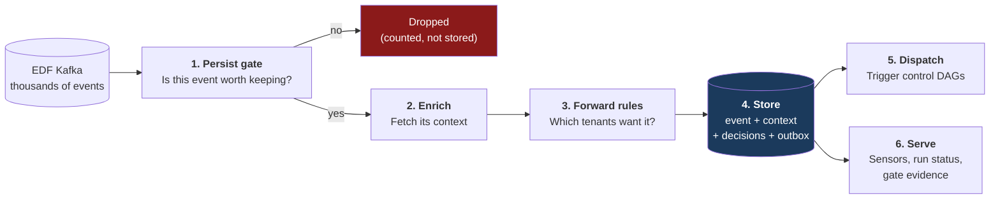
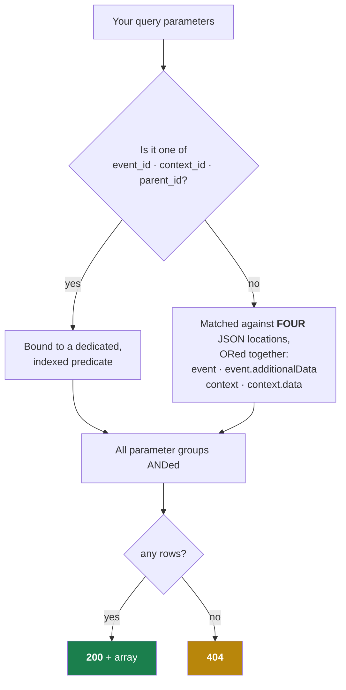
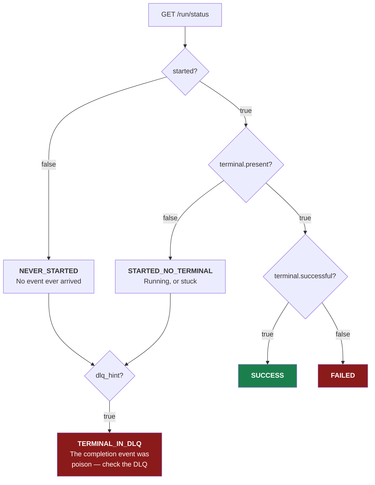
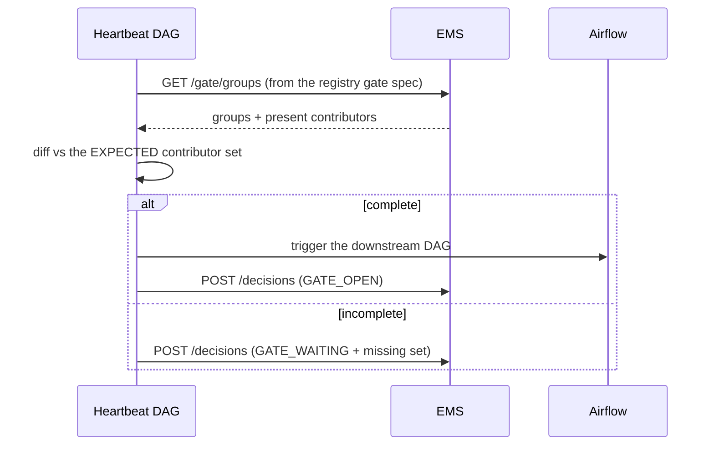
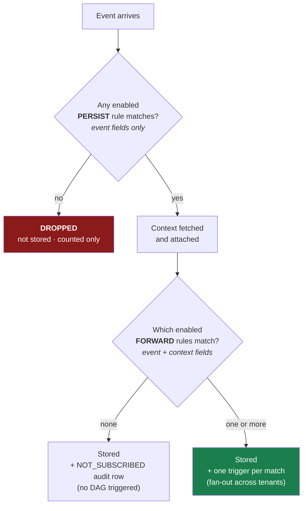
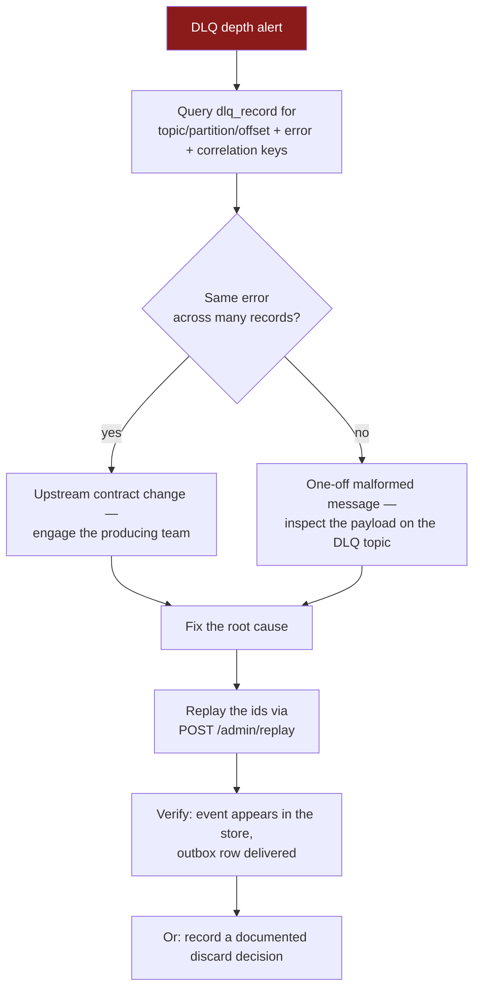
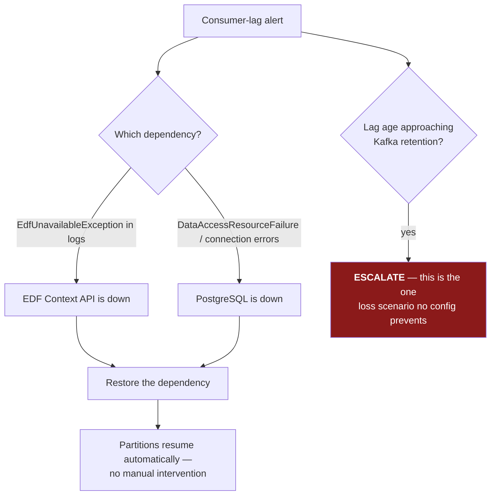

# Event Management Service (EMS) — User Guide

**Version:** 1.0 · **Date:** 2026-07-27
**Companion document:** [`ems-technical-specification.md`](ems-technical-specification.md) — the full technical specification (schema, algorithms, invariants).
**Design source of truth:** [`ems-design.md`](../ems-design.md).

> ⚠️ **Pre-production build.** EMS is at implementation phase 4 of 6. Authentication, the admin endpoints and the `seed-0` subscription rows all exist now. What does **not** exist: any observed-green integration run, any executed performance measurement, and the shadow/cutover stages. The `seed-0` rules are also loaded but not yet signed off. See [§10 Current limitations](#10-current-limitations) before relying on anything here in production.

---

## Who this guide is for

| You are… | Start at |
|---|---|
| An **Airflow DAG author** polling for events or run status | [§3 Query API](#3-querying-events-and-contexts), [§4 Run status](#4-checking-run-status-from-a-dag) |
| Building a **gate / heartbeat DAG** | [§5 Gate groups](#5-finding-open-gates), [§6 Posting decisions](#6-posting-decision-records) |
| **Onboarding a tenant** or changing routing | [§7 Subscriptions](#7-onboarding-a-tenant-subscriptions) |
| **Operating** EMS (on call) | [§8 Operations runbooks](#8-operations-runbooks), [§9 Monitoring](#9-monitoring-and-alerts) |
| **Developing** EMS | [§11 Developer quick start](#11-developer-quick-start) |

---

## Table of contents

1. [What EMS does](#1-what-ems-does)
2. [Concepts and vocabulary](#2-concepts-and-vocabulary)
3. [Querying events and contexts](#3-querying-events-and-contexts)
4. [Checking run status from a DAG](#4-checking-run-status-from-a-dag)
5. [Finding open gates](#5-finding-open-gates)
6. [Posting decision records](#6-posting-decision-records)
7. [Onboarding a tenant (subscriptions)](#7-onboarding-a-tenant-subscriptions)
8. [Operations runbooks](#8-operations-runbooks)
9. [Monitoring and alerts](#9-monitoring-and-alerts)
10. [Current limitations](#10-current-limitations)
11. [Developer quick start](#11-developer-quick-start)
12. [Reference tables](#12-reference-tables)

---

## 1. What EMS does

EMS sits between the **EDF event firehose** and the **Airflow orchestration platform**. In one sentence: *it decides which events matter, remembers them, and tells Airflow to run something.*



### Three promises EMS makes

1. **Nothing forwardable is lost.** Every write is idempotent and the Airflow trigger is buffered in a transactional outbox. An Airflow outage produces a backlog that drains on recovery — never lost triggers, and never a stalled ingest path.
2. **Nothing runs twice.** Trigger identity is a deterministic hash of `(dag_id, conf)`. A duplicate trigger collides on that id and Airflow returns `409`, which EMS treats as success.
3. **Queries are fast.** Hot filter attributes are promoted to typed, indexed columns. Sensor queries that took 10+ minutes target low single-digit milliseconds.

### One promise EMS deliberately does **not** make

**EMS does not keep every event.** Events that match no `PERSIST` rule are dropped without being stored. This is intended — EDF is a firehose and only a small fraction is relevant. If you need an event kept, a `PERSIST` rule must cover it. See [§7](#7-onboarding-a-tenant-subscriptions).

---

## 2. Concepts and vocabulary

| Term | Meaning |
|---|---|
| **Event** | One upstream message from EDF. Stored byte-verbatim; its `id` is the primary key |
| **Context** | The enrichment record an event points at via `contextId`. Immutable; carries `data.*` fields like `reporting-date`, `frequency`, `h3Region`, and a `parentIds` array |
| **Enriched event** | An `(event, context)` pair — what `GET /event` returns and what a control DAG receives as its `conf` |
| **Persist gate (L0 stage 1)** | The drop filter. Event fields **only**, evaluated *before* enrichment. Zero match ⇒ event discarded |
| **Forward rule (L0 stage 2)** | The routing filter. Event **and** context fields, evaluated *after* enrichment. Each match sends the event to one tenant's control DAG |
| **Tenant** | An **orchestration team** that owns rules — `CAPITAL`, `NSFR`, `PLATFORM`. ⚠️ Not the same as the `additionalData.tenant` field in payloads, which is an upstream *source-system* label (`FRCA`, `MR`, `ACTL`) |
| **Control DAG** | The Airflow DAG a forward rule targets, e.g. `orchestration_control_dag_capital` |
| **`dag_run_id`** | The deterministic Airflow run id: `sha1(dag_id + canonical_json(conf))[:16]`. Makes triggering idempotent |
| **Outbox** | The `dag_trigger_outbox` table. Trigger intent is committed with the event, then delivered asynchronously |
| **Routing decision** | An audit row in `routing_decision` recording *why* an event was (or was not) forwarded |
| **DLQ** | `<topic>.ems.dlq` — the dead-letter topic. **Poison payloads only**; infrastructure outages never dead-letter |
| **Poison** | A payload that can never succeed (malformed JSON, contract violation) |
| **Parked partition** | A Kafka partition paused with unbounded backoff while a dependency is down. It resumes automatically |
| **CEL** | Common Expression Language — the syntax subscription rules are written in |

### 2.1 Authenticating

**Every endpoint needs a credential** (except the `/actuator/health` and `/actuator/info` probes). Present either an `Authorization: Bearer <jwt>` token or HTTP Basic credentials — both resolve to the same permissions, because both map your **groups** onto the same three authorities.

| You are | You need | To call |
|---|---|---|
| An Airflow sensor / any reader | any valid credential | `/event`, `/context`, `/parentcontext`, `/childcontext`, `/run/status`, `/gate/groups` |
| A control DAG or heartbeat | the **dispatcher** group | `POST /decisions` |
| An operator | the **elevated** group | `POST /admin/replay` |
| The registry CI | the **elevated and CI** groups | `PUT /admin/subscriptions` |

`401` means no (or an invalid/expired) credential; `403` means you authenticated but your groups do not carry that authority.

In an Entra environment your platform issues the token. In a **local or non-Entra** environment (`ems.auth.mode=local`), exchange your Basic credentials for one:

```bash
export EMS_TOKEN=$(curl -s -X POST http://ems/token -u "$EMS_USER:$EMS_PASSWORD" \
  | python -c 'import json,sys; print(json.load(sys.stdin)["access_token"])')
```

The token asserts exactly the groups your account already has — it is a convenience, never an escalation. It expires after `ems.auth.local.token-ttl` (1 hour by default); a `401` mid-run means fetch another.

> The examples in this guide show `-H "Authorization: Bearer $EMS_TOKEN"` on write endpoints and omit it on reads for brevity. **Reads need it too.**

---

## 3. Querying events and contexts

### 3.1 `GET /event` — the sensor contract

The workhorse. Returns matching enriched events, or **404 when nothing matches** — the 404 is the signal deferrable sensors wait on, so it is a contract, not an error.

```bash
curl -s "http://ems/event?context_id=ctx-300&TYPE=INGESTION&STATE=FINISH"
```

```json
[
  {
    "event": {
      "id": "evt-mer-1",
      "contextId": "ctx-300",
      "source": "merival",
      "additionalData": { "DATASET_UUID": "ds-uuid-777", "TYPE": "INGESTION", "STATE": "FINISH" },
      "logicalBusinessDate": "2026-07-17"
    },
    "context": {
      "id": "ctx-300",
      "data": { "reporting-date": "2026-07-17", "run-category": "TOPSIDE", "h3Region": "emea", "frequency": "DAILY" },
      "parentIds": ["ctx-200"]
    }
  }
]
```

#### How parameters are matched — read this before writing a query



| Rule | Detail |
|---|---|
| **Three special parameters** | `event_id`, `context_id`, `parent_id` — matched case-sensitively by name. `parent_id` searches the context's `parentIds` **array** (multi-parent safe) |
| **Everything else** | Matched across four JSON locations at once. You do **not** need to know whether a field lives on the event or the context |
| **Values are case-sensitive** | `TYPE=INGESTION` matches; `TYPE=ingestion` does not. EMS does **not** canonicalize your query values |
| **Multiple values** | Use `\|` inside one parameter: `STATE=FINISH\|FAILED` |
| **No parameters at all** | `400` — a bare `GET /event` is a client error, not "match everything" |
| **Repeated parameters** | Only the first is used. Use the `\|` form instead |

#### Common queries

```bash
# Dataset check
curl "http://ems/event?context_id=ctx-300&DATASET_UUID=ds-uuid-777&FREQUENCY=DAILY&TYPE=INGESTION"

# Terminal state, either outcome
curl "http://ems/event?context_id=ctx-300&STATE=FINISH|FAILED"

# Status check driven by parent context
curl "http://ems/event?parent_id=ctx-200&TYPE=CALC_EVENT&STATE=FINISH|FAILED"

# Single event by id
curl "http://ems/event?event_id=evt-mer-1"
```

> **Troubleshooting a stubborn 404.** In order: (1) check the **case** of your value; (2) check the event was actually persisted — if no `PERSIST` rule covers it, it was dropped at the gate and does not exist; (3) check the field name matches the payload spelling exactly (`TYPE` vs `type`, `reporting-date` vs `reportingDate` — both spellings exist in production and the 4-location OR matches the **raw** payload text).

### 3.2 `GET /context` — look up one context

```bash
curl -s "http://ems/context?context_id=ctx-300"
```

`200` with the context object, or `404`. An empty `context_id` is `400`.

### 3.3 `GET /parentcontext` — walk up the chain

Finds the nearest ancestor matching your criteria.

```bash
curl -s "http://ems/parentcontext?initial_context_id=ctx-300&frequency=DAILY"
```

- `initial_context_id` is required (`400` otherwise).
- Every other parameter must match either `context.<key>` or `context.data.<key>`.
- **With no criteria, you get the topmost ancestor** (an empty criteria set matches everything).

### 3.4 `GET /childcontext` — walk down the chain

```bash
curl -s "http://ems/childcontext?initial_context_id=ctx-200&limit=10&frequency=DAILY"
```

Returns the starting context itself if it matches, otherwise the first matching child. `limit` (default `1`) caps how many children are scanned.

> **Note:** both chain endpoints search the **local store only**. Contexts are loaded into EMS during ingestion, not fetched on the read path.

---

## 4. Checking run status from a DAG

`GET /run/status` answers "where is this run?" in one indexed query. It is what the calculator framework's `SlaAwareHttpTrigger` polls on each wake-up.

```bash
curl -s "http://ems/run/status?context_id=ctx-300"
```

```json
{
  "scheduled": true,
  "started": true,
  "terminal": { "present": true, "successful": true, "event_id": "evt-mer-1" },
  "dlq_hint": false,
  "last_event_at": "2026-07-17T09:31:04Z"
}
```

| Parameter | Notes |
|---|---|
| `context_id` | The framework's `triggerContextId` |
| `task_id` | The MEG task id |

At least one is required (`400` otherwise); supplying both ANDs them.

### Interpreting the answer



> **It always returns 200**, never 404 — a run with no events yet is a legitimate `started: false` answer, and the framework needs a body to classify it.

> **`dlq_hint: true` is the "why is this hung?" answer.** It means a message carrying this correlation key was dead-lettered as poison. The completion event may exist upstream but never reached the store. Go to [§8.1 DLQ triage](#81-dlq-alert--triage-and-replay).

> **`scheduled` currently mirrors `started`** — EMS has no scheduler view separate from the event stream. Do not build logic on `scheduled` alone.

### Calling it from Airflow

```python
import requests

def run_finished(context_id: str) -> bool:
    r = requests.get(f"{EMS_URL}/run/status", params={"context_id": context_id}, timeout=10)
    r.raise_for_status()
    s = r.json()
    return s["terminal"]["present"]

def diagnose(context_id: str) -> str:
    s = requests.get(f"{EMS_URL}/run/status", params={"context_id": context_id}, timeout=10).json()
    if s["dlq_hint"] and not s["terminal"]["present"]:
        return "TERMINAL_IN_DLQ"
    if not s["started"]:
        return "NEVER_STARTED"
    if not s["terminal"]["present"]:
        return "STARTED_NO_TERMINAL"
    return "SUCCESS" if s["terminal"]["successful"] else "FAILED"
```

---

## 5. Finding open gates

`GET /gate/groups` answers "which groups have contributions, and which contributors are present?" in one round trip — the query a heartbeat DAG uses to find gates that are still waiting.

**EMS is rule-free here.** It does not know your gate's expected contributor set or its staleness policy. You supply the paths and criteria; you diff the result against your expectations.

```bash
curl -s "http://ems/gate/groups?\
group_by=context.data%5B%22reporting-date%22%5D&\
contributor=context.data.companyCode&\
lookback=5d&\
TYPE=CALC_EVENT&STATE=FINISH"
```

```json
{
  "groups": [
    { "group": "2026-07-16", "contributors": ["CO-11", "CO-12"] },
    { "group": "2026-07-17", "contributors": ["CO-11"] }
  ]
}
```

| Parameter | Required | Meaning |
|---|---|---|
| `group_by` | **yes** | Json-path whose value names each group |
| `lookback` | **yes** | Window width: `<int><unit>`, unit ∈ `s`/`m`/`h`/`d` — e.g. `5d`, `6h`, `30m` |
| `contributor` | no | Json-path identifying a contribution within a group |
| anything else | no | Criteria — same 4-location matching and `\|` alternation as `GET /event` |

**Path syntax:** an `event` or `context` root followed by dotted or bracketed segments. Use brackets for hyphenated keys.

```
context.data["reporting-date"]      event.additionalData.STATE      context.data.companyCode
```

An unresolvable path yields nothing for that row — no error. Groups are sorted by value; contributors are distinct and sorted.

> **Both `group_by` and `lookback` are mandatory** — a missing `lookback` returns `400` rather than silently scanning the entire table.

> **No group timestamp yet.** If you need each group's age for a staleness policy, fetch it with `GET /event` for now.

### Typical heartbeat use



---

## 6. Posting decision records

`POST /decisions` writes the audit trail for decisions **your** dispatcher or heartbeat made. EMS writes the L0 (subscription) half itself; this endpoint records the L1 and gate halves.

```bash
curl -s -X POST http://ems/decisions \
  -H "Authorization: Bearer $EMS_TOKEN" \
  -H 'Content-Type: application/json' \
  -d '{
    "decisions": [
      {
        "event_id": "evt-mer-1",
        "tenant_id": "CAPITAL",
        "tier": "L1_OUTCOME",
        "target_dag_id": "amer_d_b3f_dag",
        "decision": "TRIGGERED",
        "detail": { "matched_rule": "b3f_daily" },
        "registry_version": "reg-2026-07-20",
        "engine_version": "celpy==0.1.2"
      }
    ]
  }'
```

```json
{ "received": 1, "inserted": 1 }
```

| Field | Allowed values |
|---|---|
| `tier` | `L0_SUBSCRIPTION`, `L1_SUMMARY`, `L1_OUTCOME`, `GATE` |
| `decision` | `FORWARDED`, `NOT_SUBSCRIBED`, `MATCHED`, `TRIGGERED`, `ERROR`, `GATE_OPEN`, `GATE_WAITING` |
| `detail` | A JSON **object** (or omitted) |
| `event_id` | Required, non-blank |

### Behaviour you should code against

| Situation | Response | What to do |
|---|---|---|
| All records valid | `200 {"received": n, "inserted": m}` | Done |
| **Any** record invalid | `400`, **nothing written** | Fix your payload — this is a caller bug, and a half-applied audit batch would be worse |
| Empty `decisions` array | `200 {"received":0,"inserted":0}` | Normal — not an error |
| `inserted < received` | `200` | Normal — a duplicate `L0_SUBSCRIPTION` record was absorbed by the idempotency index. Safe after a retry |
| Database failure | `5xx` | **Retry, then alert.** EMS returns an honest error rather than silently dropping an audit record |
| Missing/expired token | `401` | Fetch a new token (§2.1) |
| Token without the dispatcher group | `403` | Your identity is not in `ems.auth.groups.dispatcher` — ask an operator |

> **Audit never blocks dispatch — but that is *your* responsibility.** Your DAG should proceed regardless of what this endpoint answers. EMS answers honestly precisely so your retry loop can engage; a silent `200` on a failed write would lose the record forever.

> **`decided_by` is not yours to set.** It is the identity on your token, recorded once for the whole batch. A `decided_by` in the body is ignored (so the existing Python client works unchanged) — what lands in the audit column is what you authenticated as.

---

## 7. Onboarding a tenant (subscriptions)

### 7.1 The two-stage model



| Stage | Purpose | Can reference | Typical breadth |
|---|---|---|---|
| `PERSIST` | Should we keep this event at all? | `event.*` **only** | **Broad** — lifecycle-wide, so sensors and gates keep non-terminal evidence |
| `FORWARD` | Which tenant's control DAG gets it? | `event.*` **and** `context.*` | **Narrow** — usually terminal states only |

### 7.2 The golden rule

> **`PERSIST` must be a superset of `FORWARD`.**
> If a `FORWARD` rule can match an event that no `PERSIST` rule admits, that event is dropped before the forward stage ever runs — the trigger silently never happens. CI enforces `PERSIST ⊇ FORWARD ⊇ your Level-1 registry rules`; a violation fails the build.

### 7.3 Writing rules in CEL

Rules are CEL boolean expressions. **There is exactly one spelling for everything: lowercase.**

```javascript
// PERSIST — event fields only
event.source == "merival" && event.additionaldata.type == "ingestion"
    && event.additionaldata.run_type == "batch"

// FORWARD — may also reference context
event.additionaldata.tenant == "frca"
    && event.additionaldata.updatetype == "curation"
    && context.data.runcategory.startsWith("topside")
```

**Why everything is lowercase.** Before your rule runs, EMS builds a *matching view* of the event and context: every key and every string value is lower-cased, and every hyphenated key also gets a hyphen-free name. So `additionalData`, `AdditionalData` and `ADDITIONALDATA` are one key; `FINISH`, `Finish` and `finish` are one value; `run-category` and `runCategory` are one name, `runcategory`. You write the lowercase form and it matches regardless of how the producer spelled it.

This exists so that you never have to write `.lowerAscii()`, never have to guard with `has()`, and never have to write the same condition twice for two spellings. If a rule needs any of those, something is wrong — ask rather than working around it.

| Do | Don't |
|---|---|
| Write **all keys and all string literals in lowercase** | ❌ `event.additionalData.TYPE == "INGESTION"` — the view has no upper-case keys or values, so this silently never matches |
| Write `context.data.runcategory` — hyphens are removed for you | ❌ `context.data["run-category"]` — it still works, but it is the old dialect and reads as if the two spellings differ |
| Use `context.*` in `FORWARD` rules | ❌ Use `context.*` in a `PERSIST` rule — **it will not compile** (the variable is not in scope) |
| Use `startsWith("prefix")` for what was a trailing `.*` | ❌ Expect regex — it was never regex, only a literal prefix |
| Keep rules **coarse** | ❌ Encode calculator logic here — that belongs in the Airflow registry |

A missing field makes the rule a **non-match**, not an error. That is deliberate, and it is also the most common reason a new rule appears to do nothing — see §7.5.

> **The fold applies to matching only.** What gets stored, what `/run/status` and `/gate/groups` return, and what EMS sends to Airflow in the `conf` are all untouched — those still carry the payload's original casing. So a rule compares `== "finish"` while the same field reads `FINISH` everywhere else. One vocabulary per surface: lowercase in rules, as-published everywhere else.

Translating a legacy filter: an array of objects is an **OR**; keys within one object are an **AND**; the legacy value literals transfer **verbatim**, because they were already lowercase.

### 7.4 Adding a subscription

`PUT /admin/subscriptions` upserts a rendered slice. It needs a token in **both** the elevated and the registry-CI group; direct SQL is break-glass only.

```bash
curl -s -X PUT http://ems/admin/subscriptions \
  -H "Authorization: Bearer $EMS_TOKEN" \
  -H 'Content-Type: application/json' \
  -d '{
    "subscriptions": [
      {
        "tenant": "CAPITAL",
        "stage": "FORWARD",
        "rule_name": "cap_data_update.MER_batch",
        "control_dag_id": "orchestration_control_dag_capital",
        "when": "event.source == \"merival\" && event.additionaldata.type == \"ingestion\"",
        "registry_version": "reg-2026-07-20"
      }
    ]
  }'
```

```json
{ "received": 1, "upserted": 1 }
```

Note the two wire names that differ from the columns: **`tenant`** → `tenant_id` and **`when`** → `when_cel`. `enabled` is optional and defaults to `true`.

The rule's identity is `(tenant, stage, rule_name)` — re-PUTting the same triple **replaces** that rule in place and keeps its id; it never creates a second row. `updated_by` is stamped from your token, not from the body.

**What gets rejected (400, whole slice, nothing written):**

- [ ] CEL that does not compile
- [ ] A `PERSIST` rule referencing `context.*` — it runs pre-enrichment, so there is no context yet (Amendment A4)
- [ ] A `FORWARD` rule with no `control_dag_id`
- [ ] An unknown `stage`, or a missing `tenant`/`rule_name`/`when`/`registry_version`

The rejection reason is logged by EMS, not returned — check the service log if a push fails.

**Still your responsibility (EMS does not check it):**

- [ ] A `PERSIST` rule already admits every event this `FORWARD` rule can match
- [ ] `tenant` is the **orchestration team** (`CAPITAL`), not the payload's `additionalData.tenant` (`FRCA`)

**Changes take effect within ~60 seconds** — the rule cache refreshes on that cadence. No redeploy, no restart.

### 7.5 Verifying a new rule works

1. Wait ~60 s for the cache refresh.
2. Watch `ems_events_dropped_total{source}` — a broadened `PERSIST` rule should reduce it.
3. **If nothing matches, check case first.** A rule that compiles but never fires is almost always an upper-case key or literal left over from the old dialect (`event.additionalData.TYPE == "INGESTION"` instead of `event.additionaldata.type == "ingestion"`). It is not an error and it produces no log line — it just never matches. See §7.3.
4. Query the audit trail:

```sql
SELECT decision, tenant_id, target_dag_id, registry_version, decided_at
FROM routing_decision
WHERE event_id = '<an event you expect to match>' AND tier = 'L0_SUBSCRIPTION';
```

`FORWARDED` with your tenant means the rule fired. `NOT_SUBSCRIBED` means the event was stored but matched no forward rule. **No rows at all** means the event never passed the persist gate.

5. Confirm delivery:

```sql
SELECT dag_id, delivered_at, attempts, last_error
FROM dag_trigger_outbox ORDER BY created_at DESC LIMIT 10;
```

### 7.6 Disabling a rule

Re-PUT the rule with `"enabled": false` — do not delete. Deletion loses the audit trail; the `NSFR` seed row ships disabled for exactly this reason. The rule stops being evaluated within one cache refresh (~60 s).

---

## 8. Operations runbooks

### 8.1 DLQ alert — triage and replay

**Alert:** `ems_dlq_depth{topic} > 0` for 5 minutes.

**What it means:** a payload that can **never** succeed was dead-lettered — malformed JSON or a contract violation. Almost always an upstream contract change. **Infrastructure outages never appear here.**



```sql
-- Triage — note the ids, they are what you replay
SELECT id, topic, kafka_partition, kafka_offset, event_id, task_id, context_id, error, recorded_at
FROM dlq_record
WHERE replayed_at IS NULL
ORDER BY recorded_at DESC;

-- Group by failure signature
SELECT left(error, 120) AS signature, count(*), min(recorded_at), max(recorded_at)
FROM dlq_record WHERE replayed_at IS NULL GROUP BY 1 ORDER BY 2 DESC;
```

Once the root cause is fixed, replay the selected ids (elevated group required):

```bash
curl -s -X POST http://ems/admin/replay \
  -H "Authorization: Bearer $EMS_TOKEN" \
  -H 'Content-Type: application/json' \
  -d '{"ids": [412, 413]}'
```

```json
{ "requested": 2, "replayed": 1,
  "skipped": [ { "id": 413, "reason": "PAYLOAD_UNAVAILABLE" } ] }
```

EMS re-reads each message at its recorded offset on the **source** topic, re-publishes it verbatim, and stamps `replayed_at`/`replayed_by` with your identity. A skipped id tells you why:

| Reason | Meaning |
|---|---|
| `NOT_FOUND` | No such `dlq_record` row |
| `ALREADY_REPLAYED` | It carries a stamp already. A message that poisons again produces a **new** row — replay that id instead |
| `PAYLOAD_UNAVAILABLE` | The offset is outside the topic's retention window. The bytes are gone; the row stays for the record |
| `PUBLISH_FAILED` | The broker did not acknowledge. The row is left unstamped, so you can simply retry |

Replay is safe: every downstream step is idempotent, so a partially processed record replays without duplicating anything. Selection is by id only — there is deliberately no "replay everything" switch.

> **The DLQ is a triage queue, never a graveyard.** Every alerted record ends in a replay or a documented discard decision.

> **A poison message does not stall its partition.** It is dead-lettered and the offset commits, so processing continues.

**Clearing the alert.** `ems_dlq_depth` counts rows with `replayed_at IS NULL`, per topic, refreshed every `ems.recon.interval-ms` (60 s). Stamping the last row of a topic makes that topic's series **disappear** rather than sit at zero — so within about a minute of finishing a replay the alert resolves on its own. Nothing to acknowledge, nothing to silence.

Two things follow from that, and both matter:

- **Never delete `dlq_record` rows to clear the alert.** It works, and it destroys the only record that a poison event ever happened. `PAYLOAD_UNAVAILABLE` rows in particular are kept deliberately — the bytes are gone but the fact is not.
- **A discard is a stamp, not a delete — and there is no endpoint for it.** `POST /admin/replay` is the only thing that sets `replayed_at`. If the decision is "we are not replaying this", the row must be stamped by hand, and the reason recorded outside the table:

  ```sql
  UPDATE dlq_record SET replayed_at = now(), replayed_by = 'discard: <your id>, <ticket>'
  WHERE id = 413 AND replayed_at IS NULL;
  ```

  Reusing `replayed_by` to carry a discard note is a workaround, not a design — the table has no discard column and no reason column. Until it does, the alert cannot distinguish "replayed" from "written off", so the ticket reference in that string is the only thing that will tell you later.

### 8.2 Outbox backlog — Airflow is down

**Alert:** `ems_outbox_pending_age_seconds > 600` (oldest undelivered row older than 10 minutes).

**What it means:** triggers are accumulating because Airflow is unreachable or rejecting. **Ingestion is unaffected** — this is exactly what the outbox is for.

```sql
-- How big and how old?
SELECT count(*) AS pending, min(created_at) AS oldest
FROM dag_trigger_outbox WHERE delivered_at IS NULL;

-- What is Airflow saying?
SELECT dag_id, attempts, last_error, count(*)
FROM dag_trigger_outbox
WHERE delivered_at IS NULL AND last_error IS NOT NULL
GROUP BY 1,2,3 ORDER BY 4 DESC;
```

| `last_error` says | Meaning | Action |
|---|---|---|
| `retriable: Airflow unavailable` | 429/5xx or unreachable | Restore Airflow. The backlog drains automatically with 30 s–600 s jittered backoff |
| `non-retriable: Airflow rejected the trigger` | A 4xx that will never succeed — usually a wrong `dag_id` or a malformed conf | **Needs correction.** These rows will never deliver on their own |

**Do not delete outbox rows to clear the alert.** Delivery is idempotent — letting them drain is always safe.

### 8.3 Consumer lag — a partition is parked

**Alerts:** `EmsConsumerLagSustained` (`ems_consumer_lag` > 100 000 for 15 m), `EmsRetentionHeadroomLow` (`ems_consumer_retention_headroom_records` < 500 000 for 5 m), `EmsLagProbeSilent` (the probe went quiet for 15 m).

**What it means:** a dependency (PostgreSQL or the EDF Context API) is down, so partitions have parked with unbounded backoff. **Nothing is lost and nothing is dead-lettered** — but the clock is running.

**Read the two gauges as a pair.** Both come from one `AdminClient` poll of the ingest group's **committed** offsets, so they are broker-side facts — published even by a pod that consumes nothing, and even while a partition is parked.

| Gauge | Measures | What it tells you |
|---|---|---|
| `ems_consumer_lag` | log end − committed offset | **How far behind you are.** Rises during any outage |
| `ems_consumer_retention_headroom_records` | committed offset − log start | **How much room is left before Kafka deletes unread data.** Falls toward zero as retention catches up with you |

Lag rising is recoverable. **Headroom falling is not** — once records age out of the topic they are gone, and no consumer configuration prevents it. That is why headroom pages at 5 minutes while lag waits 15.

> Headroom is a *proxy* for "lag age approaching retention": the broker exposes no cheap per-partition age, but headroom collapses toward zero for the same reason age approaches retention. It is measured in **records**, so a topic whose write rate changes sharply will need `alerts.headroomRecords` retuned.

**If `EmsLagProbeSilent` fires, treat it as seriously as lag itself.** The probe clears its series on failure rather than freezing them — a lag number stuck at its last value would look healthy precisely when it stopped being true. Silence means you are flying blind on the two gauges above, not that lag is zero. Check broker reachability and `ems.recon.kafka.timeout-ms`.



**The critical judgement call:** if the outage may outlast the topic's retention window, escalate immediately. Once records age out of Kafka they are gone — no consumer configuration prevents this.

### 8.4 Drop-rate anomaly — a misconfigured subscription

**Alert (warn):** `ems_events_dropped_total{source}` deviates from its baseline.

| Direction | Likely cause | Action |
|---|---|---|
| **Spike** | A `PERSIST` rule was narrowed or disabled, or an upstream payload changed shape so rules no longer match | Check recent `subscription` changes (`updated_at`, `updated_by`). Compare a sample payload against the rules |
| **Drop to zero for a source** | The source stopped producing, or a rule was broadened unintentionally | Confirm with the producing team |

**Recovery from an over-narrow rule:** fix the rule, then **replay the Kafka offsets** within the retention window. Dropped events left only a counter — there is no record to recover from the database.

### 8.5 Verifying "did this event get routed?"

The single most common operational question. One query answers it:

```sql
SELECT e.event_id,
       e.created_at                       AS ingested_at,
       rd.decision, rd.tenant_id, rd.target_dag_id, rd.registry_version,
       o.dag_run_id, o.delivered_at, o.attempts, o.last_error
FROM event e
LEFT JOIN routing_decision rd
       ON rd.event_id = e.event_id AND rd.tier = 'L0_SUBSCRIPTION'
LEFT JOIN dag_trigger_outbox o
       ON o.dag_id = rd.target_dag_id
      AND o.created_at BETWEEN e.created_at - interval '1 minute'
                           AND e.created_at + interval '1 minute'
WHERE e.event_id = '<event id>';
```

| Result | Interpretation |
|---|---|
| No `event` row | Dropped at the persist gate, or never consumed. Check `ems_events_dropped_total` and the DLQ |
| `decision = NOT_SUBSCRIBED` | Stored, but matched no forward rule — working as configured |
| `decision = FORWARDED`, `delivered_at` set | Fully routed ✅ |
| `decision = FORWARDED`, `delivered_at` null | Trigger pending — see [§8.2](#82-outbox-backlog--airflow-is-down) |

### 8.6 Rolling back to the legacy service

Rollback is a configuration change. **No data surgery, ever.**

1. Repoint the query-API route (ingress / `ES_EVENT_ENDPOINT`) back to the Scala service.
2. Scale the Scala deployment up at its **previous release version, unchanged config**.
3. Set `ems.dispatch.enabled=false`.

The Scala consumers resume from **their own frozen offsets** and reprocess the gap from Kafka; their database backfills itself. Triggers EMS already sent collide on `dag_run_id` and dedup — no double calculator runs.

**Constraint:** safe only while the gap is within Kafka retention. Keep the old stack deployable for the full 2-week observation window.

### 8.7 Overdue in-flight runs

**Alert (warn):** `EmsOverdueInflightRuns` — `ems_overdue_inflight_runs > 0` for 30 min.

**What it means:** one or more runs reached a `STARTED` event and never reached a terminal one, and the last event on that run is older than `ems.recon.overdue-window` (default 6 h). This is the **loss backstop**: it is computed by the `ReconciliationSweep` straight from committed database state, so it still fires when the thing that broke *is* the heartbeat.

**It is not, by itself, an EMS fault.** The three causes, in the order they are worth checking:

| Check | Meaning |
|---|---|
| Is the DAG still running in Airflow? | A genuinely long run. Widen `ems.recon.overdue-window` rather than silencing the alert |
| Did the DAG finish but post no terminal event? | The *producer* dropped the completion. EMS is reporting truthfully; fix the DAG |
| Was the terminal event dropped at the persist gate? | Check `ems_events_dropped_total` and [§8.4](#84-drop-rate-anomaly--a-misconfigured-subscription) — a `PERSIST` rule too narrow to match terminal events looks exactly like this |

Identify the runs with the same query the gauge uses — filter `event` for a `STARTED` state with no terminal sibling inside `ems.recon.horizon` (default 7 d). The `horizon` exists so the query rides `idx_event_created_at`; runs older than it have left the window and are no longer counted.

### 8.8 Normalization mutations on live traffic

**Alert (warn):** `EmsNormalizationMutations` — `increase(ems_normalization_mutations_total[1h]) > 0` for 5 min.

**What it means:** the `Normalizer` rewrote a field on a real payload. Per §4.4 this counter must be **reviewed and approximately zero before cutover**, because a mutation is EMS changing a value the existing control DAG expects unchanged.

This alert is intentionally noisy at a threshold of *any* nonzero. It is a pre-cutover review gate, not a steady-state health signal. The `field` label names what was rewritten; compare the stored payload against the source message and decide whether the mapping is correct or whether the upstream shape changed.

**Do not** widen the `Normalizer` to make this quiet. The case-folding needed by subscription rules happens in the `MatchView` activation view instead (amendment A15), specifically so this counter keeps its meaning.

### 8.9 Registry version divergence

**Alert (warn):** `EmsRegistryDivergence` — more than one `version` series for a single `component` for 30 min.

**What it means:** two subscription registry versions are enabled at once. The consequence is auditability, not availability: `routing_decision.registry_version` stops identifying a single ruleset, so "which rules routed this event?" becomes unanswerable after the fact.

**Cause:** a registry render landed partially — some rows updated, some not — usually a `PUT /admin/subscriptions` that failed midway or two overlapping publishes.

**Action:** `SELECT DISTINCT registry_version FROM subscription WHERE enabled` to see the split, then re-publish the intended registry version in full. The gauge is a `MultiGauge`, so the retired version's series disappears on the next sweep rather than freezing at 1.

### 8.10 Endpoint p95 regression

**Alert (warn):** `EmsEndpointP95Regression` — fleet p95 on `/event`, `/run/status` or `/gate/groups` above `alerts.endpointP95Seconds` (default 0.05 s) for 15 min.

**What it means:** the §12 latency budget is breached on one of the three endpoints that carry one. Only these three publish histogram buckets (see `MetricsConfig`) — every other route keeps a plain count/sum timer and cannot be quantiled at all.

| Check | Meaning |
|---|---|
| `EXPLAIN (FORMAT JSON)` the query behind the endpoint | A `Seq Scan` on `event` or `context` means the generated-column index is not being used — the single most common cause |
| Table growth since the last known-good measurement | The plan may have flipped as row counts crossed a threshold; `ANALYZE` first |
| Hikari pool saturation | The pool is capped at 10 per pod by design; contention shows as latency, not errors |

**Caveat, stated plainly:** the 0.05 s threshold is a *design target*, not a measured baseline. The §12 perf harness has never been executed against a realistic dataset, so treat the first firing of this alert as information about the threshold as much as about the service.

---

## 9. Monitoring and alerts

Alerts ship **with the service**, as a `PrometheusRule` in the Helm chart — you do not write them yourself. Eleven rules in two groups; every one carries a `runbook` annotation pointing back into §8 of this guide.

### 9.1 Page — someone gets woken up

| Alert | Fires when | For | Runbook |
|---|---|---|---|
| `EmsDlqDepthNonZero` | `ems_dlq_depth > 0` on any topic | 5 m | [§8.1](#81-dlq-alert--triage-and-replay) |
| `EmsOutboxBacklogStale` | `ems_outbox_pending_age_seconds > 600` | 5 m | [§8.2](#82-outbox-backlog--airflow-is-down) |
| `EmsConsumerLagSustained` | `ems_consumer_lag >` `alerts.lagRecords` (100 000) | 15 m | [§8.3](#83-consumer-lag--a-partition-is-parked) |
| `EmsRetentionHeadroomLow` | `ems_consumer_retention_headroom_records <` `alerts.headroomRecords` (500 000) | 5 m | [§8.3](#83-consumer-lag--a-partition-is-parked) |

`EmsOutboxBacklogStale` **is not rendered unless `dispatch.enabled=true`.** In shadow mode nothing drains the outbox by design, so the age climbs forever and the page would be pure noise. If you are in shadow mode and expected this alert, that is why it is missing.

`EmsRetentionHeadroomLow` is the one that matters most and the one people misread. It counts records between the log start and your committed offset — **slack before Kafka deletes data you have not read yet.** It is a proxy for "lag age approaching retention", because the broker exposes no cheap per-partition age. When it fires, the clock is running on the only loss scenario no configuration prevents.

### 9.2 Warn — look at it during the working day

| Alert | Fires when | For | Runbook |
|---|---|---|---|
| `EmsLagProbeSilent` | `absent(ems_consumer_lag)` — the probe stopped reporting | 15 m | [§8.3](#83-consumer-lag--a-partition-is-parked) |
| `EmsDropRateAnomaly` | per-source drop rate > 3× the same window yesterday | 30 m | [§8.4](#84-drop-rate-anomaly--a-misconfigured-subscription) |
| `EmsSubscriptionVerdictsDrop` | per-tenant verdict rate < 0.5× yesterday | 30 m | [§8.4](#84-drop-rate-anomaly--a-misconfigured-subscription) |
| `EmsNormalizationMutations` | `increase(ems_normalization_mutations_total[1h]) > 0` | 5 m | [§8.8](#88-normalization-mutations-on-live-traffic) |
| `EmsRegistryDivergence` | more than one `version` per `component` | 30 m | [§8.9](#89-registry-version-divergence) |
| `EmsOverdueInflightRuns` | `ems_overdue_inflight_runs > 0` | 30 m | [§8.7](#87-overdue-in-flight-runs) |
| `EmsEndpointP95Regression` | p95 of `/event`, `/run/status`, `/gate/groups` > 0.05 s | 15 m | [§8.10](#810-endpoint-p95-regression) |

**`EmsLagProbeSilent` exists because a missing metric is worse than a bad one.** If the lag probe fails, it *clears* its series rather than freezing them — a lag number that stopped rising exactly when lag started to matter would defeat every threshold above it. `absent()` catches that. Turn it off with `alerts.expectConsumerLag: false` on an API-only deployment that never consumes.

Two metrics have **no** alert and are for reading, not paging: `ems_context_fetch_total{source}` (a rising `edf` share means cache churn) and `ems_events_consumed_total{topic,outcome}`.

### 9.3 Tuning the thresholds

Every number above is a `values.yaml` knob, not a literal in the rule:

| Knob | Default | Controls |
|---|---|---|
| `alerts.lagRecords` | `100000` | `EmsConsumerLagSustained` |
| `alerts.headroomRecords` | `500000` | `EmsRetentionHeadroomLow` |
| `alerts.dropRatioFactor` | `3` | `EmsDropRateAnomaly` |
| `alerts.volumeDropFactor` | `0.5` | `EmsSubscriptionVerdictsDrop` |
| `alerts.endpointP95Seconds` | `0.05` | `EmsEndpointP95Regression` |
| `alerts.expectConsumerLag` | `true` | Renders `EmsLagProbeSilent` at all |
| `metrics.prometheusRule.enabled` | `true` | Renders the whole rule file |
| `metrics.serviceMonitor.enabled` | `true` | Whether Prometheus scrapes EMS |
| `metrics.dashboard.enabled` | `true` | The Grafana dashboard ConfigMap |

**Endpoints:** `/actuator/health/liveness`, `/actuator/health/readiness`, `/actuator/prometheus`, `/actuator/metrics`. Metrics are **pulled** by a `ServiceMonitor`, not pushed.

> ⚠️ **These thresholds have never been calibrated against real traffic.** They are design targets. Expect to retune `lagRecords`, `headroomRecords` and `endpointP95Seconds` after the first week of shadow running, and treat an early firing as information about the threshold at least as much as about the service.

---

## 10. Current limitations

Read this before depending on EMS.

| Limitation | Impact on you |
|---|---|
| 🔴 **`seed-0` rules are loaded but not signed off** | The 16 rules in `V6__subscription_seed0.sql` load automatically in the `shadow`, `live` and `azure` profiles. The FORWARD half is an **interpretation** of a legacy grammar whose parser is missing — every departure is a numbered assumption in [`docs/ems-seed0-assumptions.md`](ems-seed0-assumptions.md) awaiting a human tick. **Two are known behaviour changes vs the legacy service:** MERIVAL ingestion events now forward to the capital DAG (they never did — the legacy rule had a typo), and a context spelling `runCategory` now matches where only `run-category` used to |
| 🔴 **`ems.auth.mode` defaults to `local`** — EMS then accepts tokens it issued itself via `POST /token` | Every endpoint still needs a token and the right group, but a shared environment must set `ems.auth.mode=entra` plus `spring.security.oauth2.resourceserver.jwt.issuer-uri`. Startup warns while a random signing key is in use |
| 🔴 **No performance validation at scale** | The "< 50 ms p95" target has **never been measured**. The harness exists (`mvn verify -Pperf`, 10 M events + 1 M contexts) but needs Docker and CI, so it has not run once. Treat every latency figure in this guide as a target |
| 🟡 **No integration test has been observed green** | Testcontainers cannot reach Docker on the development workstation; the suite auto-skips and awaits CI. The last local build ran **207 unit tests green, 99 integration tests skipped** |
| 🟡 **No dispatch-outcome metric** | Nothing counts Airflow trigger successes vs failures by status. You can see *whether* the backlog drains (`ems_outbox_pending_age_seconds`) and read `last_error`, but not the 4xx/5xx mix at a glance |
| 🟡 **EDF Context API contract is provisional** | `GET /context/{id}` with a static bearer token is a placeholder; WireMock stands in for the real service |
| 🟡 **Normalization value maps are provisional** | Only `D/M/Q → DAILY/MONTHLY/QUARTERLY` and `AMERICAS → AMER` are mapped; everything else passes through upper-cased |
| 🟡 **No retention job** | Tables grow unbounded until the Phase-6 DAG ships |
| 🟢 **`/gate/groups` has no group timestamp** | Fetch group age via `GET /event` if a staleness policy needs it |
| 🟢 **`/run/status` `scheduled` mirrors `started`** | Cannot distinguish scheduled-but-not-started |
| 🟢 **Legacy dev endpoints absent** | `/listen`, `/listencontext`, `/statuschange` are not implemented (`POST /token` is, in `local` mode) |

---

## 11. Developer quick start

### Prerequisites

- JDK 17 (Liberica or Temurin)
- Maven 3.9+
- Docker (**only** for integration tests; the suite auto-skips without it)

### Build and test

```bash
# Full build: unit tests + integration tests (ITs skip without Docker)
mvn -B -ntp -f ems/pom.xml verify

# Unit tests only
mvn -B -ntp -f ems/pom.xml test

# One test
mvn -B -ntp -f ems/pom.xml test -Dtest=SubscriptionServiceTest

# Performance gate — needs Docker and a lot of patience (10 M events + 1 M contexts)
mvn -B -ntp -f ems/pom.xml verify -Pperf
```

Expected on a machine without a reachable Docker daemon:

```
Surefire (unit):        Tests run: 207, Failures: 0, Errors: 0, Skipped: 0
Failsafe (integration): Tests run:  99, Failures: 0, Errors: 0, Skipped: 99
BUILD SUCCESS
```

The 6 `perf` tests are tagged and excluded from both counts; `-Pperf` is the only way to reach them, and it writes `ems/target/perf-report.txt`. **It has never been run** — see §10.

The Helm chart has its own check, which does run locally if you have `helm`:

```bash
bash ems/deploy/helm/check.sh     # helm lint + 16 assertions over the rendered output
```

### Run locally

```bash
mvn -f ems/pom.xml spring-boot:run \
  -Dspring-boot.run.profiles=local \
  -Dspring-boot.run.arguments="--ems.consumer.enabled=false"
```

Disabling the consumer gives you an API-only pod that needs no Kafka. Flyway migrates `V1`–`V5` on startup against the configured PostgreSQL — **schema only**. The `local` profile does not load `seed-0`, so the `subscription` table starts empty and every event would be dropped at the persist gate; add rules via `PUT /admin/subscriptions` (§7.4), or run with `--spring.flyway.locations=classpath:db/migration,classpath:db/seed` to get the 16 seeded rules.

### Where things live

| Path | Contents |
|---|---|
| [`ems/src/main/java/com/orchestration/ems/`](../ems/src/main/java/com/orchestration/ems/) | Application code — 9 packages ([spec §4.2](ems-technical-specification.md#42-package-map)) |
| [`ems/src/main/resources/db/migration/`](../ems/src/main/resources/db/migration/) | Flyway `V1`–`V5` — **schema only** |
| [`ems/src/main/resources/db/seed/`](../ems/src/main/resources/db/seed/) | `V6__subscription_seed0.sql` — the 16 `seed-0` rules, applied only where a profile lists this location |
| [`docs/ems-seed0-assumptions.md`](ems-seed0-assumptions.md) | **The sign-off register for those rules.** Read it before trusting them |
| [`ems/src/test/resources/samples/`](../ems/src/test/resources/samples/) | Real MEG / CALC / Merival payload fixtures |
| [`ems/src/test/resources/fixtures/subscriptions_seed0.json`](../ems/src/test/resources/fixtures/subscriptions_seed0.json) | Test-side copy of the seed + provenance; a test asserts it matches `V6` exactly |
| [`shared/canonical-conformance/`](../shared/canonical-conformance/) | Cross-engine `dag_run_id` vectors — **the** Java ↔ Python contract |
| [`ems/deploy/helm/ems/`](../ems/deploy/helm/ems/) | Helm chart — deployment, config, alert rules, dashboard |

### Rules for contributors

1. **Verify against code, not docs.** When the legacy sources (`old-ems/`, `old-orchestration/`) contradict a plan, record a numbered amendment in [`ems-design.md §0`](../ems-design.md) with file:line evidence **before** building on it.
2. **Never mutate the stored payload.** Normalization applies to exactly three edges: the forwarded conf, the CEL activation, and the promoted columns. The `json` column is byte-verbatim, and byte-compatibility of `GET /event` depends on it.
3. **Never break the canonical-JSON contract.** If `CanonicalConformanceTest` fails, the Java and Python engines have diverged and trigger dedup is broken. Fix the code, not the vectors.
4. **New promoted columns must be `IMMUTABLE` and cast-free.** One `::date` cast lets a single malformed message poison every insert.
5. **Unit tests must run without Docker.** Put logic-shaped assertions in `*Test`; anything needing real PostgreSQL/Kafka goes in `*IT` with `@Testcontainers(disabledWithoutDocker = true)`.
6. **EMS evaluates no calculator rule, ever.** If you are tempted to add domain logic, it belongs in the Airflow registry.

---

## 12. Reference tables

### 12.1 Endpoints

| Method | Path | Purpose | Needs | Success | Not found | Bad request |
|---|---|---|---|---|---|---|
| `GET` | `/event` | Enriched-event query (sensor contract) | any credential | `200` + array | `404` | `400` (no params) |
| `GET` | `/context` | Context by id | any credential | `200` | `404` | `400` (empty id) |
| `GET` | `/parentcontext` | Walk up `parentIds` | any credential | `200` | `404` | `400` (no `initial_context_id`) |
| `GET` | `/childcontext` | Walk down to children | any credential | `200` | `404` | `400` (no `initial_context_id`) |
| `GET` | `/run/status` | Lifecycle summary | any credential | **always `200`** | — | `400` (no correlation key) |
| `GET` | `/gate/groups` | Grouped contribution query | any credential | **always `200`** | — | `400` (no `group_by`/`lookback`) |
| `POST` | `/decisions` | Audit-record batch ingest | dispatcher group | `200` + counts | — | `400` (invalid record) |
| `POST` | `/admin/replay` | DLQ replay | elevated group | `200` + per-id outcome | — | `400` (no `ids`) |
| `PUT` | `/admin/subscriptions` | Subscription upsert | elevated **and** CI groups | `200` + counts | — | `400` (unusable row / bad CEL) |
| `POST` | `/token` | Local bearer token (mode `local` only) | any credential | `200` + token | — | — |

### 12.2 Configuration knobs you are most likely to touch

| Property | Default | Meaning |
|---|---|---|
| `ems.consumer.enabled` | `true` | Turn ingestion off for an API-only pod |
| `ems.dispatch.enabled` | `false` | **The shadow → live switch.** Outbox rows accumulate but are never sent while false |
| `ems.consumer.topics` | — | Comma-separated EDF topics |
| `ems.consumer.group-id` | `ems-ingest` | Consumer group |
| `ems.dispatch.poll-interval-ms` | `2000` | Outbox drain cadence |
| `ems.dispatch.batch-size` | `100` | Rows per drain tick |
| `ems.airflow.base-url` | — | Airflow REST root, **including** the API prefix |
| `ems.edf.base-url` | — | EDF Context API root |
| `ems.auth.mode` | `local` | `local` (self-issued HS256 tokens + `POST /token`) or `entra` (Entra is the issuer) |
| `ems.auth.groups.{dispatcher,admin,ci}` | `ems-dispatchers`, `ems-admins`, `ems-registry-ci` | Group identifiers granting each authority — **Entra group object ids** in a real tenant |
| `ems.auth.groups-claim` | `groups` | The JWT claim carrying group membership (some tenants emit `roles`) |
| `ems.auth.principal-claim` | `sub` | The claim naming the caller — the value audited into `decided_by`/`replayed_by`/`updated_by` |
| `ems.auth.users[]` | empty | HTTP Basic accounts (`username`, `password` with a `{bcrypt}` prefix, `groups`) |
| `ems.auth.local.signing-key` | — | HS256 secret for `local` mode; blank ⇒ random per process (dev only) |
| `ems.recon.enabled` | `true` | The monitoring backstop that publishes DLQ depth, outbox age, overdue runs and consumer lag. **Leave it on** — it is deliberately independent of ingestion and dispatch so it still reports on a pod that is doing nothing |
| `ems.recon.interval-ms` | `60000` | How often those gauges refresh — also how long an alert takes to clear after you fix something |
| `ems.recon.overdue-window` | `6h` | How long a run may sit with no terminal event before it counts as overdue |
| `ems.recon.horizon` | `7d` | Lookback bound for the overdue query. A run older than this leaves the window — raise it and the query gets slower |
| `ems.recon.kafka.enabled` | `true` | Set `false` where there is no reachable broker. The two Kafka gauges then publish nothing; the three SQL gauges are unaffected |
| `ems.recon.kafka.timeout-ms` | `5000` | Bounds every broker call the probe makes |

Profiles: `local` · `azure` · `shadow` (dispatch off) · `live` (dispatch on).

**Profiles also decide whether the `seed-0` rules load.** `shadow`, `live` and `azure` set `spring.flyway.locations: classpath:db/migration,classpath:db/seed`, which applies `V6__subscription_seed0.sql`. The `default` and `local` profiles migrate schema only and leave the `subscription` table empty — which means **every event is dropped at the persist gate** until you add rules yourself (§7.4).

### 12.3 Vocabularies

**`routing_decision.tier`:** `L0_SUBSCRIPTION` · `L1_SUMMARY` · `L1_OUTCOME` · `GATE`

**`routing_decision.decision`:** `FORWARDED` · `NOT_SUBSCRIBED` · `MATCHED` · `TRIGGERED` · `ERROR` · `GATE_OPEN` · `GATE_WAITING`

**`subscription.stage`:** `PERSIST` · `FORWARD`

**Terminal event vocabulary:**

| Scheme | Terminal when | Successful when |
|---|---|---|
| `MERIVAL_CALC_EVENT` | `STATE ∈ {FINISH, FAILED}` | `STATE = FINISH` |
| `MEG_TASK_EVENT` | `taskEventType = COMPLETED` | the event's `successful` flag is true |

### 12.4 Useful operational SQL

```sql
-- Ingestion rate over the last hour
SELECT date_trunc('minute', created_at) AS minute, count(*)
FROM event WHERE created_at > now() - interval '1 hour'
GROUP BY 1 ORDER BY 1 DESC;

-- Routing breakdown for today
SELECT decision, tenant_id, target_dag_id, count(*)
FROM routing_decision
WHERE tier = 'L0_SUBSCRIPTION' AND decided_at > current_date
GROUP BY 1,2,3 ORDER BY 4 DESC;

-- Active rules
SELECT tenant_id, stage, rule_name, control_dag_id, registry_version, updated_at, updated_by
FROM subscription WHERE enabled ORDER BY stage, tenant_id, rule_name;

-- Undelivered triggers, oldest first
SELECT dag_run_id, dag_id, created_at, attempts, last_error
FROM dag_trigger_outbox WHERE delivered_at IS NULL ORDER BY created_at LIMIT 20;

-- Un-replayed DLQ records
SELECT id, topic, kafka_partition, kafka_offset, event_id, context_id, left(error, 100), recorded_at
FROM dlq_record WHERE replayed_at IS NULL ORDER BY recorded_at DESC;

-- Generated-column health (should reconcile with rows genuinely lacking the key)
SELECT count(*) FILTER (WHERE task_id IS NULL)    AS null_task_id,
       count(*) FILTER (WHERE context_id IS NULL) AS null_context_id,
       count(*)                                   AS total
FROM event;
```

---

*For schema details, algorithms, failure semantics and the full amendment set, see the [technical specification](ems-technical-specification.md). For design rationale and rejected alternatives, see [`ems-design.md`](../ems-design.md).*
