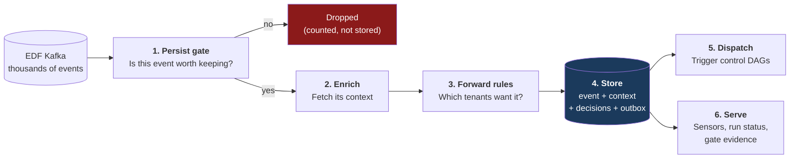
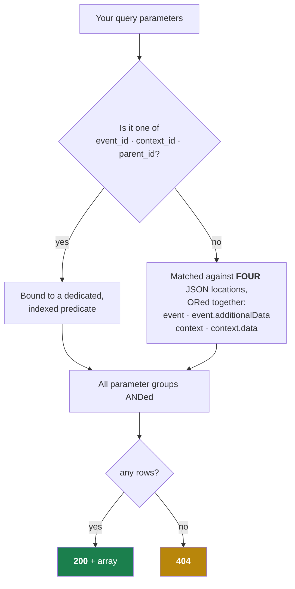
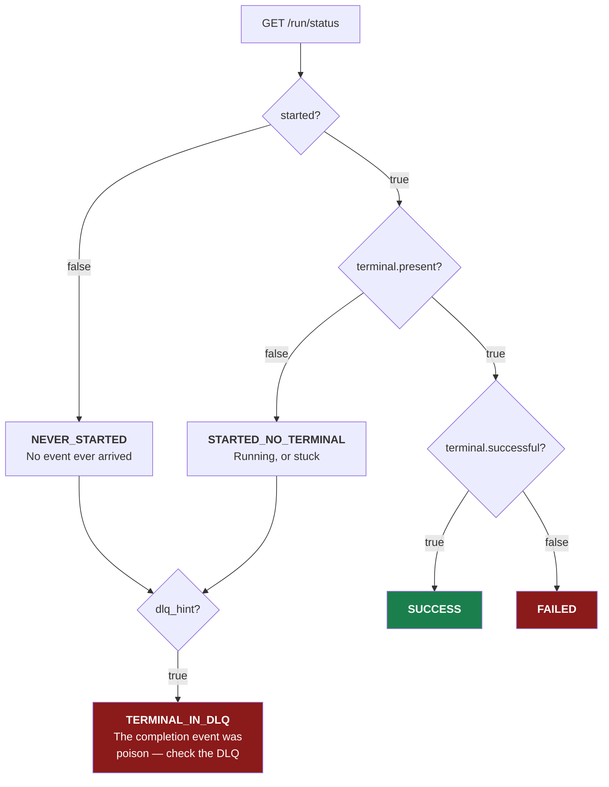
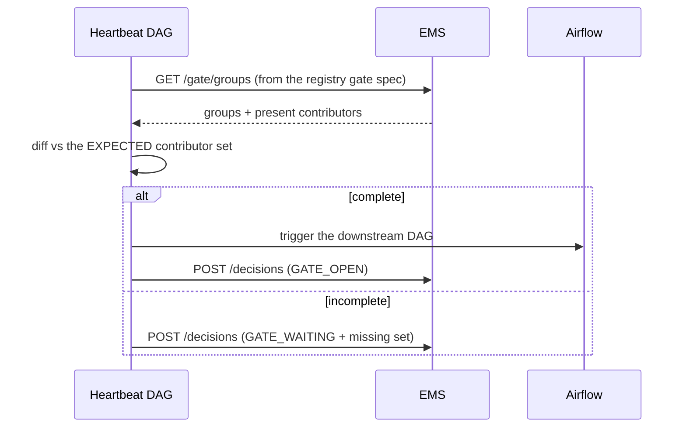
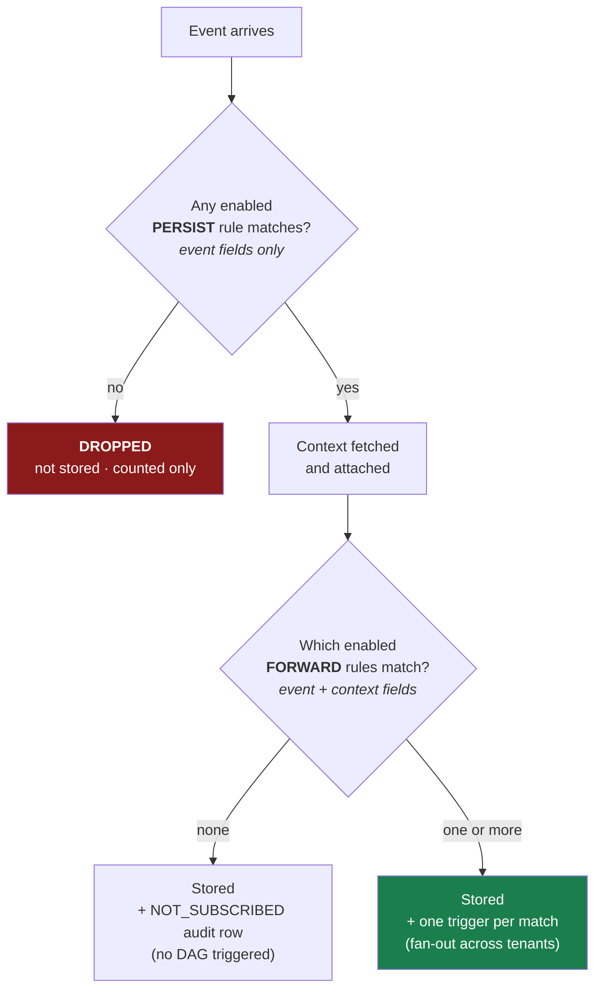
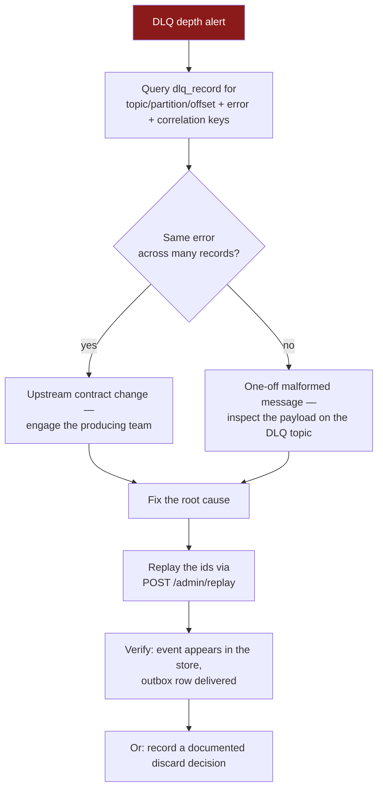
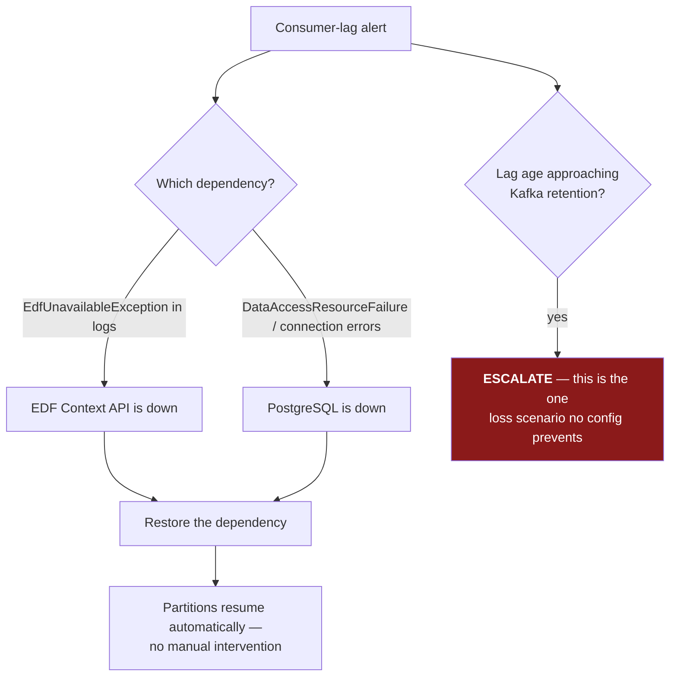

# Event Management Service (EMS) — User Guide

**Version:** 1.0 · **Date:** 2026-07-27
**Companion document:** [`ems-technical-specification.md`](ems-technical-specification.md) — the full technical specification (schema, algorithms, invariants).
**Design source of truth:** [`ems-design.md`](../ems-design.md).

> ⚠️ **Pre-production build.** EMS is at implementation phase 3 of 6. **Authentication is not yet implemented — every endpoint is currently open.** `POST /admin/replay` and `PUT /admin/subscriptions` do not exist yet, and the subscription table has no seeded rows. See [§10 Current limitations](#10-current-limitations) before relying on anything here in production.

---

## Who this guide is for

| You are… | Start at |
|---|---|
| An **Airflow DAG author** polling for events or run status | [§3 Query API](#3-querying-events-and-contexts), [§4 Run status](#4-checking-run-status-from-a-dag) |
| Building a **gate / heartbeat DAG** | [§5 Gate groups](#5-finding-open-gates), [§6 Posting decisions](#6-posting-decision-records) |
| **Onboarding a tenant** or changing routing | [§7 Subscriptions](#7-onboarding-a-tenant-subscriptions) |
| **Operating** EMS (on call) | [§8 Operations runbooks](#8-operations-runbooks), [§9 Monitoring](#9-monitoring-and-alerts) |
| **Developing** EMS | [§11 Developer quick start](#11-developer-quick-start) |

---

## Table of contents

1. [What EMS does](#1-what-ems-does)
2. [Concepts and vocabulary](#2-concepts-and-vocabulary)
3. [Querying events and contexts](#3-querying-events-and-contexts)
4. [Checking run status from a DAG](#4-checking-run-status-from-a-dag)
5. [Finding open gates](#5-finding-open-gates)
6. [Posting decision records](#6-posting-decision-records)
7. [Onboarding a tenant (subscriptions)](#7-onboarding-a-tenant-subscriptions)
8. [Operations runbooks](#8-operations-runbooks)
9. [Monitoring and alerts](#9-monitoring-and-alerts)
10. [Current limitations](#10-current-limitations)
11. [Developer quick start](#11-developer-quick-start)
12. [Reference tables](#12-reference-tables)

---

## 1. What EMS does

EMS sits between the **EDF event firehose** and the **Airflow orchestration platform**. In one sentence: *it decides which events matter, remembers them, and tells Airflow to run something.*



### Three promises EMS makes

1. **Nothing forwardable is lost.** Every write is idempotent and the Airflow trigger is buffered in a transactional outbox. An Airflow outage produces a backlog that drains on recovery — never lost triggers, and never a stalled ingest path.
2. **Nothing runs twice.** Trigger identity is a deterministic hash of `(dag_id, conf)`. A duplicate trigger collides on that id and Airflow returns `409`, which EMS treats as success.
3. **Queries are fast.** Hot filter attributes are promoted to typed, indexed columns. Sensor queries that took 10+ minutes target low single-digit milliseconds.

### One promise EMS deliberately does **not** make

**EMS does not keep every event.** Events that match no `PERSIST` rule are dropped without being stored. This is intended — EDF is a firehose and only a small fraction is relevant. If you need an event kept, a `PERSIST` rule must cover it. See [§7](#7-onboarding-a-tenant-subscriptions).

---

## 2. Concepts and vocabulary

| Term | Meaning |
|---|---|
| **Event** | One upstream message from EDF. Stored byte-verbatim; its `id` is the primary key |
| **Context** | The enrichment record an event points at via `contextId`. Immutable; carries `data.*` fields like `reporting-date`, `frequency`, `h3Region`, and a `parentIds` array |
| **Enriched event** | An `(event, context)` pair — what `GET /event` returns and what a control DAG receives as its `conf` |
| **Persist gate (L0 stage 1)** | The drop filter. Event fields **only**, evaluated *before* enrichment. Zero match ⇒ event discarded |
| **Forward rule (L0 stage 2)** | The routing filter. Event **and** context fields, evaluated *after* enrichment. Each match sends the event to one tenant's control DAG |
| **Tenant** | An **orchestration team** that owns rules — `CAPITAL`, `NSFR`, `PLATFORM`. ⚠️ Not the same as the `additionalData.tenant` field in payloads, which is an upstream *source-system* label (`FRCA`, `MR`, `ACTL`) |
| **Control DAG** | The Airflow DAG a forward rule targets, e.g. `orchestration_control_dag_capital` |
| **`dag_run_id`** | The deterministic Airflow run id: `sha1(dag_id + canonical_json(conf))[:16]`. Makes triggering idempotent |
| **Outbox** | The `dag_trigger_outbox` table. Trigger intent is committed with the event, then delivered asynchronously |
| **Routing decision** | An audit row in `routing_decision` recording *why* an event was (or was not) forwarded |
| **DLQ** | `<topic>.ems.dlq` — the dead-letter topic. **Poison payloads only**; infrastructure outages never dead-letter |
| **Poison** | A payload that can never succeed (malformed JSON, contract violation) |
| **Parked partition** | A Kafka partition paused with unbounded backoff while a dependency is down. It resumes automatically |
| **CEL** | Common Expression Language — the syntax subscription rules are written in |

### 2.1 Authenticating

**Every endpoint needs a credential** (except the `/actuator/health` and `/actuator/info` probes). Present either an `Authorization: Bearer <jwt>` token or HTTP Basic credentials — both resolve to the same permissions, because both map your **groups** onto the same three authorities.

| You are | You need | To call |
|---|---|---|
| An Airflow sensor / any reader | any valid credential | `/event`, `/context`, `/parentcontext`, `/childcontext`, `/run/status`, `/gate/groups` |
| A control DAG or heartbeat | the **dispatcher** group | `POST /decisions` |
| An operator | the **elevated** group | `POST /admin/replay` |
| The registry CI | the **elevated and CI** groups | `PUT /admin/subscriptions` |

`401` means no (or an invalid/expired) credential; `403` means you authenticated but your groups do not carry that authority.

In an Entra environment your platform issues the token. In a **local or non-Entra** environment (`ems.auth.mode=local`), exchange your Basic credentials for one:

```bash
export EMS_TOKEN=$(curl -s -X POST http://ems/token -u "$EMS_USER:$EMS_PASSWORD" \
  | python -c 'import json,sys; print(json.load(sys.stdin)["access_token"])')
```

The token asserts exactly the groups your account already has — it is a convenience, never an escalation. It expires after `ems.auth.local.token-ttl` (1 hour by default); a `401` mid-run means fetch another.

> The examples in this guide show `-H "Authorization: Bearer $EMS_TOKEN"` on write endpoints and omit it on reads for brevity. **Reads need it too.**

---

## 3. Querying events and contexts

### 3.1 `GET /event` — the sensor contract

The workhorse. Returns matching enriched events, or **404 when nothing matches** — the 404 is the signal deferrable sensors wait on, so it is a contract, not an error.

```bash
curl -s "http://ems/event?context_id=ctx-300&TYPE=INGESTION&STATE=FINISH"
```

```json
[
  {
    "event": {
      "id": "evt-mer-1",
      "contextId": "ctx-300",
      "source": "merival",
      "additionalData": { "DATASET_UUID": "ds-uuid-777", "TYPE": "INGESTION", "STATE": "FINISH" },
      "logicalBusinessDate": "2026-07-17"
    },
    "context": {
      "id": "ctx-300",
      "data": { "reporting-date": "2026-07-17", "run-category": "TOPSIDE", "h3Region": "emea", "frequency": "DAILY" },
      "parentIds": ["ctx-200"]
    }
  }
]
```

#### How parameters are matched — read this before writing a query



| Rule | Detail |
|---|---|
| **Three special parameters** | `event_id`, `context_id`, `parent_id` — matched case-sensitively by name. `parent_id` searches the context's `parentIds` **array** (multi-parent safe) |
| **Everything else** | Matched across four JSON locations at once. You do **not** need to know whether a field lives on the event or the context |
| **Values are case-sensitive** | `TYPE=INGESTION` matches; `TYPE=ingestion` does not. EMS does **not** canonicalize your query values |
| **Multiple values** | Use `\|` inside one parameter: `STATE=FINISH\|FAILED` |
| **No parameters at all** | `400` — a bare `GET /event` is a client error, not "match everything" |
| **Repeated parameters** | Only the first is used. Use the `\|` form instead |

#### Common queries

```bash
# Dataset check
curl "http://ems/event?context_id=ctx-300&DATASET_UUID=ds-uuid-777&FREQUENCY=DAILY&TYPE=INGESTION"

# Terminal state, either outcome
curl "http://ems/event?context_id=ctx-300&STATE=FINISH|FAILED"

# Status check driven by parent context
curl "http://ems/event?parent_id=ctx-200&TYPE=CALC_EVENT&STATE=FINISH|FAILED"

# Single event by id
curl "http://ems/event?event_id=evt-mer-1"
```

> **Troubleshooting a stubborn 404.** In order: (1) check the **case** of your value; (2) check the event was actually persisted — if no `PERSIST` rule covers it, it was dropped at the gate and does not exist; (3) check the field name matches the payload spelling exactly (`TYPE` vs `type`, `reporting-date` vs `reportingDate` — both spellings exist in production and the 4-location OR matches the **raw** payload text).

### 3.2 `GET /context` — look up one context

```bash
curl -s "http://ems/context?context_id=ctx-300"
```

`200` with the context object, or `404`. An empty `context_id` is `400`.

### 3.3 `GET /parentcontext` — walk up the chain

Finds the nearest ancestor matching your criteria.

```bash
curl -s "http://ems/parentcontext?initial_context_id=ctx-300&frequency=DAILY"
```

- `initial_context_id` is required (`400` otherwise).
- Every other parameter must match either `context.<key>` or `context.data.<key>`.
- **With no criteria, you get the topmost ancestor** (an empty criteria set matches everything).

### 3.4 `GET /childcontext` — walk down the chain

```bash
curl -s "http://ems/childcontext?initial_context_id=ctx-200&limit=10&frequency=DAILY"
```

Returns the starting context itself if it matches, otherwise the first matching child. `limit` (default `1`) caps how many children are scanned.

> **Note:** both chain endpoints search the **local store only**. Contexts are loaded into EMS during ingestion, not fetched on the read path.

---

## 4. Checking run status from a DAG

`GET /run/status` answers "where is this run?" in one indexed query. It is what the calculator framework's `SlaAwareHttpTrigger` polls on each wake-up.

```bash
curl -s "http://ems/run/status?context_id=ctx-300"
```

```json
{
  "scheduled": true,
  "started": true,
  "terminal": { "present": true, "successful": true, "event_id": "evt-mer-1" },
  "dlq_hint": false,
  "last_event_at": "2026-07-17T09:31:04Z"
}
```

| Parameter | Notes |
|---|---|
| `context_id` | The framework's `triggerContextId` |
| `task_id` | The MEG task id |

At least one is required (`400` otherwise); supplying both ANDs them.

### Interpreting the answer



> **It always returns 200**, never 404 — a run with no events yet is a legitimate `started: false` answer, and the framework needs a body to classify it.

> **`dlq_hint: true` is the "why is this hung?" answer.** It means a message carrying this correlation key was dead-lettered as poison. The completion event may exist upstream but never reached the store. Go to [§8.1 DLQ triage](#81-dlq-alert--triage-and-replay).

> **`scheduled` currently mirrors `started`** — EMS has no scheduler view separate from the event stream. Do not build logic on `scheduled` alone.

### Calling it from Airflow

```python
import requests

def run_finished(context_id: str) -> bool:
    r = requests.get(f"{EMS_URL}/run/status", params={"context_id": context_id}, timeout=10)
    r.raise_for_status()
    s = r.json()
    return s["terminal"]["present"]

def diagnose(context_id: str) -> str:
    s = requests.get(f"{EMS_URL}/run/status", params={"context_id": context_id}, timeout=10).json()
    if s["dlq_hint"] and not s["terminal"]["present"]:
        return "TERMINAL_IN_DLQ"
    if not s["started"]:
        return "NEVER_STARTED"
    if not s["terminal"]["present"]:
        return "STARTED_NO_TERMINAL"
    return "SUCCESS" if s["terminal"]["successful"] else "FAILED"
```

---

## 5. Finding open gates

`GET /gate/groups` answers "which groups have contributions, and which contributors are present?" in one round trip — the query a heartbeat DAG uses to find gates that are still waiting.

**EMS is rule-free here.** It does not know your gate's expected contributor set or its staleness policy. You supply the paths and criteria; you diff the result against your expectations.

```bash
curl -s "http://ems/gate/groups?\
group_by=context.data%5B%22reporting-date%22%5D&\
contributor=context.data.companyCode&\
lookback=5d&\
TYPE=CALC_EVENT&STATE=FINISH"
```

```json
{
  "groups": [
    { "group": "2026-07-16", "contributors": ["CO-11", "CO-12"] },
    { "group": "2026-07-17", "contributors": ["CO-11"] }
  ]
}
```

| Parameter | Required | Meaning |
|---|---|---|
| `group_by` | **yes** | Json-path whose value names each group |
| `lookback` | **yes** | Window width: `<int><unit>`, unit ∈ `s`/`m`/`h`/`d` — e.g. `5d`, `6h`, `30m` |
| `contributor` | no | Json-path identifying a contribution within a group |
| anything else | no | Criteria — same 4-location matching and `\|` alternation as `GET /event` |

**Path syntax:** an `event` or `context` root followed by dotted or bracketed segments. Use brackets for hyphenated keys.

```
context.data["reporting-date"]      event.additionalData.STATE      context.data.companyCode
```

An unresolvable path yields nothing for that row — no error. Groups are sorted by value; contributors are distinct and sorted.

> **Both `group_by` and `lookback` are mandatory** — a missing `lookback` returns `400` rather than silently scanning the entire table.

> **No group timestamp yet.** If you need each group's age for a staleness policy, fetch it with `GET /event` for now.

### Typical heartbeat use



---

## 6. Posting decision records

`POST /decisions` writes the audit trail for decisions **your** dispatcher or heartbeat made. EMS writes the L0 (subscription) half itself; this endpoint records the L1 and gate halves.

```bash
curl -s -X POST http://ems/decisions \
  -H "Authorization: Bearer $EMS_TOKEN" \
  -H 'Content-Type: application/json' \
  -d '{
    "decisions": [
      {
        "event_id": "evt-mer-1",
        "tenant_id": "CAPITAL",
        "tier": "L1_OUTCOME",
        "target_dag_id": "amer_d_b3f_dag",
        "decision": "TRIGGERED",
        "detail": { "matched_rule": "b3f_daily" },
        "registry_version": "reg-2026-07-20",
        "engine_version": "celpy==0.1.2"
      }
    ]
  }'
```

```json
{ "received": 1, "inserted": 1 }
```

| Field | Allowed values |
|---|---|
| `tier` | `L0_SUBSCRIPTION`, `L1_SUMMARY`, `L1_OUTCOME`, `GATE` |
| `decision` | `FORWARDED`, `NOT_SUBSCRIBED`, `MATCHED`, `TRIGGERED`, `ERROR`, `GATE_OPEN`, `GATE_WAITING` |
| `detail` | A JSON **object** (or omitted) |
| `event_id` | Required, non-blank |

### Behaviour you should code against

| Situation | Response | What to do |
|---|---|---|
| All records valid | `200 {"received": n, "inserted": m}` | Done |
| **Any** record invalid | `400`, **nothing written** | Fix your payload — this is a caller bug, and a half-applied audit batch would be worse |
| Empty `decisions` array | `200 {"received":0,"inserted":0}` | Normal — not an error |
| `inserted < received` | `200` | Normal — a duplicate `L0_SUBSCRIPTION` record was absorbed by the idempotency index. Safe after a retry |
| Database failure | `5xx` | **Retry, then alert.** EMS returns an honest error rather than silently dropping an audit record |
| Missing/expired token | `401` | Fetch a new token (§2.1) |
| Token without the dispatcher group | `403` | Your identity is not in `ems.auth.groups.dispatcher` — ask an operator |

> **Audit never blocks dispatch — but that is *your* responsibility.** Your DAG should proceed regardless of what this endpoint answers. EMS answers honestly precisely so your retry loop can engage; a silent `200` on a failed write would lose the record forever.

> **`decided_by` is not yours to set.** It is the identity on your token, recorded once for the whole batch. A `decided_by` in the body is ignored (so the existing Python client works unchanged) — what lands in the audit column is what you authenticated as.

---

## 7. Onboarding a tenant (subscriptions)

### 7.1 The two-stage model



| Stage | Purpose | Can reference | Typical breadth |
|---|---|---|---|
| `PERSIST` | Should we keep this event at all? | `event.*` **only** | **Broad** — lifecycle-wide, so sensors and gates keep non-terminal evidence |
| `FORWARD` | Which tenant's control DAG gets it? | `event.*` **and** `context.*` | **Narrow** — usually terminal states only |

### 7.2 The golden rule

> **`PERSIST` must be a superset of `FORWARD`.**
> If a `FORWARD` rule can match an event that no `PERSIST` rule admits, that event is dropped before the forward stage ever runs — the trigger silently never happens. CI enforces `PERSIST ⊇ FORWARD ⊇ your Level-1 registry rules`; a violation fails the build.

### 7.3 Writing rules in CEL

Rules are CEL boolean expressions evaluated against a **normalized** view of the payload.

```javascript
// PERSIST — event fields only
event.source == "MERIVAL" && event.additionalData.TYPE == "INGESTION"
    && event.additionalData.RUN_TYPE == "BATCH"

// FORWARD — may also reference context
event.additionalData.tenant == "FRCA"
    && event.additionalData.updateType == "CURATION"
    && context.data["run-category"].startsWith("TOPSIDE")
```

| Do | Don't |
|---|---|
| Use `context.*` in `FORWARD` rules | ❌ Use `context.*` in a `PERSIST` rule — **it will not compile** (the variable is not in scope) |
| Use `["hyphen-key"]` bracket syntax for hyphenated keys | ❌ Write `context.data.reporting-date` (parsed as subtraction) |
| Compare against **upper-case** values for `STATE`, `TYPE`, `taskEventType`, `frequency` — they are normalized before evaluation | ❌ Assume a missing field raises an error — it makes the rule a **non-match** |
| Keep rules **coarse** | ❌ Encode calculator logic here — that belongs in the Airflow registry |

Translating a legacy filter: an array of objects is an **OR**; keys within one object are an **AND**; a trailing `.*` was a literal-prefix match, so use `startsWith(...)`.

### 7.4 Adding a subscription

`PUT /admin/subscriptions` upserts a rendered slice. It needs a token in **both** the elevated and the registry-CI group; direct SQL is break-glass only.

```bash
curl -s -X PUT http://ems/admin/subscriptions \
  -H "Authorization: Bearer $EMS_TOKEN" \
  -H 'Content-Type: application/json' \
  -d '{
    "subscriptions": [
      {
        "tenant": "CAPITAL",
        "stage": "FORWARD",
        "rule_name": "cap_data_update.MER_batch",
        "control_dag_id": "orchestration_control_dag_capital",
        "when": "event.source == \"MERIVAL\" && event.additionalData.TYPE == \"INGESTION\"",
        "registry_version": "reg-2026-07-20"
      }
    ]
  }'
```

```json
{ "received": 1, "upserted": 1 }
```

Note the two wire names that differ from the columns: **`tenant`** → `tenant_id` and **`when`** → `when_cel`. `enabled` is optional and defaults to `true`.

The rule's identity is `(tenant, stage, rule_name)` — re-PUTting the same triple **replaces** that rule in place and keeps its id; it never creates a second row. `updated_by` is stamped from your token, not from the body.

**What gets rejected (400, whole slice, nothing written):**

- [ ] CEL that does not compile
- [ ] A `PERSIST` rule referencing `context.*` — it runs pre-enrichment, so there is no context yet (Amendment A4)
- [ ] A `FORWARD` rule with no `control_dag_id`
- [ ] An unknown `stage`, or a missing `tenant`/`rule_name`/`when`/`registry_version`

The rejection reason is logged by EMS, not returned — check the service log if a push fails.

**Still your responsibility (EMS does not check it):**

- [ ] A `PERSIST` rule already admits every event this `FORWARD` rule can match
- [ ] `tenant` is the **orchestration team** (`CAPITAL`), not the payload's `additionalData.tenant` (`FRCA`)

**Changes take effect within ~60 seconds** — the rule cache refreshes on that cadence. No redeploy, no restart.

### 7.5 Verifying a new rule works

1. Wait ~60 s for the cache refresh.
2. Watch `ems_events_dropped_total{source}` — a broadened `PERSIST` rule should reduce it.
3. Query the audit trail:

```sql
SELECT decision, tenant_id, target_dag_id, registry_version, decided_at
FROM routing_decision
WHERE event_id = '<an event you expect to match>' AND tier = 'L0_SUBSCRIPTION';
```

`FORWARDED` with your tenant means the rule fired. `NOT_SUBSCRIBED` means the event was stored but matched no forward rule. **No rows at all** means the event never passed the persist gate.

4. Confirm delivery:

```sql
SELECT dag_id, delivered_at, attempts, last_error
FROM dag_trigger_outbox ORDER BY created_at DESC LIMIT 10;
```

### 7.6 Disabling a rule

Re-PUT the rule with `"enabled": false` — do not delete. Deletion loses the audit trail; the `NSFR` seed row ships disabled for exactly this reason. The rule stops being evaluated within one cache refresh (~60 s).

---

## 8. Operations runbooks

### 8.1 DLQ alert — triage and replay

**Alert:** `ems_dlq_depth{topic} > 0` for 5 minutes.

**What it means:** a payload that can **never** succeed was dead-lettered — malformed JSON or a contract violation. Almost always an upstream contract change. **Infrastructure outages never appear here.**



```sql
-- Triage — note the ids, they are what you replay
SELECT id, topic, kafka_partition, kafka_offset, event_id, task_id, context_id, error, recorded_at
FROM dlq_record
WHERE replayed_at IS NULL
ORDER BY recorded_at DESC;

-- Group by failure signature
SELECT left(error, 120) AS signature, count(*), min(recorded_at), max(recorded_at)
FROM dlq_record WHERE replayed_at IS NULL GROUP BY 1 ORDER BY 2 DESC;
```

Once the root cause is fixed, replay the selected ids (elevated group required):

```bash
curl -s -X POST http://ems/admin/replay \
  -H "Authorization: Bearer $EMS_TOKEN" \
  -H 'Content-Type: application/json' \
  -d '{"ids": [412, 413]}'
```

```json
{ "requested": 2, "replayed": 1,
  "skipped": [ { "id": 413, "reason": "PAYLOAD_UNAVAILABLE" } ] }
```

EMS re-reads each message at its recorded offset on the **source** topic, re-publishes it verbatim, and stamps `replayed_at`/`replayed_by` with your identity. A skipped id tells you why:

| Reason | Meaning |
|---|---|
| `NOT_FOUND` | No such `dlq_record` row |
| `ALREADY_REPLAYED` | It carries a stamp already. A message that poisons again produces a **new** row — replay that id instead |
| `PAYLOAD_UNAVAILABLE` | The offset is outside the topic's retention window. The bytes are gone; the row stays for the record |
| `PUBLISH_FAILED` | The broker did not acknowledge. The row is left unstamped, so you can simply retry |

Replay is safe: every downstream step is idempotent, so a partially processed record replays without duplicating anything. Selection is by id only — there is deliberately no "replay everything" switch.

> **The DLQ is a triage queue, never a graveyard.** Every alerted record ends in a replay or a documented discard decision.

> **A poison message does not stall its partition.** It is dead-lettered and the offset commits, so processing continues.

### 8.2 Outbox backlog — Airflow is down

**Alert:** `ems_outbox_pending_age_seconds > 600` (oldest undelivered row older than 10 minutes).

**What it means:** triggers are accumulating because Airflow is unreachable or rejecting. **Ingestion is unaffected** — this is exactly what the outbox is for.

```sql
-- How big and how old?
SELECT count(*) AS pending, min(created_at) AS oldest
FROM dag_trigger_outbox WHERE delivered_at IS NULL;

-- What is Airflow saying?
SELECT dag_id, attempts, last_error, count(*)
FROM dag_trigger_outbox
WHERE delivered_at IS NULL AND last_error IS NOT NULL
GROUP BY 1,2,3 ORDER BY 4 DESC;
```

| `last_error` says | Meaning | Action |
|---|---|---|
| `retriable: Airflow unavailable` | 429/5xx or unreachable | Restore Airflow. The backlog drains automatically with 30 s–600 s jittered backoff |
| `non-retriable: Airflow rejected the trigger` | A 4xx that will never succeed — usually a wrong `dag_id` or a malformed conf | **Needs correction.** These rows will never deliver on their own |

**Do not delete outbox rows to clear the alert.** Delivery is idempotent — letting them drain is always safe.

### 8.3 Consumer lag — a partition is parked

**Alert:** sustained `ems_consumer_lag`, or lag age approaching topic retention.

**What it means:** a dependency (PostgreSQL or the EDF Context API) is down, so partitions have parked with unbounded backoff. **Nothing is lost and nothing is dead-lettered** — but the clock is running.



**The critical judgement call:** if the outage may outlast the topic's retention window, escalate immediately. Once records age out of Kafka they are gone — no consumer configuration prevents this.

### 8.4 Drop-rate anomaly — a misconfigured subscription

**Alert (warn):** `ems_events_dropped_total{source}` deviates from its baseline.

| Direction | Likely cause | Action |
|---|---|---|
| **Spike** | A `PERSIST` rule was narrowed or disabled, or an upstream payload changed shape so rules no longer match | Check recent `subscription` changes (`updated_at`, `updated_by`). Compare a sample payload against the rules |
| **Drop to zero for a source** | The source stopped producing, or a rule was broadened unintentionally | Confirm with the producing team |

**Recovery from an over-narrow rule:** fix the rule, then **replay the Kafka offsets** within the retention window. Dropped events left only a counter — there is no record to recover from the database.

### 8.5 Verifying "did this event get routed?"

The single most common operational question. One query answers it:

```sql
SELECT e.event_id,
       e.created_at                       AS ingested_at,
       rd.decision, rd.tenant_id, rd.target_dag_id, rd.registry_version,
       o.dag_run_id, o.delivered_at, o.attempts, o.last_error
FROM event e
LEFT JOIN routing_decision rd
       ON rd.event_id = e.event_id AND rd.tier = 'L0_SUBSCRIPTION'
LEFT JOIN dag_trigger_outbox o
       ON o.dag_id = rd.target_dag_id
      AND o.created_at BETWEEN e.created_at - interval '1 minute'
                           AND e.created_at + interval '1 minute'
WHERE e.event_id = '<event id>';
```

| Result | Interpretation |
|---|---|
| No `event` row | Dropped at the persist gate, or never consumed. Check `ems_events_dropped_total` and the DLQ |
| `decision = NOT_SUBSCRIBED` | Stored, but matched no forward rule — working as configured |
| `decision = FORWARDED`, `delivered_at` set | Fully routed ✅ |
| `decision = FORWARDED`, `delivered_at` null | Trigger pending — see [§8.2](#82-outbox-backlog--airflow-is-down) |

### 8.6 Rolling back to the legacy service

Rollback is a configuration change. **No data surgery, ever.**

1. Repoint the query-API route (ingress / `ES_EVENT_ENDPOINT`) back to the Scala service.
2. Scale the Scala deployment up at its **previous release version, unchanged config**.
3. Set `ems.dispatch.enabled=false`.

The Scala consumers resume from **their own frozen offsets** and reprocess the gap from Kafka; their database backfills itself. Triggers EMS already sent collide on `dag_run_id` and dedup — no double calculator runs.

**Constraint:** safe only while the gap is within Kafka retention. Keep the old stack deployable for the full 2-week observation window.

---

## 9. Monitoring and alerts

| Metric | Severity | Threshold | Runbook |
|---|---|---|---|
| `ems_dlq_depth{topic}` | 🔴 **page** | > 0 for 5 min | [§8.1](#81-dlq-alert--triage-and-replay) |
| `ems_outbox_pending_age_seconds` | 🔴 **page** | oldest > 10 min | [§8.2](#82-outbox-backlog--airflow-is-down) |
| `ems_consumer_lag{topic,partition}` | 🔴 **page** | sustained lag; **early page** when lag age nears retention | [§8.3](#83-consumer-lag--a-partition-is-parked) |
| `ems_events_dropped_total{source}` | 🟡 warn | per-source anomaly | [§8.4](#84-drop-rate-anomaly--a-misconfigured-subscription) |
| `ems_normalization_mutations_total{field}` | 🟡 warn | any nonzero | Review before cutover — a nonzero value means EMS is changing live values the existing control DAG expects unchanged |
| `ems_subscription_verdicts_total{tenant,decision}` | 🟡 warn | tenant volume drop | Check that tenant's rules |
| `ems_overdue_inflight_runs` | 🟡 warn | STARTED with no terminal past a global window | Loss backstop |
| `ems_registry_version{component,version}` | 🟡 warn | divergence > 30 min | Phase B+ |
| Endpoint p95 (`/event`, `/run/status`, `/gate/groups`) | 🟡 warn | regression | Check index usage with `EXPLAIN` |
| `ems_context_fetch_total{source}` | ℹ️ info | — | `edf` share rising ⇒ cache churn |

**Endpoints:** `/actuator/health/liveness`, `/actuator/health/readiness`, `/actuator/prometheus`, `/actuator/metrics`.

> ⏳ `ems_dlq_depth`, `ems_consumer_lag`, `ems_overdue_inflight_runs` and `ems_registry_version` require the `ReconciliationSweep`, which is **not yet implemented**. Four of the alerts above cannot fire today.

---

## 10. Current limitations

Read this before depending on EMS.

| Limitation | Impact on you |
|---|---|
| 🔴 **No `seed-0` subscription rows** in any migration | A fresh deployment has an **empty subscription table**, so **every event is dropped at the persist gate**. Rules must be loaded before ingestion is meaningful |
| 🔴 **`ems.auth.mode` defaults to `local`** — EMS then accepts tokens it issued itself via `POST /token` | Every endpoint still needs a token and the right group, but a shared environment must set `ems.auth.mode=entra` plus `spring.security.oauth2.resourceserver.jwt.issuer-uri`. Startup warns while a random signing key is in use |
| 🟡 **No `ReconciliationSweep`** | DLQ depth, consumer lag, and overdue-run metrics are unpublished |
| 🟡 **No integration test has been observed green** | Testcontainers cannot reach Docker on the development workstation; the suite auto-skips and awaits CI. The last local build ran **151 unit tests green, 84 integration tests skipped** |
| 🟡 **EDF Context API contract is provisional** | `GET /context/{id}` with a static bearer token is a placeholder; WireMock stands in for the real service |
| 🟡 **Normalization value maps are provisional** | Only `D/M/Q → DAILY/MONTHLY/QUARTERLY` and `AMERICAS → AMER` are mapped; everything else passes through upper-cased |
| 🟡 **No performance validation at scale** | The "< 50 ms p95" target has not been measured against 10 M rows |
| 🟡 **No retention job** | Tables grow unbounded until the Phase-6 DAG ships |
| 🟢 **`/gate/groups` has no group timestamp** | Fetch group age via `GET /event` if a staleness policy needs it |
| 🟢 **`/run/status` `scheduled` mirrors `started`** | Cannot distinguish scheduled-but-not-started |
| 🟢 **Legacy dev endpoints absent** | `/listen`, `/listencontext`, `/statuschange` are not implemented (`POST /token` is, in `local` mode) |

---

## 11. Developer quick start

### Prerequisites

- JDK 17 (Liberica or Temurin)
- Maven 3.9+
- Docker (**only** for integration tests; the suite auto-skips without it)

### Build and test

```bash
# Full build: unit tests + integration tests (ITs skip without Docker)
mvn -B -ntp -f ems/pom.xml verify

# Unit tests only
mvn -B -ntp -f ems/pom.xml test

# One test
mvn -B -ntp -f ems/pom.xml test -Dtest=SubscriptionServiceTest
```

Expected on a machine without a reachable Docker daemon:

```
Surefire (unit):        Tests run: 115, Failures: 0, Errors: 0, Skipped: 0
Failsafe (integration): Tests run:  74, Failures: 0, Errors: 0, Skipped: 74
BUILD SUCCESS
```

### Run locally

```bash
mvn -f ems/pom.xml spring-boot:run \
  -Dspring-boot.run.profiles=local \
  -Dspring-boot.run.arguments="--ems.consumer.enabled=false"
```

Disabling the consumer gives you an API-only pod that needs no Kafka. Flyway migrates `V1`–`V5` on startup against the configured PostgreSQL.

### Where things live

| Path | Contents |
|---|---|
| [`ems/src/main/java/com/orchestration/ems/`](../ems/src/main/java/com/orchestration/ems/) | Application code — 9 packages ([spec §4.2](ems-technical-specification.md#42-package-map)) |
| [`ems/src/main/resources/db/migration/`](../ems/src/main/resources/db/migration/) | Flyway `V1`–`V5` |
| [`ems/src/test/resources/samples/`](../ems/src/test/resources/samples/) | Real MEG / CALC / Merival payload fixtures |
| [`ems/src/test/resources/fixtures/subscriptions_seed0.json`](../ems/src/test/resources/fixtures/subscriptions_seed0.json) | The `seed-0` rule translation + provenance |
| [`shared/canonical-conformance/`](../shared/canonical-conformance/) | Cross-engine `dag_run_id` vectors — **the** Java ↔ Python contract |
| [`ems/deploy/helm/ems/`](../ems/deploy/helm/ems/) | Helm chart |

### Rules for contributors

1. **Verify against code, not docs.** When the legacy sources (`old-ems/`, `old-orchestration/`) contradict a plan, record a numbered amendment in [`ems-design.md §0`](../ems-design.md) with file:line evidence **before** building on it.
2. **Never mutate the stored payload.** Normalization applies to exactly three edges: the forwarded conf, the CEL activation, and the promoted columns. The `json` column is byte-verbatim, and byte-compatibility of `GET /event` depends on it.
3. **Never break the canonical-JSON contract.** If `CanonicalConformanceTest` fails, the Java and Python engines have diverged and trigger dedup is broken. Fix the code, not the vectors.
4. **New promoted columns must be `IMMUTABLE` and cast-free.** One `::date` cast lets a single malformed message poison every insert.
5. **Unit tests must run without Docker.** Put logic-shaped assertions in `*Test`; anything needing real PostgreSQL/Kafka goes in `*IT` with `@Testcontainers(disabledWithoutDocker = true)`.
6. **EMS evaluates no calculator rule, ever.** If you are tempted to add domain logic, it belongs in the Airflow registry.

---

## 12. Reference tables

### 12.1 Endpoints

| Method | Path | Purpose | Needs | Success | Not found | Bad request |
|---|---|---|---|---|---|---|
| `GET` | `/event` | Enriched-event query (sensor contract) | any credential | `200` + array | `404` | `400` (no params) |
| `GET` | `/context` | Context by id | any credential | `200` | `404` | `400` (empty id) |
| `GET` | `/parentcontext` | Walk up `parentIds` | any credential | `200` | `404` | `400` (no `initial_context_id`) |
| `GET` | `/childcontext` | Walk down to children | any credential | `200` | `404` | `400` (no `initial_context_id`) |
| `GET` | `/run/status` | Lifecycle summary | any credential | **always `200`** | — | `400` (no correlation key) |
| `GET` | `/gate/groups` | Grouped contribution query | any credential | **always `200`** | — | `400` (no `group_by`/`lookback`) |
| `POST` | `/decisions` | Audit-record batch ingest | dispatcher group | `200` + counts | — | `400` (invalid record) |
| `POST` | `/admin/replay` | DLQ replay | elevated group | `200` + per-id outcome | — | `400` (no `ids`) |
| `PUT` | `/admin/subscriptions` | Subscription upsert | elevated **and** CI groups | `200` + counts | — | `400` (unusable row / bad CEL) |
| `POST` | `/token` | Local bearer token (mode `local` only) | any credential | `200` + token | — | — |

### 12.2 Configuration knobs you are most likely to touch

| Property | Default | Meaning |
|---|---|---|
| `ems.consumer.enabled` | `true` | Turn ingestion off for an API-only pod |
| `ems.dispatch.enabled` | `false` | **The shadow → live switch.** Outbox rows accumulate but are never sent while false |
| `ems.consumer.topics` | — | Comma-separated EDF topics |
| `ems.consumer.group-id` | `ems-ingest` | Consumer group |
| `ems.dispatch.poll-interval-ms` | `2000` | Outbox drain cadence |
| `ems.dispatch.batch-size` | `100` | Rows per drain tick |
| `ems.airflow.base-url` | — | Airflow REST root, **including** the API prefix |
| `ems.edf.base-url` | — | EDF Context API root |
| `ems.auth.mode` | `local` | `local` (self-issued HS256 tokens + `POST /token`) or `entra` (Entra is the issuer) |
| `ems.auth.groups.{dispatcher,admin,ci}` | `ems-dispatchers`, `ems-admins`, `ems-registry-ci` | Group identifiers granting each authority — **Entra group object ids** in a real tenant |
| `ems.auth.groups-claim` | `groups` | The JWT claim carrying group membership (some tenants emit `roles`) |
| `ems.auth.principal-claim` | `sub` | The claim naming the caller — the value audited into `decided_by`/`replayed_by`/`updated_by` |
| `ems.auth.users[]` | empty | HTTP Basic accounts (`username`, `password` with a `{bcrypt}` prefix, `groups`) |
| `ems.auth.local.signing-key` | — | HS256 secret for `local` mode; blank ⇒ random per process (dev only) |

Profiles: `local` · `azure` · `shadow` (dispatch off) · `live` (dispatch on).

### 12.3 Vocabularies

**`routing_decision.tier`:** `L0_SUBSCRIPTION` · `L1_SUMMARY` · `L1_OUTCOME` · `GATE`

**`routing_decision.decision`:** `FORWARDED` · `NOT_SUBSCRIBED` · `MATCHED` · `TRIGGERED` · `ERROR` · `GATE_OPEN` · `GATE_WAITING`

**`subscription.stage`:** `PERSIST` · `FORWARD`

**Terminal event vocabulary:**

| Scheme | Terminal when | Successful when |
|---|---|---|
| `MERIVAL_CALC_EVENT` | `STATE ∈ {FINISH, FAILED}` | `STATE = FINISH` |
| `MEG_TASK_EVENT` | `taskEventType = COMPLETED` | the event's `successful` flag is true |

### 12.4 Useful operational SQL

```sql
-- Ingestion rate over the last hour
SELECT date_trunc('minute', created_at) AS minute, count(*)
FROM event WHERE created_at > now() - interval '1 hour'
GROUP BY 1 ORDER BY 1 DESC;

-- Routing breakdown for today
SELECT decision, tenant_id, target_dag_id, count(*)
FROM routing_decision
WHERE tier = 'L0_SUBSCRIPTION' AND decided_at > current_date
GROUP BY 1,2,3 ORDER BY 4 DESC;

-- Active rules
SELECT tenant_id, stage, rule_name, control_dag_id, registry_version, updated_at, updated_by
FROM subscription WHERE enabled ORDER BY stage, tenant_id, rule_name;

-- Undelivered triggers, oldest first
SELECT dag_run_id, dag_id, created_at, attempts, last_error
FROM dag_trigger_outbox WHERE delivered_at IS NULL ORDER BY created_at LIMIT 20;

-- Un-replayed DLQ records
SELECT id, topic, kafka_partition, kafka_offset, event_id, context_id, left(error, 100), recorded_at
FROM dlq_record WHERE replayed_at IS NULL ORDER BY recorded_at DESC;

-- Generated-column health (should reconcile with rows genuinely lacking the key)
SELECT count(*) FILTER (WHERE task_id IS NULL)    AS null_task_id,
       count(*) FILTER (WHERE context_id IS NULL) AS null_context_id,
       count(*)                                   AS total
FROM event;
```

---

*For schema details, algorithms, failure semantics and the full amendment set, see the [technical specification](ems-technical-specification.md). For design rationale and rejected alternatives, see [`ems-design.md`](../ems-design.md).*
