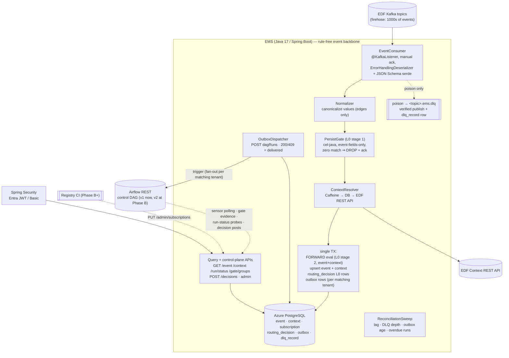

# Event Management Service (EMS) — Redesign Design & Implementation Plan

**Status:** Approved design, ready for implementation — revised 2026-07-19 to fold into the platform redesign program as the **Phase A implementation design** of the trigger-semantics plan
**Replaces:** event-orchestration (Scala 2.13 / Spring Boot, PostgreSQL JSONB-blob store)
**Companions:** [system_discovery.md](system_discovery.md) (current state) · [trigger_redesign_final_implementation_plan.md](trigger_redesign_final_implementation_plan.md) (Phase 1 — control plane) · [framework_redesign_final_implementation_plan.md](framework_redesign_final_implementation_plan.md) (Phase 2 — calculator DAG framework) · [trigger_event_context.json](trigger_event_context.json) (sample Merival `EnrichedEvent` — JSON-path evidence) · [properties.sql](properties.sql) (legacy `system_properties` filters + control-DAG map — seed evidence)

---

## 0. Role in the Redesign Program & Precedence

This document is the implementation design for **Phase A** of the trigger plan: the from-scratch Java/Spring rewrite of the event microservice. It carries two workstreams in one build:

1. **Re-platform + performance** — Java 17 / Spring Boot, redesigned event/context schema (typed generated columns + indexes), caching where it helps, retention lifecycle. Fixes the 10+ minute sensor queries.
2. **Phase-A control-plane surfaces** — everything the trigger plan requires "built in from day one": tenant **subscription table** (Level-0 routing), transactional **outbox**, **`routing_decision`** + L0 recording, **DLQ + replay**, normalization at ingestion, and the **`GET /run/status`** endpoint that framework step F0 hard-depends on.

**Precedence rule:** where this document is silent, the trigger plan governs. Where they conflict, the trigger plan wins **except** for the amendments below, agreed 2026-07-19:

| # | Amendment | Replaces (trigger plan) | Rationale |
|---|-----------|------------------------|-----------|
| A1 | Transient-infra failures **park the partition** (unbounded seek-based backoff) and never dead-letter. The DLQ is **poison-only**. Airflow unavailability is removed from the ingest path entirely by the outbox | §4.2 "9-attempt ladder → DLQ" for infra errors | Dead-lettering during an outage converts recoverable backpressure into business-level loss that needs human replay; parking self-heals on recovery. With the outbox, the most common downstream outage (Airflow) no longer touches ingestion at all |
| A2 | Cutover = **shadow-consume, then big-bang route flip** with a version-controlled rollback (§11) | §10 Phase A "per-topic cutover; Scala kept warm" | Simpler operationally; the shadow-consume stage still delivers the mirrored-traffic byte-parity evidence Phase A demands, and idempotent triggering (409 = success) makes the flip and the rollback race-free |
| A3 | The event store is **not** "as-is": typed `GENERATED ALWAYS … STORED` columns + composite indexes over the JSONB payload (§5–§6) | §2.1 / §4.1 "event/context store (as-is)" | Millisecond store queries are a **prerequisite** for Phase 1's stateless gates, `GET /gate/groups`, and the §5.8 `/run/status` probes — none of which are viable against 10-minute scans. Write path unchanged (JSONB upsert), so every as-is invariant holds |
| A4 | Level-0 is **two-stage**, mirroring the legacy PRE/POST split: a **persist gate** (stage 1 — event-fields-only CEL, evaluated **before** context enrichment; zero-match = **drop without persisting**) and per-tenant **forward conditions** (stage 2 — evaluated after enrichment, inside the TX; may reference `context.*`) | §4.2 pipeline order (persist before subscription eval); single-condition subscription shape | EDF is a central firehose: thousands of events, a tiny relevant fraction — dropping before the context fetch and DB write is the point (confirmed intended). Production config proves the persist set is deliberately **broader** than the forward set (lifecycle-wide vs terminal-only — `properties.sql`): sensors, `/run/status`, and gates need non-terminal events persisted. Two stages keep both properties: firehose economics at stage 1, the trigger plan's full `(event, context)` activation at stage 2 |
| A5 | `contractVersion` in the forwarded conf is **added at Phase B**, not Phase A | §8 invariant 3 (timing unspecified) | Adding a conf key changes `dag_run_id = sha1(dag_id + conf)`, which would defeat trigger dedup between the old and new services during the cutover overlap. Phase A conf stays byte-identical to today; the v2 dispatcher (the consumer of `contractVersion`) introduces it |

**Code-grounding amendments (agreed 2026-07-21, from reading `old-ems/` + `old-orchestration/`).** The first implementation session verified the plans against the legacy sources (design principle "verify against code, not docs"). Five contradictions were found and corrected below; each cites the source that grounds it. These win over the trigger plan and over earlier revisions of *this* document.

| # | Amendment | Replaces | Grounding & rationale |
|---|-----------|----------|-----------------------|
| A6 | **Deterministic `dag_run_id` is a NEW invariant, not a reproduction.** The legacy path sets **no** run id (Airflow auto-generates); the redesign *introduces* `dag_run_id = orch_sha1(dag_id + jcs(conf))[:16]` with 409 = success. The canonical form is **RFC 8785 (JCS)**, implemented once and locked EMS (Jackson) ↔ framework (Python) by a **shared cross-engine conformance fixture**. Shadow parity compares **`(dag_id, conf)` only** — the run id has no legacy counterpart to match | trigger §8.1 "idempotent trigger identity (unchanged, byte-exact)"; ems-design §2 "preserved: idempotent Airflow triggering (deterministic `dag_run_id`…)"; §11 parity target wording | `EventSender.sendEvent` POSTs `AirFlowRequest(event)` with no run id ([old-ems/EventSender.scala:86-103](old-ems/EventSender.scala)); `trigger_dag` passes `dag_run_id` through only if given, else omits it ([old-orchestration/common/dag_utils.py:28-37](old-orchestration/common/dag_utils.py)); no `orch_sha1`/canonical-JSON exists in either repo. Calling it "unchanged" would leave the canonical form undefined and let EMS and the framework diverge silently |
| A7 | **MEG family `taskId`/`taskEventType` live under `event.additionalData`.** V1 generated columns use `json->'additionalData'->>'taskId'` and `…->>'taskEventType'` (with COALESCE to top-level for other families) | §5 V1 DDL (`json->>'taskId'`, `json->>'taskEventType'`); §14 item 1 "VERIFY MEG paths" | `taskId`/`taskEventType` are nested in `additionalData` ([sample_MEG_STARTED_context_enriched_event.json:26](old-orchestration/dags/sample_MEG_STARTED_context_enriched_event.json)). The uncorrected DDL yields NULL `task_id` for the entire MEG family — and `task_id` is *the* calc-event lookup key |
| A8 | **Cross-family key-spelling COALESCE.** Promoted columns COALESCE both spellings: `reporting-date`\|`reportingDate`, `run-category`\|`runCategory`, region `h3Region`\|`regionCode`. The registry gate `group_by` resolves the same way (post-normalization) | §5 V1 DDL (`context.data->>'reporting-date'` only); trigger §3.2 gate `group_by: context.data["reporting-date"]` | B3F/Merival uses hyphen `reporting-date` ([sample_MEG_STARTED…:67](old-orchestration/dags/sample_MEG_STARTED_context_enriched_event.json)); CALC_EVENT uses camelCase `reportingDate` ([sample_calculator_COMPLETE_event.json:59](old-orchestration/dags/sample_calculator_COMPLETE_event.json)). Uncorrected, the portfolio gate (which fans in on CALC_EVENTs) keys on a NULL `reporting-date` |
| A9 | **`parentIds` is queried by array-containment, not element-0.** Promote via a **GIN index** on `(json->'parentIds' jsonb_path_ops)`; the `/context` chain and STATUS CHECK use `json->'parentIds' @> to_jsonb(:id)`. The scalar `first_parent_id`/btree is dropped | §5/§6 (`first_parent_id GENERATED AS json->'parentIds'->>0` + btree `idx_context_first_parent`) | Legacy query is `c.json->'parentIds' ?? ?` (JSONB contains-element) ([old-ems/DatabaseEventRepository.scala:33](old-ems/DatabaseEventRepository.scala)). Element-0 btree gives wrong results for any multi-parent context and resolves §14 item 1's "multi-parent cardinality" as **already array-contains** |
| A10 | **`/event` matches each non-id param across four JSON locations** (`event`, `event.additionalData`, `context`, `context.data`), case-sensitive, `\|`-multivalue OR — there is **no** param→single-column alias map. The redesign preserves this 4-location OR semantics; promoted columns are an index accelerator, not a semantic change | §4.3 param→single-column alias table | `OTHER_PARAMETERS_TEMPLATE` = `(e.json->>? IN (…) OR e.json->'additionalData'->>? IN (…) OR c.json->>? IN (…) OR c.json->'data'->>? IN (…))` ([old-ems/DatabaseEventRepository.scala:34-35](old-ems/DatabaseEventRepository.scala)); params `\|`-split ([old-ems/EventController.scala:47](old-ems/EventController.scala)) |

> **Seed note (extends A4):** the legacy *effective* persist set is **PERSIST ∪ FORWARD** — the Kafka `RecordFilterStrategy` admits an event if it matches persist **or** post, and `EventListener` then saves every admitted event ([old-ems/EventListener.scala:20-39](old-ems/EventListener.scala), [old-ems/EventFilter.SCALA:68-70](old-ems/EventFilter.SCALA)). The `seed-0` translation must therefore ensure **PERSIST ⊇ FORWARD** (the §7 CI invariant), adding PERSIST rows where a FORWARD-only match would otherwise be dropped.

> **CEL-translation note (control plane):** legacy filter matching is **fully case-insensitive** (whole event JSON, path, and value lower-cased) and a trailing `.*` is a `Regex.quote(prefix)+".*"` **literal-prefix** match, not free regex ([old-ems/JsonFilterRuleset.scala:14-31](old-ems/JsonFilterRuleset.scala)). §7's "the legacy value is a regex" overstates it. Subscription CEL + the Normalizer must reproduce case-insensitive comparison; the `TOPSIDE.*` clause is a prefix match.

**What this build supplies to the later phases:**

| Consumer | Dependency delivered here |
|---|---|
| Trigger plan Phase B | `PUT /admin/subscriptions` (CI-rendered registry slices), `routing_decision` store, `POST /decisions` ingest |
| Trigger plan Phase D | `GET /gate/groups`, fast indexed contribution queries for stateless gate recompute |
| Framework F0 (hard blocker) | `GET /run/status` in production |
| Framework F1+ | `GET /event` (gate evidence, reference queries) — contract preserved byte-compatibly |
| Unmigrated DAGs (entire migration) | `GET /event` 200/404 sensor polling contract, unchanged |

---

## 1. Executive Summary

The event-orchestration microservice is both the platform's performance bottleneck and the anchor point of the trigger redesign. The query Airflow sensors use to fetch context-enriched events takes **10+ minutes**. The root cause is structural, not scale — `event` and `context` are opaque JSONB blobs with no secondary indexes, so every filtered query is a full sequential scan, and the event→context join runs on a JSONB extraction that cannot use the context primary-key index. At the actual read rate (≤ 1 QPS from deferrable sensors) this is a per-query-plan problem, not a throughput problem.

This document specifies a **from-scratch rewrite in Java 17 + Spring Boot 3.x** against **Azure Database for PostgreSQL**, with a redesigned schema that promotes the known hot filter attributes to typed, indexed, **generated** columns while keeping the JSONB payload as the source of truth. The HTTP query contract is unchanged, so existing Airflow sensors are untouched; the service additionally ships the Phase-A control-plane mechanics (subscription routing, outbox, decision recording, DLQ, `/run/status`) so that trigger-plan Phases B–E and framework step F0 build on this service without a second rewrite.

Expected outcome: enriched-event queries drop from 10+ minutes to low single-digit milliseconds; triggers survive Airflow outages by construction; routing becomes tenant-scoped and CI-governable; the store gains a lifecycle (retention/archival); the service moves to a maintainable mainstream stack.

---

## 2. Current-State Critical Review (what we are fixing, and why)

| # | Finding | Consequence |
|---|---------|-------------|
| 1 | No secondary indexes on any JSONB attribute (`taskId`, `datasetId`, `reporting-date`, `frequency`, `h3Region`, …) | Every API query is O(table size): full seq scan + per-row JSONB detoast/parse → 10+ min queries |
| 2 | Join on `event.json->>'context-id' = context.context_id` | JSONB extraction on the join key defeats the context PK index; forces hash/merge joins over full scans |
| 3 | 10-min queries × 300 s sensor polls × HikariCP max 40 | Queries arrive faster than they finish → connection-pool exhaustion cascade; no `statement_timeout` guardrail exists |
| 4 | No ingest timestamp, no retention, no partitioning strategy decision | Unbounded growth compounds scan cost; no archival story |
| 5 | Scala 2.13 on Spring Boot | None of Scala's strengths (no FP ecosystem use), all of its costs: hiring pool, compile times, Scala-3 migration blocked by Spring friction |
| 6 | HikariCP 40 max × 10 pods = 400 potential connections | Oversized vs Azure PG connection slots and vs actual load (~10/pod suffices) |
| 7 | `system_properties` DB-driven config bootstrapping (`DbConfigurationPostProcessor`) | Non-standard config indirection; complicates startup and environment promotion |
| 8 | Raw versioned SQL files, no migration tool | No repeatable, auditable schema lifecycle |
| 9 | Airflow trigger issued inline on the consume path, no buffer | An Airflow outage blocks event processing; a crash after ack but before trigger would lose the trigger (mitigated today only by retry windows) |
| 10 | Routing config split across two worlds: Scala DB table (`post_filter_control_dag_map`) + Python JSON registry | Two-place authoring, no tenancy, no audit of who routes what where |

**What is sound and is deliberately preserved (anti-over-engineering):**

- Drop-uninteresting-events-early: non-matching firehose events are acked and discarded **without persistence** (now the persist-gate zero-match outcome, §4.2 step 3 — confirmed intended).
- `INSERT … ON CONFLICT DO NOTHING` dedup for Kafka at-least-once redelivery.
- JSONB as the payload of record (upstream schema can evolve without migrations).
- Idempotent Airflow triggering (deterministic `dag_run_id = orch_sha1(dag_id + conf)[:16]`, HTTP 409 = success) — this invariant is also what makes the §11 cutover and rollback race-free.
- Manual ack only after durable processing.
- K8s/Helm/Istio/HPA deployment model, Workload Identity.

---

## 3. Decision Record

| Decision | Choice | Rationale | Rejected alternatives |
|----------|--------|-----------|----------------------|
| Language/runtime | **Java 17 LTS** (org-standard runtime; blocking servlet model on platform threads) | Same JDK the current service already runs → zero runtime novelty; EDF contract ships as a JVM artifact (`com.ubs.edf.coreservice.api.v2.EventResponse`) → compile-time contract safety; matches trigger-plan §4 ("Java Spring"). Blocking model is fine at this concurrency; moving to 21/virtual threads later is a build-config change | Scala-native (ZIO/http4s): expertise-heavy, unjustified. Kotlin: novelty without need. Python/FastAPI: loses on Kafka consumer framework maturity, runtime-only typing, security/ops reset |
| Framework | **Spring Boot 3.5.x** | Spring Kafka is a consumer *framework* (error-handling deserializer, seek-based retry, dead-letter publishing, lifecycle) — not just a client; security (Entra JWT), actuator, Helm wiring carry over ~1:1 | Reactive/WebFlux: complexity with no payoff at this concurrency |
| Persistence access | **`JdbcClient`, no ORM** | Matches current (correct) choice; queries are few and hand-tuned | JPA/Hibernate: nothing to gain, plan opacity to lose |
| Schema strategy | **Typed `GENERATED ALWAYS … STORED` columns from JSONB + composite B-tree indexes; JSONB remains source of truth** | Zero write-path coupling; columns can never drift from payload; backfill is automatic during data load | Expression indexes only: fragile query↔index text coupling. Full normalization: brittle vs upstream schema evolution, no additional benefit at this scale |
| Level-0 routing | **Tenant `subscription` table with two stages** — `PERSIST` rows (event-only CEL drop gate) and `FORWARD` rows (`control_dag_id`, event+context CEL) — evaluated in-memory with cel-java; fan-out capable; CI-owned write path (`PUT /admin/subscriptions`) | The trigger plan's Level-0 model adopted with the A4 two-stage refinement — a 1:1 modernization of the proven legacy split (`eventorchestration.filter.persist` / `filter.post` + `post_filter_control_dag_map`): persist broadly (lifecycle-wide, so sensors and gates keep evidence), forward narrowly (terminal/routing conditions). Tenancy + `registry_version` audit built in; Phase B registry CI takes over rendering with no schema change | Flat AND/IN `event_filter` table (first revision of this doc): a second routing dialect, no tenancy. Single-stage subscription (previous revision of this fold): cannot express persist ⊃ forward — would have dropped the non-terminal events sensors rely on |
| Trigger delivery | **Transactional outbox + dispatcher** (trigger-plan §4.4 adopted) | Trigger intent commits atomically with the event persist — no acked-but-never-forwarded window; an Airflow outage produces a drained backlog, not lost triggers and not a stalled ingest path | Inline trigger on the consume path (previous revision): couples ingestion liveness to Airflow availability (finding 9) |
| DLQ policy | **Poison-only DLQ with verified publish; transient infra parks the partition (unbounded seek-based backoff); Airflow off the ingest path via outbox** — Amendment A1 | Poison (deserialization/contract) can never succeed → dead-letter immediately, no head-of-line blocking. Infra outages (PG, EDF API) self-heal → park and page on lag; nothing needs replay afterwards. DLQ becomes a pure triage queue with an audited replay API | "N retries → DLQ" for infra errors (trigger plan §4.2): converts outages into business-level loss pending human replay. Unbounded blind retry without classification: poison would stall partitions forever |
| Normalization | **At the source (ingestion), on the edges — raw payload preserved**: the Java `Normalizer` canonicalizes values (case, frequency, ISO region) into the forwarded conf, the CEL activation, and the promoted columns (via mirrored `IMMUTABLE` SQL functions); the stored `json` stays byte-verbatim | Rules and queries compare canonical values (trigger-plan registry clauses assume them) while `GET /event` stays byte-compatible and the migration copy stays trivially valid. A mutation counter proves normalization is a no-op on live traffic before anything depends on it (§4.4) | Canonicalizing the stored JSON: breaks byte-compat contract tests and shadow parity. Normalizing only at read time: leaves Phase-B rule evaluation exposed to raw value variance |
| Partitioning | **Not now — deferred with explicit triggers** | Partitioning `event` forces the partition key into the PK → `ON CONFLICT (event_id)` dedup breaks. At a few GB, pruning adds nothing over the indexes. **Revisit if:** table > ~50 GB or monthly delete/vacuum churn becomes measurable. (`routing_decision` is the one candidate for month-range partitioning later — its retention horizon is an open item, §14) | Range partitioning by month, now |
| Caching | **In-process Caffeine only**: context-by-id (ingestion fetch-dedup) + compiled subscription programs (refresh 60 s). **No enriched-event/query caching. No Redis** | Sensors poll `/event` to detect state change — caching that endpoint serves stale 404s and delays DAG completion by the TTL. Post-redesign reads are low-ms at ≤ 1 QPS: no DB load to relieve | Azure Cache for Redis (available, deliberately unused; revisit only for a genuine cross-pod need) |
| Migrations | **Flyway** | Repeatable, auditable, CI-enforced; replaces raw SQL folder | Liquibase (either fine; Flyway simpler for SQL-first teams) |
| Config | **Standard Spring profiles + env vars (Helm/Vault), retire `system_properties` indirection** | Removes bootstrap complexity; K8s-native | Keeping DB-driven config (audit its contents first — §14) |
| DB platform | **Azure Database for PostgreSQL Flexible Server**, zone-redundant HA, Entra ID (Workload Identity) passwordless auth | Managed, already provisioned; credentials disappear from config; resolves trigger-plan open question 6 (HA/DR posture) | — |

---

## 4. Target Architecture

### 4.1 Component view



### 4.2 Ingestion pipeline (normative)

1. **Consume** — Spring Kafka `@KafkaListener` on the EDF topics; `AckMode.MANUAL_IMMEDIATE`; `isolation.level=read_committed`; `ErrorHandlingDeserializer` wrapping the Confluent JSON Schema deserializer for `EventResponse` (a malformed message must never kill the consumer).
2. **Parse + normalize (event half)** — schema-validated parse, then the `Normalizer` canonicalizes event-level values (§4.4). The raw payload is retained untouched for storage.
3. **Persist gate (L0 stage 1 — the drop gate)** — evaluate the enabled `PERSIST` subscription rows against the event (compiled cel-java programs, in-memory, **event fields only** — Amendment A4). Production config (`properties.sql` → `eventorchestration.filter.persist`) confirms these are deliberately **lifecycle-wide** (e.g. MERIVAL INGESTION BATCH in *any* `STATE`), so non-terminal events stay available to sensors, `/run/status`, and future gates.
   - **Zero matches → count, ack, done.** No persistence, no context fetch, no decision row. This is the intended firehose behavior: EDF carries thousands of events; we persist only what some tenant's persist scope covers. Consequences accepted and documented: a dropped event leaves a metric (`ems_events_dropped_total{source}`), not a record; recovery from an over-narrow persist rule = offset replay within the Kafka topic's retention window. Guardrails: subscription changes are CI-reviewed (Phase B) or admin-audited (Phase A); per-source drop-rate anomaly alert; the §7 CI invariant chain (`PERSIST ⊇ FORWARD ⊇ Level-1 rules`) guarantees no downstream rule can silently lose events to this gate.
   - **≥ 1 match → continue.**
4. **Resolve + normalize context** — by the event's `contextId`: Caffeine cache hit → done; else DB PK lookup → cache and done; else **call the EDF Context REST API** (`RestClient`, OAuth2 client-credentials via Entra, bounded in-call retry), normalize context values, cache. Contexts are immutable → fetch-once semantics (verify — §14).
5. **Forward evaluation (L0 stage 2) + single transaction** — evaluate the enabled `FORWARD` rows over the canonical `(event, context)` activation (context references allowed here — enrichment already happened; e.g. the legacy capital rule on `context.data.run-category ~ "TOPSIDE.*"`), then in one TX:
   - `INSERT INTO event (event_id, json) VALUES (?, ?::jsonb) ON CONFLICT (event_id) DO NOTHING` (raw payload; generated columns populate automatically); same for `context`.
   - `routing_decision` **L0 rows**: one per (event, tenant) — `FORWARDED` for tenants with a matching `FORWARD` row, `NOT_SUBSCRIBED` for the rest — giving queryable absence coverage for every *persisted* event (`ON CONFLICT DO NOTHING` on the L0 uniqueness index makes redelivery idempotent). An event that passes the persist gate but matches no `FORWARD` row is persisted with all-`NOT_SUBSCRIBED` verdicts and no outbox row — exactly the legacy persist-without-trigger behavior.
   - **Outbox rows**: one per matching `FORWARD` row — `(dag_run_id, control_dag_id, conf)` where conf = canonicalized `EnrichedEvent(event, context)` (shape identical to today; `contractVersion` deferred to Phase B — Amendment A5) and `dag_run_id = orch_sha1(dag_id + canonical_json(conf))[:16]`, byte-identical to the current Scala derivation (verified in shadow, §11).
6. **Ack.**
7. **(async) Outbox dispatcher** — every 2 s, drain pending batch (`FOR UPDATE SKIP LOCKED`): `POST /dags/{dagId}/dagRuns`; **200 or 409 = delivered**; anything else records the attempt and backs off (30 s → 600 s, jitter — port of `ExponentialBackoffRetryStrategy`). Alert: oldest pending > 10 min pages. Airflow down for two hours ⇒ a drained backlog on recovery, not lost triggers and not a parked ingest path.

**Failure semantics (no-loss by construction, Amendment A1):** any pipeline step failing throws → record is **not acked** → `DefaultErrorHandler` classifies:

- **Poison — can never succeed** (deserialization failure, schema/contract violation): publish to `<topic>.ems.dlq` with **verified delivery** (`DeadLetterPublishingRecoverer`, `failIfSendResultIsError=true`, DLT producer `acks=all`), write a `dlq_record` row (best-effort correlation keys + exception chain), then ack. A failed DLQ publish leaves the offset uncommitted → redelivered, never lost. No retry ladder, no head-of-line blocking. Alert: DLQ depth > 0 for 5 min pages.
- **Transient infrastructure — will succeed later** (Azure PG or EDF Context API unavailability): **unbounded exponential backoff** (seek-based, so `max.poll.interval.ms` never trips and no rebalance storm occurs). The partition parks until the dependency recovers; nothing is dropped and nothing reaches the DLQ; consumer-lag alerting surfaces the stall, with headroom tracked against topic retention (an outage outlasting retention is the one loss scenario no consumer config prevents).
- **Airflow unavailability is not a pipeline failure** — the TX committed; the outbox absorbs it (step 7).

Because event insert, context insert, decision rows, outbox insert, and the Airflow trigger are all idempotent, at-least-once redelivery is safe end-to-end: a crash or rebalance between **any** two steps produces a duplicate no-op, never a loss and never a double calculator run.

**DLQ replay runbook:** on DLQ-depth alert, triage via `dlq_record` (original topic/partition/offset, exception, extracted correlation keys). Fix the root cause (usually an upstream contract change), then **`POST /admin/replay`** (§4.5) — re-publishes selected records to the source topic; every invocation writes an audit trail (`replayed_at`, `replayed_by`). Idempotency makes replay safe even for partially processed records; a replayed gate contribution flows through outbox → dispatcher → gate recompute exactly as trigger-plan §6.3 depicts. The DLQ is a triage queue, never a graveyard: every alerted record ends in replay or a documented discard decision.

### 4.3 Query API (contract preserved — existing Airflow sensors untouched)

| Endpoint | Semantics (unchanged) | Filter params → columns |
|----------|----------------------|--------------------------|
| `GET /event` | **200 + enriched event if found, 404 if not** (sensor contract — must be exact). Also serves Phase-D gate evidence and framework `services.events` reads | `taskId→event.task_id`, `datasetId→event.dataset_id`, `source→event.source`, `state→event.state`, `type→event.event_type`, `context-id→event.context_id`, `reporting-date→context.reporting_date`, `frequency→context.frequency`, `h3Region→context.h3_region`, `limit→LIMIT` |
| `GET /context` | context lookup | `datasetId→context.dataset_id`, `context-id→context.context_id`, `reporting-date`, `frequency` |
| `GET /parentcontext`, `GET /childcontext` | context-chain traversal | `context-id→context.context_id`; chain walked via `context.first_parent_id` (payload `parentIds` array — §14 item 1 covers multi-parent) |
| `POST /token`; dev/test `POST /listen`, `/listencontext`, `GET /statuschange` | as today | — |

Canonical enriched-event query (all filters optional, WHERE built from supplied params only):

```sql
SELECT e.json AS event, c.json AS context
FROM event e
JOIN context c ON c.context_id = e.context_id
WHERE e.task_id = :taskId
  AND c.reporting_date = :reportingDate
  AND c.frequency = :frequency
  AND c.h3_region = :h3Region
ORDER BY e.created_at DESC
LIMIT :limit;
```

Expected plan: Index Scan on `idx_event_task_id` → nested-loop → context PK lookup. Response bodies are built from the raw `json` columns, so the wire format is **byte-compatible** with today (normalization never touches stored payloads — §4.4).

**Parameter aliases & value semantics (from observed sensor traffic — must be preserved exactly):**

| Incoming param (observed) | Column | Notes |
|---|---|---|
| `contextId`, `context-id`, `triggerContextId` | `event.context_id` | alias set: VERIFY complete inventory in sensor code (§14) |
| `parent_id` | `context.first_parent_id` | STATUS CHECK driver; payloads carry a `parentIds` **array** (sample-verified) — binds to element 0; multi-parent cardinality open (§14) |
| `DATASET_UUID`, `datasetId` | `dataset_id` | |
| `FREQUENCY`, `frequency` | `context.frequency` | param value canonicalized before binding (§4.4) |
| `LBD`, `reporting-date` | `context.logical_business_date` / `context.reporting_date` | `LBD` = **logical business date**, compact `yyyyMMdd` (sample: `20260717` ↔ ISO `2026-07-17`) — controller normalizes compact→ISO; which column binds per event family: VERIFY (§14) |
| `TYPE`, `type` | `event.event_type` | |
| `STATE`, `state` | `event.state` | **multi-value alternation supported** (`FINISH\|FAILED`) → bind as `state = ANY(:values)` — still index-friendly since state is always a residual filter |
| `taskEventType` | `event.task_event_type` | |

Contract rules: param names matched **case-insensitively**; param **values** pass through the same canonicalization as ingestion (dates to the canonical stored text format, frequency/region to canonical form) before binding — normalization lives at the edges (controller, Normalizer), never in SQL against raw payloads.

**Auth:** Spring Security OAuth2 resource server (Entra JWT + group claims) with Basic fallback, mirroring current `AuthorizationManager` modes. `POST /decisions` requires the dispatcher/heartbeat JWT identity; `/admin/*` requires an elevated group; `PUT /admin/subscriptions` additionally restricted to the CI principal.

### 4.4 Normalization (at the source, on the edges — raw payload preserved)

The `Normalizer` is the single Java implementation of value canonicalization: upper-casing of enumerated fields (`state`, `type`, `taskEventType`, `frequency`), `normFreq` (e.g. `D`/`daily` → `DAILY`), and ISO-region resolution — extending the existing `normalizeContextDataValues` behavior. It is applied to exactly three edges, never to the stored payload:

1. **Forwarded conf** — the `EnrichedEvent` placed in the outbox (what control DAGs and, later, CEL rules see).
2. **CEL activation** — the event object handed to subscription evaluation.
3. **Promoted columns** — via mirrored `IMMUTABLE` SQL functions (`ems_norm_freq`, `ems_norm_region`) used in the generated-column expressions (§5), so column values match rule/conf values. A CI test asserts Java ↔ SQL equivalence exhaustively over the (finite) value inventory.

`ems_normalization_mutations_total{field}` counts every value the Normalizer actually changed. Expected ≈ 0 on live traffic (the MEG contract is fixed JSON); the shadow stage (§11) reviews any nonzero before cutover, because during Phase A the forwarded conf feeds the **existing** control DAG v1, whose Python code expects today's values. Normalization exists to *guarantee* canonical form for Phase B rules, not to change live values.

### 4.5 Control-plane API (new in this build — trigger-plan §4.6 adopted)

| Endpoint | Semantics |
|----------|-----------|
| `GET /run/status?<criteria>` | Lifecycle summary over the event store in one indexed query, keyed by the same correlation vocabulary as `/event` (`triggerContextId`, `taskId`, …): `{scheduled, started, terminal: {present, successful, event_id}, dlq_hint, last_event_at}`. `dlq_hint` comes from `dlq_record` correlation-key match. Serves the framework's `SlaAwareHttpTrigger` per-wake probes and the categorized timeout diagnosis (`NEVER_STARTED` / `STARTED_NO_TERMINAL` / `TERMINAL_IN_DLQ`). **Framework F0 blocks on this endpoint being in prod** |
| `GET /gate/groups?<criteria>&group_by=<json-path>&contributor=<json-path>&lookback=<dur>` | Generic grouped event query: distinct `group_by` values with ≥ 1 event matching the criteria inside the lookback window, plus each group's present-contributor set. EMS stays **rule-free**: all criteria and paths arrive from the caller (the heartbeat DAG passes them from the registry gate spec). Implementation: `idx_event_created_at` lookback scan + promoted-column residual filters, then in-service JSONB path extraction over the (small) qualifying set — no per-gate schema knowledge |
| `POST /decisions` | Batch ingest of slim decision records from dispatchers/heartbeats (JWT-authed) → `routing_decision` rows with `decided_by`. Used from Phase B onward; audit never blocks dispatch (caller retries then alerts) |
| `POST /admin/replay` | Re-publish selected DLQ records to the source topic (or re-emit stored events through the pipeline). Elevated JWT group; every invocation writes an audit row; safe end-to-end because every downstream step is idempotent |
| `PUT /admin/subscriptions` | Upsert of rendered subscription rows `{tenant, stage, rule_name, control_dag_id, when, registry_version}`. Rejects CEL that fails compilation; `PERSIST` rows additionally reject any `context.*` reference (Amendment A4). CI-only principal from Phase B; direct SQL grants revoked. Phase A rows are seeded by migration (§11) with `registry_version='seed-0'` |

---

## 5. Data Model (Flyway `V1__event_context.sql`, `V3__subscription.sql`, `V4__routing_decision.sql`, `V5__outbox_dlq.sql`)

Design rules: every promoted column is extracted via **`IMMUTABLE` expressions — no casts**. A `::uuid`/`::date` cast would make one malformed message poison all inserts, and `text::date` is not `IMMUTABLE` anyway. ISO-8601 dates compare and sort correctly as text. `NULL` results from absent JSON keys are expected and fine. Canonicalizing functions (`ems_norm_freq`, `ems_norm_region`) are `IMMUTABLE` pure value maps mirroring the Java Normalizer (§4.4).

```sql
-- V1 (prelude): canonicalization functions — pure value maps mirroring the Java
-- Normalizer (§4.4); final maps come from the §14 item 8 inventory. CI asserts
-- Java ↔ SQL equivalence exhaustively over the value inventory (§12).
CREATE FUNCTION ems_norm_freq(raw text) RETURNS text
LANGUAGE sql IMMUTABLE PARALLEL SAFE RETURNS NULL ON NULL INPUT AS $$
    SELECT CASE upper(raw)
        WHEN 'D' THEN 'DAILY'   WHEN 'DAILY'   THEN 'DAILY'
        WHEN 'M' THEN 'MONTHLY' WHEN 'MONTHLY' THEN 'MONTHLY'
        ELSE upper(raw)                  -- unmapped values pass through upper-cased
    END
$$;

CREATE FUNCTION ems_norm_region(raw text) RETURNS text
LANGUAGE sql IMMUTABLE PARALLEL SAFE RETURNS NULL ON NULL INPUT AS $$
    SELECT CASE upper(raw)
        WHEN 'AMERICAS' THEN 'AMER'      -- …full alias map from the §14 item 8 inventory…
        ELSE upper(raw)                  -- unmapped values pass through upper-cased
    END
$$;

-- V1: event / context — hot paths verified against trigger_event_context.json (Merival
-- family); MEG calc-event family confirmation is §14 item 1
CREATE TABLE event (
    event_id        text PRIMARY KEY,
    json            jsonb NOT NULL,                  -- raw payload, byte-verbatim
    task_id         text GENERATED ALWAYS AS (json->>'taskId') STORED,               -- MEG family: VERIFY §14
    dataset_id      text GENERATED ALWAYS AS (COALESCE(json->'additionalData'->>'DATASET_UUID',
                                                       json->'additionalData'->>'datasetId')) STORED,
                                                     -- sample: DATASET_UUID; both spellings covered
    context_id      text GENERATED ALWAYS AS (json->>'contextId') STORED,            -- sample-verified (camelCase)
    source          text GENERATED ALWAYS AS (upper(json->>'source')) STORED,
    state           text GENERATED ALWAYS AS (upper(json->'additionalData'->>'STATE')) STORED,
                                                     -- sample-verified: nested in additionalData
    event_type      text GENERATED ALWAYS AS (upper(COALESCE(json->'additionalData'->>'TYPE',
                                                             json->'additionalData'->>'type'))) STORED,
                                                     -- BOTH key spellings live in prod (INGESTION vs CALC_EVENT rows)
    task_event_type text GENERATED ALWAYS AS (upper(json->>'taskEventType')) STORED, -- MEG family: VERIFY §14
    business_date   text GENERATED ALWAYS AS (json->>'businessDate') STORED,
    logical_business_date text GENERATED ALWAYS AS (json->>'logicalBusinessDate') STORED,
                                                     -- ISO form of the compact LBD param (§4.3)
    event_timestamp text GENERATED ALWAYS AS (json->>'eventTimestamp') STORED,       -- emit time (§14 item 4: answered)
    created_at      timestamptz NOT NULL DEFAULT now()
);

CREATE TABLE context (
    context_id            text PRIMARY KEY,          -- app-supplied from the context payload's 'id'
    json                  jsonb NOT NULL,
    dataset_id            text GENERATED ALWAYS AS (json->>'datasetId') STORED,      -- absent in Merival contexts; VERIFY MEG family or drop (§14)
    reporting_date        text GENERATED ALWAYS AS (json->'data'->>'reporting-date') STORED,  -- MEG calc family (registry gate group_by)
    logical_business_date text GENERATED ALWAYS AS (json->'data'->>'logicalBusinessDate') STORED, -- Merival family (sample-verified)
    frequency             text GENERATED ALWAYS AS (ems_norm_freq(json->'data'->>'frequency')) STORED,
    h3_region             text GENERATED ALWAYS AS (ems_norm_region(json->'data'->>'h3Region')) STORED,
    first_parent_id       text GENERATED ALWAYS AS (json->'parentIds'->>0) STORED,
                          -- sample-verified: contexts carry a 'parentIds' ARRAY — no scalar
                          -- parent/initial keys, so there is no parent-vs-initial split to
                          -- resolve. Switch to a GIN index on (json->'parentIds') if
                          -- multi-parent chains are confirmed (§14 item 1)
    created_at            timestamptz NOT NULL DEFAULT now()
);
```

```sql
-- V3: Level-0 tenant subscriptions — two stages mirroring the legacy PRE/POST split (A4)
CREATE TABLE subscription (
    id               bigint GENERATED ALWAYS AS IDENTITY PRIMARY KEY,
    tenant_id        text NOT NULL,      -- orchestration tenant/team (CAPITAL, NSFR, …) — NOT the
                                         -- upstream additionalData.tenant label (FRCA/MR/ACTL); §7
    stage            text NOT NULL CHECK (stage IN ('PERSIST', 'FORWARD')),
    rule_name        text NOT NULL,      -- carried over from legacy filter_name (e.g. 'cap_data_update.MER_batch')
    control_dag_id   text,               -- FORWARD only
    when_cel         text NOT NULL,      -- PERSIST: event.* only (A4, write-rejected otherwise);
                                         -- FORWARD: event.* + context.* allowed
    registry_version text NOT NULL,      -- 'seed-0' until Phase B CI takes over
    enabled          boolean NOT NULL DEFAULT true,
    updated_at       timestamptz NOT NULL DEFAULT now(),
    updated_by       text NOT NULL,      -- 'seed' | 'ci' | break-glass identity (audited)
    CONSTRAINT forward_requires_dag CHECK (stage <> 'FORWARD' OR control_dag_id IS NOT NULL),
    CONSTRAINT uq_subscription UNIQUE (tenant_id, stage, rule_name)
);
```

```sql
-- V4: routing_decision (trigger-plan §4.5 contract, verbatim)
CREATE TABLE routing_decision (
    decision_id      uuid PRIMARY KEY DEFAULT gen_random_uuid(),
    event_id         text NOT NULL,
    tenant_id        text,
    tier             text NOT NULL,   -- 'L0_SUBSCRIPTION' | 'L1_SUMMARY' | 'L1_OUTCOME' | 'GATE'
    target_dag_id    text,
    decision         text NOT NULL,   -- FORWARDED | NOT_SUBSCRIBED | MATCHED | TRIGGERED
                                      -- | ERROR | GATE_OPEN | GATE_WAITING
    detail           jsonb,
    registry_version text,
    engine_version   text,
    decided_by       text NOT NULL,   -- 'ems' | '<tenant>_control_dag' | '<tenant>_heartbeat'
    decided_at       timestamptz NOT NULL DEFAULT now()
);
-- L0 idempotency under Kafka redelivery: the ingest TX inserts with ON CONFLICT DO NOTHING
CREATE UNIQUE INDEX ux_rd_l0 ON routing_decision (event_id, tenant_id)
    WHERE tier = 'L0_SUBSCRIPTION';
```

```sql
-- V5: outbox (trigger-plan §4.4, verbatim) + DLQ index
CREATE TABLE dag_trigger_outbox (
    dag_run_id   text PRIMARY KEY,      -- orch_sha1(dag_id + conf)[:16], unchanged scheme
    dag_id       text NOT NULL,
    conf         jsonb NOT NULL,
    created_at   timestamptz NOT NULL DEFAULT now(),
    delivered_at timestamptz,           -- set on 200/409; also set at cutover for shadow rows (§11)
    attempts     int NOT NULL DEFAULT 0,
    last_error   text
);

CREATE TABLE dlq_record (
    id           bigint GENERATED ALWAYS AS IDENTITY PRIMARY KEY,
    topic           text NOT NULL,
    kafka_partition int NOT NULL,      -- "partition"/"offset" are reserved words, hence prefixed
    kafka_offset    bigint NOT NULL,
    event_id     text,                  -- best-effort extraction from the poison payload
    task_id      text,
    context_id   text,
    error        text NOT NULL,
    recorded_at  timestamptz NOT NULL DEFAULT now(),
    replayed_at  timestamptz,
    replayed_by  text
);
```

## 6. Indexes (Flyway `V2__indexes.sql`, `V4`/`V5` companions)

Driven strictly by the stated access patterns; nothing speculative.

```sql
-- event: taskId is THE calc-event lookup key; context_id serves the join and /run/status;
-- dataset_id secondary; created_at serves retention + ORDER BY + /gate/groups lookback
CREATE INDEX idx_event_task_id    ON event (task_id);
CREATE INDEX idx_event_dataset_id ON event (dataset_id);
CREATE INDEX idx_event_context_id ON event (context_id);
CREATE INDEX idx_event_created_at ON event (created_at);

-- context: reporting-date + frequency are almost always paired; h3_region rides
-- as 3rd column. Leftmost-prefix serves pair-only queries — one index, not three.
CREATE INDEX idx_context_rep_freq_region ON context (reporting_date, frequency, h3_region);
CREATE INDEX idx_context_dataset_id      ON context (dataset_id);
CREATE INDEX idx_context_first_parent    ON context (first_parent_id);   -- STATUS CHECK + chain-traversal driver (parentIds[0])
CREATE INDEX idx_context_created_at      ON context (created_at);

-- routing_decision (audit + debuggability queries, trigger-plan §7)
CREATE INDEX ix_rd_event  ON routing_decision (event_id);
CREATE INDEX ix_rd_target ON routing_decision (target_dag_id, decided_at);
CREATE INDEX ix_rd_tier   ON routing_decision (tier, decided_at);

-- outbox: dispatcher drain + age alert
CREATE INDEX ix_outbox_pending ON dag_trigger_outbox (created_at) WHERE delivered_at IS NULL;

-- dlq_record: /run/status hint lookup + triage
CREATE INDEX ix_dlq_context ON dlq_record (context_id) WHERE context_id IS NOT NULL;
CREATE INDEX ix_dlq_task    ON dlq_record (task_id)    WHERE task_id    IS NOT NULL;
```

Low-frequency / always-companioned params (`source`, `type`, `state`, `taskEventType`) get **no dedicated indexes**: in every observed query they co-occur with a selective key (context-id, parent-context-id, task/dataset, date+frequency), so the driving index narrows to a handful of rows and the residual filter is free. Add later only if `pg_stat_statements` proves a need.

**Observed sensor queries → expected drivers** (validation targets for the §12 `EXPLAIN` assertions):

| Observed query (params) | Driving index | Residual filters |
|---|---|---|
| DATASET CHECK: `contextId, DATASET_UUID, FREQUENCY, LBD, source, TYPE` | `idx_event_context_id` (or `idx_event_dataset_id` when no contextId) | source, event_type, frequency, reporting_date |
| START-EVENT LINK: `triggerContextId, taskEventType` | `idx_event_context_id` | task_event_type |
| STATUS CHECK: `parent_id, type, STATE (multi-value)` | `idx_context_first_parent` → join `idx_event_context_id` | event_type, state |
| `/run/status` probe: `triggerContextId` (+ scheme fields) | `idx_event_context_id` | task_event_type / state — one query summarizes lifecycle |
| `/gate/groups`: contribution criteria + lookback | `idx_event_created_at` (window) | state/event_type via columns; calcType et al. via JSONB residual over the small window |

## 7. Level-0 Subscriptions (replaces `eventorchestration.filter.persist`/`filter.post` **and** `post_filter_control_dag_map`)

Two stages, one table — a 1:1 modernization of the legacy split (evidence: [properties.sql](properties.sql)):

| Stage | Legacy artifact | Job | CEL scope |
|---|---|---|---|
| `PERSIST` | `eventorchestration.filter.persist` (system_properties) | Drop gate: which firehose events are worth persisting at all. Deliberately **lifecycle-wide** (e.g. MERIVAL INGESTION BATCH in any `STATE`) so sensors, `/run/status`, and gates keep non-terminal evidence | `event.*` only (pre-enrichment — A4) |
| `FORWARD` | `eventorchestration.filter.post` + `post_filter_control_dag_map` (team → control DAG) | Routing: which persisted events go to which tenant's control DAG. Typically terminal-only (`STATE == "FINISH"` refinements) | `event.*` + `context.*` (post-enrichment) |

**Known legacy inventory (seed input — sample data, verify per environment, §14 item 3):**

- **PERSIST** (7 rows): FRCA (all); AQUA_CCR × {INTRA-MONTH-ADJUSTED, INTRA-MONTH-UNADJUSTED}; MERIVAL INGESTION × {BATCH, INTRA}; RWA MR MONTHLY; CVA MR MONTHLY.
- **FORWARD**: team **CAPITAL** → `orchestration_control_dag_capital` (8 rows: FRCA data-update/CURATION incl. the context-referencing `context.data.run-category ~ "TOPSIDE.*"` clause; FRCA CALC_EVENT FINISH; AQUA_CCR ×2; MERIVAL BATCH/INTRA FINISH; RWA; CVA) and team **NSFR** → `orchestration_control_dag_liquidity` (1 row, **disabled**).
- Redundancy to resolve during the seed audit: post conditions exist in **both** the `filter.post` property and the map table — confirm the map is what `EventFilter.scala` actually evaluates, then retire the property. The sample rows carry obvious typos (`MERYVAL`, `context.date.*`) — treat them as illustrative, not literal.

**Mechanical translation** (legacy flat JSONPath-equality: array of objects = OR across rows; keys within an object = AND):

```
{"$.source":"MERIVAL", "$.additionalData.TYPE":"INGESTION", "$.additionalData.RUN_TYPE":"BATCH"}
  → event.source == "MERIVAL" && event.additionalData.TYPE == "INGESTION"
    && event.additionalData.RUN_TYPE == "BATCH"

{"$.context.data.run-category":"TOPSIDE.*"}                    (FORWARD stage only)
  → context.data["run-category"].matches("TOPSIDE.*")          (RE2; the legacy value is a regex)
```

**Naming collision — do not confuse:** `additionalData.tenant` in payloads is an *upstream source-system label* (`FRCA`, `MR`, `ACTL`); `subscription.tenant_id` is the *orchestration team* (`CAPITAL`, `NSFR`). Subscription CEL compares the former; row ownership is the latter.

**Evaluation semantics (normative):** stage 1 = OR over enabled `PERSIST` rows, in-memory, pre-enrichment; zero match ⇒ ack + drop (§4.2 step 3). Stage 2 = every enabled `FORWARD` row over the canonical `(event, context)` activation; each match emits an outbox row for that row's `control_dag_id`; the same event may fan out to multiple tenants (disjoint `dag_id` → disjoint `dag_run_id`s). Conditions are **coarse by design**; EMS evaluates **no calculator rule, ever** — every fine-grained condition lives in the Airflow-side registry (trigger plan §3).

**CI invariant chain (extends the trigger-plan superset check):** `PERSIST ⊇ FORWARD ⊇ tenant's Level-1 rules` — every registry-rule fixture must pass its tenant's `FORWARD` rows, and every `FORWARD` fixture must pass the `PERSIST` gate; any rejection fails the build.

**Row lifecycle:** Phase A seeds by mechanical translation as above (`registry_version='seed-0'`), drop/forward parity verified in shadow (§11). From Phase B, registry CI renders and upserts rows via `PUT /admin/subscriptions`; hand edits are break-glass, audited via `updated_by`.

**Runtime:** `SubscriptionService` loads enabled rows into a Caffeine cache (`refreshAfterWrite(60 s)`); programs are compiled once per row version and cached — per-event evaluation is pure in-memory; zero hot-path DB reads; changes take effect within a minute without redeploys.

**Engine note (cross-engine consistency):** EMS evaluates subscriptions with **cel-java**; the Phase-B registry CI and the Airflow dispatcher use **celpy**. The shared CEL conformance fixture suite (trigger plan §5.2) must run against **both** pinned engines in CI — a semantic divergence between them would silently violate the superset invariant (§14 item 9).

## 8. Caching (complete list — nothing else is cached)

| Cache | Scope | Key | TTL / size | Purpose |
|-------|-------|-----|------------|---------|
| Context | in-process Caffeine | `context_id` | 24 h / 10 000 | Ingestion fetch-dedup: skip EDF API call + DB hit for events sharing a context. Safe because contexts are immutable (verify — §14) |
| Subscriptions | in-process Caffeine | all enabled rows + compiled CEL programs | refresh 60 s | Zero hot-path DB reads and zero recompilation for L0 evaluation |

**Explicitly no enriched-event or query-result caching** and **no Redis** — see Decision Record §3 (stale-404 hazard on a state-change-polling endpoint; post-redesign reads are low-ms at ≤ 1 QPS, so there is no DB load to relieve; a cross-pod cache adds a network hop and a failure mode for nothing).

---

## 9. Retention & Archival

A monthly **Airflow maintenance DAG** (the team already operates Airflow; zero new infrastructure):

1. **Archive** `event` + `context` rows older than **13 months** to compressed files in Azure Blob Storage:
   `COPY (SELECT * FROM event WHERE created_at < now() - interval '13 months') TO STDOUT` → gzip → blob.
2. **Delete events** in batches (PostgreSQL `DELETE` has no `LIMIT`; use the ctid pattern):

```sql
DELETE FROM event
WHERE ctid IN (
    SELECT ctid FROM event
    WHERE created_at < now() - interval '13 months'
    LIMIT 50000
);
-- loop until 0 rows affected; sleep between batches
```

3. **Delete orphaned contexts** — only contexts past retention **and** no longer referenced:

```sql
DELETE FROM context c
WHERE c.created_at < now() - interval '13 months'
  AND NOT EXISTS (SELECT 1 FROM event e WHERE e.context_id = c.context_id);
```

4. **Purge `dag_trigger_outbox`** rows with `delivered_at` older than 30 days; **purge `dlq_record`** older than 13 months (replayed or discard-documented only).
5. **`routing_decision`** is retained on the **audit horizon**, not the event horizon — likely years for regulatory capital (trigger-plan open question 3; §14 item 10). Until that horizon is fixed, this DAG does not touch the table; the schema is partition-ready if volume demands it.

Autovacuum absorbs the monthly ~1/13 churn at this table size; no partitioning needed (§3). **Recomputability caveat:** trigger-plan "NO_MATCH is recomputable" holds only while the stored event exists — re-evaluating events older than 13 months requires an archive restore. Documented as the accepted trade-off; `routing_decision` (which outlives the events) carries the durable verdicts.

---

## 10. Configuration, Deployment & Observability

| Concern | Setting |
|---------|---------|
| DB | Azure PG Flexible Server, zone-redundant HA; Entra ID / Workload Identity passwordless auth (Spring Cloud Azure JDBC plugin) |
| Pool | HikariCP `maximumPoolSize=10` per pod (was 40); datasource property sets `statement_timeout=30s` as a regression guardrail |
| Kafka | Same topics/group semantics; `SASL_SSL`; `enable.auto.commit=false` + `AckMode.MANUAL_IMMEDIATE`; **`auto.offset.reset=earliest`** (lost/expired group offsets must resume from oldest retained, never skip forward — a deliberate correction: the legacy seed defaults are `latest` + `enable-auto-commit=true` per `properties.sql`, i.e. today's config can silently skip events after offset loss); `ErrorHandlingDeserializer`; `DefaultErrorHandler` per §4.2/A1: unbounded seek-based backoff for transient infra, verified-publish DLQ (`acks=all`, `failIfSendResultIsError=true`) for poison only |
| CEL | cel-java, **exact version pinned**; shared conformance fixtures run against cel-java **and** celpy in CI (§7) |
| HTTP out | `RestClient`. Outbox→Airflow: attempts tracked per row, 30 s–600 s backoff with jitter on 429/5xx (port of `ExponentialBackoffRetryStrategy`); EDF context API: short bounded in-call retry (it blocks a partition), then throw → park |
| K8s | Existing Helm chart pattern; HPA 3–10; actuator liveness/readiness; Istio; Vault; RollingUpdate maxSurge 1 / maxUnavailable 0. Outbox dispatcher runs in every pod — `FOR UPDATE SKIP LOCKED` makes concurrent drains safe |
| Config | Spring profiles + env vars via Helm/Vault; `system_properties` retired — its audited contents (`properties.sql`) map cleanly: secrets (Airflow basic auth, Azure OAuth, JKS truststore, EDF API keys) → Vault; Kafka consumer tuning → profile YAML; the two filter properties → the `subscription` table (§7). Feature toggles: `ems.dispatch.enabled` (the §11 shadow/live switch), `ems.consumer.enabled` |

**Observability (Micrometer → OpenTelemetry)** — merged set (this design + trigger-plan §9 EMS rows):

| Metric | Type | Alert |
|---|---|---|
| `ems_events_consumed_total{topic,outcome}` | counter | — |
| `ems_events_dropped_total{source}` (L0 zero-match) | counter | **warn** — per-source drop-rate anomaly (the misconfigured-subscription detector) |
| `ems_subscription_verdicts_total{tenant,decision}` | counter | anomaly: tenant volume drop |
| `ems_dlq_depth{topic}` | gauge | **page** > 0 for 5 m |
| `ems_outbox_pending_age_seconds` | gauge | **page** oldest > 10 m |
| `ems_consumer_lag{topic,partition}` (+ headroom vs topic retention) | gauge | **page** on sustained lag; **page** early when lag age approaches retention |
| `ems_normalization_mutations_total{field}` | counter | **warn** — any nonzero reviewed before cutover (§4.4) |
| `ems_registry_version_info{component}` | info | **warn** divergence > 30 m (Phase B+) |
| `ems_overdue_inflight_runs` | gauge | **warn** — STARTED events with no terminal past a coarse global window (ReconciliationSweep; loss backstop independent of the Phase-D heartbeat) |
| `ems_context_fetch_total{source=cache\|db\|edf}` / EDF + Airflow latency histograms | — | — |
| per-endpoint latency histograms (`/event`, `/run/status`, `/gate/groups`) | histogram | **warn** p95 regression |

**Suggested package layout** (aligned with trigger-plan §4.1 module names):

```
com.<org>.ems
├── EmsApplication.java
├── config/          # kafka, security, datasource, cache, retry, azure, toggles
├── ingestion/       # EventConsumer, Normalizer, ContextResolver, EdfContextClient
├── subscription/    # SubscriptionService (cel-java, cached programs), SubscriptionRepo
├── store/           # EventRepository, ContextRepository (JdbcClient, JSONB upsert)
├── decisions/       # RoutingDecisionRepo, DecisionIngestController (POST /decisions)
├── dispatch/        # OutboxRepo, OutboxDispatcher, AirflowTriggerClient
├── api/             # EventController, ContextController, RunStatusController,
│                    # GateGroupsController, AdminController (replay, subscriptions), TokenController
├── recon/           # ReconciliationSweep (lag, DLQ depth, outbox age, overdue runs)
└── model/           # records: EventRow, ContextRow, EnrichedEvent, SubscriptionMatch
```

---

## 11. Migration & Cutover (big-bang flip with shadow rehearsal and version-controlled rollback)

The strategy exploits the one invariant both services share: **triggering is idempotent** (`dag_run_id` deterministic, 409 = success). That makes running both services against the same topics harmless — duplicates collapse — so the "big bang" reduces to a route flip plus a consumer toggle, with rollback being the same flip in reverse.

**Stage 0 — prerequisites (any time):**
1. Resolve §14 open items (JSON paths, EDF API contract, PG version, seed inventory).
2. Provision Azure PG; Flyway V1–V5 in all environments; CI green.
3. Seed `subscription`: `PERSIST` rows from `eventorchestration.filter.persist`, `FORWARD` rows from the audited `post_filter_control_dag_map` (cross-checked against `eventorchestration.filter.post`), mechanically translated to CEL per §7, tenant-assigned (CAPITAL; NSFR disabled), `registry_version='seed-0'`.
4. Capture **before** evidence: `EXPLAIN (ANALYZE, BUFFERS)` of the real production slow query + current p95.

**Stage 1 — shadow-consume (days-to-weeks, in production, zero risk):**
5. Deploy EMS with `ems.dispatch.enabled=false` and its **own consumer group** (not the Scala group). It consumes live traffic, evaluates subscriptions, persists events/contexts/decisions, and writes outbox rows that are **never dispatched**.
6. Parity jobs (the Phase-A acceptance evidence, on mirrored live traffic):
   - **Conf byte-parity:** shadow outbox `(dag_id, dag_run_id, conf)` vs the dag runs Scala actually triggered (Airflow REST) → target zero diffs; `ems_normalization_mutations_total` explains any.
   - **Drop parity:** events Scala persisted that EMS dropped, and vice versa → each explained or zero (validates the seed translation).
   - **Perf:** canonical §4.3 queries against the shadow-filled store under production data → p95 targets met.
7. **Backfill history:** copy the 13-month retention window from the old DB (`postgres_fdw` or dump/restore). `ON CONFLICT DO NOTHING` absorbs overlap with shadow-ingested rows; generated columns compute automatically. `ANALYZE event, context;`

**Stage 2 — flip (minutes; scheduled window for coordination, not correctness):**
8. Repoint the query-API route (`ES_EVENT_ENDPOINT` / ingress) to EMS. Deferrable sensors tolerate the blip by design (re-poke on error).
9. Scale the Scala service's consumers to 0 (its group offsets freeze at the stop point).
10. Mark all currently pending shadow outbox rows delivered (`delivered_at=now()`, annotated `shadow-suppressed`) and set `ems.dispatch.enabled=true`. Only post-flip events dispatch. Boundary events processed by both services collide on `dag_run_id` → 409 → no double runs.
11. Smoke test: `/event` 200 & 404 paths, `/context`, `/parentcontext`, `/childcontext`, `/run/status`; verify one end-to-end trigger against a test subscription row.

**Stage 3 — observation (2 weeks):** old service **and** old DB stay deployed, scaled to 0, fully startable; dashboards on §10 alerts; acceptance checklist (§12) signed off before decommission.

**Rollback (any point in stage 2–3, release-version controlled — no data surgery, ever):**
- Repoint the route back to the old service; scale the Scala deployment up (previous release version, unchanged config); set `ems.dispatch.enabled=false`.
- The Scala consumers resume from **their own frozen offsets** and reprocess the gap from Kafka — their DB backfills itself; triggers EMS already sent during the interim collide on `dag_run_id` and dedup.
- Safe as long as the gap is within Kafka topic retention (tracked by the lag-headroom alert). Keep the old stack deployable for the full observation window.

---

## 12. Testing Strategy & Acceptance Criteria

**Tests (CI-gated):**
- Unit: subscription evaluation (cel-java compile, `PERSIST`/`FORWARD` stage semantics, match/zero-match, disabled rows, `context.*` rejection on `PERSIST` rows), Normalizer (incl. Java ↔ SQL function equivalence over the full value inventory), enrichment assembly, param→SQL builder, canonical-JSON + `dag_run_id` derivation (byte-identical to the Scala/Python scheme, fixture-locked). [trigger_event_context.json](trigger_event_context.json) is a canonical fixture: persist-gate pass, CAPITAL forward match, generated-column extraction, DATASET CHECK query round-trip.
- Integration (Testcontainers: PostgreSQL 16 + Kafka): full pipeline — publish `EventResponse` → assert L0 verdict rows, event/context persisted, generated columns populated, outbox row written **in the same TX**; zero-match → dropped, counted, nothing persisted; context fetched (WireMock for EDF API); dedup + L0 idempotency on redelivery; poison → verified DLQ + `dlq_record` row; **DLQ-publish failure drill** (broker rejects DLT send → offset uncommitted, record redelivered); **transient outage drill** (DB/EDF down → partition parks, nothing dead-lettered, processed after recovery); **kill-Airflow drill** (dispatcher accumulates, backlog fully drains on recovery, zero lost triggers — Phase-A proof).
- Contract: `/event` returns **byte-compatible** enriched JSON; exact 200/404 semantics under every param combination Airflow uses; `/run/status` response schema vs the framework's `SlaAwareHttpTrigger` expectations (incl. `dlq_hint`); `/gate/groups` generic grouping.
- CEL conformance: shared fixture suite green on pinned **cel-java and celpy** (§7).
- Performance: seed 10 M synthetic events + 1 M contexts; assert the canonical query (§4.3) p95 **< 50 ms** and plan uses `idx_event_task_id` / `idx_context_rep_freq_region` (no seq scans) via `EXPLAIN` assertion; `/run/status` p95 < 50 ms.

**Acceptance checklist (gate for go-live):**
- [ ] Before/after `EXPLAIN (ANALYZE, BUFFERS)` recorded: seq-scan + hash-join → index nested-loop; 10+ min → low ms.
- [ ] Generated-column completeness: `SELECT count(*) FROM event WHERE task_id IS NULL` reconciles with rows genuinely lacking the key (same for all promoted columns).
- [ ] Dedup regression: re-insert existing `event_id` → silent no-op; no duplicate trigger; no duplicate L0 rows.
- [ ] Shadow parity (§11 stage 1): conf byte-parity zero-diff, drop parity explained-or-zero, normalization mutations reviewed.
- [ ] Kill-Airflow drill executed in staging: zero lost triggers, backlog drained, `ems_outbox_pending_age_seconds` alert fired.
- [ ] Poison drill: DLQ < 1 min, partition not stalled, `dlq_record` correlations populated, replay via `POST /admin/replay` heals end-to-end.
- [ ] Sensor round-trip p95 < 1 s at 100 concurrent pollers; `/run/status` contract suite green (framework F0 unblock).
- [ ] Rollback drill executed in staging: route back + Scala scale-up + gap reprocess, no loss, no double calculator runs.
- [ ] Retention DAG dry-run on staging copy: archive files land in blob, batch deletes complete, orphan-context rule leaves referenced contexts intact, outbox/dlq purges correct.

---

## 13. Work Breakdown (implementation order)

| Phase | Scope | Exit criterion |
|-------|-------|----------------|
| 0. Verification spike | Resolve all §14 open items against production data & EDF team | Open items table fully answered; DDL paths + seed inventory finalized |
| 1. Foundation | Repo scaffold, CI, Flyway V1–V5, Testcontainers harness, cel-java pin + cross-engine conformance fixtures, Helm skeleton | `flyway migrate` + integration harness + conformance suite green in CI |
| 2. Ingestion + control plane core | Consumer, Normalizer, SubscriptionService, ContextResolver + EDF client, single-TX persist (event/context/decisions/outbox), OutboxDispatcher, DLQ + `dlq_record` | Integration tests incl. poison/redelivery/outage/kill-Airflow drills green |
| 3. APIs | Query controllers (byte-compat contract), `/run/status`, `/gate/groups`, `POST /decisions`, `POST /admin/replay`, `PUT /admin/subscriptions`, auth (Entra JWT + Basic, CI principal) | Contract suites green vs recorded current responses; F0-unblocking `/run/status` verified |
| 4. Ops readiness | Metrics/alerts, dashboards, Helm finalization, perf test @10 M rows, subscription seed translation | Perf gate (< 50 ms p95) green; seed parity reviewed |
| 5. Shadow + cutover | §11 stages 1–2: production shadow-consume, parity jobs, backfill, flip; rollback drill rehearsed in staging first | §12 acceptance checklist fully ticked; observation window entered |
| 6. Lifecycle | Retention/archival DAG + staging dry-run | Retention gate in §12 ticked |

**Handover to the phased plans:** at Phase B, registry CI assumes ownership of `subscription` rows (`PUT /admin/subscriptions`), the v2 control DAG becomes a subscription target, and `contractVersion` enters the conf (Amendment A5). Full per-rule shadow verdict recording in Phase B is dispatcher-side (Airflow) — EMS only ingests it via `POST /decisions`. Nothing in Phases B–E requires an EMS schema change.

---

## 14. Open Items — verify before Phase 1 (Foundation) completes (do not assume)

| # | Item | Impacts |
|---|------|---------|
| 1 | **Partially answered by `trigger_event_context.json` (Merival family):** `event.contextId` (camelCase), `additionalData.STATE`/`TYPE`/`DATASET_UUID`, context `parentIds` **array** — no scalar parent/initial keys, so no parent-vs-initial split exists. Remaining: confirm MEG calc-event family paths (`taskId`, `taskEventType`, `datasetId` spelling, `data.reporting-date`) and whether `parentIds` is ever multi-element (btree on element 0 vs GIN) | V1 DDL finalization; STATUS CHECK query driver |
| 1a | **Answered in structure:** `LBD` = logical business date, compact `yyyyMMdd` (`LBD=20260717` ↔ `logicalBusinessDate=2026-07-17`); ISO is canonical, controller normalizes compact→ISO. Remaining: which column the DATASET CHECK binds per family (`logical_business_date` vs `reporting_date`) | §4.3 alias table; date edge-normalization |
| 1b | Complete query-param alias inventory from orchestration sensor code (`BasicDatasetEventCriteriaTask`, `HttpDeferrableSensor` call sites) to freeze the §4.3 alias table | Controller param mapping; contract tests |
| 2 | EDF Context REST API: endpoint, auth flow, error contract, rate limits | `EdfContextClient`, in-call retry policy |
| 3 | **Substantially answered by `properties.sql`:** PERSIST = 7 `filter.persist` rows; FORWARD = CAPITAL → `orchestration_control_dag_capital` (8 rows) + NSFR → `orchestration_control_dag_liquidity` (disabled). Remaining: confirm the map table (not the `filter.post` property) is what `EventFilter.scala` actually evaluates and retire the redundant property; collect per-environment row deltas; correct the sample typos (`MERYVAL`, `context.date.*`) against real rows | `subscription` seed (`seed-0`); drop/forward parity targets |
| 4 | **Answered:** events carry `eventTimestamp` + `publicationTimestamp`; `event_timestamp` promoted in V1 — backfilled historical rows should derive from it rather than load-time `created_at` | Retention + backfill fidelity |
| 5 | Context immutability guarantee from EDF | 24 h context cache validity |
| 6 | Azure PG version (need ≥ 12 for generated columns; target 16) | V1 DDL |
| 7 | **Answered by `properties.sql`:** secrets (Airflow/Azure/JKS/EDF keys) → Vault; Kafka consumer tuning → Spring profiles (deliberately correcting the `auto-offset-reset=latest` and `enable-auto-commit=true` defaults); the two filter properties → `subscription` table | Config migration completeness check |
| 8 | Normalization value inventory: actual frequency/region variants in production payloads (drives `ems_norm_freq` / `ems_norm_region` maps; expected mutation rate ≈ 0) | §4.4 functions; shadow mutation review |
| 9 | cel-java ↔ celpy conformance ownership: which repo hosts the shared fixture suite and gates both engine pins | §7; trigger-plan §5.2 conformance suite |
| 10 | `routing_decision` retention horizon (trigger-plan OQ-3; 7 years typical for regulatory capital) and expected event volume on `${edf.topic}` / `${edf.merival.topic}` (trigger-plan OQ-2) | §9 step 5; partitioning decision for `routing_decision` |
| 11 | Long-term owning team (was the Java-vs-Python tiebreaker) | Staffing Phase 1+ |

---

*End of design. Flyway SQL from §5–§6 is lifted into `ems/src/main/resources/db/migration/` **with the A7–A10 corrections applied** (not verbatim — the §5 DDL paths were wrong for the MEG/CALC families). §14 items 1, 1a, 1b are now largely answered by `old-orchestration/dags/` sample events + `old-ems/` sources; item 3 (seed) is grounded by `old-ems/EventFilter.SCALA` + `properties.sql`; items 2, 5, 6, 8, 10 still need the EDF team / prod. Trigger-plan touch points to annotate when that document is next revised: §4.2 (A1), §10 Phase A row (A2), §2.1/§4.1 "as-is" store wording (A3), §4.3 activation shape (A4), §8 invariant 3 timing (A5), §8.1 "idempotent trigger identity (unchanged, byte-exact)" (**A6** — it is new, canonical form = RFC 8785 JCS).*
