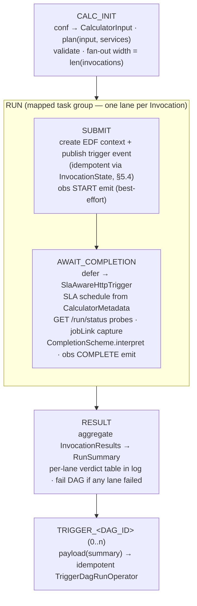

# Calculator DAG Framework — Final Implementation Plan (Phase 2)

**Status:** Final — implementation-ready (requester-accepted 2026-07-19). Incorporates decisions D1–D5 and the naming + DAG-chaining requirements; supersedes `framework-redesign-proposed-plan.md` (candidate) and folds in `phase2_discovery_and_options.md` (discovery evidence). Where anything here conflicts with `trigger_redesign_final_implementation_plan.md`, the Phase 1 plan wins. Implementation kickoff prompts: `implementation_kickoff_prompts.md`.

## TL;DR

* **One factory, one hook.** A calculator DAG is `calculator_dag(spec=CalculatorSpec(...), plan=<function>)`. The author writes a single pure function — `plan(input: CalculatorInput, services) -> CalculatorPlan` — containing only business logic (fan-out, per-unit parameters). Everything else — conf normalization, EDF submission, completion waiting, result aggregation, observability, XCom — is framework-owned.
* **Fixed, obs-invariant anatomy:** `CALC_INIT → RUN[i]: SUBMIT → AWAIT_COMPLETION → RESULT (→ TRIGGER_<dag>…)`. One topology regardless of observability; one trigger-rule scheme; every stage's record visible in the grid.
* **State is a record, not an object.** Each lane's facts live in one small frozen `InvocationState` in XCom. No mutable calculator objects cross parse/execute/defer boundaries — the rehydration hack class (`_rehydrate_calculator_state`, XCom-recovery in `DisplayCalcRunDetails`) is structurally impossible, not patched.
* **Completion vNext per Phase 1 §5.8:** `AWAIT_COMPLETION` defers to `SlaAwareHttpTrigger` — SLA-shaped schedule from `CalculatorMetadata`, per-wake `GET /run/status` progress probes, categorized failures (`NEVER_STARTED` / `STARTED_NO_TERMINAL` / `TERMINAL_IN_DLQ`). Interpretation lives in one framework-owned `CompletionScheme`, unconditionally executed — never in a calculator method, never gated on an obs flag.
* **DAG chaining, two channels with a boundary rule.** "Run B when A's calculator work completes" stays event-driven through the registry (Phase 1 CEL rules — that is what `CALC.*` routing already is). The framework adds a **direct relay** for payload-bearing continuations only: `spec.downstream=(DownstreamDag("dag_b", payload=fn), ...)` — the author shapes the conf from the run's results; the framework wires an idempotent `TriggerDagRunOperator` task per target, CI-validates the graph, and prints it in the PR.
* **Migration: per-DAG direct rewrite, no shim** (D2). Pilot on `usrg_ihc_dag`; family waves aligned with control-plane Phases C/E; the TaskGroup zoo (`mapped_calc_task_group_component`, `GenericCriteriaTaskGroup`, `BaseCalculator` lifecycle, `MvlHttpTrigger`) is deleted at Phase E close with a major version bump.

---

## 1. Decisions Locked (requester, 2026-07-19)

| # | Decision |
|---|---|
| D1 | Target = **Option A** (lean typed planner); Options B (minimal repair) and C (full ports-and-adapters) rejected |
| D2 | Migration = **direct per-DAG rewrite**, no `LegacyCalcInitAdapter` shim — clean fresh start |
| D3 | `CREATE_CONTEXT` + `PUBLISH_EDF_EVENT` **merge into one `SUBMIT` task** (both steps idempotent, both ids logged + in state) |
| D4 | Split-at-submit (Handoff 7) **deferred** — rationale in §13 (grid continuity is a hard constraint; §5.8 waits removed the economic argument; outbox keeps it adoptable later without rework) |
| D5 | Finding N1 (`post_process` gated on obs flag) — prod code differs; **not a live bug**, but it stands as evidence that completion interpretation was mis-anchored (issue 1) |
| + | Added requirements: **thoughtful naming** (§3.2) and a **framework DAG-chaining mechanism** (§7) |

---

## 2. Problem Being Solved (ranked; full grounding in `phase2_discovery_and_options.md`)

| # | Sev | Issue | Target |
|---|---|---|---|
| 1 | P0 | Completion interpretation mis-anchored: lives in calculator `post_process`, invoked conditionally by the sensor, duplicated ×3 across two event schemes | One `CompletionScheme` seam inside `AWAIT_COMPLETION`, always executed (§6) |
| 2 | High | Run state in shared mutable parse-time objects across build/execute/defer boundaries → rehydration and recovery hacks, string-wired XCom pulls | Frozen `InvocationState` per lane in XCom; stateless framework components (§5.5) |
| 3 | High | Untyped implicit authoring contract: `dict\|list[dict]` fan-out, `SKIP_TASK` magic, `CALC_RUN_PARAMS` envelope, calculator passed twice, param-soup factory, 4-branch wiring | `plan() -> CalculatorPlan` typed contract (§4) |
| 4 | High | Wait stack vLast: fixed 300s polls, blanket 3h/5h timeouts, uncategorized expiry, separate `DISPLAY` STARTED-poll task | `SlaAwareHttpTrigger` per Phase 1 §5.8/§5.8.1 (§6) |
| 5 | Med | Observability is structural: topology, trigger rules, and failure modes change with `obs_enabled` | Inline best-effort emission; `observability_status` visible, never load-bearing (§8) |
| 6 | Med | Dead/misleading surfaces: dormant evaluator can't parse the registry, placeholder stub shadows real preconditions | Deleted with Phase E; new anatomy depends on none of it (§11) |
| 7 | Low-Med | Naming/typing foot-guns: `_CALC` suffix stripping, skip-inside-naming, stringly datasets | Dissolved by the typed spec; no name-derived wiring (§3.2) |

---

## 3. Target Architecture

### 3.1 Package Layout

```
orchestration/
  framework/                  # NEW — the entire Phase 2 authoring + runtime surface
    __init__.py               # public API (the only import authors need)
    spec.py                   # CalculatorSpec, DownstreamDag, DataWait
    models.py                 # CalculatorInput, CalculatorPlan, Invocation,
                              # InvocationState, InvocationResult, RunSummary
    factory.py                # calculator_dag() — task-graph assembly (the ONLY builder)
    tasks.py                  # CALC_INIT / SUBMIT / RESULT / TRIGGER_* task callables
    completion.py             # CompletionScheme (MEG_TASK_EVENT | MERIVAL_CALC_EVENT) + interpret()
    sensors.py                # CalculatorCompletionSensor (execute / execute_complete)
    triggers.py               # SlaAwareHttpTrigger (async; §5.8.1 rules)
    services.py               # CalculatorServices bundle passed to plan()
    clients/                  # edf.py, ems.py (thin re-export of conditions/ clients), obs.py
    testing.py                # author-facing test kit (§9)
  conditions/                 # Phase 1 package — unchanged sibling (Handoff 5 placement:
                              # framework imports its EMS clients one-way; conditions/ never
                              # imports framework/)
  common/, sensor(s)/, observability/   # LEGACY — frozen at F0, deleted at Phase E close (§11)
```

### 3.2 Naming (added requirement)

Rules applied throughout: names come from the **calculator-orchestration domain**, not Airflow mechanics; one concept has one name; author-facing names contain no `Manager` / `Handler` / `Util`; task ids are stable `UPPER_SNAKE` and read as verbs/stages in the grid; nothing derives behavior from string suffixes (no `_CALC` stripping, no name-based wiring).

| Name | What it is | Why this name |
|---|---|---|
| `calculator_dag(spec, plan)` | The one factory | It builds a calculator DAG; says exactly that |
| `CalculatorSpec` | Everything declarative about the DAG | "Spec" = declaration, no behavior |
| `plan` (author hook) | `(CalculatorInput, CalculatorServices) -> CalculatorPlan` | The author *plans* what to run; the framework runs it |
| `CalculatorInput` | Normalized trigger payload (event / gated / chained / manual) | The input to planning, whatever triggered us |
| `CalculatorPlan` | The planning outcome: tuple of invocations | Plan = decided work, before execution |
| `Invocation` | One calculator submission (name + parameters) | Precise unit: one invocation of one calculator |
| `InvocationState` | Per-lane frozen record in XCom | State of one invocation, inspectable in the grid |
| `InvocationResult` / `RunSummary` | Terminal per-lane record / whole-run aggregate | Result when done; summary across lanes |
| `CalculatorServices` | Framework capabilities injected into `plan()` | Services rendered *to* the planner |
| `CompletionScheme` | Which event vocabulary signals completion | It's a scheme (MEG task-event vs MERIVAL calc-event), not a strategy zoo |
| `CalculatorCompletionSensor` | The deferrable wait operator | Sensor that awaits calculator completion — nothing else |
| `SlaAwareHttpTrigger` | Triggerer-side probe loop | Fixed by Phase 1 §5.8 |
| `DownstreamDag` | One direct-relay declaration in the spec | The Airflow-native term authors already use |
| `DataWait` | A class-D probe-only wait declaration | Says what it is: waiting on data, not an event |
| Task ids | `CALC_INIT`, `RUN.SUBMIT`, `RUN.AWAIT_COMPLETION`, `RESULT`, `TRIGGER_<DAG_ID>` | Grid reads as a sentence: init → submit → await → result → trigger |

`CALC_INIT` and `RESULT` deliberately keep today's names — prod support's muscle memory ("check CALC_INIT's XCom for fan-out") transfers unchanged. `calc_start` / `calc_end` are dropped: `calc_start`'s manual-run logging folds into `CALC_INIT`; `calc_end` was an empty ceremony task (two fewer TIs per run).

### 3.3 Runtime Anatomy



**Old → new task mapping** (grid-continuity ledger):

| Today | Target | Note |
|---|---|---|
| `OTHER_PRE_CONDITIONS` (self-skip) | — (deleted) | Class A → registry `trigger.when`; class B → `await` gates (Handoff 1) |
| dataset wait sensors | `DataWait` in spec, **only** for registered class-D exceptions | Default: none (§10) |
| `{NAME}_CALC_INIT` | `CALC_INIT` | Same role, typed contract |
| `CREATE_CONTEXT` + `PUBLISH_EDF_EVENT` | `RUN.SUBMIT` | D3: one logical step, both ids in log + state |
| `DISPLAY_*_CALCULATOR_DETAILS` | — (absorbed) | Lifecycle (SCHEDULED/STARTED/jobLink) observed by `AWAIT_COMPLETION` probes; §6.3 |
| `CHECK_*_CALCULATOR_STATUS` | `RUN.AWAIT_COMPLETION` | SLA-shaped, categorized |
| `{NAME}_RESULT` | `RESULT` | One trigger rule (`ALL_DONE` + explicit failure raise), obs-invariant |
| `OBS_POST_START` / `OBS_POST_COMPLETE` tasks | — (inline emissions) | §8 |
| `calc_start` / `calc_end` | — (deleted) | Folded / ceremony |

---

## 4. Authoring API (before / after)

### 4.1 Before — three layers, ~80 lines across two files

Today's `usrg_ihc_dag` ([usrg_ihc_dag.py](orchestration/common/dags/usrg_ihc_dag.py), [usrg_ihc_calculator.py](orchestration/common/dags/usrg_ihc_calculator.py)): a DAG file calling `get_usrg_calc_group()`, which builds criteria objects + a `CapitalUsrgIhcInit` god-callback (`__call__`/`get_calc_name`/`get_calculator`) and threads seven arguments through `mapped_calc_task_group_component`, passing the calculator twice.

### 4.2 After — one plan function + one spec

```python
# dags/logic/capital/usrg_ihc.py — business logic ONLY
from orchestration.framework import CalculatorInput, CalculatorPlan, CalculatorServices, Invocation
from dags.logic.capital import IHC_COMPONENTS, regional_capital_calc_name

def plan_usrg_ihc(input: CalculatorInput, services: CalculatorServices) -> CalculatorPlan:
    return CalculatorPlan(invocations=(
        Invocation(
            calculator=regional_capital_calc_name(input.h3_region),
            parameters={
                **input.run_params,
                "enabledComponents": IHC_COMPONENTS,
                "DerivedAttributesAdvancedApproachOff": "true",
                "cumulus": "false",
                "company-code-1": "B615",
            },
        ),
    ))
```

```python
# dags/b3f/usrg_ihc_dag.py — declaration ONLY
from orchestration.framework import CalculatorSpec, CompletionScheme, calculator_dag
from dags.logic.capital.usrg_ihc import plan_usrg_ihc

dag = calculator_dag(
    spec=CalculatorSpec(
        dag_id="usrg_ihc_dag",
        calculator="CAPITALCALC",              # catalogue key → SLA, MEG taskId, ownership
        completion=CompletionScheme.MEG_TASK_EVENT,
        tags=["CAPITAL"],
        max_invocations=4,
    ),
    plan=plan_usrg_ihc,
)
```

The old `FrequencyCriteria("M")` / `RunTypeCriteria` / `EventDateCriteria(5, 31)` preconditions become registry v2 `trigger.when` clauses (the Phase 1 registry example already carries `dayOfMonth(event.businessDate) >= 5` for this DAG). The `INTERIMCOLLATERAL` / `PARENTRATING` dataset checks are classified per-DAG during migration: class B → `await` gate, or (exceptionally) class D → `DataWait` (§10).

### 4.3 Contract details

* `plan()` is **pure business logic**: no Airflow context, no XCom, no HTTP except through `services`. Fan-out = `len(plan.invocations)` — explicit, validated (`1 ≤ n ≤ spec.max_invocations`), never inferred from a return type.
* An **empty plan is an error**, not a skip. A triggered DAG always runs (Handoff 1); "nothing to do" conditions belong in the registry. `CALC_INIT` fails with the planner's own message — visible in the grid, not silently skipped.
* `Invocation.parameters` must be JSON-serializable (validated at `CALC_INIT`); the framework adds transport fields (context ids, tracking) itself — authors never touch `PREVIOUS_CONTEXT_ID`/`CALC_TRIGGER_CONTEXT_ID`-style envelope keys.
* Manual runs: `input.is_manual=True`, `input.run_params` = the operator-supplied params; same conf-priority order as today (dag_run conf → params). The manual-rerun log line (`CalcManualRunParams…`) is emitted by `CALC_INIT`.

### 4.4 Where each old `__call__` input went (author-data access contract)

The old callback signature `__call__(context, config, calc_run_params, xcom_data, **kwargs)` gave authors four loose objects; `plan()` exposes the same information, typed, minus the plumbing that is now framework-owned:

| Old material | New home | What changed |
|---|---|---|
| `calc_run_params` | `input.run_params` (open `Mapping` — massage freely) + typed conveniences (`h3_region`, `frequency`, `reporting_date`, `run_type`, `is_manual`) | Envelope unwrap (`CALC_RUN_PARAMS`), manual-vs-event conf priority, and region/frequency normalization happen before `plan()` is called |
| Raw event/context (via `traverse_dict`) | `input.event` / `input.context` — full `EnrichedEvent` halves | Still available for anything untyped |
| `config` (Airflow Variables) | `services.config` (env/tenant/connections) + `services.catalogue` (calculator metadata) | Env-specific calc naming becomes plain code taking `services.config.env` |
| `xcom_data` (pull) | **Gone — nothing to pull**: nothing author-relevant runs before `CALC_INIT` in the new anatomy | Whatever triggered the DAG is fully in `input` |
| `push_xcom(...)` (feed downstream) | **Gone — the return value is the payload**: each `Invocation.parameters` is exactly what `SUBMIT` uses for that lane | Kills author-managed XCom (issue 2); `CALC_INIT` still XComs the validated plan, so fan-out + per-lane params stay grid-inspectable |
| `context` (Airflow) | `input.dag_id` / `input.dag_run_id` (dag-info injection automatic) | Raw context not a `plan()` argument; rare migration cases via a `services`-level escape hatch, greppable in CI |
| `return dict \| list[dict]` | `CalculatorPlan(invocations=(...))` — always a tuple | Fan-out explicit + validated, never type-sniffed |
| `SKIP_TASK` / skip-by-return | Removed — empty plan = error (Handoff 1); conditional execution lives in registry `trigger.when` | |
| `get_calc_name()` / `get_calculator()` | `Invocation.calculator`, per lane | Derived-name logic becomes ordinary planner code; lanes may target different calculators |

Full-power fan-out example (per-unit business rules — the old god-callback's hardest case):

```python
def plan_capital(input: CalculatorInput, services: CalculatorServices) -> CalculatorPlan:
    groups = capital_company_groups(region=input.h3_region, run_type=input.run_type)  # DAG-repo helper
    invocations = []
    for group in groups:
        params = {**input.run_params,
                  "enabledComponents": group.enabled_components,
                  "company-codes": list(group.company_codes)}
        if group.is_wealth_management:                      # per-unit special case — plain Python
            params["DerivedAttributesAdvancedApproachOff"] = "true"
        invocations.append(Invocation(
            calculator=capital_calc_name(input.h3_region, group, services.config.env),
            parameters=params,
        ))
    return CalculatorPlan(invocations=tuple(invocations))
```

Same expressive freedom as the old `__call__` — arbitrary Python over the input event, any per-unit payload shape — as a pure function testable from a JSON fixture with zero Airflow.

### 4.5 `CalculatorServices` (deliberately small)

```python
@dataclass(frozen=True)
class CalculatorServices:
    catalogue: CalculatorCatalogue    # CalculatorMetadata lookup (SLA, taskId, ownership)
    events: EmsReadClient             # GET /event — gate-evidence + reference queries (Handoff 3/4)
    config: FrameworkConfig           # env, tenant, connection names
```

Domain helpers (company groups, run numbers, IHC components) are ordinary DAG-repo modules the plan function imports directly — they are not framework services. This is the anti-ports decision (D1): a seam exists only where the framework owns an integration (EDF, EMS, obs, catalogue).

---

## 5. Domain Models & State Flow

### 5.1 `CalculatorInput`

```python
@dataclass(frozen=True)
class CalculatorInput:
    source: InputSource               # EVENT | GATED | CHAINED | MANUAL
    run_params: Mapping[str, Any]     # normalized calculator params from conf
    event: Mapping[str, Any] | None   # EnrichedEvent.event (EVENT source)
    context: Mapping[str, Any] | None # EnrichedEvent.context (EVENT source)
    group_key: str | None             # GATED: e.g. reporting_date
    chained_from: ChainProvenance | None  # CHAINED: upstream dag_id + dag_run_id (§7.4)
    reporting_date: str | None
    frequency: str | None
    h3_region: str | None
    run_type: str | None
    is_manual: bool
    dag_id: str
    dag_run_id: str
```

Normalization handles all four conf shapes behind one type: non-gated `EnrichedEvent + contractVersion`, gated canonical conf `{portfolio_id, reporting_date}` (Handoff 3 — and `services.events` supplies contribution evidence for portfolio `CALC_INIT`s), chained envelopes (§7.4), and manual params.

### 5.2 `CalculatorPlan` / `Invocation`

```python
@dataclass(frozen=True)
class Invocation:
    calculator: str                       # catalogue key (may differ per lane, e.g. region-derived)
    parameters: Mapping[str, Any]
    calc_type: str = "CALCULATOR"

@dataclass(frozen=True)
class CalculatorPlan:
    invocations: tuple[Invocation, ...]
```

### 5.3 `InvocationState` (the per-lane XCom record — 11 fields, D3-trimmed)

```python
@dataclass(frozen=True)
class InvocationState:
    invocation_id: str          # orch_sha1(f"{dag_run_id}:{index}:{params_hash}")[:16]
    index: int
    calculator: str
    params_hash: str
    trigger_context_id: str | None
    trigger_event_id: str | None
    submitted_at: str | None    # ISO; SlaAwareHttpTrigger schedule anchor
    job_link: str | None
    status: str                 # PLANNED | SUBMITTED | SUCCESS | FAILED | NEVER_STARTED
                                # | STARTED_NO_TERMINAL | TERMINAL_IN_DLQ
    completion_event_id: str | None
    observability_status: str   # OK | DEGRADED | DISABLED
```

### 5.4 SUBMIT idempotency — framework-side, not assumed server-side

EDF is a third-party bus; we do **not** assume its context/event APIs deduplicate. Retry safety is implemented with the lane's own state record:

1. `SUBMIT` first reads its **own** prior XCom (`InvocationState` for this `invocation_id`, present iff a previous try got far enough to write it).
2. If `trigger_context_id` exists → reuse it (skip context creation). If `trigger_event_id` exists → the submit already happened; log and return the existing state.
3. Otherwise create context → **write state** → publish event → **write state**. The write between the two external calls is what makes a crash between them recoverable without double-submission.

The same `invocation_id` scheme keys downstream queries and obs correlation. (Open question OQ-1 tracks whether EDF offers native idempotency we can additionally lean on.)

### 5.5 State-flow invariant

`InvocationState` in XCom is the **only** carrier of lane facts across task and defer boundaries. Framework task callables and the sensor are stateless; the calculator-object lifecycle (`pre_process` / `process` / `post_process`) is gone, and with it `_rehydrate_calculator_state` and the `DisplayCalcRunDetails` context-id recovery — there is no object state to lose. Wiring uses Airflow-native XCom refs from the factory (no hand-built `"{group_id}.CREATE_CONTEXT"` strings anywhere).

---

## 6. Completion Stack (class C — Handoff 2, Phase 1 §5.8/§5.8.1)

### 6.1 `CalculatorCompletionSensor.execute()`

```python
def execute(self, context):
    state = read_lane_state(context)                    # InvocationState from SUBMIT
    sla = self.catalogue.get_metadata(state.calculator).sla   # DURATION or CLOCK kind
    self.defer(
        timeout=backstop(sla),                          # SLA deadline + margin — backstop ONLY
        trigger=SlaAwareHttpTrigger(
            run_status_query=self.scheme.run_status_query(state),   # GET /run/status criteria
            submitted_at=state.submitted_at,
            sla=sla.serialize(),
            never_started_after=sla.never_started_timeout,
        ),
        method_name="execute_complete",
    )
```

### 6.2 `SlaAwareHttpTrigger.run()` (async generator; §5.8.1 rules restated as requirements)

1. **Schedule recomputed, never stored**: serialize only `(run_status_query, submitted_at, sla, never_started_after)`; on triggerer restart, rebuild the §5.8 schedule and fast-forward past elapsed check times.
2. **Async-only**: probes via the async HTTP hook; `asyncio.sleep` between checks; no blocking calls on the shared event loop.
3. Per-wake classification against `GET /run/status`: nothing `SCHEDULED` by the liveness probe → warn, then `NEVER_STARTED` at its timeout; terminal `successful=false` → **fail fast at that probe**; terminal `successful=true` → success `TriggerEvent`; deadline passed with `STARTED` seen → `STARTED_NO_TERMINAL` / `TERMINAL_IN_DLQ` (DLQ-match hint from the endpoint).
4. First probe that observes `STARTED` logs the lifecycle line **including `jobLink`** (SCHEDULED-fallback per today's backfill logic — now one place). Mid-run, the job link is findable in the task's triggerer log; terminally it lands in `InvocationState.job_link`.

### 6.3 `execute_complete()`

Maps the categorized `TriggerEvent` through `CompletionScheme.interpret()` → final `InvocationState` (+ XCom write), emits obs COMPLETE (best-effort, §8), then raises a **categorized** `AirflowException` on any failure class. Interpretation is unconditional — D5's lesson made structural: there is no path where a terminal event bypasses interpretation.

`CompletionScheme` has exactly two members (the two real vocabularies): `MEG_TASK_EVENT` (`taskEventType=COMPLETED`, `successful=true|false`) and `MERIVAL_CALC_EVENT` (`type=CALC_EVENT`, `STATE=FINISH|FAILED`). The legacy `STATE` scheme retires with Phase E (Phase 1 OQ-5 tracks remaining users).

### 6.4 RESULT

`trigger_rule=ALL_DONE`; renders the per-lane verdict table (Phase 1 §5.5 style) into the task log and XComs the `RunSummary`; **then** raises if any lane failed. The summary always exists — a half-failed fan-out is diagnosable from one log.

```
run_id=ab12ef34  calculator=CAPITALCALC  invocations=3
lane  invocation_id  calculator      status               elapsed    job_link
0     9f21ab34…      CAPITALCALC     SUCCESS              1h42m      dbc://…/run/118
1     77aa01bc…      CAPITALCALC     SUCCESS              1h38m      dbc://…/run/119
2     c3d401ee…      CAPITALCALCSML  STARTED_NO_TERMINAL  3h00m(SLA) dbc://…/run/120
```

### 6.5 Coexistence

`MvlHttpTrigger` + `HttpDeferrableSensor` remain untouched for unmigrated DAGs; each DAG adopts the new stack by migrating to `calculator_dag` (no flag day, per-DAG cadence — Handoff 2).

---

## 7. DAG Chaining (added requirement)

### 7.1 The boundary rule (design invariant)

Two channels exist; each has one job:

| Channel | Use when | Defined in |
|---|---|---|
| **Event-driven (default)** — Phase 1 control plane | Downstream should run because upstream's *calculator work completed* (today's `CALC.*` routing: portfolio, gemini, consenrichment, floors chains) | Registry v2 `trigger.when` / `trigger.await` — the single source of truth for event routing |
| **Direct relay (this section)** | Downstream needs a *payload computed in-run* that no event carries, or the target isn't event-addressable | `CalculatorSpec.downstream` in the upstream DAG |

Guard: if a relay's payload function only forwards event-derivable fields, review should push the chain to the registry — a relay that duplicates a registry rule re-creates the out-of-band routing Phase 1 just deleted. CI prints every declared relay in the PR diff so this is reviewable (§7.5).

### 7.2 Authoring

```python
# DAG A triggers DAG B and DAG C with shaped payloads
spec = CalculatorSpec(
    dag_id="consenrichment_daily_dag",
    calculator="CONSENRICHMENTCALC",
    completion=CompletionScheme.MERIVAL_CALC_EVENT,
    downstream=(
        DownstreamDag("lrd_sft_daily_dag", payload=lrd_payload),
        DownstreamDag("sectoral_floor_check_dag", payload=floor_payload),
    ),
)

def lrd_payload(summary: RunSummary) -> dict | None:
    """Shape the conf for the downstream DAG from this run's results.
    Return None to not trigger (relay task shows SKIPPED in the grid, reason logged)."""
    return {
        "reporting-date": summary.input.reporting_date,
        "sourceContextIds": [r.trigger_context_id for r in summary.results],
    }
```

The author touches exactly one thing: the payload function, with the run's aggregate (`RunSummary` = `CalculatorInput` + all `InvocationResult`s — the "current DAG's XCom object", typed). The framework does all wiring.

### 7.3 Mechanics — `TRIGGER_<DAG_ID>` tasks

* The factory appends one task per `DownstreamDag` after `RESULT` (default `trigger_rule=ALL_SUCCESS` — relays fire only from a successful run; a failed run is repaired and re-run, and dedup absorbs the repeat).
* Implementation: a thin subclass of **`TriggerDagRunOperator`** (as requested — it's the existing primitive, and the grid renders a click-through link to the triggered run):
  * `trigger_run_id = orch_sha1(target_dag_id + canonical_json(conf))[:16]` — the formal Phase 1 invariant, byte-stable canonical JSON.
  * Run-already-exists = success (logged as `409-equivalent: duplicate (ok)`), never an error — retries and repaired re-runs are safe end-to-end.
  * `payload() -> None` → `AirflowSkipException` with the logged reason (a *visible*, single-TI skip on the relay task — not the deleted self-skip-the-whole-run pattern).
* The relay task log ends with a verdict-style line: `TRIGGER lrd_sft_daily_dag run_id=9c31… conf_keys=[reporting-date, sourceContextIds] → 200 created`.

### 7.4 Chained conf contract

```json
{
  "contractVersion": "2",
  "chainedFrom": {"dag_id": "consenrichment_daily_dag", "dag_run_id": "ab12ef34…"},
  "payload": { "reporting-date": "2026-07-17", "sourceContextIds": ["…"] }
}
```

* `chainedFrom` inside the hashed conf gives the exact dedup semantics wanted: distinct upstream runs produce distinct downstream runs; a retried relay of the *same* upstream run dedups to one.
* Provenance is grid-debuggable: "why did B run?" — open B's run conf, `chainedFrom` names the upstream run.
* The downstream DAG is a normal `calculator_dag`; its `CALC_INIT` normalizes this shape to `CalculatorInput(source=CHAINED, run_params=payload, chained_from=…)`. Nothing chain-specific leaks into its plan function.

### 7.5 Where is the wiring defined? (the requester's direct question)

**In the upstream `CalculatorSpec` — code, next to the payload function — not in the registry.** Considered options:

| Option | Verdict |
|---|---|
| (a) `spec.downstream` in the upstream DAG (chosen) | Declaration and payload shaper are one reviewable unit in one file; the graph is statically extractable from specs; no runtime config lookup |
| (b) A `chains:` section in registry v2 YAML | Splits one feature across two artifacts (YAML declaration + Python payload) — re-creating the two-place authoring problem (Scala table + JSON map) Phase 1 killed; also touches the frozen registry schema |
| (c) Both (spec + registry mirror) | Two sources of truth for one edge; drift guaranteed |

Single-pane visibility is preserved without a second source of truth: **CI renders the effective chain graph** (`DAG A → B, C`, from specs via DagBag) into the PR diff, validates every target `dag_id` exists, rejects cycles, and fails on payload functions that aren't importable. The registry remains the one place for *event-driven* routing; the spec is the one place for *direct relays*; both are Git, both tenant-scoped, both CI-checked.

---

## 8. Observability Integration

* **START**: emitted from `SUBMIT` after event publish (has context/event ids + `invocation_id`; no job link yet — job link reaches obs in COMPLETE). **COMPLETE**: emitted from `execute_complete` with terminal status + job link, **including FAILED lanes**.
* Emissions are best-effort with an explicit trace: failure sets `observability_status=DEGRADED` on the lane state (grid-visible) and increments `obs_emit_failures_total` (warn) — it never fails, reroutes, or reshapes the business run. The topology is identical with obs on, off, or broken (kills issue 5).
* Division of labor with the control plane: `routing_decision` answers "why was this DAG (not) triggered"; framework obs answers "what happened inside the run". No overlap: the framework posts nothing to `/decisions` for its own tasks; relay triggers are in task logs + downstream conf provenance (§7.4).

## 9. Testing Framework (scope 7)

`orchestration.framework.testing` ships with the framework and runs in the DAG-repo CI:

```python
def test_usrg_plan_shapes_single_invocation():
    input = testing.input_from_fixture("fixtures/merival_usrg_day7.json")   # same fixtures as registry CI
    plan = plan_usrg_ihc(input, testing.fake_services())
    assert [i.calculator for i in plan.invocations] == ["CAPITALCALC"]
    assert plan.invocations[0].parameters["company-code-1"] == "B615"
```

| Layer | What it proves |
|---|---|
| Plan unit tests (pure function + fake services) | Business logic — fan-out width, per-unit params — with zero Airflow |
| Spec contract tests (auto-generated per DAG) | Catalogue key exists; completion scheme valid; `downstream` targets exist; `DataWait`s appear in the class-D exception list; params serializable |
| DagBag test | Every DAG file parses; chain graph acyclic |
| Trigger schedule tests (framework-owned) | Given SLA fixture → expected probe schedule (§5.8 shape) |
| Registry fixtures (Phase 1 CI) | `trigger.when` behavior — shared fixture files with plan tests keep rule and plan views of one event consistent |

## 10. Class-D Waits (Handoff 1 exception path)

`spec.data_waits=(DataWait("PARENTRATING"),)` builds one deferrable probe task per entry **before** `CALC_INIT`. Every entry must appear in the tenant's registered exception list (`registry/<tenant>/class_d_exceptions.yaml` — an additive file beside the frozen registry schema, default empty); CI fails any `DataWait` not on the list, keeping the path explicit and reviewed. Expectation per the migration classification: most of today's dataset checks are class B (event-addressable → gates) and this list stays near-empty.

## 11. Framework ↔ DAG-Repo Seam (scope 6) & Deletions

* **Additive release line**: `orchestration.framework` ships in the current 5.x line; legacy modules untouched while any DAG uses them. DAG repo pins the **exact** framework version (today's 5.2.4-vs-5.3.0 drift class becomes a CI error, not a surprise).
* The framework publishes its contract/test kit as a pytest plugin so the DAG-repo CI runs spec-contract + DagBag + chain-graph checks on every PR.
* Adoption is measurable: the factory stamps `framework:v2` into `dag.tags` — count in the UI/DB, target = 85.
* Deprecation: once wave 2 (§12) completes, legacy imports emit `DeprecationWarning`; at Phase E close, delete `mapped_calc_task_group_component`, `create_dynamic_calc_task_group`, `CalculatorTaskGroup`, `GenericCriteriaTaskGroup`, `create_pre_condition_tasks` (both), `BaseCalculator` lifecycle classes, `CalculatorTaskManager`, `HttpDeferrableSensor`/`MvlHttpTrigger`, `create_control_tasks`, `DagTriggerWithConditionTaskGroup`, the dormant evaluator path, `dag_trigger_criteria_map.json` — with a major bump to 6.0.0. Handoff 6 holds: nothing in §3–§10 references any of these.

## 12. Migration Plan (per-DAG strangler, no flag day, no shim — D2)

| Step | Scope | Depends on | Proves it worked | Rollback |
|---|---|---|---|---|
| **F0. Framework lands** | `orchestration/framework/` complete (factory, models, wait stack, chaining, testing kit); no DAG migrated | Control-plane Phase A in prod (`GET /run/status`); `CalculatorMetadata` SLA fields verified (OQ-2) | Unit + contract + schedule suites green; testing kit runs in DAG-repo CI | None needed (additive) |
| **F1. Pilot: `usrg_ihc_dag`** | Full rewrite (plan + spec); classification table committed with the PR (criteria → registry clauses, datasets → B/D) | F0; its registry rule live (Phase C for this DAG) | ≥1 month-end of green runs; support sign-off: diagnosed a seeded failure from grid/XCom/logs only; `af_completion_timeout_total` categorized as designed | Revert the DAG-file PR (single file pair) |
| **F2. Family waves** | B3F regional (~11) → IHC/floors/validations/market-risk → remaining singles; each PR = one DAG, same shape as F1 | F1 lessons folded into templates | Per wave: zero `af_calc_runs_skipped_total` for migrated DAGs; verdict tables in RESULT logs; no obs-topology diffs | Per-DAG PR revert |
| **F3. Gated/portfolio DAGs** | Portfolio planners consume `GATED` input + evidence via `services.events`; relays declared where portfolio chains carry payloads | Control-plane Phase D (gates live) | Portfolio runs 10→1 per reporting date with new anatomy; evidence visible in CALC_INIT log | Per-DAG revert; gate rollback is control-plane's (independent) |
| **F4. Deletion** | §11 deletion list; framework 6.0.0 | All 85 on `framework:v2`; control-plane Phase E close | Grep-zero legacy imports; DagBag green; metrics steady 2 weeks | Tag before delete; restore = revert |

Cadence rule (Handoff 2/6): a DAG migrates **once**, taking new anatomy + new wait stack + its trigger-condition classification in the same PR — one review, one rollback unit, one line in the program tracker.

## 13. Split-at-Submit (Handoff 7) — **Deferred** (D4)

Deferred with rationale: (1) grid continuity of a single run is the debuggability hard constraint, and splitting severs it across two DAG runs correlated only by conf; (2) §5.8 removed the economics — waits cost ~10–25 informative async probes on the triggerer, no worker slot held; (3) reversibility is cheap — the outbox already supports continuation triggering, so adopting it later is one registry rule + one continuation DAG, zero framework rework. Revisit triggers: triggerer saturation, or a real seconds-level completion-latency requirement.

## 14. Risk Register

| # | Risk | Mitigation |
|---|---|---|
| 1 | EDF create/publish not idempotent server-side → duplicate submissions on retry | Framework-side dedup via state-record protocol (§5.4); OQ-1 verifies EDF semantics; duplicate-context alert |
| 2 | `CalculatorMetadata` SLA data missing/wrong → noisy or blind probe schedules | F0 gate: SLA audit of all 85 entries (OQ-2); conservative defaults + `sla_defaulted` warn metric |
| 3 | Direct relays misused as routing → out-of-band trigger logic returns | Boundary rule §7.1; CI-rendered chain graph in PRs; review checklist item |
| 4 | Async probe stack maturity in the shared triggerer | §5.8.1 conformance tests in F0; `defer(timeout)` backstop; per-DAG adoption isolates blast radius |
| 5 | Migration fatigue across ~85 DAGs | Mechanical plan-extraction recipe from F1; waves with per-wave success metrics; adoption tag makes stalls visible |
| 6 | Mapped-lane XCom growth (large params) | State record excludes `parameters` (hash only); params travel once as the mapped input |
| 7 | Pilot regression vs old anatomy (silent behavior drift) | F1 runs with full obs + a shadow checklist comparing per-lane events in the event store to pre-migration runs |

## 15. Open Questions (tagged to the step they block)

| # | Question | Blocks |
|---|---|---|
| OQ-1 | Do EDF context/event APIs offer any native idempotency (key/echo semantics)? | F0 (§5.4 stays framework-side regardless; native support would simplify) |
| OQ-2 | Prod `CalculatorMetadata`: exact SLA fields (duration & clock kinds), coverage across all 85 calculators (file absent from this workspace) | F0 |
| OQ-3 | Obs sink contract (endpoint, payload, auth) — reconstruct from prod `orchestration/observability/` | F0 |
| OQ-4 | Which relays exist implicitly today (any hand-rolled `TriggerDagRunOperator`/`trigger_dag` in DAG-repo logic)? Inventory → registry-vs-relay classification | F1/F2 |
| OQ-5 | Legacy `STATE` completion scheme users (Phase 1 OQ-5) | F4 / Phase E |
| OQ-6 | Does support need mid-run `jobLink` in XCom, or is the triggerer-log line (§6.2.4) sufficient? | F1 pilot verifies |

## 16. Handoff Compliance Check (contract items 1–8)

| # | Handoff item | Where satisfied |
|---|---|---|
| 1 | Fully-matched triggers; delete self-skip; class-D explicit exception list, default empty | Anatomy has no precondition surface (§3.3); empty plan = error, not skip (§4.3); `DataWait` + registered list (§10) |
| 2 | Class-C waits: `SlaAwareHttpTrigger`, SLA from `CalculatorMetadata`, categorized failures, §5.8.1 serialization rules, coexistence with `MvlHttpTrigger`, no `/event/wait` | §6 entire; coexistence §6.5; no long-poll anywhere |
| 3 | `dag_run_id = orch_sha1(dag_id + conf)[:16]`, canonical JSON, 409=success; gated conf = pure `(dag_id, group_key)`; evidence via `GET /event` | Relay run-ids §7.3; chained-conf dedup §7.4; `GATED` input + `services.events` evidence §5.1 |
| 4 | Outbound clients only: `/run/status`, `/decisions` (control-plane), `/event`, registry reader; SLAs from metadata not registry | `/run/status` §6.2; `/event` §5.1; catalogue-sourced SLAs §6.1; framework posts nothing inbound, no webhook (§8) |
| 5 | `orchestration/conditions/` placement | Sibling package; framework imports its EMS clients one-way (§3.1) |
| 6 | No dependency on scheduled deletions | §11 deletion list vs §3–§10 cross-check: zero references |
| 7 | Split-at-submit: decide or defer with rationale | Deferred, rationale §13 (D4) |
| 8 | Multi-tenancy | Spec/catalogue/registry/exception-list all tenant-scoped; no singletons, no tenant assumptions in models (§3–§10) |
