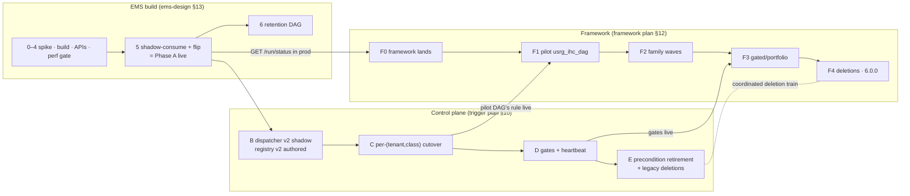

# Orchestration Modernization — Full Implementation Kickoff (EMS · Control Plane · DAG Framework)

> **Usage:** Start a new session in this workspace and say:
> *"Read `phase2_dag_framework_planning_prompt.md` in full and begin implementation as it instructs."*
> Everything a session needs — mission, authoritative documents & precedence, program map, sequencing, binding decisions, open items, working agreement — is below.
>
> **History:** this file originally kicked off Phase 2 *planning*. All planning is now closed: `framework_redesign_final_implementation_plan.md` was requester-accepted 2026-07-19, and `ems-design.md` was revised the same day to fold the EMS rewrite into the program as the Phase A implementation design. This document is now the **implementation kickoff for the whole program** (it also fills the role of the `implementation_kickoff_prompts.md` file the framework plan references, which was never created separately).

---

## Mission

Implement the modernization of the orchestration platform across its three planned workstreams:

| Workstream | Plan (authoritative, build-ready) | Delivers |
|---|---|---|
| **EMS rewrite** (event microservice, Java 17 / Spring Boot) | `ems-design.md` | Trigger-plan **Phase A**: re-platform + performance schema (10+ min queries → low ms) + subscription routing, transactional outbox, `routing_decision`, poison-only DLQ + audited replay, `GET /run/status` / `GET /gate/groups` |
| **Control plane** (trigger semantics) | `trigger_redesign_final_implementation_plan.md` | Phases **B–E**: registry v2 + CEL dispatcher in shadow, per-(tenant, event-class) cutover, stateless gates + heartbeat, precondition retirement + legacy deletions |
| **Calculator DAG framework** | `framework_redesign_final_implementation_plan.md` | Steps **F0–F4**: `calculator_dag(spec, plan)` factory, `SlaAwareHttpTrigger` wait stack, DAG chaining, per-DAG migration of ~85 DAGs, framework 6.0.0 deletions |

All design decisions are made — **do not re-open them** (§ Binding Decisions). The remaining work is exactly what the three plans specify: verification spikes → build → gated rollout with recorded evidence at every promotion gate.

---

## Authoritative Documents & Precedence

Reading order for a fresh session:

| # | Document | Role |
|---|---|---|
| 1 | `trigger_redesign_final_implementation_plan.md` | Program backbone: target architecture, registry v2 + CEL, gates, slim audit, §5.8 completion model, migration Phases A–E, risk register |
| 2 | `ems-design.md` | **Phase A implementation design** — build-ready: Flyway DDL (§5–§6), normative pipeline semantics (§4), API contracts (§4.3/§4.5), cutover runbook (§11), acceptance gates (§12), work breakdown (§13), open items (§14) |
| 3 | `framework_redesign_final_implementation_plan.md` | Phase 2 final: framework architecture, authoring API, completion stack, chaining, F0–F4 migration, handoff compliance map (§16) |
| 4 | `system_discovery.md` | Current-state context, scale numbers, boundary facts |

**Precedence rules:**

1. The trigger plan governs wherever the other documents are silent.
2. The framework plan defers to the trigger plan (its own Status clause).
3. `ems-design.md` **wins over the trigger plan on its five recorded amendments** (§0 of that doc, agreed 2026-07-19): **A1** poison-only DLQ — transient infra parks the partition, Airflow is off the ingest path via the outbox · **A2** cutover = shadow-consume then big-bang route flip with version-controlled rollback · **A3** event store gets typed generated columns + indexes (not "as-is") · **A4** L0 is two-stage, mirroring the legacy PRE/POST split: an event-only persist gate pre-enrichment (zero-match = drop-without-persist, intended firehose behavior) + per-tenant forward conditions (context allowed) post-enrichment · **A5** `contractVersion` enters the conf at Phase B, not Phase A (protects `dag_run_id` dedup across the cutover overlap).
4. Planning-era artifacts are **superseded — never consult them for decisions**: `framework-redesign-proposed-plan.md`, `phase2_discovery_and_options.md`, `system_discovery_dag_framework.md`, `trigger_semantics_redesign_plan.md` (their surviving content is folded into the final plans; the files may be absent from this workspace).

**Doc-sync task (first implementation session):** annotate the trigger plan's five touch points with pointers to A1–A5, as listed in `ems-design.md`'s closing note (§4.2 error classification; §10 Phase A row; §2.1/§4.1 "as-is" store wording; §4.3 activation shape; §8 invariant-3 timing).

---

## Program Map — how the three plans interlock

**Cross-workstream dependencies (the coordination points — overlaps deduplicated):**

| Dependency | Needed by | Provided by |
|---|---|---|
| `GET /run/status` in prod (incl. `dlq_hint` for `TERMINAL_IN_DLQ`) | Framework **F0 exit** (hard blocker) | EMS build phase 3, live at Phase A cutover |
| `PUT /admin/subscriptions` · `POST /decisions` · `routing_decision` store | Phase B (registry CI rendering, shadow verdict recording) | EMS — delivered at Phase A, seeded `registry_version='seed-0'` |
| `GET /gate/groups` + fast indexed contribution queries | Phase D heartbeat + stateless gate recompute | EMS — delivered at Phase A (A3 schema is the enabler) |
| Registry v2 authored + pinned celpy engine + conformance suite | Phase B onward; F1 classification tables | Control-plane workstream |
| Shared CEL conformance fixtures green on **both** pinned engines (cel-java + celpy) | EMS build phase 1 **and** Phase B gate | Joint CI asset — ownership is ems §14 item 9 |
| `CalculatorMetadata` SLA audit across all ~85 calculators | F0 exit (framework OQ-2) | Framework workstream spike |
| Pilot DAG's `trigger.when` rule live (Phase C for that DAG) | F1 | Control plane |
| Gates live per portfolio (Phase D) | F3 (`GATED` input + evidence via `services.events`) | Control plane |
| `contractVersion` in non-gated conf | v2 dispatcher + framework `CalculatorInput` normalization | Added **at Phase B** (A5) — Phase A conf stays byte-identical to today |
| Phase E deletion list ∥ framework 6.0.0 major bump | E and F4 close together | Coordinated PR train (grep-zero legacy imports before either lands) |

**Critical path:** EMS verification spike (ems §14) → EMS build + shadow + flip (**Phase A**) → Phase B shadow ∥ F0 → Phase C ∥ F1/F2 → Phase D → F3 → Phase E ∥ F4.

**Gate discipline:** a step is done when its gate evidence is recorded, not when its code merges. The hard gates: ems §12 acceptance checklist (incl. kill-Airflow, poison, and rollback drills) for Phase A; `parity_mismatch_total == 0` over a window **spanning month-end** for Phase C; ≥ 1 month-end of green pilot runs + support sign-off for F1; portfolio runs 10 → 1 per reporting date for Phase D/F3; metrics steady 2 weeks after every deletion wave.

---

## Binding Decisions (closed — do not re-open)

1. **Trigger plan, in full:** Airflow-resident condition engine; thin rule-free EMS; CEL registry v2 (clause list = implicit AND); stateless gates with canonical `(dag_id, group_key)` conf; exactly-once via `dag_run_id` dedup (409 = success); slim `routing_decision`; §5.8/§5.8.1 SLA-shaped completion — **no `/event/wait` long-poll**; strangler migration A–E.
2. **Framework plan:** D1–D5 (Option A lean typed planner; direct per-DAG rewrite, no shim; `CREATE_CONTEXT`+`PUBLISH_EDF_EVENT` merged into `SUBMIT`; split-at-submit deferred with §13 rationale; N1 lesson made structural); the §3.2 naming rules; the §7 chaining boundary rule (registry = event-driven routing; `spec.downstream` relays = payload-bearing continuations only); frozen `InvocationState` in XCom as the only lane-state carrier.
3. **EMS design:** amendments A1–A5 plus the confirmed intents — subscription table replaces `event_filter` entirely (no flat-criteria dialect); PRE-drop is the persist-gate zero-match outcome, unpersisted by design; normalization at the edges with the raw payload byte-verbatim; caching = context + compiled subscriptions only (no query caching, no Redis); big-bang flip with rollback = release-version redeploy + route flip + Kafka gap replay.
4. **Handoff Contract items 1–8** (Phase 1 → 2) remain binding on all framework work; the compliance mapping lives in framework plan §16. Note item 3's conf contract now carries the A5 timing.

---

## Open Questions & Verification Spikes (resolve before the step each blocks)

Consolidated across the three plans; trigger-plan OQ 6 (EMS PG HA/DR) is already resolved by ems-design (zone-redundant Flexible Server + Entra Workload Identity).

| Item | Source | Blocks |
|---|---|---|
| Residual JSON-path confirmations — Merival family sample-verified (`contextId`, `additionalData.STATE/TYPE/DATASET_UUID`, `parentIds` array); remaining: MEG calc family + `parentIds` cardinality | ems §14.1 | EMS V1 DDL |
| `LBD` = logical business date (compact `yyyyMMdd`) — confirmed; remaining: which column the DATASET CHECK binds per family; full sensor param-alias inventory | ems §14.1a/1b | EMS query contract tests |
| EDF Context REST API contract (endpoint, auth, errors, rate limits) | ems §14.2 | EMS `ContextResolver` |
| Seed rows identified (`filter.persist` ×7; CAPITAL ×8; NSFR disabled); remaining: map-vs-property authority in `EventFilter.scala`, per-environment deltas | ems §14.3 | Subscription seed (`seed-0`); drop/forward parity |
| Context immutability · Azure PG version ≥ 12 (emit timestamp + `system_properties` contents: answered — ems §14.4/7) | ems §14.5–6 | EMS build |
| Normalization value inventory (frequency/region variants in prod payloads) | ems §14.8 | `ems_norm_*` maps; shadow mutation review |
| cel-java ↔ celpy conformance suite ownership + pinning | ems §14.9 / trigger §5.2 | EMS phase 1 **and** Phase B |
| `routing_decision` retention horizon + topic volumes | ems §14.10 / trigger OQ 2–3 | Retention step; partitioning call |
| Gate composition identity (company codes vs regions; static vs date-dependent; shared accumulator Variables today) | trigger OQ 1 | Phase D schema |
| Kafka keying of inbound topics (run/context correlation) | trigger OQ 4 | Absorbing-terminal-event ordering assumption |
| Legacy `STATE` completion-scheme users in prod | trigger OQ 5 / framework OQ-5 | Phase E / F4 deletions |
| EDF native idempotency on context/event APIs | framework OQ-1 | F0 (§5.4 stays framework-side regardless) |
| `CalculatorMetadata` SLA fields + coverage across ~85 calculators | framework OQ-2 | F0 |
| Obs sink contract (endpoint, payload, auth) | framework OQ-3 | F0 |
| Implicit-relay inventory (hand-rolled `trigger_dag` in DAG-repo logic) | framework OQ-4 | F1/F2 registry-vs-relay classification |
| Mid-run `jobLink` in XCom vs triggerer-log line | framework OQ-6 | F1 pilot verdict |

---

## Code to Verify Before Building (docs drift — cite `file:line`)

**Framework repo (`orchestration/` package):**

- `orchestration/common/group.py` — TaskGroup zoo (`CalculatorTaskGroup`, `mapped_calc_task_group_component`, `GenericCriteriaTaskGroup`, dataset waits)
- `orchestration/common/dag_utils.py` — `trigger_dag` idempotent `dag_run_id` derivation (the invariant to reproduce byte-exactly), `create_control_tasks`
- `orchestration/common/trigger_conditions.py`, `orchestration/sensor/http_deferrable_sensor.py`, calculator core (`base_calculator`, `CalculatorTaskManager`, `calculator_metadata`), `orchestration/observability/`
- Example DAGs: `usrg_ihc_dag.py` + `usrg_ihc_calculator.py` (the F1 pilot), `orchestration_control_dag_capital.py`

**Known landmines (confirmed during planning — retained so implementers don't "fix" code scheduled for deletion):**

1. `trigger_conditions.py:165` — dormant evaluator can't parse the current registry (dies with the Phase E / F4 deletion list; do not repair).
2. `trigger_conditions.py:218-222` + `dag_utils.py:157` — malformed registry entry raises `AirflowSkipException` during registry *build* (designed out by registry v2 CI; legacy path deleted at Phase E).
3. `http_deferrable_sensor.py:101-124` — `_rehydrate_calculator_state` (dissolved structurally by `InvocationState`, framework §5.5; never port it).
4. `group.py:403` — placeholder `create_pre_condition_tasks` stub shadowing the real one (deleted with the anatomy; framework issue 6).

**Scala service repo (parity + seed inputs for the EMS build):**

- `predicate/EventFilter.scala` — confirms which filter source is authoritative (`system_properties` `eventorchestration.filter.*` vs the map table) and the exact evaluation semantics
- `system_properties` filter rows + `post_filter_control_dag_map` — subscription seed + drop/forward-parity baseline (workspace sample: `properties.sql`)
- `controller/EventController.scala` + orchestration sensor call sites — the §4.3 param-alias inventory to freeze
- `controller/EventSender.scala` — current `dag_run_id`/conf construction, the byte-parity target for the shadow stage

---

## Design Principles (unchanged — enforced by the requester, treat as requirements)

- **Clean, elegant, simple; no over-engineering.** Challenge every component's existence in both directions. Program precedent: `/event/wait` long-poll, full per-rule audit rows, Redis, and the flat `event_filter` dialect were all cut on this principle.
- **Debuggability in the Airflow UI is a hard constraint.** Diagnosis from task logs, XCom, and the grid — no black boxes. Condition evaluation lives in Airflow for exactly this reason.
- **Prefer existing primitives over new infrastructure.** Exactly-once gates via `dag_run_id` dedup; SLA schedules from `CalculatorMetadata`; cutover safety from trigger idempotency; retention via an Airflow DAG.
- **Verify against code, not docs.** Read the actual sources before asserting current behavior; cite `file:line`.

---

## Working Agreement for Implementation Sessions

1. **Per-step task plans at step start.** Before building any step (EMS phases 0–6, control-plane Phases B–E, framework F0–F4), author the detailed task-level implementation plan for that step (per trigger plan §10), review it with the requester, then execute. One step, one plan, one rollback unit.
2. **Gate discipline.** Exit criteria are the plans' "proves it worked" columns plus ems §12's acceptance checklist. Record the evidence (`EXPLAIN` captures, drill logs, parity reports, month-end windows) before advancing. Never skip a rollback rehearsal.
3. **Amendment protocol.** If implementation reality contradicts a plan, stop and record an explicit numbered amendment in the owning document (the A1–A5 pattern) — never silently diverge. Update this kickoff's precedence section if an amendment changes cross-plan authority.
4. **Rollback paths stay warm** until their gate closes: Scala service + old DB deployable through the Phase A observation window; v1 routing rows through Phase C; the Variable fan-in path through Phase D shadow; per-DAG PR reverts through F1–F4.
5. **Iterate with the requester** revision-by-revision, exactly as planning worked: present findings and options, expect challenge questions, fold accepted challenges into the owning document.
