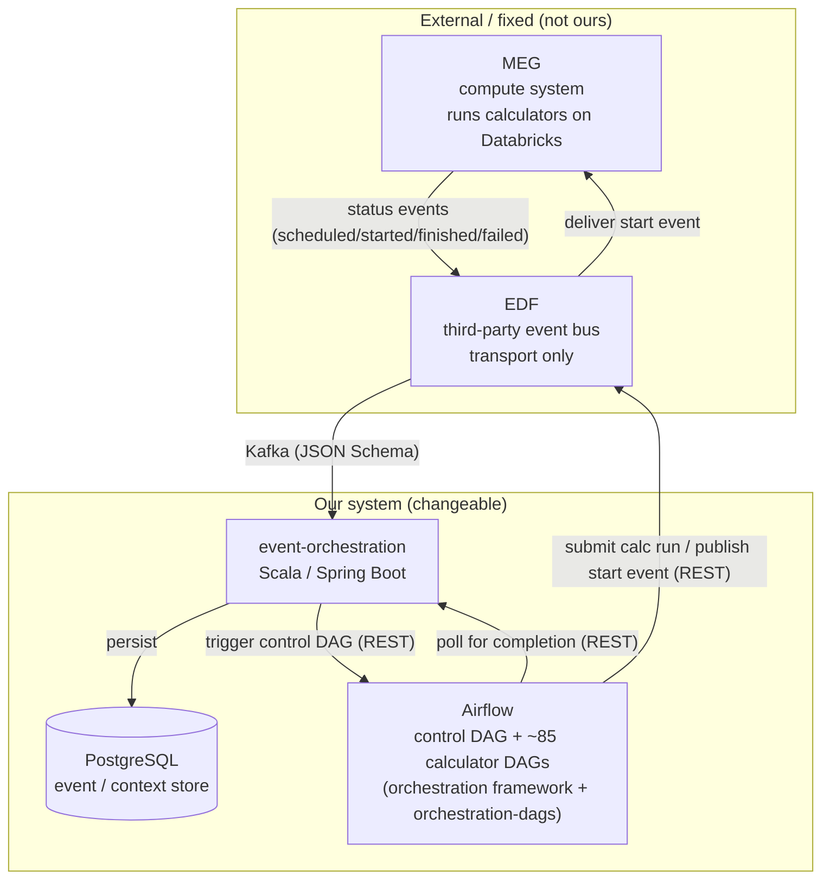
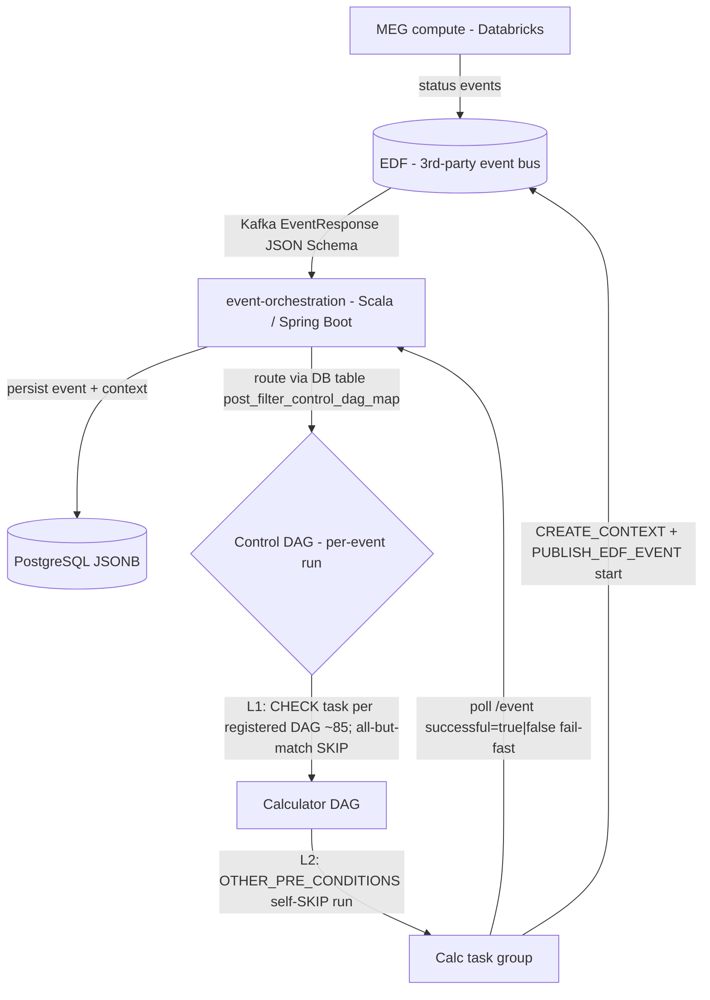
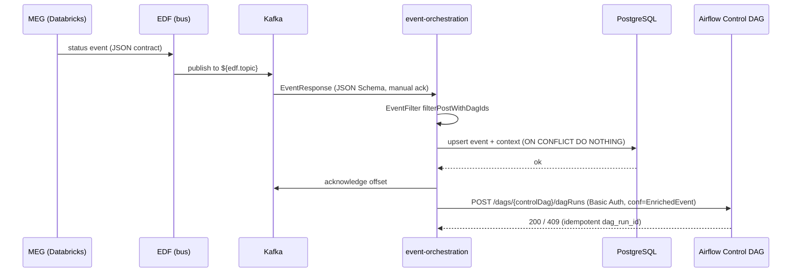
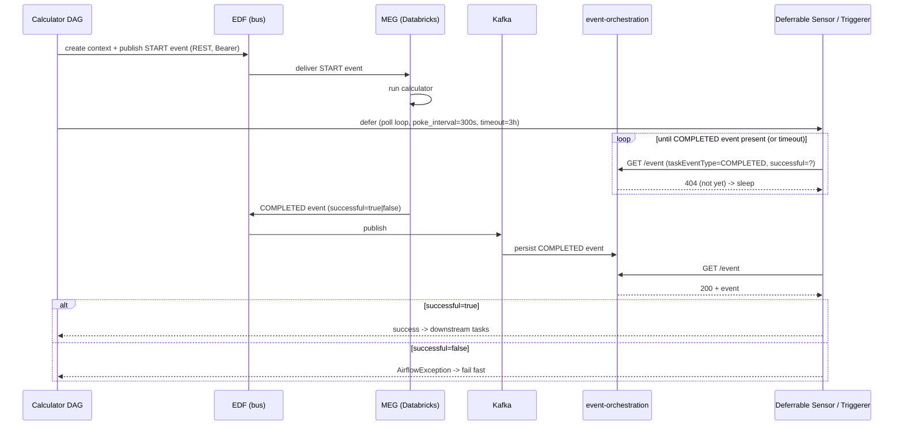
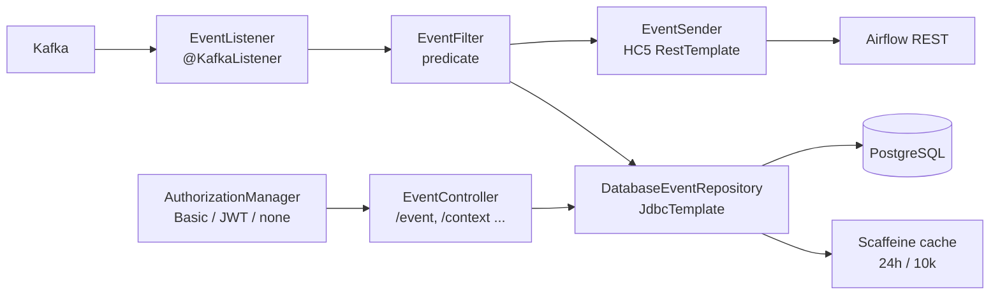
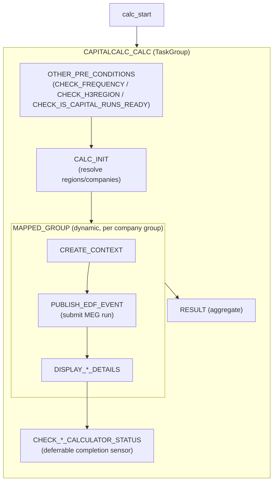
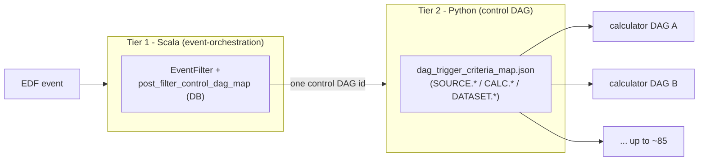
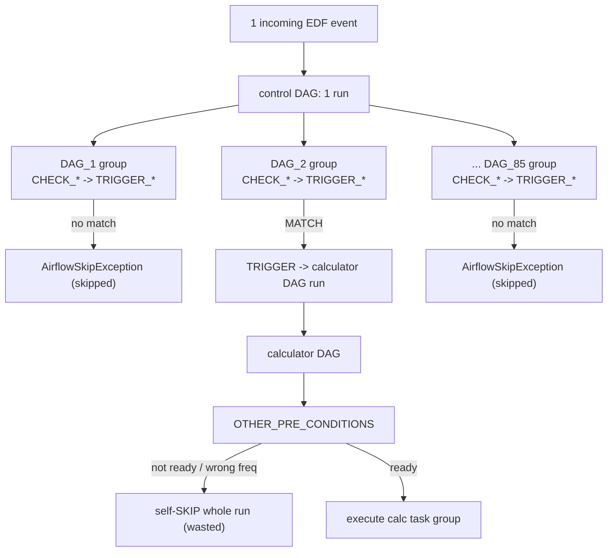
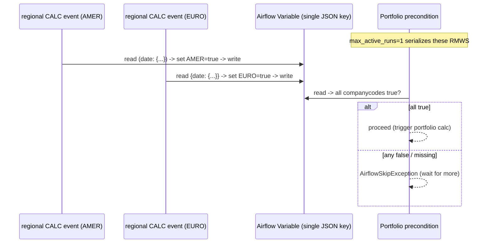

# System Discovery

## Executive Summary

An event-driven orchestrator that triggers UBS regulatory capital calculators. **MEG** (the compute system, running on Databricks) emits calculator lifecycle status events onto **EDF** (a third-party event bus, transport only). **`event-orchestration`** (Scala / Spring Boot) consumes those events from Kafka, persists them to PostgreSQL, and routes matching events to an Airflow control DAG via the Airflow REST API.

The control DAG fans out to **~85 calculator DAGs** using a JSON trigger registry. Each calculator DAG publishes a "start" event to EDF (submitting a MEG run) and then waits via async deferrable HTTP sensors that poll `event-orchestration` for that run's completion event.

The system is moderate scale (**20–100 concurrent calculator runs at peak**) and is correctness/efficiency-bound, not throughput-bound. It "mostly works." The primary driver for this review is architectural inefficiency: a **two-level fan-out-then-skip design** produces large volumes of wasted, skipped Airflow tasks and DAG runs (scheduler + metadata-DB churn), rather than failure edge cases.

---

## 1. Discovery Method & Boundary Facts

Findings were established by code inspection of all three modules and validated against the Chief Architect through four targeted questions (see Appendix A).

### Boundary Facts (Validated)

* **EDF:** Third-party-owned event bus only (communication medium). Fixed black box, but it is just transport. We control what we publish/subscribe, not EDF itself.
* **MEG:** The compute system; runs calculators on Databricks. Separate system, black-box internals.
* **MEG Payloads:** MEG emits status events/contexts in a fixed JSON contract for calculator lifecycle states (`scheduled` / `started` / `finished` / `failed`). *Escape hatch:* We can define our own JSON structure that a calculator emits directly to EDF.
* **Completion Loop (Confirmed):** MEG (Databricks) $\rightarrow$ EDF (bus) $\rightarrow$ Kafka $\rightarrow$ `event-orchestration` $\rightarrow$ PostgreSQL $\rightarrow$ polled by Airflow deferrable sensor.
* **Redesign Solution Space:** Cannot change EDF (transport) or MEG internals; can change our publish/subscribe payloads, `event-orchestration`, the Airflow framework/DAGs, and (partially) what calculators emit via the custom-JSON escape hatch.

### 1.1 System Context (C4 Level 1)

---

## 2. End-to-End Flow

### 2.1 Sequence: Event Ingestion & Control DAG Trigger

### 2.2 Sequence: Calculator Run & Completion (Live Prod Path)

---

## 3. System Reconstruction Model

* **System Boundaries:** EDF = 3rd-party event bus (transport only, fixed); MEG = compute on Databricks (black box); ours = `event-orchestration`, orchestration (framework), orchestration-dags, Airflow. Run on Azure/AKS.
* **Key Components:** `event-orchestration` (Scala 2.13 / Spring Boot 3.5.7 / Spring Kafka 3.3.11); orchestration (Python lib v5.3.0, Airflow 2.10.5); orchestration-dags (~85 DAGs, v5.1.3).
* **Data Flow:** Kafka inbound (Confluent JSON Schema); Airflow REST for DAG triggers; EDF REST for context/event submit; HTTP polling for completion.
* **Eventing Model:** Manual-ack Kafka, exponential backoff (9 retries), no DLQ. Completion uses MEG task-event scheme (`taskEventType=COMPLETED`, `successful=true|false`).
* **Orchestration:** Two-tier routing $\rightarrow$ control DAG fan-out $\rightarrow$ calculator task group:

$$\text{CALC\_INIT} \rightarrow \text{CREATE\_CONTEXT} \rightarrow \text{PUBLISH\_EDF\_EVENT} \rightarrow \text{CHECK\_STATUS} \rightarrow \text{RESULT}$$

Idempotent `dag_run_id` (SHA-1; HTTP 409 treated as success).
* **Storage:** `event-orchestration` owns PostgreSQL (event/context JSONB, routing table, runtime config). Airflow metadata DB holds mutable Variables as portfolio fan-in state. Scaffeine 24h context cache.

---

## 4. Component Deep Dive

### 4.1 `event-orchestration` (Scala / Spring Boot)

* **Tech Stack:** Scala 2.13.18, JDK 17, Spring Boot 3.5.7 (web, actuator, JDBC, Kafka), Spring Security 6.5.5 (OAuth2/JWT via Nimbus), Spring Kafka 3.3.11, Kafka client 3.9.2, Confluent JSON Schema Serializer 7.9.0, PostgreSQL JDBC 42.7.3 (HikariCP, 40 max pool), Apache HC5 5.5, Jackson 2.21.1, Scaffeine 5.3.0.
* **Entry Point:** `EventOrchestrationMain` / `EventOrchestrationApp` (`@SpringBootApplication`).
* **Kafka Ingestion:** `listener/EventListener.scala` (`@KafkaListener`), topics `${edf.topic}`, `${edf.merival.topic}`, message type `com.ubs.edf.coreservice.api.v2.EventResponse`. Uses `ErrorHandlingDeserializer` + Confluent JSON Schema, manual ack, `read_committed`, SASL_SSL/PLAIN.
* *Retry:* `configuration/KafkaErrorHandlingConfig.scala` + `KafkaLimitedExponentialBackoff.scala` (30s initial, multiplier of 2, 600s max, 9 attempts). **No DLQ.**

* **Persistence:** `repository/DatabaseEventRepository.scala` (Spring `JdbcTemplate`, no ORM).
* *Tables:* `event(event_id PK, json JSONB)`, `context(context_id PK, json JSONB)`, `post_filter_control_dag_map`, system properties. Upsert uses `ON CONFLICT DO NOTHING`.
* *DDL:* Managed in `src/main/resources/database/` (raw SQL versioned upgrades, no Flyway/Liquibase).
* *Context cache:* `CachedContextEventRepository.scala` (24h TTL, 10k entries).

* **Trigger to Airflow:** `controller/EventSender.scala` $\rightarrow$ `POST /FRCA/airflow/api/v1/dags/{dagid}/dagRuns` (Basic Auth) with payload `AirflowRequest(conf=EnrichedEvent(event, context))`.
* *Retry:* `configuration/ExponentialBackoffRetryStrategy.scala` (5 retries, 30s to 600s, jitter on 429/5xx).
* *DAG Selection:* `predicate/EventFilter.scala` reads from the `post_filter_control_dag_map` table.

* **Query API (Polled by Airflow):** `controller/EventController.scala` exposing `GET /event`, `/context`, `/parentcontext`, `/childcontext`; and dev/test endpoints `POST /listen`, `/listencontext`, `GET /statuschange`, `POST /token`.
* *Auth:* `controller/AuthorizationManager.scala` (Basic, Bearer/JWT via Azure OIDC with group checks, or none).

* **Config Loading:** `application.properties` $\rightarrow$ `EnvironmentVariablePostProcessor` (validates env vars) $\rightarrow$ `DbConfigurationPostProcessor` (loads properties from system properties at runtime).
* **Deployment:** Docker on `openjdk:17-jdk-slim`; Helm deploy; HPA 3–10 (CPU 50% / memory 80%), memory request/limit 1000Mi, RollingUpdate (`maxSurge=1`, `maxUnavailable=0`); Istio, Vault, Workload Identity.

### 4.2 `orchestration` (Python Framework, v5.3.0)

* **Tech Stack:** Python 3.10–3.13, Airflow 2.10.5. Dependencies: `cicommon 3.0.1`, `msal`, `azure-identity`, `opencensus-ext-azure`, `requests`. Poetry-packaged to GitLab PyPI; imported by `orchestration-dags`.
* **Control DAG Builder:** `common/dag_utils.py` $\rightarrow$ `create_control_tasks(dags_dir)` builds one `DagTriggerWithConditionTaskGroup` per registered DAG.
* **Condition Model:** `common/trigger_conditions.py`. `TriggerCondition` (namedtuple). `get_trigger_condition()` parses `TRIGGER_CONDITION[-REGION]` (e.g., `SOURCE.MERIVAL.AMER`, `CALC.CAPITALCALC`, `DATASET.OUTPUTPOSTING`). Evaluators inherit from `TriggerCriteriaEvaluator`.
* **Reusable Building Blocks:** `common/base_calculator.py`, `common/generic_calculator.py` (`SimpleCalculator`, `TaskTriggeringCalculator`, `DisplayCalcRunDetails`), `common/group.py` (`CalculatorTaskGroup`, `DatasetMegEventCriteriaTaskGroup`, dynamic mapped task groups), `sensors/http_async_run_condition_sensor.py`, `sensors/http_deferrable_completion_sensor.py`, `triggers/http_async_trigger.py` (`MvlHttpTrigger`), `hooks/http_async_hook.py`. (`operators/` directory is empty).
* **EDF Integration:** `common/edf_util.py` $\rightarrow$ `trigger_calculator_task()`, `create_edf_context()` (`POST /api/context/v3/`), `publish_edf_event()` (`POST /api/core/v3/topics/.../events/`). Bearer authentication via `common/auth_utils.py` (MSAL). Connection: `fra_megdp_service_con`.
* **Completion Polling:** `CalcRunCompletionSensor` defers to `MvlHttpTrigger`, polling `ES_EVENT_ENDPOINT = /FRCA/event-orchestration/event`. `200` $\rightarrow$ success; `404` $\rightarrow$ sleep; others $\rightarrow$ error. Default settings: `DEFAULT_POKE_INTERVAL = 300s`, `DEFAULT_CALC_SENSOR_TIMEOUT = 3h`.
* **DAG Triggering:** `trigger_dag()` $\rightarrow$ `POST /FRCA/airflow/api/v1/dags/{dag_id}/dagRuns` (Basic Auth). Uses an idempotent `dag_run_id` structured as `orch_sha1(dag_id+conf)[:16]`. `HTTP 409` is handled as a success; Tenacity handles retries on 408/429/5xx.
* **Config & Testing:** Airflow Variables (JSON representation) accessed via helpers in `common/af_utils.py`. Evaluated via pytest + aioresponses (coverage $\ge 75\%$).

### 4.3 `orchestration-dags` (Python DAGs, v5.1.3)

* **Packaging:** Built with Maven (`pom.xml` + `src/main/assembly/assembly.xml`) packaging the `dags/` assets into a `.tar.gz` for Nexus (no Java compilation). Depends on `orchestration` framework v5.2.4.
* **DAG Inventory (~85):** 2 control/meta (`orchestration_control_dag.py`, `orchestration_control_dag_capital.py`); 20 regional B3F (daily + monthly); IHC (`urg_ihc_dag`); 7 portfolio (`portfolio_daily_dag`, `portfolio_fed*`, `groupreporting_*`); floors (`output_floor_monthly`, `sectoral_floor_monthly`); plus validation, adjustments, market-risk, SAVA, SACCR-QA, archive, etc.
* **Registry:** `dags/dag_trigger_criteria_map.json` maps DAG IDs to trigger conditions (`SOURCE.*` / `CALC.*` / `DATASET.*`). Includes custom criteria like `EventDateCriteria` (`dags/logic/capital/custom_trigger_conditions.py`).
* **Calculator DAG Structure:**

$$\text{calc\_start} \rightarrow \text{CAPITALCALC\_CALC group} \rightarrow \text{calc\_end}$$

Where the group contains:

$$\text{OTHER\_PRE\_CONDITIONS} \rightarrow \text{CALC\_INIT} \rightarrow \text{MAPPED\_GROUP} \rightarrow \text{RESULT}$$

The dynamic mapped group handles `CREATE_CONTEXT` $\rightarrow$ `PUBLISH_EDF_EVENT` $\rightarrow$ `DISPLAY` $\rightarrow$ `CHECK_STATUS`.
* **Plugins & Grouping:** The `plugins/` directory contains only `.keep`. Environment-specific calculations are managed in `dags/control/calculator_utils.py` (e.g., `capitalcalcdev` vs `capitalcalc`). Company groupings are organized in `dags/logic/capital/__init__.py`.
* **Config Priority:** DAG-run `conf` $\rightarrow$ Airflow Variables $\rightarrow$ `@dag` params $\rightarrow$ framework constants.

### 4.4 Calculator DAG Task Structure

---

## 6. Routing & Fan-Out

### 6.1 Two-Tier Routing

* **Tier 1 (Scala):** `event-orchestration` matches incoming EDF events against `post_filter_control_dag_map` and triggers one control DAG.
* **Tier 2 (Python):** The control DAG uses `dag_trigger_criteria_map.json` to decide which calculator DAGs to trigger.
* **Issue:** Routing logic is split across two environments (PostgreSQL table in Scala and a JSON file in Python).

### 6.2 The Skip-Churn Fan-Out (PRIMARY DRIVER)

* **Level 1 Control DAG Gatekeeper:** `create_control_tasks` dynamically builds one `DagTriggerWithConditionTaskGroup` per registered DAG (~85). Each has one `CHECK_*` task per condition and one `TRIGGER_*` task. Every incoming event materializes all groups (~150–300+ task instances) in the control DAG; all non-matching conditions raise `AirflowSkipException`. Each skip is a real, state-tracked scheduler/DB operations lifecycle loop, causing heavy churn for exactly **1 useful trigger**.
* **Level 2 Calculator DAG Self-Skip:** Triggered calculator DAGs run `OTHER_PRE_CONDITIONS` which can also raise `AirflowSkipException`. For portfolios, every regional completion triggers a `portfolio_daily_dag` run that no-ops until the very last region finishes (wasting 9 out of 10 runs).
* **Alternative:** An in-Python alternative already exists but is unused (`evaluate_dag_start_criteria` + `TriggerCriteriaEvaluator` + `DagTriggerer`). This resolves conditions in memory and triggers only the matched DAGs, completely avoiding task-level skipped churn.

### 6.3 Portfolio Fan-In (Mutable Airflow Variable Accumulator)

`is_capital_cal_runs_ready` (`dags/logic/portfolio/portfolio_commons.py`) performs a non-atomic read-merge-write (RMW) on a single Airflow Variable (`PORTFOLIO_REPORTINGDATE_COMPANYCODES_*`), accumulating `(reporting_date: (companycode: bool))` values from incoming regional events. The portfolio DAG proceeds only when all company codes evaluate to `True`. The classic lost-update race condition is mitigated only by the portfolio DAG's configuration of `max_active_runs=1`.

---

## 8. Top Risks (Ranked to Reality)

1. **Gatekeeper Skip-Churn (The Driver):** Per event, the control DAG materializes ~150–300+ task instances across ~85 registered DAGs. Nearly all are skipped via `AirflowSkipException`. Triggered calculator DAGs then self-skip via pre-conditions (e.g., 90% of portfolio runs are wasted no-ops). Real Airflow tasks and runs are scheduled, queued, and state-tracked for every single useful execution, placing unnecessary stress on the scheduler and metadata DB.
2. **Maintainability / Tech Debt Cluster:** Dual completion schemes remain in the codebase (`legacy STATE` vs `SMEG successful`); routing configurations are split across separate applications (Scala DB table vs Python JSON registry); version mismatches exist between the orchestration framework (5.2.4 vs 5.3.0); and fan-in states rely on opaque, mutable Airflow Variables.
3. **Lost-Completion-Event Reliability Gap:** There is no Kafka DLQ and no built-in event reconciliation mechanism. A genuinely lost event will poll until the ~3-hour timeout, and in the case of portfolio runs, it can silently and permanently block the fan-in accumulator (since it is built incrementally from events rather than computed via a reconciled state query).