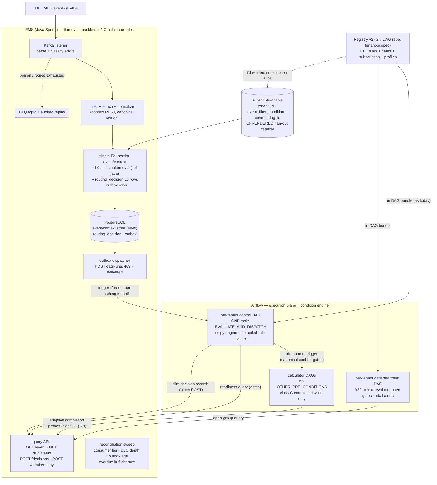
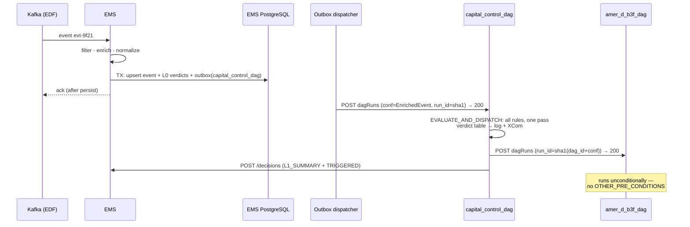
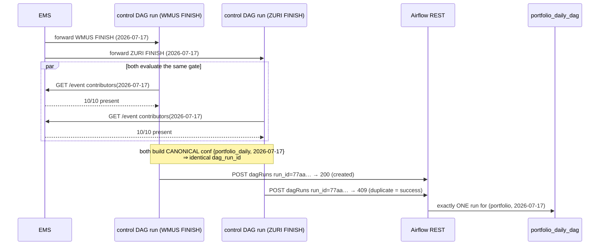
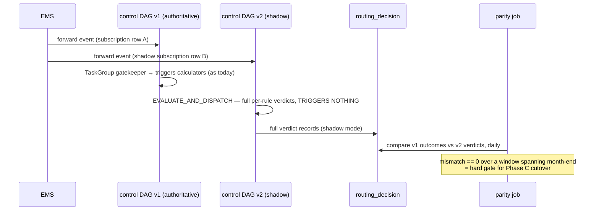

# Trigger Semantics Redesign — Final Implementation Plan

**Status:** Implementation-ready. Consolidates `trigger_semantics_redesign_plan.md` (Rev 2.1) with all review decisions. Supersedes the EMS-engine variant.

## TL;DR

* **Airflow-resident condition engine:** All calculator trigger rules — definition *and* evaluation — live in the Airflow layer. One per-tenant control DAG with a **single `EVALUATE_AND_DISPATCH` task** replaces the ~85-TaskGroup fan-out; verdicts are visible in the task log, XCom, and the grid view where developers and prod support already work.
* **Thin EMS:** The rewritten Java Spring Event Micro Service is a rule-free event backbone: Kafka listener → filter → **Level-0 tenant subscription** (`tenant_id, event_filter_condition, control_dag_id`, fan-out capable) → enrich + normalize → persist → **outbox** → forward. Plus DLQ/replay, `GET /event`, `GET /run/status`, `routing_decision` storage. EMS evaluates no calculator rule — only CI-generated subscription filters.
* **CEL registry v2:** Tenant-scoped YAML in the DAG repo, shipped in the DAG bundle exactly like `dag_trigger_criteria_map.json` today. `trigger.when` written as a **list of CEL clauses (implicit AND)** for native per-clause diagnostics. Pinned `celpy` behind a wrapper interface; pure custom functions; normalization at ingestion.
* **Stateless gates:** Multi-event conditions (`await.all_of`) are **recomputed from the EMS event store on every evaluation** — no accumulator anywhere, so the portfolio Variable's lost-update bug class is structurally impossible. Exactly-once via **canonical conf → idempotent `dag_run_id` dedup**; liveness via a per-tenant **heartbeat DAG**; stall alerts name the missing contributions.
* **Slim audit:** Task logs are the debug record. `routing_decision` durably stores only what logs can't: Level-0 verdicts (absence coverage), per-event evaluation summaries, consequential outcomes, and gate evaluations. `NO_MATCH` detail is recomputable (immutable events + versioned registry + pinned engine).
* **Rollout:** Strangler in five phases (A–E), shadow-parity gated, per-(tenant, event-class) cutover, instant rollback per step.

---

## 1. Problem Being Solved (the four issues)

| # | Issue | Today | Target |
|---|---|---|---|
| 1 | Every trigger condition is a separate Airflow task; ~150–300+ task instances materialized per event, nearly all skipped (`create_control_tasks`, `dag_utils.py:132-143`) | Level-1 skip churn | **1 task instance per event**; non-matches are log lines, not task instances |
| 2 | Conditions delegated to calculator DAGs (`OTHER_PRE_CONDITIONS`, dataset checks) which evaluate-and-skip whole runs; portfolios waste 9 of ~10 runs | Level-2 skip churn | A triggered DAG **always runs**; all stateless checks evaluate before triggering |
| 3 | Flat `dag_id → "TRIGGER.CONDITION[REGION]"` map cannot express compound predicates | No expressiveness | CEL clause lists; compound predicates, date arithmetic, set membership |
| 4 | No multi-event "gate open" mechanism; portfolio fan-in is a racy Airflow-Variable read-merge-write with a silent lost-update bug | No gates | Declarative `await.all_of`, stateless recompute, exactly-once dispatch |

**Scale context:** 20–100 concurrent calculator runs at peak; correctness/efficiency-bound, not throughput-bound.

---

## 2. Target Architecture

### 2.1 Component Diagram



> **[EMS Amendment A3 — see ems-design.md §0 / §5–§6]** The "event/context store (as-is)" node above is **superseded** for Phase A: the store gains typed `GENERATED ALWAYS … STORED` columns + composite indexes over the JSONB payload. The **write path is unchanged** (raw JSONB upsert, `ON CONFLICT DO NOTHING`), so every "as-is" invariant holds; only the read path is made millisecond-fast — a prerequisite for stateless gates, `GET /gate/groups`, and the §5.8 `/run/status` probes.

### 2.2 The Two Layers

* **Level 0 (EMS): "who wants this event?"** The subscription table is evaluated against *all* rows per event; every matching row forwards a copy to that tenant's control DAG. **The same event may fan out to multiple tenants.** Conditions are coarse (source/type granularity), written in CEL, **CI-rendered from the registry** — never hand-authored. Each per-(event, tenant) verdict is recorded (tier `L0_SUBSCRIPTION`).
* **Level 1 (tenant control DAG): "what do we do with it?"** All calculator trigger conditions, evaluated by `EVALUATE_AND_DISPATCH`.

Cross-tenant fan-out is idempotency-safe: different tenants trigger different `dag_id`s → disjoint `dag_run_id`s.

**Superset invariant (CI-enforced):** a tenant's subscription must match a superset of what its Level-1 rules can match, or a rule silently never fires. CI runs every rule's must-match fixtures against the tenant's rendered subscription; any rejection fails the build.

### 2.3 Condition Taxonomy (every existing check is classified during Phase E)

| Class | Definition | Target home |
|---|---|---|
| **A. Event predicate** — stateless boolean over one event + context | `trigger.when` (CEL), dispatcher task |
| **B. Multi-event gate** — predicate over several events over time, keyed by group value | `trigger.await`, dispatcher + heartbeat (§6) |
| **C. Execution wait** — completion of work this run started | Calculator DAG deferrable trigger, SLA-shaped adaptive schedule from `CalculatorMetadata` (§5.8) |
| **D. Non-event data wait** — probe-only, no event exists | Calculator DAG sensor; explicit exception list, default empty |

Rule of thumb: **facts about events are decided in the dispatcher (reading the event store); progress of launched work is awaited in the DAG.**

---

## 3. Registry v2 Specification

### 3.1 Repo Layout (DAG repo)

```
orchestration-dags/
  registry/
    schema/
      event_context_schema.yaml      # typed field declarations for CI type-check
    capital/
      registry.yaml                  # CAPITAL tenant rules (CODEOWNERS: capital team)
      fixtures/
        merival_amer_daily.json      # sample EnrichedEvent payloads
        capitalcalc_finish_amer.json
        ...
    nsfr/
      registry.yaml                  # enabled: false until NSFR activates
```

### 3.2 Schema

```yaml
# registry/capital/registry.yaml
version: 2
tenant: CAPITAL
enabled: true

# Level-0 subscription — CI renders this into the EMS subscription table.
# MUST be a superset of every rule below (CI-verified against fixtures).
subscription:
  control_dag_id: capital_control_dag
  when:
    - 'event.source in ["MERIVAL", "AQUA_RISK_PLATFORM", "RWA"]
       || event.additionalData.type == "CALC_EVENT"
       || event.additionalData.TYPE == "INGESTION"'

defaults:
  rule_time_budget_ms: 250          # per-rule wall-clock guard (CEL terminates by design)

rules:
  # ---- simple regional predicate (issue 3: clause list = implicit AND,
  #      one clause per line → native per-clause diagnostics) ----
  amer_d_b3f_dag:
    trigger:
      when:
        - 'event.source == "MERIVAL"'
        - 'context.data.h3Region == "AMER"'
        - 'context.data.frequency == "DAILY"'     # canonical post-normalization value
    fixtures:
      must_match: [fixtures/merival_amer_daily.json]
      must_not_match: [fixtures/merival_euro_daily.json]

  # ---- compound predicate with custom function (inexpressible today) ----
  usrg_ihc_dag:
    trigger:
      when:
        - 'event.source == "MERIVAL"'
        - 'context.data.h3Region == "USRG"'
        - 'dayOfMonth(event.businessDate) >= 5'
    fixtures:
      must_match: [fixtures/merival_usrg_day7.json]
      must_not_match: [fixtures/merival_usrg_day2.json]

  # ---- multi-event gate (issue 4) ----
  portfolio_daily_dag:
    trigger:
      when:
        - 'event.additionalData.type == "CALC_EVENT"'
        - 'event.additionalData.STATE == "FINISH"'
        - 'context.data.calcType in ["CAPITALCALC", "CAPITALCALCSMALL",
                                     "CAPITALCALCEXTRASMALL", "CAPITALCALCMEDIUM"]'
      await:
        all_of:
          # what counts as a contribution (CEL over stored terminal events)
          contribution: 'event.additionalData.STATE == "FINISH"
                         && context.data.calcType.startsWith("CAPITALCALC")'
          # identity of a contribution within the group
          contributor_key: 'context.data.companyCode'
          # required set — resolve open question §12.1 (company codes vs regions)
          expected: [AMER, ASIA, AUNZ, EURO, LDNL, WMAP, WMCH, WMDE, WMUS, ZURI]
          # grouping value, extracted from the triggering event
          group_by: 'context.data["reporting-date"]'
          staleness_window: 6h          # partial + older than this → page
          lookback: 5d                  # heartbeat candidate-group window
      # CANONICAL CONF — pure function of (dag_id, group key) ONLY.
      # CI rejects any template referencing event.*, context.*, now(), registry_version.
      conf:
        portfolio_id: portfolio_daily
        reporting_date: '{group_key}'
    fixtures:
      must_match: [fixtures/capitalcalc_finish_amer.json]
      must_not_match: [fixtures/capitalcalc_started_amer.json]

# NOTE: no completion_profiles section. Class-C completion SLAs come from the
# existing CalculatorMetadata object (duration- or UTC-clock-based) — see §5.8.
```

### 3.3 CEL Environment

**Activation (variable bindings) per evaluation:**

| Variable | Content |
|---|---|
| `event` | The EDF/MEG event object from the `EnrichedEvent` conf |
| `context` | The enriched context object |

**Custom functions (pure only — no I/O, no wall clock):** `dayOfMonth(ts)`, `isMonthEnd(date, workingDayCal)`, `isLastWorkingDay(date, cal)`, `isoRegion(s)`, `eqci(a, b)`, `normFreq(s)` (the last two are escape hatches; normalization at ingestion §4.2 makes them rarely needed). Catalog lookups (`taskIdOf`, `datasetUuidOf`) are resolved **at registry load** into constants — never during evaluation.

**Determinism invariant (CI-enforced):** rules reference only `event`/`context` fields and pure functions. This is what makes `NO_MATCH` verdicts recomputable (§8) and shadow parity meaningful.

### 3.4 CI Pipeline (DAG repo)

```
1. yaml-schema validation of registry.yaml
2. CEL compile + type-check of every clause against event_context_schema.yaml
   → unknown field / type mismatch FAILS the build (no silent never-match)
3. Fixture execution: pinned celpy engine runs every rule against its
   must_match / must_not_match fixtures
4. Superset check: every must_match fixture also evaluated against the
   tenant subscription.when → any rejection FAILS the build
5. Canonical-conf lint: gate conf templates may reference only {group_key}
   and literals
6. Rendered diff: effective rule-set delta printed into the PR
7. On merge: registry_version = monotonic counter + content hash;
   subscription slice rendered and upserted to EMS via admin API
   (PUT /admin/subscriptions {tenant, control_dag_id, when, registry_version});
   registry ships in the DAG bundle as today
```

---

## 4. EMS (Java Spring) — Thin Event Backbone

### 4.1 Module Layout

```
ems/
  ingestion/    KafkaEventListener, EventFilter, ContextEnricher, Normalizer
  subscription/ SubscriptionService (cel-java, cached programs), SubscriptionRepo
  store/        EventStoreRepo (as-is JSONB upsert), RoutingDecisionRepo
  dispatch/     OutboxRepo, OutboxDispatcher
  api/          EventQueryController, RunStatusController,
                DecisionIngestController, AdminController (replay, subscriptions)
  recon/        ReconciliationSweep
```

> **[EMS Amendment A3 — see ems-design.md §0 / §5–§6]** `EventStoreRepo` "(as-is JSONB upsert)" keeps its as-is *write* path, but the store schema is **not** as-is: promoted generated columns + indexes back the fast read path (see §2.2 annotation).

> **[EMS Amendment A4 — see ems-design.md §0 / §4.2]** Level-0 is **two-stage** in the Phase-A implementation, mirroring the legacy PRE/POST split: a **`PERSIST` gate** (event-fields-only CEL, evaluated *before* context enrichment; zero-match = drop **without** persisting — intended firehose behavior) and per-tenant **`FORWARD`** conditions (event + context CEL, evaluated *after* enrichment, inside the TX). The single-stage pipeline order below (persist before subscription eval) is refined accordingly: the drop gate runs first, enrichment second, forward-eval + persist + outbox in one TX.

### 4.2 Ingestion Pipeline

```java
@KafkaListener(topics = "${edf.topic}", containerFactory = "manualAckFactory")
public void onMessage(ConsumerRecord<String, String> rec, Acknowledgment ack) {
    EnrichedEvent enriched;
    try {
        Event event = parser.parse(rec.value());        // schema-validated
        Context ctx = enricher.fetchContext(event);      // context REST (cached)
        enriched = normalizer.canonicalize(event, ctx);  // upper-case, normalizeFrequency,
                                                         // ISO-region resolution — extends
                                                         // existing normalizeContextDataValues
    } catch (NonRetryableException e) {
        throw e;   // DefaultErrorHandler routes to DLQ IMMEDIATELY (no 55-min ladder,
                   // no partition head-of-line blocking)
    }
    tx.executeWithoutResult(s -> {
        eventStore.upsert(enriched);                     // ON CONFLICT DO NOTHING (as-is)
        List<SubscriptionMatch> matches = subscriptions.evaluate(enriched); // cel-java
        decisions.recordL0(enriched, matches);           // one row per (event, tenant)
        for (SubscriptionMatch m : matches) {            // FAN-OUT: every matching tenant
            outbox.insert(m.controlDagId(), enriched.toConf());  // same TX — no
        }                                                // acked-but-never-forwarded window
    });
    ack.acknowledge();                                   // manual ack AFTER persist (as-is)
}
```

> **[EMS Amendment A1 — see ems-design.md §0 / §4.2]** For the Phase-A implementation this classification is **superseded**: transient-infra failures (PG / EDF API) **park the partition** (unbounded seek-based backoff) and are **never** dead-lettered; the DLQ is **poison-only** (deserialization / schema / contract). Airflow unavailability is removed from the ingest path entirely by the transactional outbox. The "9-attempt ladder → DLQ for infra errors" below is retained only as the trigger-plan's original statement.

**Error classification:** deserialization / schema / contract violations → DLQ immediately. DB unavailability / downstream 5xx → existing 9-attempt exponential ladder (30s → 600s cap) → DLQ. `DeadLetterPublishingRecoverer`, one DLQ topic per inbound topic (`<topic>.ems.dlq`), carrying payload + headers + exception chain + attempt count. Alert: DLQ depth > 0 for 5 min pages.

### 4.3 Subscription Evaluation (the ONLY expressions EMS evaluates)

```java
@Service
public class SubscriptionService {
    // programs compiled once per registry_version, cached
    private volatile Map<String, CompiledSubscription> byTenant;

    public List<SubscriptionMatch> evaluate(EnrichedEvent e) {
        Map<String, Object> activation = Map.of("event", e.event(), "context", e.context());
        return byTenant.values().stream()
            .filter(s -> s.program().eval(activation))   // cel-java; coarse, few rows
            .map(s -> new SubscriptionMatch(s.tenantId(), s.controlDagId(), s.registryVersion()))
            .toList();
    }
}
```

> **[EMS Amendment A4 — see ems-design.md §0 / §4.3, §7]** The single `activation = Map.of("event", …, "context", …)` above is the **`FORWARD`-stage (stage 2)** activation. The Phase-A implementation splits subscription evaluation into a `PERSIST` stage (event-only activation, pre-enrichment, drop gate) and this `FORWARD` stage (full event+context activation, post-enrichment, in-TX). `PERSIST` rows referencing `context.*` are rejected at write time.

### 4.4 Outbox + Dispatcher

```sql
CREATE TABLE dag_trigger_outbox (
  dag_run_id   text PRIMARY KEY,      -- orch_sha1(dag_id + conf)[:16], unchanged scheme
  dag_id       text NOT NULL,
  conf         jsonb NOT NULL,
  created_at   timestamptz NOT NULL DEFAULT now(),
  delivered_at timestamptz,
  attempts     int NOT NULL DEFAULT 0,
  last_error   text
);
CREATE INDEX ix_outbox_pending ON dag_trigger_outbox (created_at) WHERE delivered_at IS NULL;
```

```java
@Scheduled(fixedDelay = 2000)
public void drainOutbox() {
    for (OutboxRow row : outbox.pendingBatch(50)) {
        try {
            int status = airflow.triggerDagRun(row.dagId(), row.dagRunId(), row.conf());
            if (status == 200 || status == 409) outbox.markDelivered(row);  // 409 = already ran
            else outbox.recordAttempt(row, "HTTP " + status);
        } catch (Exception e) { outbox.recordAttempt(row, e.toString()); }  // backoff via attempts
    }
}
```

Airflow down for two hours ⇒ a drained backlog on recovery, not lost triggers. Alert: oldest pending > 10 min pages.

### 4.5 `routing_decision` (slim contract — see §8 for what is and isn't recorded)

```sql
CREATE TABLE routing_decision (
  decision_id      uuid PRIMARY KEY DEFAULT gen_random_uuid(),
  event_id         text NOT NULL,
  tenant_id        text,
  tier             text NOT NULL,   -- 'L0_SUBSCRIPTION' | 'L1_SUMMARY' | 'L1_OUTCOME' | 'GATE'
  target_dag_id    text,            -- NULL for L1_SUMMARY
  decision         text NOT NULL,   -- FORWARDED | NOT_SUBSCRIBED | MATCHED | TRIGGERED
                                    -- | ERROR | GATE_OPEN | GATE_WAITING
  detail           jsonb,           -- counts / failing clause / missing set / completing ids
  registry_version text,
  engine_version   text,            -- e.g. 'celpy==x.y.z' (recomputability anchor)
  decided_by       text NOT NULL,   -- 'ems' | '<tenant>_control_dag' | '<tenant>_heartbeat'
  decided_at       timestamptz NOT NULL DEFAULT now()
);
CREATE INDEX ix_rd_event  ON routing_decision (event_id);
CREATE INDEX ix_rd_target ON routing_decision (target_dag_id, decided_at);
CREATE INDEX ix_rd_tier   ON routing_decision (tier, decided_at);
```

### 4.6 API Contracts

| Endpoint | Semantics |
|---|---|
| `GET /event?<criteria>` | As-is query over the event store. Used by gate readiness (§6) and class-C sensors. |
| `GET /run/status?<criteria>` | Lifecycle summary over the event store in one indexed query: `SCHEDULED` / `STARTED` / terminal observed, `successful` flag, DLQ-match hint. Serves the §5.8 adaptive completion probes and the categorized timeout diagnosis. |
| `GET /gate/groups?rule=<dag_id>&lookback=<d>` | Distinct `group_by` values with ≥1 qualifying contribution in the lookback window + per-group present-contributor sets. Serves the heartbeat in one round trip. |
| `POST /decisions` | Batch ingest of slim decision records from dispatchers/heartbeats (JWT-authed). |
| `POST /admin/replay` | Re-publish selected DLQ messages / re-emit stored events. Elevated JWT group; every invocation writes an audit row. Safe end-to-end: every downstream step is idempotent. |
| `PUT /admin/subscriptions` | CI-only upsert of rendered subscription rows, stamped with `registry_version`. Direct SQL grants revoked. |

---

## 5. Airflow Condition Engine

### 5.1 Package Layout (framework repo)

```
orchestration/
  conditions/
    cel_engine.py      # pinned celpy behind a seam + custom functions
    registry.py        # RuleSet load / validate / compile / cache
    models.py          # ClauseVerdict, RuleVerdict, EvaluationSummary
    evaluator.py       # evaluate_rules(), per-rule isolation
    gates.py           # gate readiness + canonical conf + dispatch
    decisions.py       # slim routing_decision batch POST client
    verdict_log.py     # human verdict table renderer
```

### 5.2 Engine Seam (the celpy hedge)

```python
# orchestration/conditions/cel_engine.py
import celpy

ENGINE_VERSION = f"celpy=={celpy.__version__}"    # recorded in every L1_SUMMARY row

class CompiledClause:
    def __init__(self, src: str, program):
        self.src = src
        self._program = program

    def evaluate(self, activation: dict) -> bool:
        return bool(self._program.evaluate(activation))

class CelEngine:
    """The only module importing celpy. Swapping CEL implementations touches this file
    and the CI conformance suite only."""
    def __init__(self):
        self._env = celpy.Environment()
        self._functions = build_pure_functions()   # dayOfMonth, isMonthEnd, eqci, ...

    def compile(self, expr: str) -> CompiledClause:
        ast = self._env.compile(expr)              # raises on syntax error (CI catches first)
        return CompiledClause(expr, self._env.program(ast, functions=self._functions))
```

A CI **conformance suite** asserts the exact CEL semantics rules rely on (string ops, `in`, comparisons, timestamp functions, error propagation) against the pinned version — the upgrade gate for the engine.

### 5.3 Models

```python
# orchestration/conditions/models.py
@dataclass(frozen=True)
class ClauseVerdict:
    expr: str
    passed: bool
    detail: str = ""                  # actual values on failure

@dataclass(frozen=True)
class RuleVerdict:
    dag_id: str
    verdict: str                      # MATCH | NO_MATCH | GATE_OPEN | GATE_WAITING | ERROR
    clauses: tuple[ClauseVerdict, ...] = ()
    detail: str = ""                  # missing contributors / error repr / ...
    trigger_result: str | None = None # "200 dag_run_id=ab12…" | "409 duplicate (ok)"
    elapsed_ms: float = 0.0
```

### 5.4 Evaluation with Per-Rule Isolation and Clause Diagnostics

```python
# orchestration/conditions/evaluator.py
def evaluate_rule(rule: CompiledRule, activation: dict) -> RuleVerdict:
    """One rule, fully isolated: an ERROR here never affects other rules.
    Clause list = implicit AND -> per-clause diagnostics come free (no AST surgery)."""
    start = time.monotonic()
    clauses: list[ClauseVerdict] = []
    try:
        for clause in rule.when:                       # short-circuit like &&
            passed = clause.evaluate(activation)
            clauses.append(ClauseVerdict(clause.src, passed,
                           detail="" if passed else actuals_for(clause, activation)))
            if not passed:
                return RuleVerdict(rule.dag_id, "NO_MATCH", tuple(clauses),
                                   detail=f"clause {len(clauses)}/{len(rule.when)} false",
                                   elapsed_ms=(time.monotonic() - start) * 1000)
        return RuleVerdict(rule.dag_id, "MATCH", tuple(clauses),
                           elapsed_ms=(time.monotonic() - start) * 1000)
    except Exception as exc:                           # throwing rule -> ERROR, isolated
        return RuleVerdict(rule.dag_id, "ERROR", tuple(clauses), detail=repr(exc),
                           elapsed_ms=(time.monotonic() - start) * 1000)

def actuals_for(clause, activation) -> str:
    """Best-effort: evaluate the identifiers referenced by the clause and render
    'context.data.h3Region == "USRG" (actual: "AMER")' for the verdict table."""
    ...
```

CEL is non-Turing-complete and terminating, so runaway rules cannot happen by construction; `elapsed_ms` against `rule_time_budget_ms` feeds a slow-rule warning metric rather than a kill switch.

### 5.5 The Control DAG (complete)

```python
# dags/control/capital_control_dag.py
import pendulum
from airflow.decorators import dag, task

from orchestration.conditions.registry import RuleSet          # module-level compile cache,
from orchestration.conditions.evaluator import evaluate_rule    # keyed by registry hash
from orchestration.conditions.gates import evaluate_gate_and_maybe_dispatch
from orchestration.conditions.decisions import post_decision_records
from orchestration.conditions.verdict_log import render_verdict_table
from orchestration.common.dag_utils import trigger_dag, orch_sha1, canonical_json

@dag(dag_id="capital_control_dag", schedule=None, catchup=False,
     start_date=pendulum.datetime(2021, 1, 1, tz="Europe/Zurich"),
     tags=["CAPITAL", "CONTROL"])
def capital_control_dag():

    @task(task_id="EVALUATE_AND_DISPATCH")
    def evaluate_and_dispatch(**context):
        conf = context["dag_run"].conf or {}                    # EnrichedEvent (as today)
        ruleset = RuleSet.load(tenant="capital")                # cached compiled rules
        activation = {"event": conf.get("event", {}), "context": conf.get("context", {})}

        verdicts = []
        for rule in ruleset.rules:
            v = evaluate_rule(rule, activation)
            if v.verdict == "MATCH":
                if rule.gate is None:
                    # plain trigger: conf = EnrichedEvent, unchanged idempotent scheme
                    run_id = orch_sha1(rule.dag_id + canonical_json(conf))[:16]
                    v = dispatch(rule, conf, run_id, v)
                else:
                    v = evaluate_gate_and_maybe_dispatch(rule, activation, v)
            verdicts.append(v)

        # 1) DEBUG RECORD: full table, every rule, clause-level reasoning -> task log
        print(render_verdict_table(verdicts, ruleset))
        # 2) UI RECORD: same table -> XCom (grid-visible without opening logs)
        context["ti"].xcom_push(key="verdicts", value=[asdict(v) for v in verdicts])
        # 3) AUDIT RECORD (slim, §8): summary + consequential outcomes + gate evals.
        #    Retried; on persistent failure alert-and-proceed — triggers never block on audit.
        post_decision_records(conf, ruleset, verdicts, decided_by="capital_control_dag")

        return {"matched": sum(v.verdict in ("MATCH", "GATE_OPEN") for v in verdicts),
                "errors":  sum(v.verdict == "ERROR" for v in verdicts)}

    evaluate_and_dispatch()

capital_control_dag()
```

**Verdict table as it appears in the task log:**

```
event_id=evt-9f21  registry=v42/ab99f0  engine=celpy==0.x.y
rule                  verdict       detail                                          dispatch
amer_d_b3f_dag        MATCH         all 3 clauses true                              200 dag_run_id=ab12ef34
usrg_ihc_dag          NO_MATCH      clause 2/3 false: context.data.h3Region ==
                                    "USRG" (actual: "AMER")                         -
portfolio_daily_dag   GATE_WAITING  7/10 present for reporting-date=2026-07-17;
                                    missing: [WMDE, WMUS, ZURI]                     -
marketriskrwa_m_dag   ERROR         KeyError('businessDate') — isolated             -
```

### 5.6 Gates

```python
# orchestration/conditions/gates.py
def evaluate_gate_and_maybe_dispatch(rule, activation, verdict) -> RuleVerdict:
    gate = rule.gate
    group_key = gate.group_by.evaluate(activation)              # e.g. "2026-07-17"

    # (1) READINESS IS RECOMPUTED, NEVER ACCUMULATED: the event store is the
    #     only state. A crashed/re-run evaluation recomputes identically.
    present = ems_client.contributors(gate, group_key)          # GET /event -> {code: event_id}
    missing = sorted(set(gate.expected) - set(present))
    if missing:
        return replace(verdict, verdict="GATE_WAITING",
                       detail=f"{len(present)}/{len(gate.expected)} present for "
                              f"{gate.group_by_name}={group_key}; missing: {missing}")

    # (2) EXACTLY-ONCE VIA CANONICAL CONF: pure function of (dag_id, group_key).
    #     Racing evaluations derive the SAME dag_run_id; Airflow 409-dedups the loser.
    conf = gate.canonical_conf(group_key)                       # {'portfolio_id': ..., 'reporting_date': group_key}
    run_id = orch_sha1(rule.dag_id + canonical_json(conf))[:16]
    result = dispatch_raw(rule.dag_id, conf, run_id)            # 200 or 409 both = success

    return replace(verdict, verdict="GATE_OPEN", trigger_result=result,
                   detail=f"completing_event_ids={sorted(present.values())}")
```

The gated DAG's `CALC_INIT` fetches contribution evidence from the event store by `(portfolio_id, reporting_date)` — evidence is **not** in the hashed conf (see §8 invariants).

### 5.7 Heartbeat DAG (liveness + stall alerting, in Airflow where support can read it)

```python
# dags/control/capital_gate_heartbeat_dag.py
@dag(dag_id="capital_gate_heartbeat_dag", schedule="*/30 * * * *",
     max_active_runs=1, catchup=False, start_date=..., tags=["CAPITAL", "CONTROL"])
def capital_gate_heartbeat_dag():

    @task(task_id="SWEEP_OPEN_GATES")
    def sweep(**context):
        ruleset = RuleSet.load(tenant="capital")
        report = []
        for rule in ruleset.gated_rules():
            for grp in ems_client.open_groups(rule.gate):        # GET /gate/groups
                v = evaluate_gate_readiness(rule, grp.key)       # same function as dispatcher
                if v.ready:
                    dispatch_gate(rule, grp.key)                 # dedup makes redundancy free
                    report.append(f"{rule.dag_id}[{grp.key}]: OPENED by heartbeat")
                elif grp.age > rule.gate.staleness_window:
                    alert_stalled_gate(rule, grp)                # pages, names the missing set
                    report.append(f"{rule.dag_id}[{grp.key}]: STALLED "
                                  f"age={grp.age} missing={v.missing}")
                else:
                    report.append(f"{rule.dag_id}[{grp.key}]: waiting missing={v.missing}")
        print("\n".join(report))                                 # the gate state, in a task log
        post_gate_records(report, decided_by="capital_heartbeat")

    sweep()

capital_gate_heartbeat_dag()
```

### 5.8 Class-C Completion Waits — SLA-Shaped Adaptive Deferral

`GET /event/wait` long-poll was evaluated and **rejected as over-engineering**: cross-DAG chaining is event-driven through EMS (§2), so sensor wake-up latency delays only in-run post-steps — never the pipeline — while long-poll would cost `LISTEN/NOTIFY` fan-out, `DeferredResult` plumbing, mesh idle-timeout coordination, and a fallback ladder. The valuable 80% of the completion redesign is transport-independent and is **kept**: per-calculator timeouts, categorized failure diagnosis, DLQ + reconciliation as the loss detectors.

Instead, the deferrable trigger derives its check schedule from the **existing `CalculatorMetadata` SLA** (duration- or UTC-clock-based), and each wake calls `GET /run/status` — classifying *progress*, not just terminal presence:

```python
def build_check_schedule(sla, submitted_at):
    """Probe early for liveness, stay sparse mid-run, densify near expected
    completion. ~10-25 informative probes per run vs 18+ blind 300s polls."""
    if sla.kind == "DURATION":                       # e.g. GroupReporting: 90m
        d = sla.expected_duration
        yield submitted_at + LIVENESS_PROBE          # +5m: SCHEDULED/STARTED yet?
        yield submitted_at + 0.5 * d                 # midpoint: catch mid-run failure
        t = submitted_at + 0.8 * d                   # dense phase from 80% of SLA
        deadline = submitted_at + max(1.5 * d, d + timedelta(minutes=30))
        while t < deadline:
            yield t
            t += max(timedelta(seconds=90), d / 30)  # 90m SLA -> every ~3m
    else:                                            # CLOCK, e.g. "by 06:00 UTC"
        yield submitted_at + LIVENESS_PROBE
        t = submitted_at + SPARSE_INTERVAL           # every 30m
        while t < sla.deadline - DENSE_WINDOW:
            yield t; t += SPARSE_INTERVAL
        while t < sla.deadline + sla.grace:          # dense approach to the clock
            yield t; t += timedelta(minutes=2)

# per-wake classification (subsumes the categorized-timeout diagnosis):
#   nothing SCHEDULED by liveness probe -> warn; fail NEVER_STARTED at never_started_timeout
#   terminal successful=false observed  -> fail fast AT THAT PROBE (not at timeout)
#   terminal successful=true observed   -> task success
#   deadline reached, STARTED seen      -> fail STARTED_NO_TERMINAL / TERMINAL_IN_DLQ
```

Properties: zero new EMS machinery; **earlier failure detection than either today's fixed poll or long-poll** (`NEVER_STARTED` surfaces at minutes, not at a 90m/3h timeout, because probes check lifecycle progress); per-calculator tuning is one metadata field. Escape hatches if a calculator ever needs seconds-level completion latency: shrink its dense-phase interval, or the Phase-2 split-at-submit continuation (fully event-native, no waiting at all — deliberately deferred).

**Amends handoff decision 1:** the deferrable pattern, per-calculator timeouts, and categorized diagnosis stand; the long-poll transport is replaced by the SLA-shaped schedule; handoff decision 4(a) (the `/event/wait` client) is dropped, 4(b) (`/run/status` client) is now used on every probe, not only at expiry.

#### 5.8.1 Airflow mechanics: dynamic intervals are trigger-side user code

`poke_interval` is not an Airflow-enforced constant — it is an ordinary kwarg on our own trigger class (`HttpDeferrableSensor.execute()` → `self.defer(trigger=MvlHttpTrigger(..., poke_interval=...))`). The triggerer simply runs the trigger's `run()` async generator, so a per-iteration computed `await asyncio.sleep(...)` implements any schedule. The vNext trigger (`SlaAwareHttpTrigger`, replacing `MvlHttpTrigger` for class-C waits) obeys three rules:

1. **Recomputable, never stored, schedule.** Triggers are re-instantiated from `serialize()` output on triggerer restart. Serialize only `(submitted_at, sla, never_started_after)`; `run()` re-derives the §5.8 schedule and **fast-forwards past check times already elapsed** — no progress index is ever persisted.
2. **Async-only probes.** `GET /run/status` via the async HTTP hook; `asyncio.sleep` for waits; no blocking calls in the shared triggerer event loop.
3. **`defer(timeout=…)` is a backstop only** (SLA deadline + margin). Categorized expiry (`NEVER_STARTED` / `STARTED_NO_TERMINAL` / `TERMINAL_IN_DLQ`) is yielded by the trigger itself as a `TriggerEvent`, so `execute_complete()` raises a *categorized* `AirflowException`; the existing `successful=false` fail-fast branch maps to the `"failed"` event unchanged.

Sensor-side delta: `execute()` passes `submitted_at` + `CalculatorMetadata` SLA instead of `poke_interval`; `execute_complete()` gains the diagnosis→exception mapping. The re-defer-from-callback pattern (`execute_complete()` calling `self.defer()` again with a new interval) is supported by Airflow but rejected here: each cycle occupies a worker slot and a scheduler round-trip for no benefit, since the schedule needs nothing from task context.

---

## 6. Sequence Diagrams

### 6.1 Simple Event → Calculator Trigger



### 6.2 Gate: Racing Final Completions (exactly-once via dedup)



### 6.3 Lost Final Event → Stall Alert → DLQ Replay Heals the Gate

```mermaid
sequenceDiagram
    participant K as Kafka
    participant E as EMS
    participant DLQ as DLQ topic
    participant HB as capital_gate_heartbeat_dag
    participant OPS as On-call
    participant CD as capital_control_dag
    participant P as portfolio_daily_dag

    K->>E: ZURI FINISH (poison / retries exhausted)
    E->>DLQ: dead-letter (partition NOT stalled)
    Note over E: 9/10 contributions persisted — no dispatcher run fires for the 10th
    HB->>E: GET /gate/groups (every 30 min)
    E-->>HB: portfolio_daily[2026-07-17]: 9/10, age > staleness_window
    HB->>OPS: PAGE: gate stalled — missing [ZURI]; matching msg in DLQ
    OPS->>E: POST /admin/replay (audited)
    E->>E: re-ingest → persist → outbox → forward
    E->>CD: dispatcher run for replayed ZURI FINISH
    CD->>P: gate 10/10 → trigger (canonical conf, dedup-safe)
    Note over P: repair = replay. No Variable surgery, ever.
```

### 6.4 Phase B Shadow Parity



---

## 7. Debuggability Contract

| Question | Where it's answered |
|---|---|
| "Why didn't DAG X run for event E?" | Open E's control-DAG run in the grid → `EVALUATE_AND_DISPATCH` log → verdict table with the failing clause and actual values. Same table in XCom. Five minutes, no SQL, no Scala. |
| "Did my tenant even receive event E?" | The dispatcher run's existence in the grid is the visible proof; `routing_decision` tier `L0_SUBSCRIPTION` is the queryable one (this is the case with **no** Airflow run — logs cannot cover it). |
| "Why is the portfolio not running?" | Latest heartbeat run's log lists every open gate with its missing contributors; staleness pages with the same list. |
| "Re-evaluate this event." | Clear/re-run the dispatcher run — safe end-to-end (idempotent triggers, stateless gates). |
| "Show me all events in March that matched nothing" / regulator extract | `routing_decision` SQL (below) — logs rotate; the table doesn't. |

```sql
-- Why didn't amer_d_b3f_dag run for event evt-9f21? (long after logs rotated)
SELECT tier, decision, detail, registry_version, decided_by, decided_at
FROM routing_decision
WHERE event_id = 'evt-9f21'
  AND (target_dag_id = 'amer_d_b3f_dag' OR tier IN ('L0_SUBSCRIPTION', 'L1_SUMMARY'))
ORDER BY decided_at;

-- Which events produced zero matches this month? (candidate routing gaps)
SELECT event_id, detail->>'rules_evaluated' AS evaluated, decided_at
FROM routing_decision
WHERE tier = 'L1_SUMMARY' AND (detail->>'matched')::int = 0
  AND decided_at >= date_trunc('month', now());
```

---

## 8. Data Contracts & Invariants

1. **Idempotent trigger identity (unchanged, byte-exact):** `dag_run_id = orch_sha1(dag_id + conf)[:16]`; HTTP 409 = success. The framework guarantees byte-stable canonical JSON serialization of conf.
   > **[EMS Amendment A6 — see ems-design.md §0]** "unchanged, byte-exact" is **corrected**: the legacy services set no deterministic run id ([old-ems/EventSender.scala:86-103](old-ems/EventSender.scala), [old-orchestration/common/dag_utils.py:28-37](old-orchestration/common/dag_utils.py)), so this is a **new** invariant. The canonical JSON form is defined as **RFC 8785 (JCS)**, implemented once and locked EMS (Jackson) ↔ framework (Python) by a shared cross-engine conformance fixture. Shadow parity therefore compares `(dag_id, conf)` only.
2. **Canonical gate conf (new hard invariant, CI-enforced):** an `await` rule's conf is a pure function of `(dag_id, group_key)` — never the triggering event, timestamps, `completing_event_ids`, or `registry_version`. This is what makes racing gate evaluations collide onto one `dag_run_id`. **Amends handoff decision 3:** portfolio hashed conf = `{portfolio_id, reporting_date}`; evidence travels in `routing_decision` and is fetched by `CALC_INIT` from the event store.
3. **`EnrichedEvent` conf contract:** unchanged for non-gated triggers; add `contractVersion`.
   > **[EMS Amendment A5 — see ems-design.md §0 / §13]** Timing is fixed: `contractVersion` is added **at Phase B** (by the v2 dispatcher), **not** Phase A. Adding a conf key changes `dag_run_id = sha1(dag_id + conf)`, which would defeat trigger dedup during the cutover overlap; Phase A conf therefore stays **byte-identical** to today.
4. **Slim decision-record contract:** durably recorded = L0 subscription verdicts (EMS, in-process), one `L1_SUMMARY` per evaluation (counts + `registry_version` + `engine_version`), `L1_OUTCOME` rows (TRIGGERED / ERROR), and every `GATE` evaluation (open **and** waiting — gate verdicts depend on event-store contents at evaluation time and are not recomputable). **Not recorded steady-state:** per-rule `NO_MATCH` detail — recomputable from (immutable stored event, Git registry version, pinned engine); an admin command re-evaluates any historical event on demand. Full per-rule recording is a switchable shadow mode (Phase B and re-validation windows).
5. **Determinism:** rules are pure over `event`/`context`; no wall clock, no I/O (CI-enforced). Prerequisite for #4 and for shadow parity.
6. **Absorbing terminal events:** once a terminal event is recorded for a run, late/replayed non-terminal events update nothing; gates consume terminal events only → order-insensitive.
7. **Audit never blocks dispatch:** `POST /decisions` is retried then alerts; triggers proceed regardless.

---

## 9. Observability

| Metric | Type | Alert |
|---|---|---|
| `ems_events_consumed_total{topic,outcome}` | counter | — |
| `ems_dlq_depth{topic}` | gauge | **page** >0 for 5m |
| `ems_outbox_pending_age_seconds` | gauge | **page** oldest >10m |
| `ems_subscription_verdicts_total{tenant,decision}` | counter | anomaly: tenant volume drop |
| `ems_registry_version_info{component}` | info | **warn** divergence >30m |
| `af_dispatcher_tis_per_run` | histogram | **warn** p95 >2 (skip-churn regression guard) |
| `af_rule_eval_ms{dag_id}` | histogram | **warn** > rule_time_budget_ms |
| `af_rule_errors_total{dag_id}` | counter | **page** — a rule is throwing |
| `af_gate_open_groups{rule,age_bucket}` | gauge | **page** past staleness_window (silent-block detector) |
| `af_calc_runs_skipped_total{dag_id,reason}` | counter | target →0 after Phase E |
| `af_completion_timeout_total{dag_id,diagnosis}` | counter | **page** — categorized: `never_started` / `started_no_terminal` / `terminal_in_dlq` |
| `af_decision_post_failures_total` | counter | **warn** — audit channel degraded |
| `parity_mismatch_total` | counter | **any nonzero blocks Phase C** |

SLO targets (initial): event → dispatcher verdicts within 60s of Kafka arrival (p99); gate dispatch within 60s of final contribution persist; `af_dispatcher_tis_per_run` p95 ≤ 2; zero unresolved DLQ messages >1h in business hours.

---

## 10. Migration Plan (strangler, no flag day)

| Phase | Scope | Proves it worked | Rollback |
|---|---|---|---|
| **A. Spring EMS parity + plumbing** | Rewrite reaches behavior parity with the Scala service (listen/filter/enrich/store/forward to existing control DAG v1). Built in from day one: DLQ + retry classification, outbox, normalization-at-ingestion, `routing_decision` + L0 recording, subscription table honoring the existing routing rows. Per-topic cutover; Scala kept warm. | Byte-parity of forwarded conf on mirrored traffic; kill-Airflow drill → zero lost triggers, backlog drains; poison message → DLQ <1 min, no partition stall. | Route topic back to Scala service. |
| **B. Dispatcher v2 in shadow** | Registry v2 authored (mechanical translation of `dag_trigger_criteria_map.json` + routing rows); `capital_control_dag` (v2) evaluates every dual-routed event, records **full per-rule verdicts** (shadow mode), **triggers nothing**. v1 authoritative. | `parity_mismatch_total == 0` over an agreed window **spanning month-end** for capital-critical classes; every mismatch explained. | Remove dual-route row; delete shadow DAG. |
| **C. Per-(tenant, event-class) cutover** | Flip subscription rows one at a time (lowest-stakes first): `control_dag_id` v1 → v2. Fan-out makes each flip independent of other tenants. Invariant: within a tenant, a class routes to exactly one of {v1, v2}; conf stays byte-identical so calculator-level dedup absorbs any overlap. | Zero missed/extra triggers vs decision records; TIs/event ~150–300 → 1 for migrated pairs. | Flip the row back (instant, per tenant+class). |
| **D. Gates + heartbeat** | `await` rules authored; dispatcher logs would-trigger readiness while the Variable path stays authoritative (shadow ≥1 month-end — expect to catch real Variable losses). Then per-portfolio cutover: regional-event routes to portfolio DAGs removed, gate live, `CHECK_IS_CAPITAL_RUNS_READY` deleted, heartbeat on. Resolve §12.1 before authoring compositions. | Portfolio runs per reporting date ~10 → 1; lost-final-event drill: heartbeat pages naming the missing contributor. | Per-portfolio: restore routes + precondition. |
| **E. Precondition promotion + retirement** | Per calculator DAG on its own cadence: classify every in-DAG check (taxonomy §2.3, table committed with the PR), fold class A into `trigger.when`, class B into `await`, delete `OTHER_PRE_CONDITIONS` usage. Then delete: control DAG v1, `create_control_tasks` / `DagTriggerWithConditionTaskGroup`, `dag_trigger_criteria_map.json`, portfolio Variables, the Scala service. | `af_calc_runs_skipped_total` → ~0 for migrated DAGs; deletions with all metrics steady. | Per-DAG revert of the classification commit. |

Ordering: A first; B before C; D after A (may shadow in parallel with B); E last, per-DAG, never in bulk. Detailed task-level implementation plans are authored per phase at phase start.

> **[EMS Amendment A2 — see ems-design.md §0 / §11]** The Phase A row's "per-topic cutover; Scala kept warm" is **superseded** by the implementation cutover: **shadow-consume** (own consumer group, `ems.dispatch.enabled=false`, mirrored-traffic byte-parity evidence) then a **big-bang route flip** with a version-controlled rollback (route back + Scala scale-up + Kafka gap replay). Idempotent triggering (409 = success) makes both the flip and the rollback race-free. Old service **and** old DB stay startable through the observation window.

---

## 11. Risk Register

| # | Risk | Mitigation |
|---|---|---|
| 1 | `celpy` maturity / semantic drift vs accumulated Python semantics (case-folding, `normalize_frequency`, ISO-region duality) | Pinned engine behind the §5.2 seam; CI conformance suite; normalization-at-ingestion shrinks the surface; Phase B zero-mismatch gate spanning month-end |
| 2 | Canonical-conf invariant violated → duplicate gated runs | CI lint (§3.4 step 5); `gates.py` is the only conf builder; duplicate-run alert on same `(dag_id, group_key)` |
| 3 | Gate liveness depends on the heartbeat (lost final event + broken heartbeat = silent block) | Heartbeat has its own SLA-miss alert; EMS reconciliation independently alerts on overdue in-flight runs; DLQ depth pages |
| 4 | Dispatcher task as concentration point (one bad rule delays a tenant's verdicts) | Per-rule isolation (§5.4) → `ERROR` for that rule only; CI fixtures; per-tenant DAGs bound blast radius; Airflow pool separates control from calc DAGs |
| 5 | Level-0 subscription too narrow/corrupted → rule's events never reach the dispatcher (presents as absence) | Superset CI check (§2.2); rendered diff; staged apply; one-command republish of prior `registry_version`; per-tenant volume anomaly alert |
| 6 | Registry render pipeline as routing SPOF | Schema validation; CI-only write path (`PUT /admin/subscriptions`); SQL grants revoked; break-glass audited |
| 7 | Racing gate evaluations see different store snapshots | Single PostgreSQL, `read_committed`; readiness is monotonic (later racer sees a superset); dedup absorbs both; heartbeat converges any residue |
| 8 | Correlation-service opt-in reintroduces out-of-band rule authoring | Governance exception, not a peer strategy: per-rule sign-off, mandatory shadow cross-check, portal rule linked from the registry entry |

---

## 12. Open Questions (resolve before the phase that needs them)

1. **Gate composition identity (blocks Phase D schema):** is the portfolio expected set company codes or regions, static or reporting-date-dependent (holidays, entity onboarding)? Do any of the 7 portfolio DAGs share an accumulator Variable today?
2. **Event volume** on `${edf.topic}` / `${edf.merival.topic}` (sizes `routing_decision` growth and L0 write volume; blocks retention/partitioning design).
3. **Audit retention horizon** for `routing_decision` (7 years typical for regulatory capital; drives partitioning/archival — Phase A).
4. **Kafka keying:** is the inbound topic keyed by run/context correlation id? (Ordering assumption for absorbing-terminal-event handling.)
5. **Legacy STATE completion scheme:** any production users left? (Determines whether its deletion in Phase E is code-only.)
6. **EMS PostgreSQL HA/DR posture** (it is the one hard dependency; verify before Phase C).
